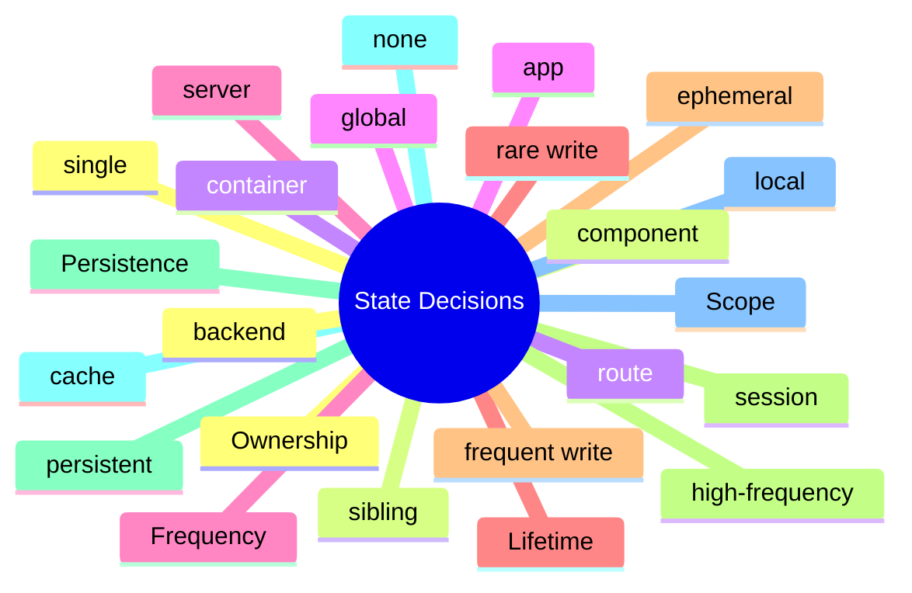

# Module 1: State Management Problems and the Decision Tree

Est. study time: 1.5h
Language: en
Description: How to diagnose a React state management problem before reaching for a library. The decision tree of ownership, lifetime, scope, frequency, persistence. Why "which library" is the wrong first question.

## Knowledge Map



---

## Learning Objectives (maps to course CILOs)
- Diagnose a state management problem from first principles: ownership, lifetime, scope, frequency, persistence — serves CILO 1
- Walk the decision tree to the right primitive without defaulting to a library — serves CILO 1
- Recognize when the question "which library?" is the wrong first question — serves CILO 1
- Apply the decision tree to a new feature before writing any code — serves CILO 1

---

## Real-World Example

A team adopts zustand for every state in their app. Six months later, the bundle is bloated, the devtools show 200+ actions firing on every render, and a junior reaches for `useEffect` to derive a value that should be a selector. The state architecture has become a debugging chore.

The diagnosis: nobody walked the decision tree. Half the state was component-local and should have been `useState`. A quarter was server-state and should have been TanStack Query. The remaining quarter was genuinely global, and zustand was the right tool. The team had reached for the library first and the model last; the order should have been reversed.

> **Think**: What is wrong with starting a feature by choosing a state management library?
>
> *Answer: It picks a tool before the problem. The right order is: (1) what is the lifetime, (2) who owns it, (3) what is the scope, (4) how often does it change, (5) does it need to persist. The answers to those questions narrow the primitive to a small set, and the library choice follows. Library-first is a recipe for over-engineering.*

---

## Core Content

### Section 1: The Five Questions

Every state problem in React reduces to five questions:

1. **Ownership**: who is the canonical source — a component, a container, a global store, or a server?
2. **Lifetime**: how long does the value live — one render, a session, until reload, or until the server says otherwise?
3. **Scope**: who needs to read it — one component, a sibling, a route, or the whole app?
4. **Frequency**: how often does it change — once per click, once per second, or 60 times per second?
5. **Persistence**: does it need to survive reload, sync across tabs, or be the source of truth on the server?

The answers to these questions narrow the primitive. A component-local value with session lifetime and one component reading it is `useState`. A value shared across siblings with session lifetime is lifted state. A value with route scope and reload-survival is URL state. A value fetched from the server with cache lifetime is TanStack Query. A value shared across routes with session lifetime is a global store (zustand, Context, Redux).

### Section 2: The Decision Tree

Walking the tree:

- **Is the value fetched from a server?** Yes → TanStack Query (or React Router loaders, or RSC, depending on framework). The server is the source of truth; the cache is a window onto it.
- **No. Is the value a URL parameter or query string?** Yes → URL state. Use `useSearchParams` or a router's primitives. The URL is the source of truth.
- **No. Does the value need to survive a reload?** Yes → zustand with `persist` middleware, or Jotai with `atomWithStorage`. Pick the persistence layer first; the primitive follows.
- **No. Is the value read by components in many places across the app, with frequent writes?** Yes → zustand or Redux Toolkit. Choose based on team familiarity and the size of the action surface.
- **No. Is the value read by a small subtree of components, with infrequent writes?** Yes → Context. Lift to the closest common parent; provide a value object; be ready to memoize if writes become frequent.
- **No. Is the value owned by one component, with rare writes?** Yes → `useState`. The simplest primitive is the right answer.

The tree is not a flowchart that always picks one tool. Real apps use several primitives, each for a different question's answer. A form field is `useState`. The form's draft is zustand-persisted. The submit mutation is TanStack Query. The pagination is URL state. Four primitives, four questions.

### Section 3: The Wrong Defaults

Three wrong defaults to recognize in code review:

- **Default to zustand for everything.** Zustand is a global store. A component-local value with one reader is `useState`. Reaching for zustand first is over-engineering.
- **Default to Context for "shared" state.** Context is a re-render broadcast. Every consumer re-renders on every value change. A high-frequency value (a typing cursor, a drag position) under Context will re-render the whole subtree. The right tool is an external store with a selector.
- **Default to TanStack Query for everything fetched.** TanStack Query is for cacheable server state. A one-shot fetch on form submit is `fetch` in a submit handler. A realtime stream is its own primitive. Reach for the cache when the same data is read in multiple places or needs to stay fresh across navigations.

### Section 4: When The Library Choice Matters

The library choice matters when:

- The team has a convention. Pick the convention's tool.
- The value is shared across many components with high write frequency. External store with selectors.
- The value must survive a reload. Persisted store or URL.
- The value must be devtools-debuggable. Redux Toolkit or zustand with devtools middleware.
- The team has standardized on one tool for global state. Pick the standard.

When the library choice does NOT matter:

- A two-component app. Anything works.
- A new feature in an established codebase. Follow the codebase's choice.
- A prototype. Use the simplest primitive.

---

## Verify — Walking The Tree

```ts
test('decision tree: a form field is useState', () => {
  const feature = { lifetime: 'ephemeral', scope: 'one-component', writes: 'rare' };
  expect(choose(feature)).toBe('useState');
});

test('decision tree: an applicant list is TanStack Query', () => {
  const feature = { source: 'server', reads: 'multiple', fresh: 'stale-while-revalidate' };
  expect(choose(feature)).toBe('TanStack Query');
});

test('decision tree: the current page in pagination is URL state', () => {
  const feature = { source: 'url', shareable: true, fresh: 'on-navigation' };
  expect(choose(feature)).toBe('URL state');
});
```

---

## Common Misconception

*"Zustand is the modern default for React state."* It is one of the right answers for global state with frequent writes. It is the wrong answer for component-local state, server state, URL state, or form state. Defaults are useful when you do not know the question; the right answer is to know the question.

*"Context is bad."* Context is a re-render broadcast. For low-frequency values shared by a small subtree, it is fine. For high-frequency values, it is wrong. The tool is fine for what it is good at; the misuse is the bug.

*"Server state should be in Redux."* No. Server state has different ownership (the server is the source of truth), different lifetime (the cache is a window), and different concerns (staleness, invalidation, refetching). TanStack Query is built for this. Putting server state in Redux is fighting the cache.

---

## Spot the Mistake

```tsx
// Team uses zustand for a form field
const useFieldStore = create((set) => ({
  email: '',
  setEmail: (v) => set({ email: v }),
}));

function EmailField() {
  const email = useFieldStore((s) => s.email);
  const setEmail = useFieldStore((s) => s.setEmail);
  return <input value={email} onChange={(e) => setEmail(e.target.value)} />;
}
```

What's wrong?

*Answer: The email field is a component-local value with one reader. `useState` is the right primitive. The zustand store adds a global subscription that every other consumer of the store will re-render with (or worse, has been sliced incorrectly to keep them out). For a single field, `useState` is simpler, faster, and clearer. The store is the right answer when the email is shared across components (a header, a summary, a validation panel) — but that is a different feature, not this one.*

---

## Key Takeaways
- The five questions: ownership, lifetime, scope, frequency, persistence
- The decision tree narrows the primitive before picking a library
- Real apps use several primitives; one tool is rarely the answer
- Defaults are useful when you do not know the question; the right answer is to know the question
- The library choice matters when team convention, frequency, or persistence drive it

---

## Drill
Take the quiz.

Run: `learn.sh quiz react-state-management-landscape 01-state-decision`

---

## Think

> **Think**: A team has a feature with: 3 sibling components share a value, the value changes once per second, the value must survive a reload, and the value is NOT fetched from a server. Walk the decision tree and pick the right primitive. Defend the choice.
>
> *Answer: Sibling scope, frequent writes, persistence, no server. Context is wrong (frequent writes re-render the whole subtree). URL is wrong (not URL-shaped). `useState` lifted to the parent works but does not persist. The right answer is zustand with the `persist` middleware (localStorage) or Jotai with `atomWithStorage`. The frequency of writes makes the external store with selectors the right shape; persistence rules out the local primitives. The combination is the right answer.*

---

## Predict

> **Predict**: A team defaults to Context for "shared" state. A typing-cursor position updates 30 times per second. What happens to the app, and what is the fix?
>
> *Answer: Every consumer of the Context re-renders 30 times per second. The whole subtree thrashes; the typing-cursor animation looks fine, but every other component in the subtree (a header, a sidebar, a list) re-renders too. The fix: split the Context into a state Context and a dispatch Context (so consumers of the dispatch do not re-render on state change), or use an external store with a selector (zustand, Jotai) that only re-renders the component that uses the cursor. The high-frequency write is the signal; the fix is the selector boundary.*

---

## Spot the Mistake

> **Spot the Mistake**: A junior reaches for TanStack Query to fetch a list of products on a one-shot form submit. The list is read once and discarded. What's wrong?
>
> *Answer: TanStack Query is for cacheable server state that multiple components read across navigations. A one-shot fetch on form submit does not need a cache; it is a single read that the form uses and discards. The right primitive is `fetch` inside the submit handler. TanStack Query here is over-engineering: it adds a cache, devtools, and a query key for a value that is read once and forgotten. The decision tree's first question — "Is the value fetched from a server?" — has the right answer (yes, it is a fetch), but the second question — "is it cacheable and read in multiple places?" — has the wrong answer (no).*

---

## Cloze

The five {questions} for diagnosing state: {ownership}, {lifetime}, {scope}, {frequency}, {persistence}. The decision tree narrows the primitive before picking a {library}. Real apps use {several} primitives, each for a different question's answer. Defaults are useful when you do not know the {question}; the right answer is to know the question. The library choice matters when team {convention}, frequency, or persistence drive it.

