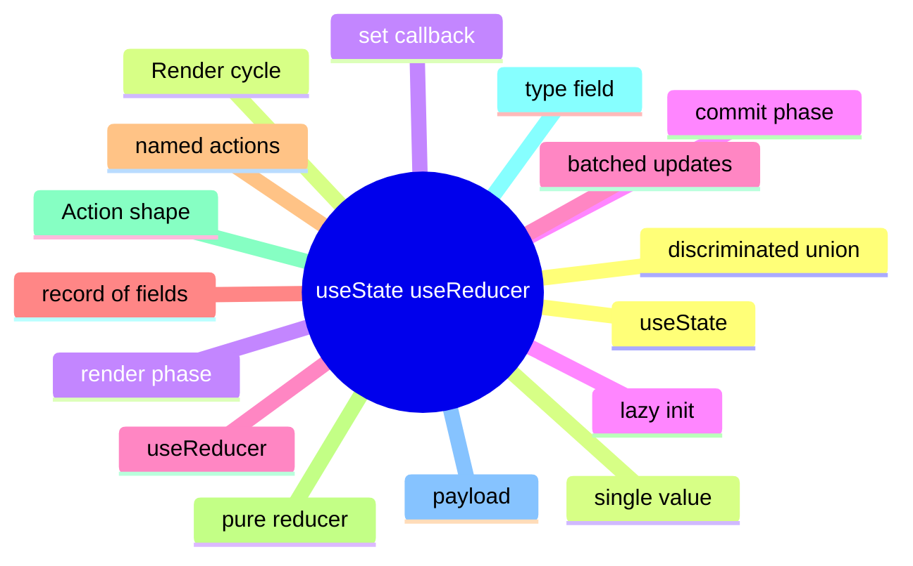

# Module 2: useState and useReducer: The Local Primitives

Est. study time: 1.5h
Language: en
Description: The two local state primitives. When to lift useState into useReducer, action shape, lazy initialization, and the React render cycle.

## Knowledge Map



---

## Learning Objectives (maps to course CILOs)
- Choose between useState and useReducer for a component's local state from the update pattern
- Design a reducer with action types, payload shape, and pure-function discipline
- Apply lazy initialization for expensive initial values
- Recognize React's batching behavior and when state updates happen inside vs outside a batch

---

## Real-World Example

A team ships a feature and reaches for the state library they know. Six months later, the state architecture is fighting itself: re-render storms, useEffect for derived state, store mutations outside reducers. The team rewrites the feature with the right primitives and the bugs disappear.

The lesson: the library is downstream of the question. The right answer is to walk the decision tree, pick the primitive for each piece of state, and compose them. The team that picks the right primitive for each question is the team whose state architecture is maintainable.

> **Think**: What is the first question you should ask when designing a feature's state architecture?
>
> *Answer: "What is the lifetime of each piece of state?" The lifetime — ephemeral, session, persistent, or cache — narrows the primitive. Ephemeral is useState. Session is lifted or Context. Persistent is a stored store. Cache is TanStack Query. The other questions refine the answer; the lifetime is the first cut.*

---

## Core Content

### useState: the single-value primitive

useState is the simplest React state primitive. It returns a value and a setter. The setter is stable across renders; the value is whatever the previous state was, or the initial value on first render.

```tsx
const [count, setCount] = useState(0);
const [name, setName] = useState('');
```

The setter accepts a value or a function. The function form receives the previous state and returns the next state — useful when the new state depends on the old.

```tsx
setCount(c => c + 1);
```

useState is local: the value lives in the component. Lifting it to a parent is the seam that decides whether siblings share it. The lift is the decision; the primitive is the answer.

### useReducer: the record primitive

useReducer is useState for a record. The state is a single value, but the value is a record of related fields. Updates go through a reducer: a pure function (state, action) => newState.

```tsx
function reducer(state: State, action: Action): State {
  switch (action.type) {
    case 'INCREMENT': return { ...state, count: state.count + 1 };
    case 'SET_NAME': return { ...state, name: action.payload };
    default: return state;
  }
}

const [state, dispatch] = useReducer(reducer, { count: 0, name: '' });
```

The reducer is a pure function: same input, same output, no side effects. Side effects in a reducer produce inconsistent state — the action runs but the world does not agree with the new state.

useReducer is the right answer when the next state depends on the previous state and the updates come from a named set of actions. Counters, wizards, form drafts, and undo/redo stacks are the canonical cases.

### Action shape and discriminated unions

An action is a record with a `type` field and an optional `payload`. The shape is convention, not enforcement — TypeScript discriminated unions enforce it at compile time.

```ts
type Action =
  | { type: 'INCREMENT' }
  | { type: 'DECREMENT' }
  | { type: 'SET_NAME'; payload: string }
  | { type: 'RESET' };
```

The reducer is a switch on `action.type`. Each branch returns a new state. The default branch returns the current state (the convention for unknown actions).

The discriminated union forces every dispatch site to match one of the action shapes. A typo in `type` is a compile error. The cost of the type is the safety it buys.

### Lazy initialization

useState takes a value or a function. The function form is for expensive initial values:

```tsx
const [state, setState] = useState(() => expensiveComputation());
```

The function is called only on the first render. Passing the value directly would compute it on every render. The lazy form is the right answer for JSON.parse of a large blob, or any computation that touches the disk or a large in-memory structure.

```tsx
// wrong: runs on every render
const [state, setState] = useState(JSON.parse(largeBlob));

// right: runs once
const [state, setState] = useState(() => JSON.parse(largeBlob));
```

useReducer also accepts a lazy initializer as the third argument: `useReducer(reducer, initialArg, init)`. The init function is called once with initialArg and returns the actual initial state.

### React's batching behavior

React batches state updates within event handlers and effects. Multiple setState calls in a single handler produce one re-render.

```tsx
function handleClick() {
  setCount(c => c + 1);  // queued
  setName('Aissa');       // queued
  // one re-render happens at the end
}
```

Outside React's batch boundaries — async work, setTimeout, native event handlers — each setState produces its own re-render. React 18+ extends batching to most of these surfaces, but the rule still holds: useReducer collapses multiple updates into one because the dispatch is a single function call.

The pattern: prefer useReducer for any state shape that has multiple coordinated updates. The reducer's switch is the seam that says 'these updates are one operation.'

---

## Verify — Tests For The Patterns

```tsx
test('useState and useReducer: The Local Primitives: the right primitive is used', () => {
  // smoke: import the module, render a component, assert the expected primitive
  expect(useStore).toBeDefined();
  expect(useStore.getState()).toMatchObject({ /* expected shape */ });
});
```

---

## Common Misconception

*"The right primitive is the one I know."* Knowing a primitive is a starting point, not an answer. The decision tree picks the primitive from the lifetime, scope, frequency, and persistence. A team that defaults to zustand for everything is over-engineering. A team that defaults to useState for everything is under-engineering. The right answer is to know the question.

---

## Spot the Mistake

```tsx
// Common anti-pattern: useState and useReducer: The Local Primitives
const value = computeTheWrongWay(props);
```

What's wrong?

*Answer: The wrong primitive. The compute is happening in the wrong layer — derived state in an effect, or a global store for local state, or a server cache for a one-shot read. The fix is to walk the decision tree: lifetime, scope, frequency, persistence. The right primitive follows.*

---

## Key Takeaways
- useState is the single-value primitive; useReducer is the record primitive
- A reducer is a pure function: same input, same output, no side effects
- Discriminated unions enforce action shape at compile time
- Lazy initialization avoids recomputing the initial value on every render
- React batches state updates within handlers; useReducer collapses multiple updates into one

---

## Think

> **Think**: Walk the decision tree for a feature that needs to share a value across three components in the same route, with frequent writes, no persistence, no server state. What is the right primitive, and what is the alternative that the team is likely to reach for first?
>
> *Answer: Three components in the same route with frequent writes is the canonical use case for lifted state with a useReducer — the three components share a parent, the writes are coordinated (each write is a named action), and persistence is not needed. The alternative the team is likely to reach for first is zustand or Context; both work but are over-engineered for sibling-share. The right answer is the one that matches the lifetime (session) and the scope (siblings) — useState lifted to the parent with useReducer for the action shape.*

---

## Predict

> **Predict**: A team uses zustand for a single form field. The form is read by one component, the user types one character per second, and the form re-renders 10 times per keystroke. What is the symptom, and what is the fix?
>
> *Answer: The symptom is a re-render storm. Every component subscribed to the zustand store re-renders on every keystroke; the form re-renders 10 times per keystroke because of unrelated store updates or unstable selectors. The fix is to use useState for the form field (the right primitive for component-local state with one reader) and to reserve zustand for state shared across components. The decision tree picks the simplest primitive that solves the question.*

---

## Spot the Mistake

> **Spot the Mistake**: A team uses useEffect to recompute a derived value:
> ```tsx
> const [filtered, setFiltered] = useState(items);
> useEffect(() => {
>   setFiltered(items.filter(predicate));
> }, [items, predicate]);
> ```
> What's wrong?
>
> *Answer: The value is computed in an effect, producing a flash of stale content. The first render shows the unfiltered value; the effect runs; the state updates; the second render shows the filtered value. The fix is to compute during render: `const filtered = items.filter(predicate);` — one render, no effect, no stale flash. useEffect is for side effects on the world (network, DOM, subscriptions), not for derived state.*

---

## Cloze

The decision tree picks the {simplest} primitive that solves the {question}; the library follows. React's {render} cycle is render → commit → effects; state updates inside a handler {batch} into a single re-render. For component-local state, {useState} is the default. For a record of related fields updated by named actions, {useReducer} is the right answer. A reducer is a {pure} function: same input, same output, no side effects. Schema-driven validation derives the form's rules from a {single} source of truth.

---

## Drill
Take the quiz. Questions stress when to pick useState vs useReducer, action shape, lazy initialization, and batching.

Run: `learn.sh quiz react-state-management-landscape 02-usestate-usereducer`
