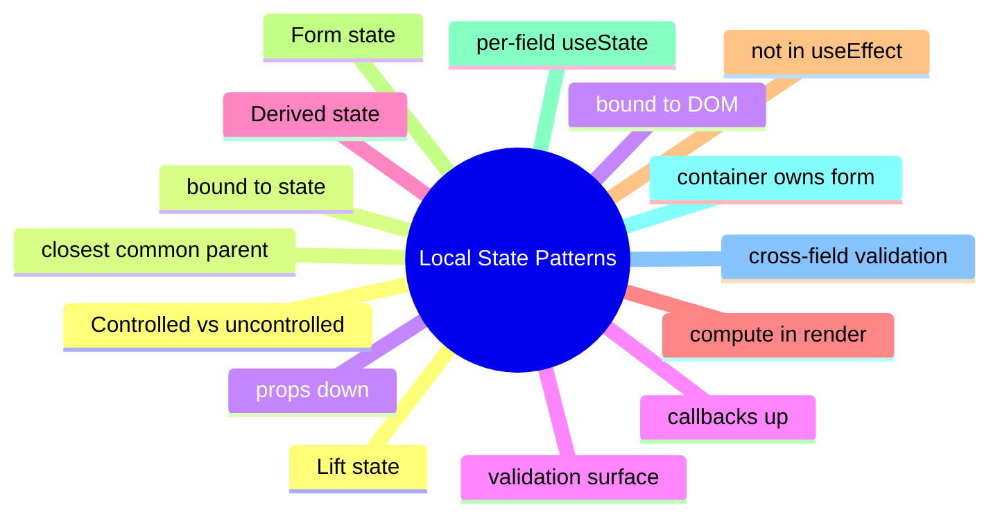

# Module 3: Component-Local State Patterns

Est. study time: 1.5h
Language: en
Description: Lifted state, sibling state, derived state, and the useEffect anti-pattern. The boundary between local and shared state.

## Knowledge Map



---

## Learning Objectives (maps to course CILOs)
- Apply the lift pattern to share state between siblings through a common parent
- Distinguish stored state from derived state and use computation in render, not useEffect
- Recognize the controlled vs uncontrolled input trade-off and when each fits
- Use a form container to coordinate multi-field state and cross-field validation

---

## Real-World Example

A team ships a feature and reaches for the state library they know. Six months later, the state architecture is fighting itself: re-render storms, useEffect for derived state, store mutations outside reducers. The team rewrites the feature with the right primitives and the bugs disappear.

The lesson: the library is downstream of the question. The right answer is to walk the decision tree, pick the primitive for each piece of state, and compose them. The team that picks the right primitive for each question is the team whose state architecture is maintainable.

> **Think**: What is the first question you should ask when designing a feature's state architecture?
>
> *Answer: "What is the lifetime of each piece of state?" The lifetime — ephemeral, session, persistent, or cache — narrows the primitive. Ephemeral is useState. Session is lifted or Context. Persistent is a stored store. Cache is TanStack Query. The other questions refine the answer; the lifetime is the first cut.*

---

## Core Content

### Lifted state: the parent is the source of truth

Lifted state is the closest common parent of two siblings that need to share a value. The parent holds the state; both children receive the value and a setter as props.

```tsx
function Parent() {
  const [value, setValue] = useState('');
  return (
    <>
      <ChildA value={value} onChange={setValue} />
      <ChildB value={value} />
    </>
  );
}
```

The parent is the source of truth. Children are pure: they receive the value and a callback. The pattern is the smallest possible shared state — no global store, no Context, no library.

The lift is the boundary. Above the lift, the value is shared. Below, it is private. The minimum lift is the right lift; over-lifting re-renders siblings that do not need the value.

### Derived state: compute in render, not in useEffect

Derived state is computed from props or other state. It should never be stored separately.

```tsx
// wrong: useState + useEffect
const [filtered, setFiltered] = useState(items);
useEffect(() => setFiltered(items.filter(predicate)), [items, predicate]);

// right: compute in render
const filtered = items.filter(predicate);
```

The wrong pattern produces a flash of stale content: the render happens with the old filtered value, the effect runs, the state updates, the render happens again. The right pattern is one render with the correct value.

The principle: if the value can be computed from props or state, compute it. useState is for values that have an independent lifetime; useMemo is for values that are expensive to compute. Both compute during render.

### Form state: container owns the form

A form's state in a single component is useState. Across the form, it is lifted to the form container.

```tsx
function Form() {
  const [name, setName] = useState('');
  const [email, setEmail] = useState('');
  const onSubmit = () => api.submit({ name, email });
  return (
    <form onSubmit={onSubmit}>
      <Field label="Name" value={name} onChange={setName} />
      <Field label="Email" value={email} onChange={setEmail} />
    </form>
  );
}
```

The form container owns the form's state; fields receive the value and a change handler. Cross-field validation lives in the container — it has access to all the fields.

For complex forms (validation, dynamic fields, multi-step), a form library (React Hook Form, TanStack Form) is the right answer. The library owns the same state pattern but adds a focus-tracked, validation-driven, field-level API.

### Controlled vs uncontrolled inputs

A controlled input's value is bound to state. An uncontrolled input stores its value in the DOM.

```tsx
// controlled
<input value={name} onChange={e => setName(e.target.value)} />

// uncontrolled
<input ref={ref} defaultValue="" />
```

Controlled inputs are easier to validate, format, and reset. The state is the source of truth. Uncontrolled inputs are simpler for one-shot forms where the value is read once at submit.

The choice depends on the validation surface. If you need to validate on every keystroke, controlled. If you only need the value at submit, uncontrolled. Form libraries give you controlled semantics with the performance of uncontrolled (via refs).

### Sibling state and the minimal lift

Sibling state is the parent state passed to two children as props. The pattern is the same as lifted state; the difference is the scope.

```tsx
function Parent() {
  const [count, setCount] = useState(0);
  return (
    <>
      <Display count={count} />
      <Buttons onIncrement={() => setCount(c => c + 1)} />
    </>
  );
}
```

The Display is a pure consumer; the Buttons is a pure producer. The Parent is the seam. The pattern is the smallest possible composition — no global store, no library.

A reducer in the parent is the right answer when the lifted state has multiple coordinated updates. Otherwise useState is enough. The number of updates is the signal: one setter is useState; many setters with action types is useReducer.

---

## Verify — Tests For The Patterns

```tsx
test('Component-Local State Patterns: the right primitive is used', () => {
  // smoke: import the module, render a component, assert the expected primitive
  expect(useStore).toBeDefined();
  expect(useStore.getState()).toMatchObject({ /* expected shape */ });
});
```

---

## Common Misconception

*"The right primitive is the one I know."* Knowing a primitive is a starting point, not an answer. The decision tree picks the primitive from the lifetime, scope, frequency, and persistence. A team that defaults to zustand for everything is over-engineering. A team that defaults to useState for everything is under-engineering. The right answer is to know the question.

---

## Spot the Mistake

```tsx
// Common anti-pattern: Component-Local State Patterns
const value = computeTheWrongWay(props);
```

What's wrong?

*Answer: The wrong primitive. The compute is happening in the wrong layer — derived state in an effect, or a global store for local state, or a server cache for a one-shot read. The fix is to walk the decision tree: lifetime, scope, frequency, persistence. The right primitive follows.*

---

## Key Takeaways
- Lifted state is the closest common parent; the parent is the source of truth
- Derived state is computed in render, not stored separately
- Form state lives in the form container; fields receive value and onChange
- Controlled inputs are bound to state; uncontrolled inputs use refs
- Multiple coordinated updates in a parent → useReducer; one setter → useState

---

## Think

> **Think**: Walk the decision tree for a feature that needs to share a value across three components in the same route, with frequent writes, no persistence, no server state. What is the right primitive, and what is the alternative that the team is likely to reach for first?
>
> *Answer: Three components in the same route with frequent writes is the canonical use case for lifted state with a useReducer — the three components share a parent, the writes are coordinated (each write is a named action), and persistence is not needed. The alternative the team is likely to reach for first is zustand or Context; both work but are over-engineered for sibling-share. The right answer is the one that matches the lifetime (session) and the scope (siblings) — useState lifted to the parent with useReducer for the action shape.*

---

## Predict

> **Predict**: A team uses zustand for a single form field. The form is read by one component, the user types one character per second, and the form re-renders 10 times per keystroke. What is the symptom, and what is the fix?
>
> *Answer: The symptom is a re-render storm. Every component subscribed to the zustand store re-renders on every keystroke; the form re-renders 10 times per keystroke because of unrelated store updates or unstable selectors. The fix is to use useState for the form field (the right primitive for component-local state with one reader) and to reserve zustand for state shared across components. The decision tree picks the simplest primitive that solves the question.*

---

## Spot the Mistake

> **Spot the Mistake**: A team uses useEffect to recompute a derived value:
> ```tsx
> const [filtered, setFiltered] = useState(items);
> useEffect(() => {
>   setFiltered(items.filter(predicate));
> }, [items, predicate]);
> ```
> What's wrong?
>
> *Answer: The value is computed in an effect, producing a flash of stale content. The first render shows the unfiltered value; the effect runs; the state updates; the second render shows the filtered value. The fix is to compute during render: `const filtered = items.filter(predicate);` — one render, no effect, no stale flash. useEffect is for side effects on the world (network, DOM, subscriptions), not for derived state.*

---

## Cloze

The decision tree picks the {simplest} primitive that solves the {question}; the library follows. React's {render} cycle is render → commit → effects; state updates inside a handler {batch} into a single re-render. For component-local state, {useState} is the default. For a record of related fields updated by named actions, {useReducer} is the right answer. A reducer is a {pure} function: same input, same output, no side effects. Schema-driven validation derives the form's rules from a {single} source of truth.

---

## Drill
Take the quiz. Questions stress lift decisions, derived state, controlled inputs, and when to escalate to a reducer.

Run: `learn.sh quiz react-state-management-landscape 03-local-state-patterns`
