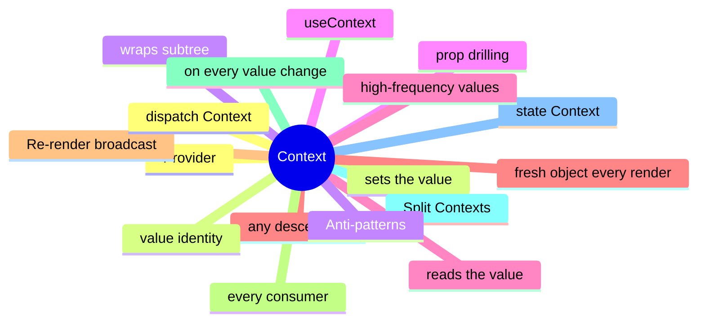

# Module 4: React Context: The Built-in Global

Est. study time: 1.5h
Language: en
Description: Context as a re-render broadcast, the Provider/useContext API, splitting state and dispatch Contexts, and when Context is the wrong answer.

## Knowledge Map



---

## Learning Objectives (maps to course CILOs)
- Use Context for low-frequency values shared by a small subtree, like theme and locale
- Recognize when Context is wrong for high-frequency values shared by a large subtree
- Apply the value-identity rule to avoid unintended re-renders from a fresh object every render
- Split state and dispatch Contexts to scope re-renders to consumers that need them

---

## Real-World Example

A team ships a feature and reaches for the state library they know. Six months later, the state architecture is fighting itself: re-render storms, useEffect for derived state, store mutations outside reducers. The team rewrites the feature with the right primitives and the bugs disappear.

The lesson: the library is downstream of the question. The right answer is to walk the decision tree, pick the primitive for each piece of state, and compose them. The team that picks the right primitive for each question is the team whose state architecture is maintainable.

> **Think**: What is the first question you should ask when designing a feature's state architecture?
>
> *Answer: "What is the lifetime of each piece of state?" The lifetime — ephemeral, session, persistent, or cache — narrows the primitive. Ephemeral is useState. Session is lifted or Context. Persistent is a stored store. Cache is TanStack Query. The other questions refine the answer; the lifetime is the first cut.*

---

## Core Content

### Context as a re-render broadcast

Context is a re-render broadcast. Every consumer re-renders on every value change. The contract is the broadcast — for low-frequency values in a small subtree, it is fine; for high-frequency values or large subtrees, it is wrong.

```tsx
const ThemeContext = createContext('light');

function App() {
  const [theme, setTheme] = useState('light');
  return (
    <ThemeContext.Provider value={theme}>
      <Page />
    </ThemeContext.Provider>
  );
}

function Page() {
  const theme = useContext(ThemeContext);
  return <div className={theme}>...</div>;
}
```

The Provider sets the value; useContext reads it. Any descendant can read it. The pattern is the same as props, but the wiring is implicit (descendant tree) rather than explicit (props passed one at a time).

### Value identity: the most common Context bug

The Context value must be a stable reference. Passing a fresh object every render causes every consumer to re-render.

```tsx
// wrong: fresh object every render
<ThemeContext.Provider value={{ theme, setTheme }}>
  <Page />
</ThemeContext.Provider>

// right: stable object
const value = useMemo(() => ({ theme, setTheme }), [theme]);
<ThemeContext.Provider value={value}>
  <Page />
</ThemeContext.Provider>
```

The fix is to memoize the value with useMemo. Otherwise, every render of the Provider creates a new object, React's referential-equality check fails, and every consumer re-renders — even if the underlying value is unchanged.

The same rule applies to arrays, sets, and any other composite value. The reference must be stable for React's comparison to work.

### Splitting state and dispatch Contexts

A common pattern: split a Context into a state Context and a dispatch Context. Consumers of the dispatch do not re-render on state change.

```tsx
const StateContext = createContext(null);
const DispatchContext = createContext(null);

function Provider({ children }) {
  const [state, dispatch] = useReducer(reducer, initial);
  return (
    <DispatchContext.Provider value={dispatch}>
      <StateContext.Provider value={state}>
        {children}
      </StateContext.Provider>
    </DispatchContext.Provider>
  );
}

function Consumer() {
  const dispatch = useContext(DispatchContext);  // stable; never re-renders
  const state = useContext(StateContext);        // re-renders on change
  return ...;
}
```

The dispatch is referentially stable across renders. Consumers of the dispatch re-render only when the dispatch reference changes — which is never, for stable callbacks. The state Context re-renders on every state change.

The split is the seam. The state change re-renders state consumers; the dispatch is free.

### When Context is the wrong answer

Context is the wrong answer for high-frequency values shared by a large subtree. The broadcast is the bug.

```tsx
// wrong: typing cursor position
const CursorContext = createContext({ x: 0, y: 0 });

// right: external store with selector
const cursorAtom = atom({ x: 0, y: 0 });
function Cursor() {
  const { x, y } = useAtomValue(cursorAtom);  // only this re-renders
  return <div style={{ left: x, top: y }} />;
}
```

A typing cursor updates 30 times per second. Every consumer of the Context re-renders. The whole subtree thrashes. The fix is an external store with a selector — only the component using the cursor re-renders.

The rule: Context is for low-frequency values in a small subtree. Theme, locale, session, and feature flags are fine. Typing cursors, drag positions, and high-frequency animations are wrong.

### React 19's use() hook

React 19 ships the `use` hook, which can read Context conditionally. The useContext hook cannot.

```tsx
// useContext: must be at the top
const theme = useContext(ThemeContext);

// use: can be inside conditionals
function Component({ condition }) {
  if (condition) {
    const theme = use(ThemeContext);  // OK
    return <div className={theme}>...</div>;
  }
  return <div>...</div>;
}
```

`use` is the modern API. It can be called inside conditionals, loops, and even after early returns. useContext must be called at the top of the component, like any other hook.

The migration is mechanical: replace useContext with use where appropriate. The runtime behavior is the same; the API is more flexible.

---

## Verify — Tests For The Patterns

```tsx
test('React Context: The Built-in Global: the right primitive is used', () => {
  // smoke: import the module, render a component, assert the expected primitive
  expect(useStore).toBeDefined();
  expect(useStore.getState()).toMatchObject({ /* expected shape */ });
});
```

---

## Common Misconception

*"The right primitive is the one I know."* Knowing a primitive is a starting point, not an answer. The decision tree picks the primitive from the lifetime, scope, frequency, and persistence. A team that defaults to zustand for everything is over-engineering. A team that defaults to useState for everything is under-engineering. The right answer is to know the question.

---

## Spot the Mistake

```tsx
// Common anti-pattern: React Context: The Built-in Global
const value = computeTheWrongWay(props);
```

What's wrong?

*Answer: The wrong primitive. The compute is happening in the wrong layer — derived state in an effect, or a global store for local state, or a server cache for a one-shot read. The fix is to walk the decision tree: lifetime, scope, frequency, persistence. The right primitive follows.*

---

## Key Takeaways
- Context is a re-render broadcast; every consumer re-renders on every value change
- Memoize the value with useMemo to keep the reference stable
- Split state and dispatch Contexts to scope re-renders to consumers that need them
- Context is wrong for high-frequency values; external stores with selectors are right
- React 19's use() hook can read Context conditionally; useContext cannot

---

## Think

> **Think**: Walk the decision tree for a feature that needs to share a value across three components in the same route, with frequent writes, no persistence, no server state. What is the right primitive, and what is the alternative that the team is likely to reach for first?
>
> *Answer: Three components in the same route with frequent writes is the canonical use case for lifted state with a useReducer — the three components share a parent, the writes are coordinated (each write is a named action), and persistence is not needed. The alternative the team is likely to reach for first is zustand or Context; both work but are over-engineered for sibling-share. The right answer is the one that matches the lifetime (session) and the scope (siblings) — useState lifted to the parent with useReducer for the action shape.*

---

## Predict

> **Predict**: A team uses zustand for a single form field. The form is read by one component, the user types one character per second, and the form re-renders 10 times per keystroke. What is the symptom, and what is the fix?
>
> *Answer: The symptom is a re-render storm. Every component subscribed to the zustand store re-renders on every keystroke; the form re-renders 10 times per keystroke because of unrelated store updates or unstable selectors. The fix is to use useState for the form field (the right primitive for component-local state with one reader) and to reserve zustand for state shared across components. The decision tree picks the simplest primitive that solves the question.*

---

## Spot the Mistake

> **Spot the Mistake**: A team uses useEffect to recompute a derived value:
> ```tsx
> const [filtered, setFiltered] = useState(items);
> useEffect(() => {
>   setFiltered(items.filter(predicate));
> }, [items, predicate]);
> ```
> What's wrong?
>
> *Answer: The value is computed in an effect, producing a flash of stale content. The first render shows the unfiltered value; the effect runs; the state updates; the second render shows the filtered value. The fix is to compute during render: `const filtered = items.filter(predicate);` — one render, no effect, no stale flash. useEffect is for side effects on the world (network, DOM, subscriptions), not for derived state.*

---

## Cloze

The decision tree picks the {simplest} primitive that solves the {question}; the library follows. React's {render} cycle is render → commit → effects; state updates inside a handler {batch} into a single re-render. For component-local state, {useState} is the default. For a record of related fields updated by named actions, {useReducer} is the right answer. A reducer is a {pure} function: same input, same output, no side effects. Schema-driven validation derives the form's rules from a {single} source of truth.

---

## Drill
Take the quiz. Questions stress value identity, split Contexts, when Context is wrong, and the use() hook.

Run: `learn.sh quiz react-state-management-landscape 04-context`
