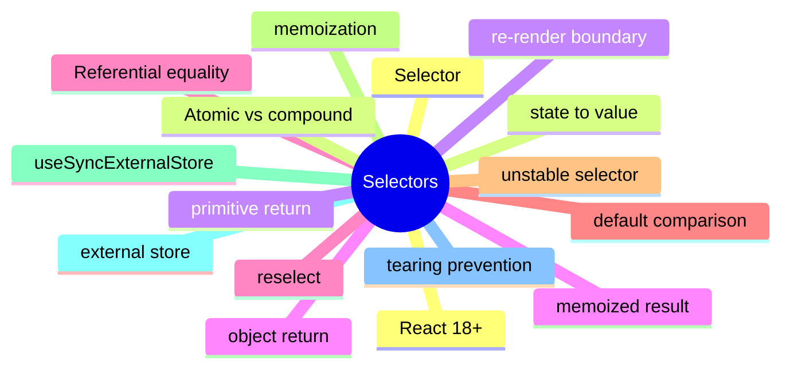

# Module 5: Selectors and the Render Cycle

Est. study time: 1.5h
Language: en
Description: How selectors scope re-renders to the components that need the value. useSyncExternalStore, referential equality, atomic vs compound selectors, and tearing.

## Knowledge Map



---

## Learning Objectives (maps to course CILOs)
- Define a selector as a function from store state to a derived value
- Apply referential equality to prevent re-renders on equal content
- Use useSyncExternalStore for React 18+ external store integration
- Distinguish atomic selectors from compound selectors and apply memoization for each

---

## Real-World Example

A team ships a feature and reaches for the state library they know. Six months later, the state architecture is fighting itself: re-render storms, useEffect for derived state, store mutations outside reducers. The team rewrites the feature with the right primitives and the bugs disappear.

The lesson: the library is downstream of the question. The right answer is to walk the decision tree, pick the primitive for each piece of state, and compose them. The team that picks the right primitive for each question is the team whose state architecture is maintainable.

> **Think**: What is the first question you should ask when designing a feature's state architecture?
>
> *Answer: "What is the lifetime of each piece of state?" The lifetime — ephemeral, session, persistent, or cache — narrows the primitive. Ephemeral is useState. Session is lifted or Context. Persistent is a stored store. Cache is TanStack Query. The other questions refine the answer; the lifetime is the first cut.*

---

## Core Content

### Selectors scope re-renders

A selector is a function from store state to a derived value. The component re-renders only when the selected value changes.

```tsx
// without selector: re-renders on every state change
const state = useStore();

// with selector: re-renders only when count changes
const count = useStore(s => s.count);
```

The selector is the boundary between the store and the component. Without a selector, every state change re-renders the component. With a selector, only changes to the selected slice do.

The cost of the selector is the cost of computing the derived value. The benefit is the precision of the re-render.

### Referential equality and the unstable selector

Referential equality is the default comparison in zustand and Redux. Two objects with the same content but different references are not equal.

```tsx
// wrong: returns a new object every call
const userInfo = useStore(s => ({ name: s.name, email: s.email }));

// right: returns a primitive or memoized object
const name = useStore(s => s.name);  // primitive: always stable on equal values
const userInfo = useStore(s => s.user);  // object: stable if the user object is the same reference
```

A selector that returns a new object every call re-renders every consumer. The fix is to use zustand's shallow compare, to memoize the selector, or to return primitives.

The rule: a selector must return a referentially stable value. The same content but a different reference is a re-render trigger.

### useSyncExternalStore: the React 18+ bridge

useSyncExternalStore is the React 18+ primitive for subscribing to an external store with concurrent rendering support.

```tsx
function useStore<T>(selector: (state: State) => T): T {
  return useSyncExternalStore(
    store.subscribe,
    () => selector(store.getState()),
    () => selector(store.getServerSnapshot?.() ?? store.getState())
  );
}
```

The hook takes three functions: subscribe (called when the store changes), getSnapshot (called on every render to read the current value), and getServerSnapshot (called during SSR to read the server's value).

Tearing is the bug this hook prevents. Without it, two components in different parts of the tree can see different versions of the store during concurrent rendering. The hook ensures every component sees the same value during a single render.

### Atomic vs compound selectors

Atomic selectors return a primitive. Compound selectors return an object. The choice has re-render consequences.

```tsx
// atomic: stable on equal values
const name = useStore(s => s.name);

// compound: new object on every call
const userInfo = useStore(s => ({ name: s.name, email: s.email }));

// compound with shallow compare: stable if the fields are equal
const userInfo = useStore(s => ({ name: s.name, email: s.email }), shallow);
```

Atomic is the default. Compound is a trade-off: the convenience of one selector against the cost of an extra re-render on a non-equal-but-same-content object.

For compound selectors that compute expensive derivations, a reselect-style memoized selector is the right answer. The selector computes once per state change, not once per render.

### Tearing and concurrent rendering

Tearing is when different components see different versions of the same external store during concurrent rendering. The bug is rare in single-threaded React but possible in React 18+'s concurrent mode.

```tsx
// without useSyncExternalStore: can tear
function Component() {
  const value = store.getState();  // reads once
  return <div>{value}</div>;
}

// with useSyncExternalStore: cannot tear
function Component() {
  const value = useSyncExternalStore(
    store.subscribe,
    store.getState,
    store.getServerSnapshot
  );
  return <div>{value}</div>;
}
```

The hook tells React the store's current value and how to subscribe. Concurrent rendering can safely re-read the store; tearing is impossible. The hook is required for any external-store integration in React 18+.

---

## Verify — Tests For The Patterns

```tsx
test('Selectors and the Render Cycle: the right primitive is used', () => {
  // smoke: import the module, render a component, assert the expected primitive
  expect(useStore).toBeDefined();
  expect(useStore.getState()).toMatchObject({ /* expected shape */ });
});
```

---

## Common Misconception

*"The right primitive is the one I know."* Knowing a primitive is a starting point, not an answer. The decision tree picks the primitive from the lifetime, scope, frequency, and persistence. A team that defaults to zustand for everything is over-engineering. A team that defaults to useState for everything is under-engineering. The right answer is to know the question.

---

## Spot the Mistake

```tsx
// Common anti-pattern: Selectors and the Render Cycle
const value = computeTheWrongWay(props);
```

What's wrong?

*Answer: The wrong primitive. The compute is happening in the wrong layer — derived state in an effect, or a global store for local state, or a server cache for a one-shot read. The fix is to walk the decision tree: lifetime, scope, frequency, persistence. The right primitive follows.*

---

## Key Takeaways
- A selector is a function from state to a derived value; the component re-renders only when the selected value changes
- Referential equality is the default; an unstable selector is a re-render trigger
- useSyncExternalStore prevents tearing in concurrent React 18+
- Atomic selectors are simpler; compound selectors need shallow compare or memoization
- Selector inference drives memoization strategy

---

## Think

> **Think**: Walk the decision tree for a feature that needs to share a value across three components in the same route, with frequent writes, no persistence, no server state. What is the right primitive, and what is the alternative that the team is likely to reach for first?
>
> *Answer: Three components in the same route with frequent writes is the canonical use case for lifted state with a useReducer — the three components share a parent, the writes are coordinated (each write is a named action), and persistence is not needed. The alternative the team is likely to reach for first is zustand or Context; both work but are over-engineered for sibling-share. The right answer is the one that matches the lifetime (session) and the scope (siblings) — useState lifted to the parent with useReducer for the action shape.*

---

## Predict

> **Predict**: A team uses zustand for a single form field. The form is read by one component, the user types one character per second, and the form re-renders 10 times per keystroke. What is the symptom, and what is the fix?
>
> *Answer: The symptom is a re-render storm. Every component subscribed to the zustand store re-renders on every keystroke; the form re-renders 10 times per keystroke because of unrelated store updates or unstable selectors. The fix is to use useState for the form field (the right primitive for component-local state with one reader) and to reserve zustand for state shared across components. The decision tree picks the simplest primitive that solves the question.*

---

## Spot the Mistake

> **Spot the Mistake**: A team uses useEffect to recompute a derived value:
> ```tsx
> const [filtered, setFiltered] = useState(items);
> useEffect(() => {
>   setFiltered(items.filter(predicate));
> }, [items, predicate]);
> ```
> What's wrong?
>
> *Answer: The value is computed in an effect, producing a flash of stale content. The first render shows the unfiltered value; the effect runs; the state updates; the second render shows the filtered value. The fix is to compute during render: `const filtered = items.filter(predicate);` — one render, no effect, no stale flash. useEffect is for side effects on the world (network, DOM, subscriptions), not for derived state.*

---

## Cloze

The decision tree picks the {simplest} primitive that solves the {question}; the library follows. React's {render} cycle is render → commit → effects; state updates inside a handler {batch} into a single re-render. For component-local state, {useState} is the default. For a record of related fields updated by named actions, {useReducer} is the right answer. A reducer is a {pure} function: same input, same output, no side effects. Schema-driven validation derives the form's rules from a {single} source of truth.

---

## Drill
Take the quiz. Questions stress selector stability, useSyncExternalStore, atomic vs compound, and tearing.

Run: `learn.sh quiz react-state-management-landscape 05-selectors-render`
