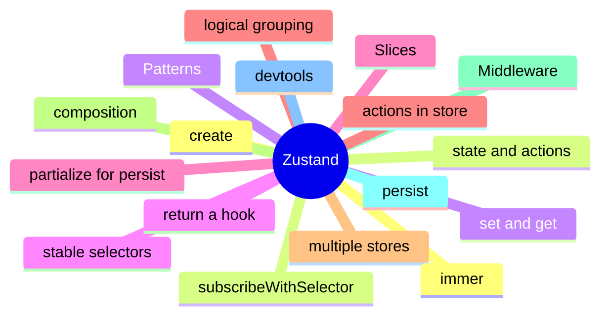

# Module 6: Zustand: The Minimal External Store

Est. study time: 1.5h
Language: en
Description: Zustand's create() API, slices, middleware (persist, devtools, immer, subscribeWithSelector), and the patterns that keep a zustand store readable.

## Knowledge Map



---

## Learning Objectives (maps to course CILOs)
- Create a zustand store with state, actions, and middleware
- Slice a large store by composing multiple stores or by convention within one
- Apply persist, devtools, immer, and subscribeWithSelector middleware for the right capability
- Recognize unstable selectors and apply the stability rule

---

## Real-World Example

A team ships a feature and reaches for the state library they know. Six months later, the state architecture is fighting itself: re-render storms, useEffect for derived state, store mutations outside reducers. The team rewrites the feature with the right primitives and the bugs disappear.

The lesson: the library is downstream of the question. The right answer is to walk the decision tree, pick the primitive for each piece of state, and compose them. The team that picks the right primitive for each question is the team whose state architecture is maintainable.

> **Think**: What is the first question you should ask when designing a feature's state architecture?
>
> *Answer: "What is the lifetime of each piece of state?" The lifetime — ephemeral, session, persistent, or cache — narrows the primitive. Ephemeral is useState. Session is lifted or Context. Persistent is a stored store. Cache is TanStack Query. The other questions refine the answer; the lifetime is the first cut.*

---

## Core Content

### The create API: state, actions, and the hook

Zustand's create() returns a hook. The hook reads the store with an optional selector and updates the store with the returned actions.

```tsx
import { create } from 'zustand';

const useStore = create((set, get) => ({
  count: 0,
  increment: () => set((s) => ({ count: s.count + 1 })),
  reset: () => set({ count: 0 }),
}));

function Counter() {
  const count = useStore((s) => s.count);
  const increment = useStore((s) => s.increment);
  return <button onClick={increment}>{count}</button>;
}
```

`set` updates the state — partial or function. `get` reads the current state inside an action. The hook is the API surface; everything else is the store's internal shape.

### Slices: logical grouping, multiple stores

A slice is a logical grouping of state and actions. Zustand encourages slicing by composing multiple stores or by convention within one.

```tsx
// multiple stores
const useUserStore = create((set) => ({ user: null, setUser: (u) => set({ user: u }) }));
const useCartStore = create((set) => ({ items: [], addItem: (i) => set((s) => ({ items: [...s.items, i] })) }));

// one store, slice convention
const useStore = create((set) => ({
  user: { ... },
  cart: { ... },
  ui: { ... },
}));
```

Multiple stores keep unrelated re-renders from coupling. One store is simpler but couples the slices. The decision is the slicing. The trade-off is between simplicity (one store) and isolation (multiple stores).

### Middleware: persist, devtools, immer, subscribeWithSelector

Middleware in zustand is a function that wraps set. Common middleware adds a capability.

```tsx
import { persist, devtools, immer } from 'zustand/middleware';

const useStore = create(
  devtools(
    persist(
      immer((set) => ({
        count: 0,
        increment: () => set((s) => { s.count += 1 }),
      })),
      { name: 'my-store' }
    )
  )
);
```

- persist: writes the store to localStorage on every change; partialize controls which fields are persisted.
- devtools: integrates with the Redux DevTools extension; actions and state are visible in the panel.
- immer: lets you update state with mutable syntax; the middleware produces immutable updates.
- subscribeWithSelector: lets you subscribe to a selector from outside React (e.g. for side effects).

Each middleware is composed in the create() call. The order matters: the outermost middleware wraps the innermost.

### Unstable selectors and the stability rule

A zustand selector must be referentially stable on equal values. An unstable selector (e.g. one that returns a new object) re-renders every render.

```tsx
// wrong: new object every call
const userInfo = useStore((s) => ({ name: s.name, email: s.email }));

// right 1: primitives
const name = useStore((s) => s.name);

// right 2: shallow compare
const userInfo = useStore((s) => ({ name: s.name, email: s.email }), shallow);

// right 3: return the store's own object
const user = useStore((s) => s.user);  // stable if s.user is the same reference
```

The fix is to use zustand's shallow compare, to memoize the selector, or to return primitives. Without stability, the selector is a re-render trigger.

### Persist: which fields, which risks

The persist middleware writes the store to localStorage on every change. The partialize option controls which fields are persisted.

```tsx
persist(
  (set) => ({ token: null, theme: 'light', setToken: (t) => set({ token: t }) }),
  {
    name: 'app-storage',
    partialize: (state) => ({ theme: state.theme }),  // do not persist token
  }
);
```

Persisting tokens is risky (XSS can scrape localStorage). Persisting UI state (theme, sidebar collapsed) is fine. partialize is the place to make that call. The middleware handles the rest.

---

## Verify — Tests For The Patterns

```tsx
test('Zustand: The Minimal External Store: the right primitive is used', () => {
  // smoke: import the module, render a component, assert the expected primitive
  expect(useStore).toBeDefined();
  expect(useStore.getState()).toMatchObject({ /* expected shape */ });
});
```

---

## Common Misconception

*"The right primitive is the one I know."* Knowing a primitive is a starting point, not an answer. The decision tree picks the primitive from the lifetime, scope, frequency, and persistence. A team that defaults to zustand for everything is over-engineering. A team that defaults to useState for everything is under-engineering. The right answer is to know the question.

---

## Spot the Mistake

```tsx
// Common anti-pattern: Zustand: The Minimal External Store
const value = computeTheWrongWay(props);
```

What's wrong?

*Answer: The wrong primitive. The compute is happening in the wrong layer — derived state in an effect, or a global store for local state, or a server cache for a one-shot read. The fix is to walk the decision tree: lifetime, scope, frequency, persistence. The right primitive follows.*

---

## Key Takeaways
- create() returns a hook; set and get are the internal API
- Slice by logical grouping; multiple stores or one store with slice convention
- persist, devtools, immer, subscribeWithSelector are the common middleware
- Selectors must be referentially stable; use shallow compare or return primitives
- Persisting tokens is risky; partialize controls which fields are persisted

---

## Think

> **Think**: Walk the decision tree for a feature that needs to share a value across three components in the same route, with frequent writes, no persistence, no server state. What is the right primitive, and what is the alternative that the team is likely to reach for first?
>
> *Answer: Three components in the same route with frequent writes is the canonical use case for lifted state with a useReducer — the three components share a parent, the writes are coordinated (each write is a named action), and persistence is not needed. The alternative the team is likely to reach for first is zustand or Context; both work but are over-engineered for sibling-share. The right answer is the one that matches the lifetime (session) and the scope (siblings) — useState lifted to the parent with useReducer for the action shape.*

---

## Predict

> **Predict**: A team uses zustand for a single form field. The form is read by one component, the user types one character per second, and the form re-renders 10 times per keystroke. What is the symptom, and what is the fix?
>
> *Answer: The symptom is a re-render storm. Every component subscribed to the zustand store re-renders on every keystroke; the form re-renders 10 times per keystroke because of unrelated store updates or unstable selectors. The fix is to use useState for the form field (the right primitive for component-local state with one reader) and to reserve zustand for state shared across components. The decision tree picks the simplest primitive that solves the question.*

---

## Spot the Mistake

> **Spot the Mistake**: A team uses useEffect to recompute a derived value:
> ```tsx
> const [filtered, setFiltered] = useState(items);
> useEffect(() => {
>   setFiltered(items.filter(predicate));
> }, [items, predicate]);
> ```
> What's wrong?
>
> *Answer: The value is computed in an effect, producing a flash of stale content. The first render shows the unfiltered value; the effect runs; the state updates; the second render shows the filtered value. The fix is to compute during render: `const filtered = items.filter(predicate);` — one render, no effect, no stale flash. useEffect is for side effects on the world (network, DOM, subscriptions), not for derived state.*

---

## Cloze

The decision tree picks the {simplest} primitive that solves the {question}; the library follows. React's {render} cycle is render → commit → effects; state updates inside a handler {batch} into a single re-render. For component-local state, {useState} is the default. For a record of related fields updated by named actions, {useReducer} is the right answer. A reducer is a {pure} function: same input, same output, no side effects. Schema-driven validation derives the form's rules from a {single} source of truth.

---

## Drill
Take the quiz. Questions stress the create API, slicing, middleware order, selector stability, and persist.

Run: `learn.sh quiz react-state-management-landscape 06-zustand`
