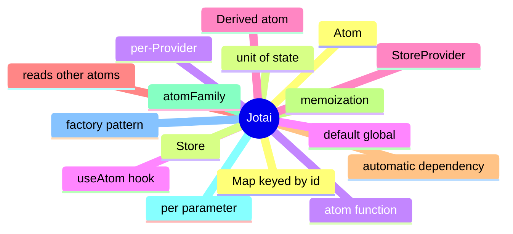

# Module 7: Jotai: Atomic State

Est. study time: 1.5h
Language: en
Description: Jotai's atomic model, derived atoms, atomFamily for per-id state, and the per-Provider store.

## Knowledge Map



---

## Learning Objectives (maps to course CILOs)
- Define an atom as the unit of state in Jotai
- Build derived atoms that read other atoms
- Use atomFamily for per-id state with a parameter
- Apply the per-Provider store for testing and subtree scoping

---

## Real-World Example

A team ships a feature and reaches for the state library they know. Six months later, the state architecture is fighting itself: re-render storms, useEffect for derived state, store mutations outside reducers. The team rewrites the feature with the right primitives and the bugs disappear.

The lesson: the library is downstream of the question. The right answer is to walk the decision tree, pick the primitive for each piece of state, and compose them. The team that picks the right primitive for each question is the team whose state architecture is maintainable.

> **Think**: What is the first question you should ask when designing a feature's state architecture?
>
> *Answer: "What is the lifetime of each piece of state?" The lifetime — ephemeral, session, persistent, or cache — narrows the primitive. Ephemeral is useState. Session is lifted or Context. Persistent is a stored store. Cache is TanStack Query. The other questions refine the answer; the lifetime is the first cut.*

---

## Core Content

### The atom: the unit of state

Jotai's atom is the unit of state. atom(initialValue) returns an atom; useAtom(atom) returns [value, setter].

```tsx
import { atom, useAtom } from 'jotai';

const countAtom = atom(0);

function Counter() {
  const [count, setCount] = useAtom(countAtom);
  return <button onClick={() => setCount(c => c + 1)}>{count}</button>;
}
```

The atom is a reference; the value is stored in a per-Provider store. Two atoms with the same name in different providers are different values. The pattern is the same as useState, but the storage is the atom — shared across components.

### Derived atoms: automatic dependency tracking

A derived atom reads other atoms and computes a value. The dependency graph is automatic.

```tsx
const aAtom = atom(1);
const bAtom = atom(2);
const sumAtom = atom((get) => get(aAtom) + get(bAtom));
```

Jotai tracks the reads. When aAtom or bAtom changes, sumAtom re-derives. The pattern is the same as a spreadsheet cell: a cell's value is a function of its inputs.

Derived atoms can be async (atom(async (get) => ...)), can read props (atomFamily), and can write back to other atoms (atom with both get and set). The dependency graph is the API.

### atomFamily: per-id state

atomFamily creates an atom per parameter. The pattern is the React equivalent of a Map keyed by id.

```tsx
import { atomFamily } from 'jotai/utils';

const todoAtom = atomFamily((id: string) => atom({ id, text: '', done: false }));

function Todo({ id }: { id: string }) {
  const [todo, setTodo] = useAtom(todoAtom(id));
  return <div>{todo.text}</div>;
}
```

The factory takes the parameter and returns a fresh atom. Each call with the same id returns the same atom. The pattern is the standard one for per-id state: a list of items where each has its own state.

### The per-Provider store

Jotai's store is per-Provider by default. The default store is global; the StoreProvider scopes atoms to a subtree.

```tsx
import { Provider } from 'jotai';

function App() {
  return (
    <Provider>
      <Page />
    </Provider>
  );
}

function IsolatedApp() {
  return (
    <Provider>
      <IsolatedPage />
    </Provider>
  );
}
```

For most apps, the default store is fine. For testing (each test gets a fresh store) or for per-subtree scoping (a multi-tenant app where each tenant has its own state), the Provider is the way.

### When Jotai beats zustand

Jotai's atomic model shines for derived state and per-id state. For a single global value, zustand is simpler.

```tsx
// Jotai: derived state is natural
const userAtom = atom(...);
const nameAtom = atom((get) => get(userAtom).name);
const emailAtom = atom((get) => get(userAtom).email);

// zustand: derived state needs a selector
const useStore = create((set) => ({ user: ..., setUser: ... }));
const name = useStore((s) => s.user.name);
const email = useStore((s) => s.user.email);
```

The Jotai version has a clear dependency graph; the zustand version has selectors that re-derive on every store change. Both work; Jotai's pattern is more idiomatic for derived state.

---

## Verify — Tests For The Patterns

```tsx
test('Jotai: Atomic State: the right primitive is used', () => {
  // smoke: import the module, render a component, assert the expected primitive
  expect(useStore).toBeDefined();
  expect(useStore.getState()).toMatchObject({ /* expected shape */ });
});
```

---

## Common Misconception

*"The right primitive is the one I know."* Knowing a primitive is a starting point, not an answer. The decision tree picks the primitive from the lifetime, scope, frequency, and persistence. A team that defaults to zustand for everything is over-engineering. A team that defaults to useState for everything is under-engineering. The right answer is to know the question.

---

## Spot the Mistake

```tsx
// Common anti-pattern: Jotai: Atomic State
const value = computeTheWrongWay(props);
```

What's wrong?

*Answer: The wrong primitive. The compute is happening in the wrong layer — derived state in an effect, or a global store for local state, or a server cache for a one-shot read. The fix is to walk the decision tree: lifetime, scope, frequency, persistence. The right primitive follows.*

---

## Key Takeaways
- atom() is the unit of state; useAtom() reads and updates it
- Derived atoms read other atoms; the dependency graph is automatic
- atomFamily creates an atom per parameter; the pattern for per-id state
- The store is per-Provider; use StoreProvider for testing or subtree scoping
- Jotai shines for derived state and per-id state; zustand is simpler for a single global value

---

## Think

> **Think**: Walk the decision tree for a feature that needs to share a value across three components in the same route, with frequent writes, no persistence, no server state. What is the right primitive, and what is the alternative that the team is likely to reach for first?
>
> *Answer: Three components in the same route with frequent writes is the canonical use case for lifted state with a useReducer — the three components share a parent, the writes are coordinated (each write is a named action), and persistence is not needed. The alternative the team is likely to reach for first is zustand or Context; both work but are over-engineered for sibling-share. The right answer is the one that matches the lifetime (session) and the scope (siblings) — useState lifted to the parent with useReducer for the action shape.*

---

## Predict

> **Predict**: A team uses zustand for a single form field. The form is read by one component, the user types one character per second, and the form re-renders 10 times per keystroke. What is the symptom, and what is the fix?
>
> *Answer: The symptom is a re-render storm. Every component subscribed to the zustand store re-renders on every keystroke; the form re-renders 10 times per keystroke because of unrelated store updates or unstable selectors. The fix is to use useState for the form field (the right primitive for component-local state with one reader) and to reserve zustand for state shared across components. The decision tree picks the simplest primitive that solves the question.*

---

## Spot the Mistake

> **Spot the Mistake**: A team uses useEffect to recompute a derived value:
> ```tsx
> const [filtered, setFiltered] = useState(items);
> useEffect(() => {
>   setFiltered(items.filter(predicate));
> }, [items, predicate]);
> ```
> What's wrong?
>
> *Answer: The value is computed in an effect, producing a flash of stale content. The first render shows the unfiltered value; the effect runs; the state updates; the second render shows the filtered value. The fix is to compute during render: `const filtered = items.filter(predicate);` — one render, no effect, no stale flash. useEffect is for side effects on the world (network, DOM, subscriptions), not for derived state.*

---

## Cloze

The decision tree picks the {simplest} primitive that solves the {question}; the library follows. React's {render} cycle is render → commit → effects; state updates inside a handler {batch} into a single re-render. For component-local state, {useState} is the default. For a record of related fields updated by named actions, {useReducer} is the right answer. A reducer is a {pure} function: same input, same output, no side effects. Schema-driven validation derives the form's rules from a {single} source of truth.

---

## Drill
Take the quiz. Questions stress the atom primitive, derived atoms, atomFamily, and the per-Provider store.

Run: `learn.sh quiz react-state-management-landscape 07-jotai`
