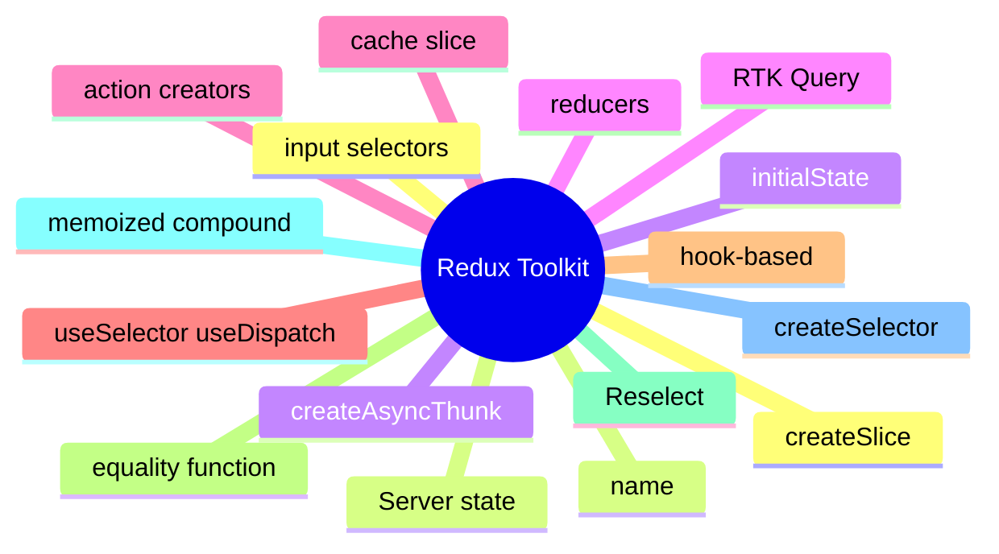

# Module 8: Redux Toolkit: The Canonical Store

Est. study time: 1.5h
Language: en
Description: createSlice, useSelector/useDispatch, reselect for compound selectors, RTK Query for server state, and the patterns that keep a Redux store readable.

## Knowledge Map



---

## Learning Objectives (maps to course CILOs)
- Create a slice with createSlice and consume it with useSelector/useDispatch
- Apply reselect for memoized compound selectors
- Distinguish createAsyncThunk from RTK Query for server state
- Recognize the slice boundary as the architectural decision

---

## Real-World Example

A team ships a feature and reaches for the state library they know. Six months later, the state architecture is fighting itself: re-render storms, useEffect for derived state, store mutations outside reducers. The team rewrites the feature with the right primitives and the bugs disappear.

The lesson: the library is downstream of the question. The right answer is to walk the decision tree, pick the primitive for each piece of state, and compose them. The team that picks the right primitive for each question is the team whose state architecture is maintainable.

> **Think**: What is the first question you should ask when designing a feature's state architecture?
>
> *Answer: "What is the lifetime of each piece of state?" The lifetime — ephemeral, session, persistent, or cache — narrows the primitive. Ephemeral is useState. Session is lifted or Context. Persistent is a stored store. Cache is TanStack Query. The other questions refine the answer; the lifetime is the first cut.*

---

## Core Content

### createSlice: actions, reducers, and types in one call

createSlice wraps action creators, reducers, and action types in one call. The boilerplate of classic Redux is gone; the mental model is the same.

```tsx
import { createSlice, configureStore } from '@reduxjs/toolkit';

const counterSlice = createSlice({
  name: 'counter',
  initialState: { count: 0 },
  reducers: {
    increment: (state) => { state.count += 1 },
    setName: (state, action: PayloadAction<string>) => { state.name = action.payload },
  },
});

export const { increment, setName } = counterSlice.actions;
export const counterReducer = counterSlice.reducer;

export const store = configureStore({ reducer: { counter: counterReducer } });
```

The slice's `name` is the namespace for action types (`counter/increment`). The `reducers` are the only way to update the state. Immer is built in — you can mutate the state inside reducers, and the toolkit produces immutable updates.

### useSelector and useDispatch: hooks-based access

useSelector reads a value from the store; useDispatch writes an action.

```tsx
import { useSelector, useDispatch } from 'react-redux';

function Counter() {
  const count = useSelector((state) => state.counter.count);
  const dispatch = useDispatch();
  return <button onClick={() => dispatch(increment())}>{count}</button>;
}
```

The selector runs on every store change. The component re-renders when the selected value changes. The dispatch is stable across renders.

A selector that returns a new object every call re-renders every consumer. The fix is reselect's createSelector for memoized compound selectors.

### Reselect: memoized compound selectors

createSelector from reselect builds a memoized selector from input selectors and a result function. The result is cached; it recomputes only when the inputs change.

```tsx
import { createSelector } from '@reduxjs/toolkit';

const selectItems = (state) => state.cart.items;
const selectFilter = (state) => state.cart.filter;

const selectVisibleItems = createSelector(
  [selectItems, selectFilter],
  (items, filter) => items.filter((i) => i.category === filter)
);
```

The selector recomputes only when items or filter changes. Components that use selectVisibleItems re-render only when the visible items change — not when the cart's other fields change.

createSelector is the right answer for compound selectors that compute expensive derivations or that are read by many components.

### createAsyncThunk vs RTK Query

createAsyncThunk is a thunk for async work; RTK Query is a dedicated cache for server state. The choice depends on whether you already have a Redux store.

```tsx
// createAsyncThunk: a thunk
export const fetchUser = createAsyncThunk('user/fetch', async (id) => {
  const res = await api.getUser(id);
  return res.data;
});

// RTK Query: a dedicated cache
const usersApi = createApi({
  baseQuery: fetchBaseQuery({ baseUrl: '/api' }),
  endpoints: (build) => ({
    getUser: build.query({ query: (id) => `users/${id}` }),
  }),
});
```

createAsyncThunk is the right answer when you want to keep the existing Redux store and add async work. RTK Query is the right answer when you are building a new app or want a dedicated cache with refetching, invalidation, and polling.

### The slice boundary as architecture

A slice is a logical grouping of state, not a technical one. The slicing decision is the architecture.

```tsx
// slice by user
const userSlice = createSlice({ name: 'user', ... });
const userPreferencesSlice = createSlice({ name: 'userPreferences', ... });

// slice by feature
const cartSlice = createSlice({ name: 'cart', ... });
const checkoutSlice = createSlice({ name: 'checkout', ... });

// slice by domain
const productsSlice = createSlice({ name: 'products', ... });
const ordersSlice = createSlice({ name: 'orders', ... });
```

The slicing decision is the seam between unrelated concerns. The pattern: slice by user, by feature, or by domain — not by reducer, by action, or by selector. The slicing is the architecture.

---

## Verify — Tests For The Patterns

```tsx
test('Redux Toolkit: The Canonical Store: the right primitive is used', () => {
  // smoke: import the module, render a component, assert the expected primitive
  expect(useStore).toBeDefined();
  expect(useStore.getState()).toMatchObject({ /* expected shape */ });
});
```

---

## Common Misconception

*"The right primitive is the one I know."* Knowing a primitive is a starting point, not an answer. The decision tree picks the primitive from the lifetime, scope, frequency, and persistence. A team that defaults to zustand for everything is over-engineering. A team that defaults to useState for everything is under-engineering. The right answer is to know the question.

---

## Spot the Mistake

```tsx
// Common anti-pattern: Redux Toolkit: The Canonical Store
const value = computeTheWrongWay(props);
```

What's wrong?

*Answer: The wrong primitive. The compute is happening in the wrong layer — derived state in an effect, or a global store for local state, or a server cache for a one-shot read. The fix is to walk the decision tree: lifetime, scope, frequency, persistence. The right primitive follows.*

---

## Key Takeaways
- createSlice wraps actions, reducers, and types in one call; Immer is built in
- useSelector reads; useDispatch writes; the dispatch is stable
- reselect's createSelector memoizes compound selectors
- createAsyncThunk is for adding async to an existing store; RTK Query is a dedicated cache
- Slice by user, by feature, or by domain; the slicing is the architecture

---

## Think

> **Think**: Walk the decision tree for a feature that needs to share a value across three components in the same route, with frequent writes, no persistence, no server state. What is the right primitive, and what is the alternative that the team is likely to reach for first?
>
> *Answer: Three components in the same route with frequent writes is the canonical use case for lifted state with a useReducer — the three components share a parent, the writes are coordinated (each write is a named action), and persistence is not needed. The alternative the team is likely to reach for first is zustand or Context; both work but are over-engineered for sibling-share. The right answer is the one that matches the lifetime (session) and the scope (siblings) — useState lifted to the parent with useReducer for the action shape.*

---

## Predict

> **Predict**: A team uses zustand for a single form field. The form is read by one component, the user types one character per second, and the form re-renders 10 times per keystroke. What is the symptom, and what is the fix?
>
> *Answer: The symptom is a re-render storm. Every component subscribed to the zustand store re-renders on every keystroke; the form re-renders 10 times per keystroke because of unrelated store updates or unstable selectors. The fix is to use useState for the form field (the right primitive for component-local state with one reader) and to reserve zustand for state shared across components. The decision tree picks the simplest primitive that solves the question.*

---

## Spot the Mistake

> **Spot the Mistake**: A team uses useEffect to recompute a derived value:
> ```tsx
> const [filtered, setFiltered] = useState(items);
> useEffect(() => {
>   setFiltered(items.filter(predicate));
> }, [items, predicate]);
> ```
> What's wrong?
>
> *Answer: The value is computed in an effect, producing a flash of stale content. The first render shows the unfiltered value; the effect runs; the state updates; the second render shows the filtered value. The fix is to compute during render: `const filtered = items.filter(predicate);` — one render, no effect, no stale flash. useEffect is for side effects on the world (network, DOM, subscriptions), not for derived state.*

---

## Cloze

The decision tree picks the {simplest} primitive that solves the {question}; the library follows. React's {render} cycle is render → commit → effects; state updates inside a handler {batch} into a single re-render. For component-local state, {useState} is the default. For a record of related fields updated by named actions, {useReducer} is the right answer. A reducer is a {pure} function: same input, same output, no side effects. Schema-driven validation derives the form's rules from a {single} source of truth.

---

## Drill
Take the quiz. Questions stress createSlice, useSelector/useDispatch, reselect, RTK Query, and slice boundaries.

Run: `learn.sh quiz react-state-management-landscape 08-redux-toolkit`
