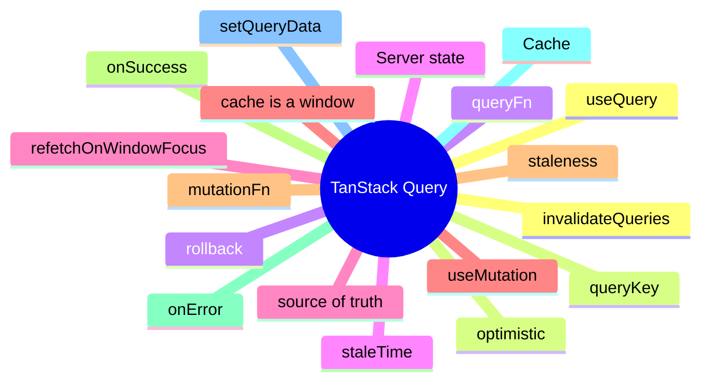

# Module 9: TanStack Query: Server-State as a First-Class Citizen

Est. study time: 1.5h
Language: en
Description: Query keys, useQuery, useMutation, cache invalidation, optimistic updates, and the patterns that keep a TanStack Query cache healthy.

## Knowledge Map



---

## Learning Objectives (maps to course CILOs)
- Define a query key and the data it identifies in the cache
- Distinguish setQueryData (precise) from invalidateQueries (safe)
- Apply staleTime, refetchOnWindowFocus, and refetchInterval for the right freshness
- Wire optimistic updates with rollback on error

---

## Real-World Example

A team ships a feature and reaches for the state library they know. Six months later, the state architecture is fighting itself: re-render storms, useEffect for derived state, store mutations outside reducers. The team rewrites the feature with the right primitives and the bugs disappear.

The lesson: the library is downstream of the question. The right answer is to walk the decision tree, pick the primitive for each piece of state, and compose them. The team that picks the right primitive for each question is the team whose state architecture is maintainable.

> **Think**: What is the first question you should ask when designing a feature's state architecture?
>
> *Answer: "What is the lifetime of each piece of state?" The lifetime — ephemeral, session, persistent, or cache — narrows the primitive. Ephemeral is useState. Session is lifted or Context. Persistent is a stored store. Cache is TanStack Query. The other questions refine the answer; the lifetime is the first cut.*

---

## Core Content

### useQuery: cacheable server state

useQuery is the read primitive. It takes a queryKey, a queryFn, and a set of options. It returns the cached value, the loading state, and the error.

```tsx
const { data, isLoading, error } = useQuery({
  queryKey: ['applicants', { cohort: 'Spring' }],
  queryFn: () => api.getApplicants({ cohort: 'Spring' }),
});
```

The queryKey is the cache identity. Two components that use the same queryKey read the same data. The queryFn is the fetch. The hook returns the cached value on re-render; it refetches when the data is stale.

### staleTime and the freshness budget

staleTime controls how long a query is considered fresh. A fresh query returns the cached value without a network round trip. A stale query refetches on the next render.

```tsx
const { data } = useQuery({
  queryKey: ['config'],
  queryFn: fetchConfig,
  staleTime: 5 * 60 * 1000,  // 5 minutes
});
```

The freshness budget is the trade-off. A short staleTime (e.g. 0) means the cache is always stale and refetches on every render. A long staleTime (e.g. 1 hour) means the cache is fresh and refetches rarely. The right answer depends on the data: config rarely changes; a feed changes constantly.

### useMutation: writes with side effects

useMutation is the write primitive. It takes a mutationFn and returns a tuple with the mutate function, the state, and the data.

```tsx
const mutation = useMutation({
  mutationFn: (newApplicant) => api.createApplicant(newApplicant),
  onSuccess: (data) => {
    queryClient.invalidateQueries({ queryKey: ['applicants'] });
  },
});
```

The mutation does not have a queryKey; it has a mutationKey. On success, the mutation decides what to do with the cache. The standard pattern is to invalidate the relevant queries so the next read refetches.

### setQueryData vs invalidateQueries

setQueryData updates the cache without a network round trip. invalidateQueries marks the query stale and refetches.

```tsx
// precise: client knows the new value
queryClient.setQueryData(['applicants'], (prev) => [...prev, newApplicant]);

// safe: server is the source of truth
queryClient.invalidateQueries({ queryKey: ['applicants'] });
```

setQueryData is precise (no extra fetch) but error-prone (the client must know the new value perfectly). invalidateQueries is safe (refetch guaranteed) but uses bandwidth. The choice depends on whether the server is the source of truth for the new value.

### Optimistic updates with rollback

An optimistic update shows the result before the server confirms. The rollback is the caller's job on error.

```tsx
const mutation = useMutation({
  mutationFn: api.updateApplicant,
  onMutate: async (newApplicant) => {
    await queryClient.cancelQueries({ queryKey: ['applicants', newApplicant.id] });
    const previous = queryClient.getQueryData(['applicants', newApplicant.id]);
    queryClient.setQueryData(['applicants', newApplicant.id], newApplicant);
    return { previous };
  },
  onError: (err, newApplicant, context) => {
    queryClient.setQueryData(['applicants', newApplicant.id], context.previous);
  },
  onSettled: (newApplicant) => {
    queryClient.invalidateQueries({ queryKey: ['applicants', newApplicant.id] });
  },
});
```

onMutate returns a context (the previous value). onError restores it. onSettled invalidates the query so the next read refetches. The pattern is the same as useOptimistic but at the cache level.

---

## Verify — Tests For The Patterns

```tsx
test('TanStack Query: Server-State as a First-Class Citizen: the right primitive is used', () => {
  // smoke: import the module, render a component, assert the expected primitive
  expect(useStore).toBeDefined();
  expect(useStore.getState()).toMatchObject({ /* expected shape */ });
});
```

---

## Common Misconception

*"The right primitive is the one I know."* Knowing a primitive is a starting point, not an answer. The decision tree picks the primitive from the lifetime, scope, frequency, and persistence. A team that defaults to zustand for everything is over-engineering. A team that defaults to useState for everything is under-engineering. The right answer is to know the question.

---

## Spot the Mistake

```tsx
// Common anti-pattern: TanStack Query: Server-State as a First-Class Citizen
const value = computeTheWrongWay(props);
```

What's wrong?

*Answer: The wrong primitive. The compute is happening in the wrong layer — derived state in an effect, or a global store for local state, or a server cache for a one-shot read. The fix is to walk the decision tree: lifetime, scope, frequency, persistence. The right primitive follows.*

---

## Key Takeaways
- useQuery is the read primitive; the queryKey is the cache identity
- staleTime controls freshness; the right answer depends on the data
- useMutation is the write primitive; on success, invalidate or setQueryData
- setQueryData is precise; invalidateQueries is safe
- Optimistic updates need onMutate (return context), onError (rollback), and onSettled (invalidate)

---

## Think

> **Think**: Walk the decision tree for a feature that needs to share a value across three components in the same route, with frequent writes, no persistence, no server state. What is the right primitive, and what is the alternative that the team is likely to reach for first?
>
> *Answer: Three components in the same route with frequent writes is the canonical use case for lifted state with a useReducer — the three components share a parent, the writes are coordinated (each write is a named action), and persistence is not needed. The alternative the team is likely to reach for first is zustand or Context; both work but are over-engineered for sibling-share. The right answer is the one that matches the lifetime (session) and the scope (siblings) — useState lifted to the parent with useReducer for the action shape.*

---

## Predict

> **Predict**: A team uses zustand for a single form field. The form is read by one component, the user types one character per second, and the form re-renders 10 times per keystroke. What is the symptom, and what is the fix?
>
> *Answer: The symptom is a re-render storm. Every component subscribed to the zustand store re-renders on every keystroke; the form re-renders 10 times per keystroke because of unrelated store updates or unstable selectors. The fix is to use useState for the form field (the right primitive for component-local state with one reader) and to reserve zustand for state shared across components. The decision tree picks the simplest primitive that solves the question.*

---

## Spot the Mistake

> **Spot the Mistake**: A team uses useEffect to recompute a derived value:
> ```tsx
> const [filtered, setFiltered] = useState(items);
> useEffect(() => {
>   setFiltered(items.filter(predicate));
> }, [items, predicate]);
> ```
> What's wrong?
>
> *Answer: The value is computed in an effect, producing a flash of stale content. The first render shows the unfiltered value; the effect runs; the state updates; the second render shows the filtered value. The fix is to compute during render: `const filtered = items.filter(predicate);` — one render, no effect, no stale flash. useEffect is for side effects on the world (network, DOM, subscriptions), not for derived state.*

---

## Cloze

The decision tree picks the {simplest} primitive that solves the {question}; the library follows. React's {render} cycle is render → commit → effects; state updates inside a handler {batch} into a single re-render. For component-local state, {useState} is the default. For a record of related fields updated by named actions, {useReducer} is the right answer. A reducer is a {pure} function: same input, same output, no side effects. Schema-driven validation derives the form's rules from a {single} source of truth.

---

## Drill
Take the quiz. Questions stress query keys, staleTime, mutation patterns, setQueryData vs invalidateQueries, and optimistic updates.

Run: `learn.sh quiz react-state-management-landscape 09-tanstack-query`
