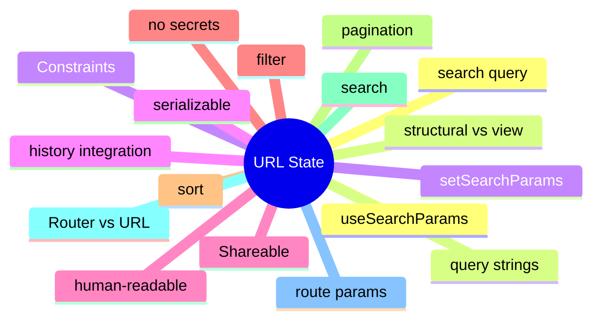

# Module 10: URL State: The Shareable Layer

Est. study time: 1.5h
Language: en
Description: useSearchParams, shareable view configuration, history integration, and when URL state is the right answer.

## Knowledge Map



---

## Learning Objectives (maps to course CILOs)
- Read and write URL state with useSearchParams
- Apply URL state to filters, sort, pagination, and search
- Recognize the seam between router-owned params and search-owned query
- Avoid putting secrets or large objects in the URL

---

## Real-World Example

A team ships a feature and reaches for the state library they know. Six months later, the state architecture is fighting itself: re-render storms, useEffect for derived state, store mutations outside reducers. The team rewrites the feature with the right primitives and the bugs disappear.

The lesson: the library is downstream of the question. The right answer is to walk the decision tree, pick the primitive for each piece of state, and compose them. The team that picks the right primitive for each question is the team whose state architecture is maintainable.

> **Think**: What is the first question you should ask when designing a feature's state architecture?
>
> *Answer: "What is the lifetime of each piece of state?" The lifetime — ephemeral, session, persistent, or cache — narrows the primitive. Ephemeral is useState. Session is lifted or Context. Persistent is a stored store. Cache is TanStack Query. The other questions refine the answer; the lifetime is the first cut.*

---

## Core Content

### useSearchParams: the React 18+ hook for URL state

useSearchParams is the React 18+ hook for reading and writing query strings. The API is like useState but the value is the URL.

```tsx
import { useSearchParams } from 'react-router-dom';

function Filters() {
  const [searchParams, setSearchParams] = useSearchParams();
  const cohort = searchParams.get('cohort') ?? 'all';
  return (
    <select value={cohort} onChange={(e) => setSearchParams({ cohort: e.target.value })}>
      <option value="all">All</option>
      <option value="spring">Spring</option>
      <option value="fall">Fall</option>
    </select>
  );
}
```

The setter updates the URL; the hook re-renders the consumer. The URL is the source of truth. The back button works for free.

### What belongs in URL state

URL state is the right answer for shareable view configuration: filters, sort, pagination, and search.

```tsx
// good: shareable
/applicants?cohort=spring&sort=name&page=2&q=smith

// bad: not URL-shaped
/applicants?data=eyJjb2hvcnQiOiJzcHJpbmciLCJzb3J0IjoibmFtZSJ9
```

Anything that should be a link is URL state. The user can copy the URL and send it to a colleague; the colleague lands on the same view. The back button restores the previous view.

### Router params vs search query

The router owns the URL and the route params; the app owns the search query. The split is the seam.

```tsx
// route: structural
/applicants/:id

// search: view configuration
/applicants/123?tab=history&page=2
```

React Router (or your framework's equivalent) owns the route params. useSearchParams owns the query. The split is the contract: route is structural (the entity), query is view (the configuration of the view). The two are different concerns; the two have different primitives.

### URL state and the back button

History and the back button are the seams that URL state honors for free. Component state does not.

```tsx
// user filters by Spring, then navigates to detail, then hits back
// with URL state: filter restored
// with component state: filter lost
```

The browser is the seam. URL state is the only way to make the back button work for view configuration. A back-button click should restore the previous view; URL state does that; component state does not.

### URL state and SSR

URL state is the default for server-side rendering. The server can read the URL and render the right view.

```tsx
// server
const url = new URL(request.url);
const cohort = url.searchParams.get('cohort');
const html = renderToString(<Applicants cohort={cohort} />);
```

The server renders the same view for the same URL. Component state is not available on the server; URL state is. For SSR-friendly apps, URL state is the natural fit. The URL is the seam between client and server.

---

## Verify — Tests For The Patterns

```tsx
test('URL State: The Shareable Layer: the right primitive is used', () => {
  // smoke: import the module, render a component, assert the expected primitive
  expect(useStore).toBeDefined();
  expect(useStore.getState()).toMatchObject({ /* expected shape */ });
});
```

---

## Common Misconception

*"The right primitive is the one I know."* Knowing a primitive is a starting point, not an answer. The decision tree picks the primitive from the lifetime, scope, frequency, and persistence. A team that defaults to zustand for everything is over-engineering. A team that defaults to useState for everything is under-engineering. The right answer is to know the question.

---

## Spot the Mistake

```tsx
// Common anti-pattern: URL State: The Shareable Layer
const value = computeTheWrongWay(props);
```

What's wrong?

*Answer: The wrong primitive. The compute is happening in the wrong layer — derived state in an effect, or a global store for local state, or a server cache for a one-shot read. The fix is to walk the decision tree: lifetime, scope, frequency, persistence. The right primitive follows.*

---

## Key Takeaways
- useSearchParams is the React 18+ hook for URL state; the URL is the source of truth
- URL state is for shareable view configuration: filters, sort, pagination, search
- Router owns route params; useSearchParams owns the search query
- URL state makes the back button work; component state does not
- URL state is SSR-friendly; the server can read the URL and render the right view

---

## Think

> **Think**: Walk the decision tree for a feature that needs to share a value across three components in the same route, with frequent writes, no persistence, no server state. What is the right primitive, and what is the alternative that the team is likely to reach for first?
>
> *Answer: Three components in the same route with frequent writes is the canonical use case for lifted state with a useReducer — the three components share a parent, the writes are coordinated (each write is a named action), and persistence is not needed. The alternative the team is likely to reach for first is zustand or Context; both work but are over-engineered for sibling-share. The right answer is the one that matches the lifetime (session) and the scope (siblings) — useState lifted to the parent with useReducer for the action shape.*

---

## Predict

> **Predict**: A team uses zustand for a single form field. The form is read by one component, the user types one character per second, and the form re-renders 10 times per keystroke. What is the symptom, and what is the fix?
>
> *Answer: The symptom is a re-render storm. Every component subscribed to the zustand store re-renders on every keystroke; the form re-renders 10 times per keystroke because of unrelated store updates or unstable selectors. The fix is to use useState for the form field (the right primitive for component-local state with one reader) and to reserve zustand for state shared across components. The decision tree picks the simplest primitive that solves the question.*

---

## Spot the Mistake

> **Spot the Mistake**: A team uses useEffect to recompute a derived value:
> ```tsx
> const [filtered, setFiltered] = useState(items);
> useEffect(() => {
>   setFiltered(items.filter(predicate));
> }, [items, predicate]);
> ```
> What's wrong?
>
> *Answer: The value is computed in an effect, producing a flash of stale content. The first render shows the unfiltered value; the effect runs; the state updates; the second render shows the filtered value. The fix is to compute during render: `const filtered = items.filter(predicate);` — one render, no effect, no stale flash. useEffect is for side effects on the world (network, DOM, subscriptions), not for derived state.*

---

## Cloze

The decision tree picks the {simplest} primitive that solves the {question}; the library follows. React's {render} cycle is render → commit → effects; state updates inside a handler {batch} into a single re-render. For component-local state, {useState} is the default. For a record of related fields updated by named actions, {useReducer} is the right answer. A reducer is a {pure} function: same input, same output, no side effects. Schema-driven validation derives the form's rules from a {single} source of truth.

---

## Drill
Take the quiz. Questions stress useSearchParams, what belongs in URL, router vs search, the back button, and SSR.

Run: `learn.sh quiz react-state-management-landscape 10-url-state`
