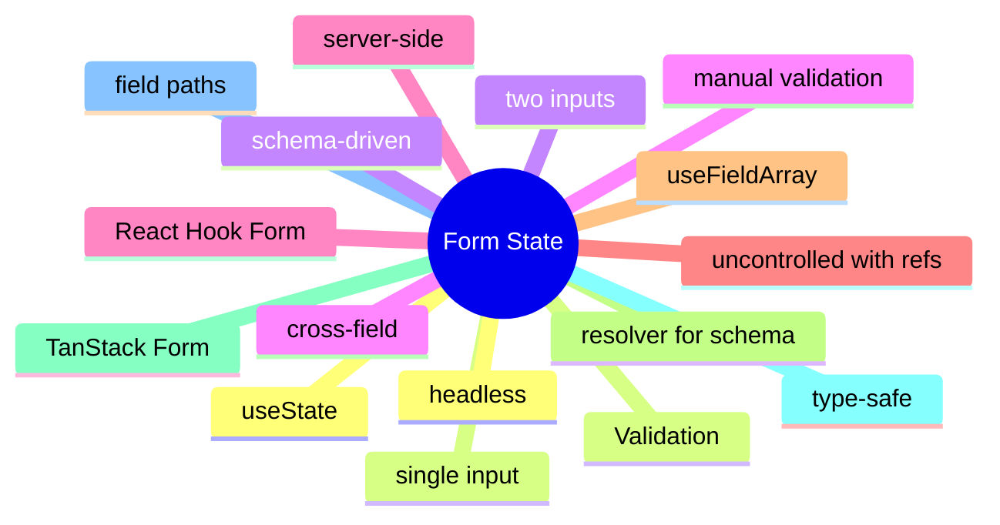

# Module 11: Form State: React Hook Form and TanStack Form

Est. study time: 1.5h
Language: en
Description: Form state as a local concern, controlled vs uncontrolled inputs, schema-driven validation, and the libraries that own the form pattern.

## Knowledge Map



---

## Learning Objectives (maps to course CILOs)
- Choose between useState, React Hook Form, and TanStack Form from the form's complexity
- Apply schema-driven validation with zod or valibot
- Recognize when cross-field validation is needed and where it lives
- Use field arrays for dynamic lists in a form

---

## Real-World Example

A team ships a feature and reaches for the state library they know. Six months later, the state architecture is fighting itself: re-render storms, useEffect for derived state, store mutations outside reducers. The team rewrites the feature with the right primitives and the bugs disappear.

The lesson: the library is downstream of the question. The right answer is to walk the decision tree, pick the primitive for each piece of state, and compose them. The team that picks the right primitive for each question is the team whose state architecture is maintainable.

> **Think**: What is the first question you should ask when designing a feature's state architecture?
>
> *Answer: "What is the lifetime of each piece of state?" The lifetime — ephemeral, session, persistent, or cache — narrows the primitive. Ephemeral is useState. Session is lifted or Context. Persistent is a stored store. Cache is TanStack Query. The other questions refine the answer; the lifetime is the first cut.*

---

## Core Content

### When to use a form library

A form library is the right answer when the form has multiple fields, cross-field validation, or dynamic fields. For a single input, useState is enough.

```tsx
// one input: useState
const [email, setEmail] = useState('');

// many inputs, cross-field validation, dynamic fields: library
const { register, handleSubmit } = useForm({ resolver: zodResolver(schema) });
```

The decision tree picks the primitive. One input is useState. Two inputs is a form. Twenty inputs with cross-field validation is a form library. The complexity of the form is the signal.

### React Hook Form: uncontrolled with refs

React Hook Form uses uncontrolled inputs with refs. The form state is internal, but the API is hooks-based.

```tsx
import { useForm } from 'react-hook-form';

function Form() {
  const { register, handleSubmit, formState: { errors } } = useForm();
  const onSubmit = (data) => api.submit(data);
  return (
    <form onSubmit={handleSubmit(onSubmit)}>
      <input {...register('email', { required: true })} />
      {errors.email && <span>Email is required</span>}
      <button type="submit">Submit</button>
    </form>
  );
}
```

The library uses refs to read input values, avoiding the controlled-input re-render on every keystroke. The form state is internal; the consumer subscribes to fields via the API.

### TanStack Form: type-safe alternative

TanStack Form is the type-safe alternative to React Hook Form. The same headless API with first-class TypeScript inference.

```tsx
import { useForm } from '@tanstack/react-form';

function Form() {
  const form = useForm({
    defaultValues: { email: '', name: '' },
    onSubmit: async ({ value }) => api.submit(value),
  });
  return (
    <form onSubmit={form.handleSubmit}>
      <form.Field name="email">
        {(field) => <input value={field.state.value} onChange={field.handleChange} />}
      </form.Field>
    </form>
  );
}
```

The choice between RHF and TanStack Form is the choice between ecosystem and type safety. RHF has a larger ecosystem and more community adapters. TanStack Form has stronger TypeScript inference and a more headless API.

### Schema-driven validation

Schema-driven validation uses zod or valibot to derive the form's validation rules from a single source of truth.

```tsx
import { zodResolver } from '@hookform/resolvers/zod';
import { z } from 'zod';

const schema = z.object({
  email: z.string().email(),
  age: z.number().min(18),
});

const { register, handleSubmit } = useForm({ resolver: zodResolver(schema) });
```

The schema is the source of truth for the form's shape and the validation rules. The form library consumes the schema; the consumer writes the schema. Drift is impossible — the form cannot have a field that the schema does not know about.

### Cross-field validation

Cross-field validation depends on multiple fields. It lives in the form's submit handler or the schema's superRefine.

```tsx
const schema = z.object({
  password: z.string().min(8),
  confirmPassword: z.string(),
}).refine((data) => data.password === data.confirmPassword, {
  message: 'Passwords do not match',
  path: ['confirmPassword'],
});
```

The schema's refine is the right place for cross-field validation. The library runs the refine at validation time; the error is attached to the right field. The pattern is the same as a database constraint.

---

## Verify — Tests For The Patterns

```tsx
test('Form State: React Hook Form and TanStack Form: the right primitive is used', () => {
  // smoke: import the module, render a component, assert the expected primitive
  expect(useStore).toBeDefined();
  expect(useStore.getState()).toMatchObject({ /* expected shape */ });
});
```

---

## Common Misconception

*"The right primitive is the one I know."* Knowing a primitive is a starting point, not an answer. The decision tree picks the primitive from the lifetime, scope, frequency, and persistence. A team that defaults to zustand for everything is over-engineering. A team that defaults to useState for everything is under-engineering. The right answer is to know the question.

---

## Spot the Mistake

```tsx
// Common anti-pattern: Form State: React Hook Form and TanStack Form
const value = computeTheWrongWay(props);
```

What's wrong?

*Answer: The wrong primitive. The compute is happening in the wrong layer — derived state in an effect, or a global store for local state, or a server cache for a one-shot read. The fix is to walk the decision tree: lifetime, scope, frequency, persistence. The right primitive follows.*

---

## Key Takeaways
- useState is enough for a single input; a form library is the right answer for many fields
- React Hook Form uses uncontrolled inputs with refs; TanStack Form is type-safe
- Schema-driven validation with zod or valibot is the single source of truth
- Cross-field validation lives in the schema's refine or the submit handler
- Field arrays handle dynamic lists in a form

---

## Think

> **Think**: Walk the decision tree for a feature that needs to share a value across three components in the same route, with frequent writes, no persistence, no server state. What is the right primitive, and what is the alternative that the team is likely to reach for first?
>
> *Answer: Three components in the same route with frequent writes is the canonical use case for lifted state with a useReducer — the three components share a parent, the writes are coordinated (each write is a named action), and persistence is not needed. The alternative the team is likely to reach for first is zustand or Context; both work but are over-engineered for sibling-share. The right answer is the one that matches the lifetime (session) and the scope (siblings) — useState lifted to the parent with useReducer for the action shape.*

---

## Predict

> **Predict**: A team uses zustand for a single form field. The form is read by one component, the user types one character per second, and the form re-renders 10 times per keystroke. What is the symptom, and what is the fix?
>
> *Answer: The symptom is a re-render storm. Every component subscribed to the zustand store re-renders on every keystroke; the form re-renders 10 times per keystroke because of unrelated store updates or unstable selectors. The fix is to use useState for the form field (the right primitive for component-local state with one reader) and to reserve zustand for state shared across components. The decision tree picks the simplest primitive that solves the question.*

---

## Spot the Mistake

> **Spot the Mistake**: A team uses useEffect to recompute a derived value:
> ```tsx
> const [filtered, setFiltered] = useState(items);
> useEffect(() => {
>   setFiltered(items.filter(predicate));
> }, [items, predicate]);
> ```
> What's wrong?
>
> *Answer: The value is computed in an effect, producing a flash of stale content. The first render shows the unfiltered value; the effect runs; the state updates; the second render shows the filtered value. The fix is to compute during render: `const filtered = items.filter(predicate);` — one render, no effect, no stale flash. useEffect is for side effects on the world (network, DOM, subscriptions), not for derived state.*

---

## Cloze

The decision tree picks the {simplest} primitive that solves the {question}; the library follows. React's {render} cycle is render → commit → effects; state updates inside a handler {batch} into a single re-render. For component-local state, {useState} is the default. For a record of related fields updated by named actions, {useReducer} is the right answer. A reducer is a {pure} function: same input, same output, no side effects. Schema-driven validation derives the form's rules from a {single} source of truth.

---

## Drill
Take the quiz. Questions stress library choice, schema-driven validation, cross-field validation, and field arrays.

Run: `learn.sh quiz react-state-management-landscape 11-form-state`
