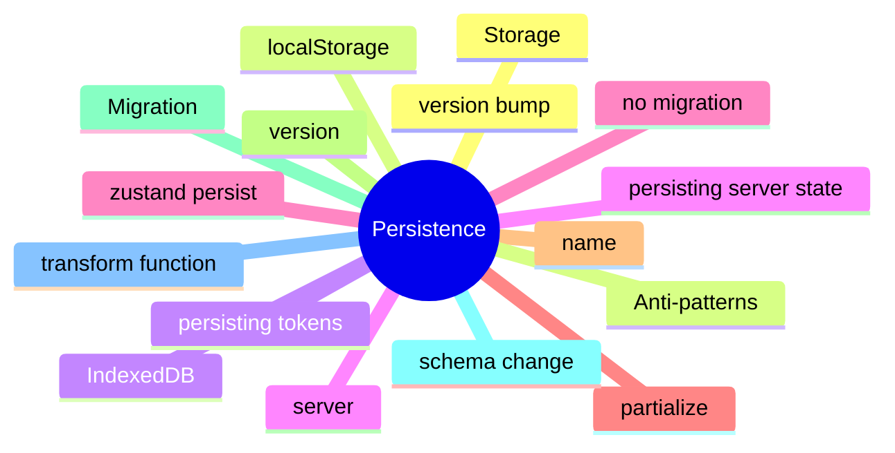

# Module 12: Persistence: LocalStorage, IndexedDB, and Migrations

Est. study time: 1.5h
Language: en
Description: Surviving reload: the storage layer (localStorage, IndexedDB, server), zustand persist, partialize, and the migration pattern.

## Knowledge Map



---

## Learning Objectives (maps to course CILOs)
- Choose between localStorage, IndexedDB, and server-side persistence from the data shape and size
- Apply zustand persist with partialize to control what is persisted
- Write a migration when the persisted schema changes
- Recognize the anti-pattern of persisting server-derived state

---

## Real-World Example

A team ships a feature and reaches for the state library they know. Six months later, the state architecture is fighting itself: re-render storms, useEffect for derived state, store mutations outside reducers. The team rewrites the feature with the right primitives and the bugs disappear.

The lesson: the library is downstream of the question. The right answer is to walk the decision tree, pick the primitive for each piece of state, and compose them. The team that picks the right primitive for each question is the team whose state architecture is maintainable.

> **Think**: What is the first question you should ask when designing a feature's state architecture?
>
> *Answer: "What is the lifetime of each piece of state?" The lifetime — ephemeral, session, persistent, or cache — narrows the primitive. Ephemeral is useState. Session is lifted or Context. Persistent is a stored store. Cache is TanStack Query. The other questions refine the answer; the lifetime is the first cut.*

---

## Core Content

### Choosing the storage layer

The storage layer is the answer to the persistence question. The choice depends on the data shape and size.

- localStorage: 5-10MB, synchronous, key-value strings. Fine for settings and small UI state. Wrong for large data or frequent reads.
- IndexedDB: megabytes to gigabytes, asynchronous, structured. Right for large client-side data and offline support.
- Server: cross-device, cross-tab, the source of truth. The cost is a network round trip and a server to maintain.

The decision tree picks the layer. Small data, infrequent reads, single device: localStorage. Large data, frequent reads, offline: IndexedDB. Cross-device: server.

### zustand persist: the middleware

zustand persist writes the store to localStorage on every change. The partialize option controls which fields are persisted.

```tsx
import { persist, createJSONStorage } from 'zustand/middleware';

const useStore = create(
  persist(
    (set) => ({
      token: null,
      theme: 'light',
      setToken: (t) => set({ token: t }),
      setTheme: (t) => set({ theme: t }),
    }),
    {
      name: 'app-storage',
      storage: createJSONStorage(() => localStorage),
      partialize: (state) => ({ theme: state.theme }),  // do not persist token
    }
  )
);
```

Persisting tokens is risky (XSS can scrape localStorage). Persisting UI state is fine. partialize is the place to make that call.

### Migrations: transforming old data to new

A migration is a function that transforms persisted data when the schema changes. Without migrations, old data can crash the new app.

```tsx
persist(
  (set) => ({ ... }),
  {
    name: 'app-storage',
    version: 2,
    migrate: (persistedState, version) => {
      if (version === 0) {
        // v0 → v1: rename 'userName' to 'username'
        persistedState.username = persistedState.userName;
        delete persistedState.userName;
      }
      if (version < 2) {
        // v1 → v2: add 'preferences' field
        persistedState.preferences = { theme: 'light' };
      }
      return persistedState;
    },
  }
);
```

The version is the migration point. Newer data is rejected (the user is on an old version of the app). Older data is migrated. The pattern is the same as database schema migrations.

### Persisting server-derived state: the anti-pattern

Persisting server-derived state is an anti-pattern. The server is the source of truth, and the persisted value will be stale on the next refetch.

```tsx
// wrong: persisting TanStack Query's cache
persist(queryClient, { name: 'query-cache' });

// right: let the cache refetch
useQuery({ queryKey: ['applicants'], queryFn: fetchApplicants });
```

The cache is a window onto the server. Persisting it is fighting the staleness logic. The cache refetches on focus; the persisted value is overridden. The pattern is to let the cache refetch.

### IndexedDB for large data

IndexedDB is the right answer for large client-side data: megabytes to gigabytes of structured data, offline support, indexed queries.

```tsx
import { openDB } from 'idb';

const db = await openDB('app-db', 1, {
  upgrade(db) {
    db.createObjectStore('applicants', { keyPath: 'id' });
  },
});

await db.put('applicants', { id: 'A-1', name: 'Aissa' });
const all = await db.getAll('applicants');
```

IndexedDB is async; the API is verbose compared to localStorage. Libraries like idb wrap it in a Promise-based API. The right answer for large client-side data.

---

## Verify — Tests For The Patterns

```tsx
test('Persistence: LocalStorage, IndexedDB, and Migrations: the right primitive is used', () => {
  // smoke: import the module, render a component, assert the expected primitive
  expect(useStore).toBeDefined();
  expect(useStore.getState()).toMatchObject({ /* expected shape */ });
});
```

---

## Common Misconception

*"The right primitive is the one I know."* Knowing a primitive is a starting point, not an answer. The decision tree picks the primitive from the lifetime, scope, frequency, and persistence. A team that defaults to zustand for everything is over-engineering. A team that defaults to useState for everything is under-engineering. The right answer is to know the question.

---

## Spot the Mistake

```tsx
// Common anti-pattern: Persistence: LocalStorage, IndexedDB, and Migrations
const value = computeTheWrongWay(props);
```

What's wrong?

*Answer: The wrong primitive. The compute is happening in the wrong layer — derived state in an effect, or a global store for local state, or a server cache for a one-shot read. The fix is to walk the decision tree: lifetime, scope, frequency, persistence. The right primitive follows.*

---

## Key Takeaways
- Choose the storage layer from the data shape and size: localStorage, IndexedDB, or server
- zustand persist with partialize controls which fields are persisted; tokens are risky
- Migrations transform old data to new when the schema changes; bump the version
- Persisting server-derived state is an anti-pattern; the cache refetches
- IndexedDB is the right answer for large data and offline support

---

## Think

> **Think**: Walk the decision tree for a feature that needs to share a value across three components in the same route, with frequent writes, no persistence, no server state. What is the right primitive, and what is the alternative that the team is likely to reach for first?
>
> *Answer: Three components in the same route with frequent writes is the canonical use case for lifted state with a useReducer — the three components share a parent, the writes are coordinated (each write is a named action), and persistence is not needed. The alternative the team is likely to reach for first is zustand or Context; both work but are over-engineered for sibling-share. The right answer is the one that matches the lifetime (session) and the scope (siblings) — useState lifted to the parent with useReducer for the action shape.*

---

## Predict

> **Predict**: A team uses zustand for a single form field. The form is read by one component, the user types one character per second, and the form re-renders 10 times per keystroke. What is the symptom, and what is the fix?
>
> *Answer: The symptom is a re-render storm. Every component subscribed to the zustand store re-renders on every keystroke; the form re-renders 10 times per keystroke because of unrelated store updates or unstable selectors. The fix is to use useState for the form field (the right primitive for component-local state with one reader) and to reserve zustand for state shared across components. The decision tree picks the simplest primitive that solves the question.*

---

## Spot the Mistake

> **Spot the Mistake**: A team uses useEffect to recompute a derived value:
> ```tsx
> const [filtered, setFiltered] = useState(items);
> useEffect(() => {
>   setFiltered(items.filter(predicate));
> }, [items, predicate]);
> ```
> What's wrong?
>
> *Answer: The value is computed in an effect, producing a flash of stale content. The first render shows the unfiltered value; the effect runs; the state updates; the second render shows the filtered value. The fix is to compute during render: `const filtered = items.filter(predicate);` — one render, no effect, no stale flash. useEffect is for side effects on the world (network, DOM, subscriptions), not for derived state.*

---

## Cloze

The decision tree picks the {simplest} primitive that solves the {question}; the library follows. React's {render} cycle is render → commit → effects; state updates inside a handler {batch} into a single re-render. For component-local state, {useState} is the default. For a record of related fields updated by named actions, {useReducer} is the right answer. A reducer is a {pure} function: same input, same output, no side effects. Schema-driven validation derives the form's rules from a {single} source of truth.

---

## Drill
Take the quiz. Questions stress storage choice, persist with partialize, migrations, and the server-state anti-pattern.

Run: `learn.sh quiz react-state-management-landscape 12-persistence`
