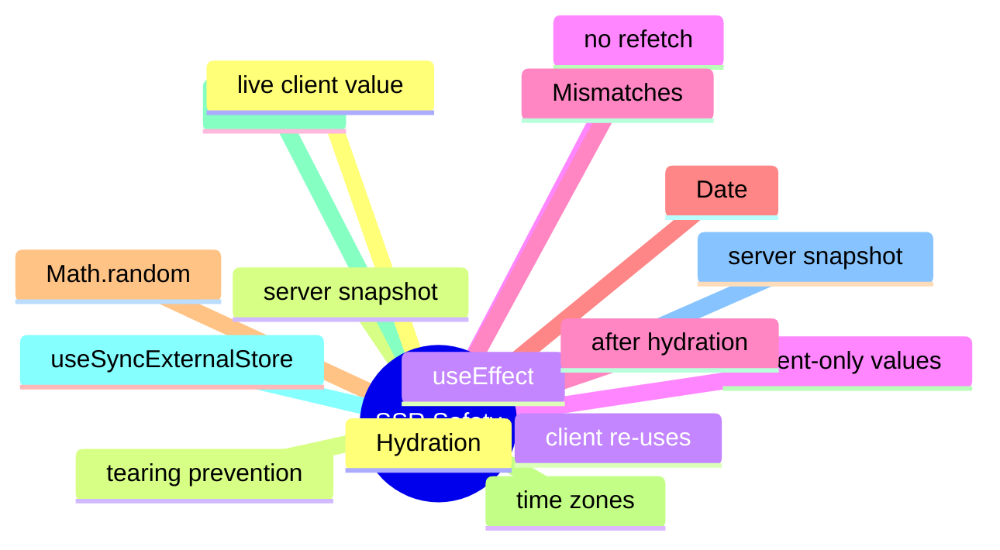

# Module 13: SSR Safety and Hydration

Est. study time: 1.5h
Language: en
Description: Hydrating server-rendered HTML with client state, server snapshots, common hydration traps (Date, Math.random, time zones), and useSyncExternalStore for SSR.

## Knowledge Map



---

## Learning Objectives (maps to course CILOs)
- Apply server snapshots to hydrate client state without a refetch
- Recognize common hydration traps: Date, Math.random, time zones, window
- Use useSyncExternalStore for SSR-safe external store integration
- Read client-only values inside useEffect to avoid hydration mismatches

---

## Real-World Example

A team ships a feature and reaches for the state library they know. Six months later, the state architecture is fighting itself: re-render storms, useEffect for derived state, store mutations outside reducers. The team rewrites the feature with the right primitives and the bugs disappear.

The lesson: the library is downstream of the question. The right answer is to walk the decision tree, pick the primitive for each piece of state, and compose them. The team that picks the right primitive for each question is the team whose state architecture is maintainable.

> **Think**: What is the first question you should ask when designing a feature's state architecture?
>
> *Answer: "What is the lifetime of each piece of state?" The lifetime — ephemeral, session, persistent, or cache — narrows the primitive. Ephemeral is useState. Session is lifted or Context. Persistent is a stored store. Cache is TanStack Query. The other questions refine the answer; the lifetime is the first cut.*

---

## Core Content

### Hydration: server snapshot, client re-use

The server renders HTML with one version of the state. The client re-renders with the same state to avoid a refetch and a hydration mismatch.

```tsx
// server
const state = dehydrate(queryClient);
const html = renderToString(<App />);

// client
hydrate(queryClient, state);
const root = hydrateRoot(document, <App />);
```

The pattern: dehydrate the server state into the HTML; hydrate it on the client. TanStack Query and zustand both ship the pattern (e.g. zustand/middleware/persist with skipHydration).

### Common hydration traps

A hydration mismatch happens when the server's rendered HTML differs from the client's first render. The mismatch is the contract violation.

Common traps:
- new Date() in render: server time vs client time.
- Math.random() in render: different on every call.
- Time zones: server in UTC, client in PST.
- window.localStorage, window.matchMedia: not available on the server.
- navigator.language: not available on the server.

The fix: compute these in an effect, pass them as props from the server, or guard with a useEffect-based client-only flag.

### useSyncExternalStore for SSR

useSyncExternalStore is the React 18+ primitive for SSR-safe external store integration. The hook takes a getServerSnapshot function that returns the value to use during SSR.

```tsx
function useStore<T>(selector: (state: State) => T): T {
  return useSyncExternalStore(
    store.subscribe,
    () => selector(store.getState()),
    () => selector(store.getServerSnapshot?.() ?? store.getState())
  );
}
```

On the server, the hook calls getServerSnapshot. On the client, it calls the live getSnapshot. The hook is the bridge between server and client state, and it prevents tearing during concurrent rendering.

### Reading client-only values in useEffect

An effect runs after hydration. Reading window.localStorage, navigator.language, or window.matchMedia in an effect is SSR-safe.

```tsx
function Component() {
  const [theme, setTheme] = useState('light');
  useEffect(() => {
    const stored = localStorage.getItem('theme');
    if (stored) setTheme(stored);
  }, []);
  return <div className={theme}>...</div>;
}
```

The first render uses the default value. The effect runs after hydration, reads the client-only value, and updates the state. The re-render uses the client value. No hydration mismatch.

### When SSR safety is not relevant

For a client-only app, SSR safety is not relevant. The app renders on the client only. There is no server render; there is no hydration.

A portal like Aissa's enterprise React UI is client-only. The question of SSR safety is for Next.js, Remix, or any framework that ships HTML from the server. The skills built into this course are framework-neutral on this point.

---

## Verify — Tests For The Patterns

```tsx
test('SSR Safety and Hydration: the right primitive is used', () => {
  // smoke: import the module, render a component, assert the expected primitive
  expect(useStore).toBeDefined();
  expect(useStore.getState()).toMatchObject({ /* expected shape */ });
});
```

---

## Common Misconception

*"The right primitive is the one I know."* Knowing a primitive is a starting point, not an answer. The decision tree picks the primitive from the lifetime, scope, frequency, and persistence. A team that defaults to zustand for everything is over-engineering. A team that defaults to useState for everything is under-engineering. The right answer is to know the question.

---

## Spot the Mistake

```tsx
// Common anti-pattern: SSR Safety and Hydration
const value = computeTheWrongWay(props);
```

What's wrong?

*Answer: The wrong primitive. The compute is happening in the wrong layer — derived state in an effect, or a global store for local state, or a server cache for a one-shot read. The fix is to walk the decision tree: lifetime, scope, frequency, persistence. The right primitive follows.*

---

## Key Takeaways
- Hydration re-uses the server's state on the client; no refetch
- Common hydration traps: Date, Math.random, time zones, window
- useSyncExternalStore's getServerSnapshot is the SSR-safe bridge
- Read client-only values inside useEffect; effects run after hydration
- For client-only apps, SSR safety is not relevant

---

## Think

> **Think**: Walk the decision tree for a feature that needs to share a value across three components in the same route, with frequent writes, no persistence, no server state. What is the right primitive, and what is the alternative that the team is likely to reach for first?
>
> *Answer: Three components in the same route with frequent writes is the canonical use case for lifted state with a useReducer — the three components share a parent, the writes are coordinated (each write is a named action), and persistence is not needed. The alternative the team is likely to reach for first is zustand or Context; both work but are over-engineered for sibling-share. The right answer is the one that matches the lifetime (session) and the scope (siblings) — useState lifted to the parent with useReducer for the action shape.*

---

## Predict

> **Predict**: A team uses zustand for a single form field. The form is read by one component, the user types one character per second, and the form re-renders 10 times per keystroke. What is the symptom, and what is the fix?
>
> *Answer: The symptom is a re-render storm. Every component subscribed to the zustand store re-renders on every keystroke; the form re-renders 10 times per keystroke because of unrelated store updates or unstable selectors. The fix is to use useState for the form field (the right primitive for component-local state with one reader) and to reserve zustand for state shared across components. The decision tree picks the simplest primitive that solves the question.*

---

## Spot the Mistake

> **Spot the Mistake**: A team uses useEffect to recompute a derived value:
> ```tsx
> const [filtered, setFiltered] = useState(items);
> useEffect(() => {
>   setFiltered(items.filter(predicate));
> }, [items, predicate]);
> ```
> What's wrong?
>
> *Answer: The value is computed in an effect, producing a flash of stale content. The first render shows the unfiltered value; the effect runs; the state updates; the second render shows the filtered value. The fix is to compute during render: `const filtered = items.filter(predicate);` — one render, no effect, no stale flash. useEffect is for side effects on the world (network, DOM, subscriptions), not for derived state.*

---

## Cloze

The decision tree picks the {simplest} primitive that solves the {question}; the library follows. React's {render} cycle is render → commit → effects; state updates inside a handler {batch} into a single re-render. For component-local state, {useState} is the default. For a record of related fields updated by named actions, {useReducer} is the right answer. A reducer is a {pure} function: same input, same output, no side effects. Schema-driven validation derives the form's rules from a {single} source of truth.

---

## Drill
Take the quiz. Questions stress server snapshots, hydration traps, useSyncExternalStore, and useEffect for client-only values.

Run: `learn.sh quiz react-state-management-landscape 13-ssr-safety`
