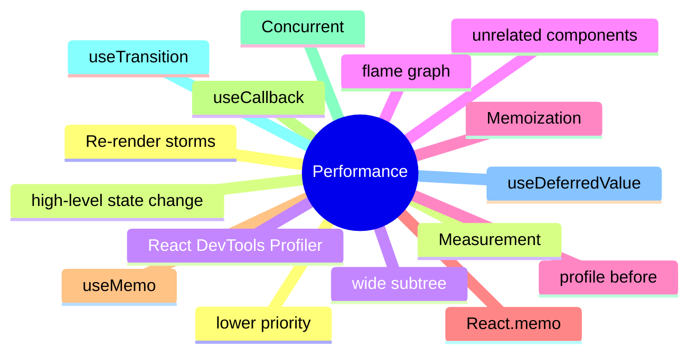

# Module 14: Performance: Re-render Storms and Selector Stability

Est. study time: 1.5h
Language: en
Description: Diagnosing re-render storms, React.memo, useMemo, useCallback, useTransition, useDeferredValue, and the React DevTools Profiler.

## Knowledge Map



---

## Learning Objectives (maps to course CILOs)
- Diagnose a re-render storm using the React DevTools Profiler
- Apply React.memo, useMemo, and useCallback at the right boundary
- Use useTransition and useDeferredValue to defer expensive updates
- Profile before optimizing and after; intuition is not measurement

---

## Real-World Example

A team ships a feature and reaches for the state library they know. Six months later, the state architecture is fighting itself: re-render storms, useEffect for derived state, store mutations outside reducers. The team rewrites the feature with the right primitives and the bugs disappear.

The lesson: the library is downstream of the question. The right answer is to walk the decision tree, pick the primitive for each piece of state, and compose them. The team that picks the right primitive for each question is the team whose state architecture is maintainable.

> **Think**: What is the first question you should ask when designing a feature's state architecture?
>
> *Answer: "What is the lifetime of each piece of state?" The lifetime — ephemeral, session, persistent, or cache — narrows the primitive. Ephemeral is useState. Session is lifted or Context. Persistent is a stored store. Cache is TanStack Query. The other questions refine the answer; the lifetime is the first cut.*

---

## Core Content

### Re-render storms: a single change, a wide cascade

A re-render storm happens when a single state change at a high level re-renders a wide subtree of unrelated components.

```tsx
// provider
const [value, setValue] = useState(0);

// consumer
function Header() { const v = useContext(SomeContext); return <div>{v}</div>; }
function Sidebar() { const v = useContext(SomeContext); return <div>{v}</div>; }
function List() { const v = useContext(SomeContext); return <List items={...} />; }
```

When `value` changes, Header, Sidebar, and List all re-render. If they are unrelated to the value, the storm is the bug. The fix: smaller state boundaries, more components, or external stores with selectors.

### React.memo: the wrapper

React.memo is a higher-order component that prevents a re-render when props are referentially equal.

```tsx
const MemoizedHeader = React.memo(Header);
```

The default comparison is shallow. The pattern is to memoize at the component boundary, not at the function level. Memoizing individual functions inside a component is the wrong granularity.

The trade-off: React.memo adds a comparison cost on every render. For components that re-render rarely, the cost is overhead. For components that re-render often with the same props, the cost pays off.

### useMemo and useCallback: the hooks

useMemo memoizes a value across renders; useCallback memoizes a function.

```tsx
const sorted = useMemo(() => items.sort(compare), [items]);
const onClick = useCallback(() => setCount(c => c + 1), []);
```

useMemo and useCallback are the same idea applied to different shapes. The deps array drives when the memo is invalidated. A missing dep produces a stale memo; an extra dep produces unnecessary re-computation.

The principle: memoize what is expensive to compute, not everything. The cost of the memo is the cost of the comparison; the benefit is the cost of avoiding the computation.

### useTransition: defer non-urgent updates

useTransition defers a state update so the UI stays responsive. The deferred update is rendered at a lower priority.

```tsx
const [isPending, startTransition] = useTransition();
const onChange = (e) => {
  const value = e.target.value;
  startTransition(() => setFilter(value));
  setInputValue(value);
};
```

The input value updates synchronously (urgent). The filter update is deferred (non-urgent). The UI stays responsive while the expensive filter runs in the background.

The pattern: useTransition for any state update that touches a heavy computation — filtering a large list, switching tabs with many components, etc.

### useDeferredValue: the mirror

useDeferredValue is the mirror of useTransition. It defers a value that is expensive to compute.

```tsx
const deferredQuery = useDeferredValue(query);
const results = useMemo(() => expensiveSearch(deferredQuery), [deferredQuery]);
```

The hook returns the original value synchronously, then the deferred value when React has time. The pattern is the same as useTransition but applied to a value rather than a state update.

The combination of useDeferredValue and useMemo is the standard pattern for expensive computations that depend on user input.

---

## Verify — Tests For The Patterns

```tsx
test('Performance: Re-render Storms and Selector Stability: the right primitive is used', () => {
  // smoke: import the module, render a component, assert the expected primitive
  expect(useStore).toBeDefined();
  expect(useStore.getState()).toMatchObject({ /* expected shape */ });
});
```

---

## Common Misconception

*"The right primitive is the one I know."* Knowing a primitive is a starting point, not an answer. The decision tree picks the primitive from the lifetime, scope, frequency, and persistence. A team that defaults to zustand for everything is over-engineering. A team that defaults to useState for everything is under-engineering. The right answer is to know the question.

---

## Spot the Mistake

```tsx
// Common anti-pattern: Performance: Re-render Storms and Selector Stability
const value = computeTheWrongWay(props);
```

What's wrong?

*Answer: The wrong primitive. The compute is happening in the wrong layer — derived state in an effect, or a global store for local state, or a server cache for a one-shot read. The fix is to walk the decision tree: lifetime, scope, frequency, persistence. The right primitive follows.*

---

## Key Takeaways
- Re-render storms are diagnosed with the React DevTools Profiler; the flame graph shows the cascade
- React.memo is a wrapper; useMemo and useCallback are hooks
- useTransition defers a state update; useDeferredValue defers a value
- Memoize what is expensive, not everything; the comparison has a cost
- Profile before optimizing and after; intuition is not measurement

---

## Think

> **Think**: Walk the decision tree for a feature that needs to share a value across three components in the same route, with frequent writes, no persistence, no server state. What is the right primitive, and what is the alternative that the team is likely to reach for first?
>
> *Answer: Three components in the same route with frequent writes is the canonical use case for lifted state with a useReducer — the three components share a parent, the writes are coordinated (each write is a named action), and persistence is not needed. The alternative the team is likely to reach for first is zustand or Context; both work but are over-engineered for sibling-share. The right answer is the one that matches the lifetime (session) and the scope (siblings) — useState lifted to the parent with useReducer for the action shape.*

---

## Predict

> **Predict**: A team uses zustand for a single form field. The form is read by one component, the user types one character per second, and the form re-renders 10 times per keystroke. What is the symptom, and what is the fix?
>
> *Answer: The symptom is a re-render storm. Every component subscribed to the zustand store re-renders on every keystroke; the form re-renders 10 times per keystroke because of unrelated store updates or unstable selectors. The fix is to use useState for the form field (the right primitive for component-local state with one reader) and to reserve zustand for state shared across components. The decision tree picks the simplest primitive that solves the question.*

---

## Spot the Mistake

> **Spot the Mistake**: A team uses useEffect to recompute a derived value:
> ```tsx
> const [filtered, setFiltered] = useState(items);
> useEffect(() => {
>   setFiltered(items.filter(predicate));
> }, [items, predicate]);
> ```
> What's wrong?
>
> *Answer: The value is computed in an effect, producing a flash of stale content. The first render shows the unfiltered value; the effect runs; the state updates; the second render shows the filtered value. The fix is to compute during render: `const filtered = items.filter(predicate);` — one render, no effect, no stale flash. useEffect is for side effects on the world (network, DOM, subscriptions), not for derived state.*

---

## Cloze

The decision tree picks the {simplest} primitive that solves the {question}; the library follows. React's {render} cycle is render → commit → effects; state updates inside a handler {batch} into a single re-render. For component-local state, {useState} is the default. For a record of related fields updated by named actions, {useReducer} is the right answer. A reducer is a {pure} function: same input, same output, no side effects. Schema-driven validation derives the form's rules from a {single} source of truth.

---

## Drill
Take the quiz. Questions stress re-render storms, memoization boundaries, useTransition, useDeferredValue, and profiling.

Run: `learn.sh quiz react-state-management-landscape 14-performance`
