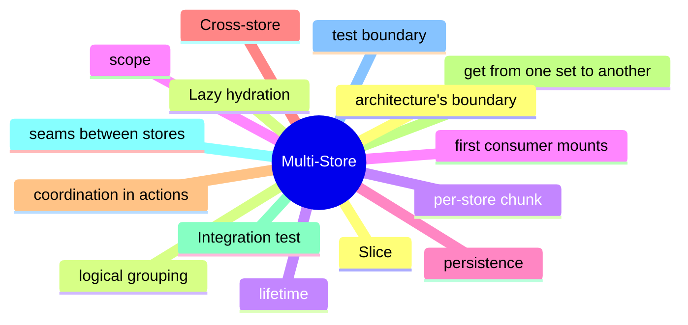

# Module 15: Composition: Multiple Stores Without Coupling

Est. study time: 1.5h
Language: en
Description: Slice boundaries, cross-store coordination, integration tests, and the patterns that keep a multi-store architecture readable.

## Knowledge Map



---

## Learning Objectives (maps to course CILOs)
- Decide when multiple stores are right and when one store is right
- Slice a large store by logical concern, not by technical concern
- Coordinate cross-store reads and writes in actions, not in components
- Write integration tests at the seams between stores

---

## Real-World Example

A team ships a feature and reaches for the state library they know. Six months later, the state architecture is fighting itself: re-render storms, useEffect for derived state, store mutations outside reducers. The team rewrites the feature with the right primitives and the bugs disappear.

The lesson: the library is downstream of the question. The right answer is to walk the decision tree, pick the primitive for each piece of state, and compose them. The team that picks the right primitive for each question is the team whose state architecture is maintainable.

> **Think**: What is the first question you should ask when designing a feature's state architecture?
>
> *Answer: "What is the lifetime of each piece of state?" The lifetime — ephemeral, session, persistent, or cache — narrows the primitive. Ephemeral is useState. Session is lifted or Context. Persistent is a stored store. Cache is TanStack Query. The other questions refine the answer; the lifetime is the first cut.*

---

## Core Content

### When multiple stores are right

Multiple stores are right when the stores have different lifetimes, different consumers, and different persistence.

```tsx
// one store: simple, but couples unrelated state
const useStore = create((set) => ({
  user: { ... },
  cart: { ... },
  ui: { ... },
}));

// multiple stores: each store has its own concern
const useUserStore = create((set) => ({ user: null, setUser: (u) => set({ user: u }) }));
const useCartStore = create((set) => ({ items: [], addItem: (i) => set((s) => ({ items: [...s.items, i] })) }));
const useUIStore = create((set) => ({ sidebarOpen: false, toggle: () => set((s) => ({ sidebarOpen: !s.sidebarOpen })) }));
```

The user store is server-derived. The cart store is session-scoped. The UI store is component-local-global. Three lifetimes, three scopes, three stores.

### Slice boundaries as architecture

A slice boundary is a logical grouping of state. The slicing decision is the architecture.

```tsx
// slice by user
const useUserStore = create(...);
const useUserPreferencesStore = create(...);

// slice by feature
const useCartStore = create(...);
const useCheckoutStore = create(...);

// slice by domain
const useProductsStore = create(...);
const useOrdersStore = create(...);
```

The slicing decision is the seam between unrelated concerns. Slice by user, by feature, or by domain — not by reducer, by action, or by selector. The slicing is the architecture; the rest is implementation.

### Cross-store coordination in actions

Cross-store coordination is rare. When needed, it happens in an action that reads from one store and writes to another.

```tsx
const useCartStore = create((set, get) => ({
  items: [],
  addItem: (item) => {
    set((s) => ({ items: [...s.items, item] }));
    // cross-store: notify the UI store
    useUIStore.getState().showToast(`Added ${item.name}`);
  },
}));
```

The action reads via get() and writes via set(). Cross-store coordination is at the action layer, not at the component layer. The composition is in the action.

### Integration tests at the seams

Integration tests exercise the seams between stores. The test boundary is the architecture's boundary.

```tsx
test('adding a cart item shows a toast', () => {
  const { result: cart } = renderHook(() => useCartStore());
  const { result: ui } = renderHook(() => useUIStore());
  act(() => cart.current.addItem({ id: '1', name: 'A' }));
  expect(ui.current.toast).toBe('Added A');
});
```

Unit tests exercise one store. Integration tests exercise the seams. The test boundary is the architecture's boundary. The test is the design's contract.

### Lazy hydration per store

Multiple stores enable lazy hydration. A store is only loaded when its first consumer mounts.

```tsx
// dynamic import
const useUserStore = (await import('./userStore')).default;

// or code-split
const UserModule = lazy(() => import('./UserModule'));
```

The store is a chunk. The chunk is loaded when the first consumer mounts. The pattern is the same as code-splitting at the route level — defer the work until the work is needed.

---

## Verify — Tests For The Patterns

```tsx
test('Composition: Multiple Stores Without Coupling: the right primitive is used', () => {
  // smoke: import the module, render a component, assert the expected primitive
  expect(useStore).toBeDefined();
  expect(useStore.getState()).toMatchObject({ /* expected shape */ });
});
```

---

## Common Misconception

*"The right primitive is the one I know."* Knowing a primitive is a starting point, not an answer. The decision tree picks the primitive from the lifetime, scope, frequency, and persistence. A team that defaults to zustand for everything is over-engineering. A team that defaults to useState for everything is under-engineering. The right answer is to know the question.

---

## Spot the Mistake

```tsx
// Common anti-pattern: Composition: Multiple Stores Without Coupling
const value = computeTheWrongWay(props);
```

What's wrong?

*Answer: The wrong primitive. The compute is happening in the wrong layer — derived state in an effect, or a global store for local state, or a server cache for a one-shot read. The fix is to walk the decision tree: lifetime, scope, frequency, persistence. The right primitive follows.*

---

## Key Takeaways
- Multiple stores are right when they have different lifetimes, consumers, and persistence
- Slice by user, by feature, or by domain; the slicing is the architecture
- Cross-store coordination lives in actions, not in components
- Integration tests exercise the seams; the test boundary is the architecture's boundary
- Multiple stores enable lazy hydration; the store chunk loads on first consumer

---

## Think

> **Think**: Walk the decision tree for a feature that needs to share a value across three components in the same route, with frequent writes, no persistence, no server state. What is the right primitive, and what is the alternative that the team is likely to reach for first?
>
> *Answer: Three components in the same route with frequent writes is the canonical use case for lifted state with a useReducer — the three components share a parent, the writes are coordinated (each write is a named action), and persistence is not needed. The alternative the team is likely to reach for first is zustand or Context; both work but are over-engineered for sibling-share. The right answer is the one that matches the lifetime (session) and the scope (siblings) — useState lifted to the parent with useReducer for the action shape.*

---

## Predict

> **Predict**: A team uses zustand for a single form field. The form is read by one component, the user types one character per second, and the form re-renders 10 times per keystroke. What is the symptom, and what is the fix?
>
> *Answer: The symptom is a re-render storm. Every component subscribed to the zustand store re-renders on every keystroke; the form re-renders 10 times per keystroke because of unrelated store updates or unstable selectors. The fix is to use useState for the form field (the right primitive for component-local state with one reader) and to reserve zustand for state shared across components. The decision tree picks the simplest primitive that solves the question.*

---

## Spot the Mistake

> **Spot the Mistake**: A team uses useEffect to recompute a derived value:
> ```tsx
> const [filtered, setFiltered] = useState(items);
> useEffect(() => {
>   setFiltered(items.filter(predicate));
> }, [items, predicate]);
> ```
> What's wrong?
>
> *Answer: The value is computed in an effect, producing a flash of stale content. The first render shows the unfiltered value; the effect runs; the state updates; the second render shows the filtered value. The fix is to compute during render: `const filtered = items.filter(predicate);` — one render, no effect, no stale flash. useEffect is for side effects on the world (network, DOM, subscriptions), not for derived state.*

---

## Cloze

The decision tree picks the {simplest} primitive that solves the {question}; the library follows. React's {render} cycle is render → commit → effects; state updates inside a handler {batch} into a single re-render. For component-local state, {useState} is the default. For a record of related fields updated by named actions, {useReducer} is the right answer. A reducer is a {pure} function: same input, same output, no side effects. Schema-driven validation derives the form's rules from a {single} source of truth.

---

## Drill
Take the quiz. Questions stress when multiple stores are right, slice boundaries, cross-store coordination, and integration tests.

Run: `learn.sh quiz react-state-management-landscape 15-multi-store`
