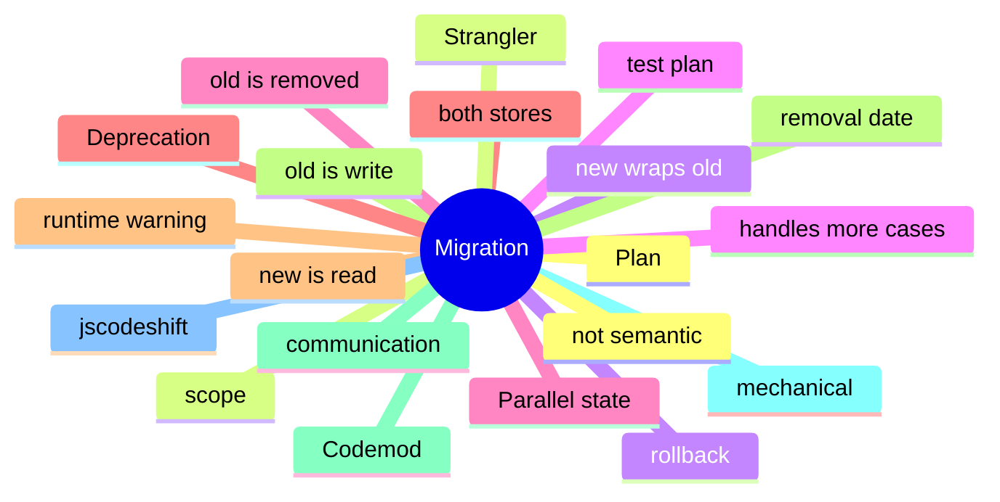

# Module 16: Migration Paths: From One Store to Another

Est. study time: 1.5h
Language: en
Description: Codemods, parallel-state migrations, the strangler pattern, deprecation flags, and the rollback plan.

## Knowledge Map



---

## Learning Objectives (maps to course CILOs)
- Plan a migration with a scope, a rollback, and a test plan before changing any code
- Apply the parallel-state pattern: both stores exist, the new one is the read source
- Use a codemod for mechanical changes; humans make the semantic decisions
- Communicate deprecations with runtime warnings and a removal date

---

## Real-World Example

A team ships a feature and reaches for the state library they know. Six months later, the state architecture is fighting itself: re-render storms, useEffect for derived state, store mutations outside reducers. The team rewrites the feature with the right primitives and the bugs disappear.

The lesson: the library is downstream of the question. The right answer is to walk the decision tree, pick the primitive for each piece of state, and compose them. The team that picks the right primitive for each question is the team whose state architecture is maintainable.

> **Think**: What is the first question you should ask when designing a feature's state architecture?
>
> *Answer: "What is the lifetime of each piece of state?" The lifetime — ephemeral, session, persistent, or cache — narrows the primitive. Ephemeral is useState. Session is lifted or Context. Persistent is a stored store. Cache is TanStack Query. The other questions refine the answer; the lifetime is the first cut.*

---

## Core Content

### A migration is a project, not a refactor

A migration has a start, an end, and a rollback. A refactor is an ongoing change. The two are different.

```md
## Migration: Context to Zustand

### Scope
- All `useContext(...)` calls in `apps/portal/src/**`.
- The `ThemeContext` and `LocaleContext` consumers.

### Rollback
- Revert the PR; both stores exist until the migration is verified.

### Test plan
- Unit tests pass.
- Integration tests for theme and locale switching.
- E2E smoke for the portal.
- Production traffic canary: 1% for 24 hours, then 100%.
```

The migration plan is the deliverable. The code is the execution.

### Parallel state: the bridge between old and new

Parallel state runs both stores simultaneously. The new store is the read source; the old store is the write sink until the migration is complete.

```tsx
// during migration
const useTheme = () => {
  const newTheme = useNewThemeStore((s) => s.theme);  // read source
  const oldTheme = useContext(OldThemeContext);       // write sink
  return { theme: newTheme, setTheme: oldTheme.setTheme };
};
```

The new store is the source of truth for reads. The old store is updated for compatibility. Once the migration is verified, the old store is removed. The pattern is the same as a database migration.

### Codemods for mechanical changes

A codemod automates the mechanical changes. It does not handle semantic changes.

```js
// jscodeshift codemod
module.exports = function(fileInfo, api) {
  const j = api.jscodeshift;
  return j(fileInfo.source)
    .find(j.CallExpression, { callee: { name: 'useContext' } })
    .replaceWith(/* ... */)
    .toSource();
};
```

A codemod can rename a hook call or change the import. It cannot decide that a Context value should be a zustand atom — the semantic decision is human. The codemod is the mechanical step; the human review is the semantic step.

### The strangler pattern

The strangler pattern wraps the old code with the new code. The new code handles more cases until the old code is removed.

```tsx
function ThemeProvider({ children }) {
  // new: zustand store
  const zustandTheme = useNewThemeStore((s) => s.theme);
  // old: Context for backward compat
  const oldTheme = useContext(OldThemeContext);
  return (
    <OldThemeContext.Provider value={zustandTheme ?? oldTheme}>
      {children}
    </OldThemeContext.Provider>
  );
}
```

The new code handles more cases. The old code is removed once the consumers have migrated. The pattern is from microservices: the new service handles more traffic until the old service is removed.

### Deprecation flags and removal dates

Deprecation flags mark code that is scheduled for removal. The flag is a runtime warning that the consumer sees.

```ts
export const useOldStore = () => {
  if (process.env.NODE_ENV === 'development') {
    console.warn('useOldStore is deprecated; migrate to useNewStore by Q2 2025');
  }
  return useContext(OldStoreContext);
};
```

The flag stays in until the consumer is verified to have migrated. The removal date is communicated in the warning and in the changelog. The pattern is the same as API deprecation in any library.

---

## Verify — Tests For The Patterns

```tsx
test('Migration Paths: From One Store to Another: the right primitive is used', () => {
  // smoke: import the module, render a component, assert the expected primitive
  expect(useStore).toBeDefined();
  expect(useStore.getState()).toMatchObject({ /* expected shape */ });
});
```

---

## Common Misconception

*"The right primitive is the one I know."* Knowing a primitive is a starting point, not an answer. The decision tree picks the primitive from the lifetime, scope, frequency, and persistence. A team that defaults to zustand for everything is over-engineering. A team that defaults to useState for everything is under-engineering. The right answer is to know the question.

---

## Spot the Mistake

```tsx
// Common anti-pattern: Migration Paths: From One Store to Another
const value = computeTheWrongWay(props);
```

What's wrong?

*Answer: The wrong primitive. The compute is happening in the wrong layer — derived state in an effect, or a global store for local state, or a server cache for a one-shot read. The fix is to walk the decision tree: lifetime, scope, frequency, persistence. The right primitive follows.*

---

## Key Takeaways
- A migration has a scope, a rollback, and a test plan
- Parallel state: both stores exist, the new one is the read source
- Codemods automate mechanical changes; humans make the semantic decisions
- The strangler pattern wraps the old code with the new code
- Deprecation flags and removal dates communicate the migration plan

---

## Think

> **Think**: Walk the decision tree for a feature that needs to share a value across three components in the same route, with frequent writes, no persistence, no server state. What is the right primitive, and what is the alternative that the team is likely to reach for first?
>
> *Answer: Three components in the same route with frequent writes is the canonical use case for lifted state with a useReducer — the three components share a parent, the writes are coordinated (each write is a named action), and persistence is not needed. The alternative the team is likely to reach for first is zustand or Context; both work but are over-engineered for sibling-share. The right answer is the one that matches the lifetime (session) and the scope (siblings) — useState lifted to the parent with useReducer for the action shape.*

---

## Predict

> **Predict**: A team uses zustand for a single form field. The form is read by one component, the user types one character per second, and the form re-renders 10 times per keystroke. What is the symptom, and what is the fix?
>
> *Answer: The symptom is a re-render storm. Every component subscribed to the zustand store re-renders on every keystroke; the form re-renders 10 times per keystroke because of unrelated store updates or unstable selectors. The fix is to use useState for the form field (the right primitive for component-local state with one reader) and to reserve zustand for state shared across components. The decision tree picks the simplest primitive that solves the question.*

---

## Spot the Mistake

> **Spot the Mistake**: A team uses useEffect to recompute a derived value:
> ```tsx
> const [filtered, setFiltered] = useState(items);
> useEffect(() => {
>   setFiltered(items.filter(predicate));
> }, [items, predicate]);
> ```
> What's wrong?
>
> *Answer: The value is computed in an effect, producing a flash of stale content. The first render shows the unfiltered value; the effect runs; the state updates; the second render shows the filtered value. The fix is to compute during render: `const filtered = items.filter(predicate);` — one render, no effect, no stale flash. useEffect is for side effects on the world (network, DOM, subscriptions), not for derived state.*

---

## Cloze

The decision tree picks the {simplest} primitive that solves the {question}; the library follows. React's {render} cycle is render → commit → effects; state updates inside a handler {batch} into a single re-render. For component-local state, {useState} is the default. For a record of related fields updated by named actions, {useReducer} is the right answer. A reducer is a {pure} function: same input, same output, no side effects. Schema-driven validation derives the form's rules from a {single} source of truth.

---

## Drill
Take the quiz. Questions stress migration planning, parallel state, codemods, the strangler pattern, and deprecation.

Run: `learn.sh quiz react-state-management-landscape 16-migration`
