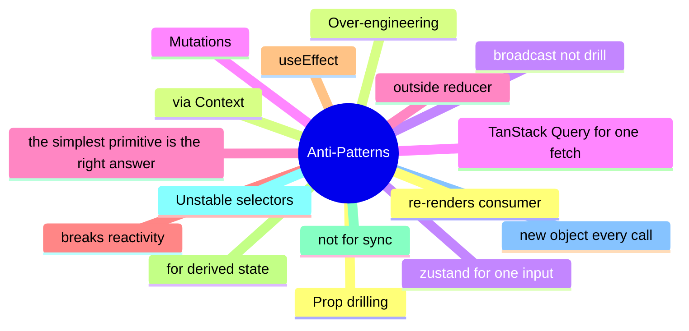

# Module 17: Anti-Patterns: What Not to Do

Est. study time: 1.5h
Language: en
Description: Prop drilling via Context, store mutations outside reducers, useEffect for derived state, unstable selectors, and the over-engineering default.

## Knowledge Map



---

## Learning Objectives (maps to course CILOs)
- Recognize prop drilling via Context as an anti-pattern
- Identify store mutations outside reducers as breaking the reactivity contract
- Spot useEffect for derived state and replace with computation in render
- Avoid over-engineering by walking the decision tree first

---

## Real-World Example

A team ships a feature and reaches for the state library they know. Six months later, the state architecture is fighting itself: re-render storms, useEffect for derived state, store mutations outside reducers. The team rewrites the feature with the right primitives and the bugs disappear.

The lesson: the library is downstream of the question. The right answer is to walk the decision tree, pick the primitive for each piece of state, and compose them. The team that picks the right primitive for each question is the team whose state architecture is maintainable.

> **Think**: What is the first question you should ask when designing a feature's state architecture?
>
> *Answer: "What is the lifetime of each piece of state?" The lifetime — ephemeral, session, persistent, or cache — narrows the primitive. Ephemeral is useState. Session is lifted or Context. Persistent is a stored store. Cache is TanStack Query. The other questions refine the answer; the lifetime is the first cut.*

---

## Core Content

### Prop drilling via Context

Prop drilling via Context is an anti-pattern. Context is a broadcast, not a drill.

```tsx
// anti-pattern: pass every prop through Context
const AppContext = createContext({ user, theme, locale, sidebarOpen, ... });

// right: explicit props OR external store
function Child({ user, onLogout }) {  // explicit
  return <div>{user.name} <button onClick={onLogout}>Logout</button></div>;
}
```

Context is for cross-cutting values (theme, locale, session). For high-frequency or large-subtree values, an external store with selectors is the right answer. The fix is either explicit props (when the chain is short) or an external store (when the chain is long or the value is shared).

### Mutating a store outside a reducer

Mutating a store outside a reducer is an anti-pattern. The reactivity contract is broken.

```tsx
// anti-pattern: direct mutation
useStore.setState({ count: useStore.getState().count + 1 });

// right: action
useStore.setState((s) => ({ count: s.count + 1 }));

// or even better: the store defines the action
const useStore = create((set) => ({
  count: 0,
  increment: () => set((s) => ({ count: s.count + 1 })),
}));
```

Direct mutation produces an inconsistent state — the change is invisible to subscribers, the time-travel debugger shows the wrong history, and the devtools log skips the action. The fix is to dispatch an action (or to use the store's own action).

### useEffect for derived state

useEffect for derived state is an anti-pattern. The value is computed during render, not in an effect.

```tsx
// anti-pattern: useState + useEffect
const [filtered, setFiltered] = useState(items);
useEffect(() => setFiltered(items.filter(predicate)), [items, predicate]);

// right: compute in render
const filtered = items.filter(predicate);
```

The anti-pattern produces a flash of stale content: the render happens with the old value, the effect runs, the state updates, the render happens again. The right pattern is one render with the correct value.

The principle: if the value can be computed from props or state, compute it. useState is for values with an independent lifetime; useMemo is for expensive computations. Both compute during render.

### Unstable selectors

An unstable selector is an anti-pattern. The selector returns a new object every call and the consumer re-renders.

```tsx
// anti-pattern: new object every call
const userInfo = useStore((s) => ({ name: s.name, email: s.email }));

// right: return primitives or memoized object
const name = useStore((s) => s.name);
const user = useStore((s) => s.user);  // stable if s.user is the same reference
```

The fix is to use the store's shallow compare, to memoize the selector, or to return primitives. An unstable selector is a re-render trigger; the consumer re-renders on every store change.

### Over-engineering: the default state

Over-engineering is the default state of state management. The right answer is the simplest primitive that solves the question.

```tsx
// anti-pattern: zustand for a form field
const useFieldStore = create((set) => ({ email: '', setEmail: (v) => set({ email: v }) }));

// right: useState
const [email, setEmail] = useState('');
```

Most state anti-patterns are over-engineering. The fix is to walk the decision tree. The question picks the primitive. The simplest primitive is the right answer. Reach for the library when the question demands it, not before.

---

## Verify — Tests For The Patterns

```tsx
test('Anti-Patterns: What Not to Do: the right primitive is used', () => {
  // smoke: import the module, render a component, assert the expected primitive
  expect(useStore).toBeDefined();
  expect(useStore.getState()).toMatchObject({ /* expected shape */ });
});
```

---

## Common Misconception

*"The right primitive is the one I know."* Knowing a primitive is a starting point, not an answer. The decision tree picks the primitive from the lifetime, scope, frequency, and persistence. A team that defaults to zustand for everything is over-engineering. A team that defaults to useState for everything is under-engineering. The right answer is to know the question.

---

## Spot the Mistake

```tsx
// Common anti-pattern: Anti-Patterns: What Not to Do
const value = computeTheWrongWay(props);
```

What's wrong?

*Answer: The wrong primitive. The compute is happening in the wrong layer — derived state in an effect, or a global store for local state, or a server cache for a one-shot read. The fix is to walk the decision tree: lifetime, scope, frequency, persistence. The right primitive follows.*

---

## Key Takeaways
- Prop drilling via Context is a broadcast misuse; the fix is explicit props or an external store
- Mutating a store outside a reducer breaks reactivity; use actions
- useEffect for derived state produces a flash of stale content; compute in render
- Unstable selectors re-render every consumer; return primitives or memoize
- Over-engineering is the default; the decision tree picks the simplest primitive

---

## Think

> **Think**: Walk the decision tree for a feature that needs to share a value across three components in the same route, with frequent writes, no persistence, no server state. What is the right primitive, and what is the alternative that the team is likely to reach for first?
>
> *Answer: Three components in the same route with frequent writes is the canonical use case for lifted state with a useReducer — the three components share a parent, the writes are coordinated (each write is a named action), and persistence is not needed. The alternative the team is likely to reach for first is zustand or Context; both work but are over-engineered for sibling-share. The right answer is the one that matches the lifetime (session) and the scope (siblings) — useState lifted to the parent with useReducer for the action shape.*

---

## Predict

> **Predict**: A team uses zustand for a single form field. The form is read by one component, the user types one character per second, and the form re-renders 10 times per keystroke. What is the symptom, and what is the fix?
>
> *Answer: The symptom is a re-render storm. Every component subscribed to the zustand store re-renders on every keystroke; the form re-renders 10 times per keystroke because of unrelated store updates or unstable selectors. The fix is to use useState for the form field (the right primitive for component-local state with one reader) and to reserve zustand for state shared across components. The decision tree picks the simplest primitive that solves the question.*

---

## Spot the Mistake

> **Spot the Mistake**: A team uses useEffect to recompute a derived value:
> ```tsx
> const [filtered, setFiltered] = useState(items);
> useEffect(() => {
>   setFiltered(items.filter(predicate));
> }, [items, predicate]);
> ```
> What's wrong?
>
> *Answer: The value is computed in an effect, producing a flash of stale content. The first render shows the unfiltered value; the effect runs; the state updates; the second render shows the filtered value. The fix is to compute during render: `const filtered = items.filter(predicate);` — one render, no effect, no stale flash. useEffect is for side effects on the world (network, DOM, subscriptions), not for derived state.*

---

## Cloze

The decision tree picks the {simplest} primitive that solves the {question}; the library follows. React's {render} cycle is render → commit → effects; state updates inside a handler {batch} into a single re-render. For component-local state, {useState} is the default. For a record of related fields updated by named actions, {useReducer} is the right answer. A reducer is a {pure} function: same input, same output, no side effects. Schema-driven validation derives the form's rules from a {single} source of truth.

---

## Drill
Take the quiz. Questions stress the anti-patterns: prop drilling, store mutations, useEffect for derived state, unstable selectors, over-engineering.

Run: `learn.sh quiz react-state-management-landscape 17-anti-patterns`
