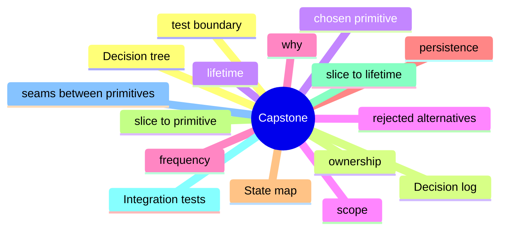

# Module 18: Capstone: Designing a New Feature's State Architecture

Est. study time: 1.5h
Language: en
Description: Putting it all together. Walking the decision tree, choosing the primitives, slicing the state, writing the integration tests, and documenting the decisions.

## Knowledge Map



---

## Learning Objectives (maps to course CILOs)
- Apply the decision tree to a new feature from scratch
- Map state slices to primitives from the lifetime, scope, frequency, and persistence
- Write the integration tests at the seams between primitives
- Document the decisions in a decision log with rejected alternatives

---

## Real-World Example

A team ships a feature and reaches for the state library they know. Six months later, the state architecture is fighting itself: re-render storms, useEffect for derived state, store mutations outside reducers. The team rewrites the feature with the right primitives and the bugs disappear.

The lesson: the library is downstream of the question. The right answer is to walk the decision tree, pick the primitive for each piece of state, and compose them. The team that picks the right primitive for each question is the team whose state architecture is maintainable.

> **Think**: What is the first question you should ask when designing a feature's state architecture?
>
> *Answer: "What is the lifetime of each piece of state?" The lifetime — ephemeral, session, persistent, or cache — narrows the primitive. Ephemeral is useState. Session is lifted or Context. Persistent is a stored store. Cache is TanStack Query. The other questions refine the answer; the lifetime is the first cut.*

---

## Core Content

### The feature: an applicant portal

The capstone feature: a university applicant portal with a form, a list, a detail page, and a notification badge.

State inventory:
- Form fields: name, email, program, cohort. Local to the form.
- Form draft: persisted across reload. Survives close.
- Applicant list: server state. Multiple readers across routes.
- Applicant detail: server state, fetched on route.
- Pagination: URL state. Shareable.
- Notification badge: server state, polled every 30s.
- Theme: low-frequency, app-wide. Context.
- Sidebar collapsed: low-frequency, app-wide. Context or zustand.

The decision tree picks the primitive for each piece. The composition is the architecture.

### The state map: slice to primitive

For each piece of state, the map is the design.

| State | Lifetime | Scope | Frequency | Persistence | Primitive |
|---|---|---|---|---|---|
| Form field | ephemeral | one component | rare | none | useState |
| Form draft | session | form | rare | localStorage | zustand persist |
| Applicant list | cache | app | rare | server | TanStack Query |
| Applicant detail | cache | route | rare | server | TanStack Query |
| Pagination | URL | route | rare | URL | useSearchParams |
| Notification badge | cache | app | every 30s | server | TanStack Query |
| Theme | session | app | rare | localStorage | Context + persist |
| Sidebar collapsed | session | app | rare | localStorage | Context + persist |

Eight pieces of state, six primitives. The map is the deliverable.

### The integration tests at the seams

Integration tests exercise the seams between primitives. The test boundary is the architecture's boundary.

```tsx
test('form draft survives reload', async () => {
  // zustand persist seam
  const { result } = renderHook(() => useFormDraftStore());
  act(() => result.current.setDraft({ name: 'A' }));
  // simulate reload
  const newStore = createFormDraftStore();
  expect(newStore.getState().draft).toEqual({ name: 'A' });
});

test('pagination is shareable', () => {
  // URL state seam
  render(<MemoryRouter initialEntries={['/applicants?page=2']}><List /></MemoryRouter>);
  expect(screen.getByText('Page 2')).toBeInTheDocument();
});
```

The tests are the contract. The architecture is the test boundary.

### The decision log

The decision log is the institutional memory. The team writes down the decisions and the alternatives that were rejected.

```md
# Decision Log: Applicant Portal State Architecture

## 2025-01-15: Notification badge polling cadence

**Decision**: Poll every 30 seconds.

**Alternatives**:
- SSE: rejected — connection cost not justified for low-frequency updates.
- WebSocket: rejected — bidirectional, more complex than needed.
- Manual refresh: rejected — user has to know to refresh.

**Why**: 30s staleness is acceptable for a notification badge. The polling cost is one request per active tab per 30s.
```

The log is the architecture's contract with future team members. The new team member reads the log and understands why the architecture is what it is.

### Refactoring as a migration

Refactoring the state architecture is a migration. The migration is reversible and has a rollback plan.

```md
## Migration: Context to zustand for theme

### Scope
- `useTheme()` consumer in 12 components.

### Rollback
- Revert the PR; the Context remains.

### Test plan
- Unit tests pass.
- Theme switcher smoke test.
- Production canary: 5% for 24 hours, then 100%.
```

The migration plan is the deliverable. The code is the execution. The pattern is the same as database migrations: write the plan, run it, never break the old shape.

---

## Verify — Tests For The Patterns

```tsx
test('Capstone: Designing a New Feature's State Architecture: the right primitive is used', () => {
  // smoke: import the module, render a component, assert the expected primitive
  expect(useStore).toBeDefined();
  expect(useStore.getState()).toMatchObject({ /* expected shape */ });
});
```

---

## Common Misconception

*"The right primitive is the one I know."* Knowing a primitive is a starting point, not an answer. The decision tree picks the primitive from the lifetime, scope, frequency, and persistence. A team that defaults to zustand for everything is over-engineering. A team that defaults to useState for everything is under-engineering. The right answer is to know the question.

---

## Spot the Mistake

```tsx
// Common anti-pattern: Capstone: Designing a New Feature's State Architecture
const value = computeTheWrongWay(props);
```

What's wrong?

*Answer: The wrong primitive. The compute is happening in the wrong layer — derived state in an effect, or a global store for local state, or a server cache for a one-shot read. The fix is to walk the decision tree: lifetime, scope, frequency, persistence. The right primitive follows.*

---

## Key Takeaways
- The decision tree picks the primitive for each piece of state
- The state map is the deliverable: slice to lifetime to primitive
- Integration tests exercise the seams; the test boundary is the architecture's boundary
- The decision log is the institutional memory; rejected alternatives are part of the story
- Refactoring the state architecture is a migration; the migration is reversible and has a rollback plan

---

## Think

> **Think**: Walk the decision tree for a feature that needs to share a value across three components in the same route, with frequent writes, no persistence, no server state. What is the right primitive, and what is the alternative that the team is likely to reach for first?
>
> *Answer: Three components in the same route with frequent writes is the canonical use case for lifted state with a useReducer — the three components share a parent, the writes are coordinated (each write is a named action), and persistence is not needed. The alternative the team is likely to reach for first is zustand or Context; both work but are over-engineered for sibling-share. The right answer is the one that matches the lifetime (session) and the scope (siblings) — useState lifted to the parent with useReducer for the action shape.*

---

## Predict

> **Predict**: A team uses zustand for a single form field. The form is read by one component, the user types one character per second, and the form re-renders 10 times per keystroke. What is the symptom, and what is the fix?
>
> *Answer: The symptom is a re-render storm. Every component subscribed to the zustand store re-renders on every keystroke; the form re-renders 10 times per keystroke because of unrelated store updates or unstable selectors. The fix is to use useState for the form field (the right primitive for component-local state with one reader) and to reserve zustand for state shared across components. The decision tree picks the simplest primitive that solves the question.*

---

## Spot the Mistake

> **Spot the Mistake**: A team uses useEffect to recompute a derived value:
> ```tsx
> const [filtered, setFiltered] = useState(items);
> useEffect(() => {
>   setFiltered(items.filter(predicate));
> }, [items, predicate]);
> ```
> What's wrong?
>
> *Answer: The value is computed in an effect, producing a flash of stale content. The first render shows the unfiltered value; the effect runs; the state updates; the second render shows the filtered value. The fix is to compute during render: `const filtered = items.filter(predicate);` — one render, no effect, no stale flash. useEffect is for side effects on the world (network, DOM, subscriptions), not for derived state.*

---

## Cloze

The decision tree picks the {simplest} primitive that solves the {question}; the library follows. React's {render} cycle is render → commit → effects; state updates inside a handler {batch} into a single re-render. For component-local state, {useState} is the default. For a record of related fields updated by named actions, {useReducer} is the right answer. A reducer is a {pure} function: same input, same output, no side effects. Schema-driven validation derives the form's rules from a {single} source of truth.

---

## Drill
Take the quiz. Questions stress the decision tree, the state map, integration tests, the decision log, and migrations.

Run: `learn.sh quiz react-state-management-landscape 18-capstone`
