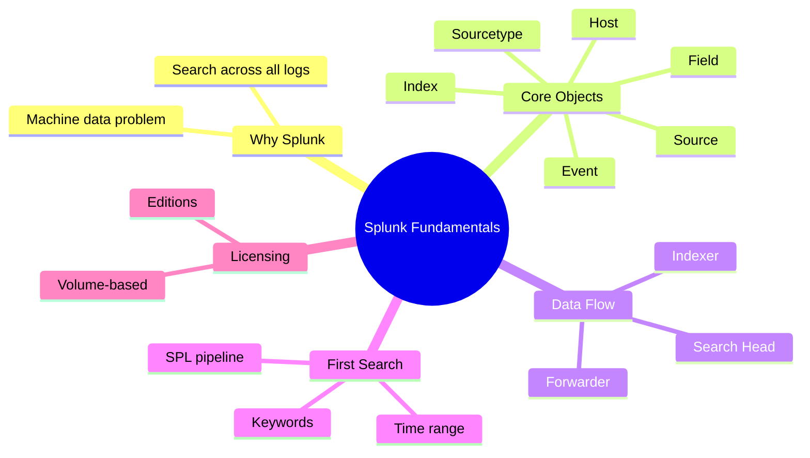
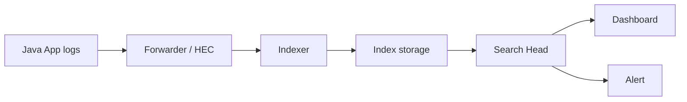
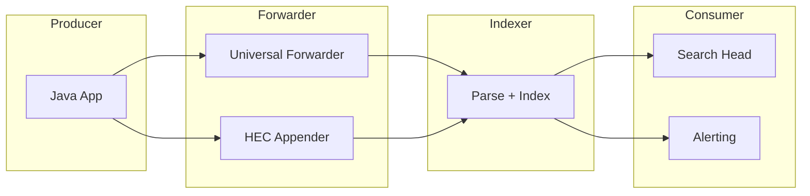

# Module 01: Splunk Fundamentals

Est. study time: 1.5h
Language: en
Description: What Splunk is, core objects, data flow, first SPL search, licensing.

## Knowledge Map



---

## Learning Objectives (maps to course CILOs)
- Explain what Splunk is and why teams use it for machine data — serves CILO #1
- Define the core objects: index, event, field, source, sourcetype, host — serves CILO #1
- Trace the data flow from application to searchable event — serves CILO #1, #2
- Run a first SPL search and interpret results — serves CILO #5

---

## Real-World Example

Your Spring Boot checkout service crashes at 3am. The JVM logged a huge stacktrace — but it's spread across ten files in five containers, timestamps in different formats, and grep found nothing because the error message is truncated across log lines. Your team spends 40 minutes rebuilding the scenario before anyone sees the root cause.

Splunk exists for exactly this. It ingests all machine data into one place, breaks it into searchable events, extracts fields, and lets you ask questions in seconds: "how many 500s in the last hour?", "which pod produced this traceId?", "what did the DB say 2 seconds before this NPE?"

> **Think**: Why did grep fail while Splunk would have succeeded?
>
> *Answer: grep reads files serially and needs the exact byte sequence on one line. Splunk ingests from all sources, splits events correctly (even multi-line stacktraces), indexes timestamps, and offers a query language that filters on fields and time rather than raw text. The stacktrace that "isn't grepable" becomes one searchable event.*

---

## Core Content

### What Is Splunk?

Splunk is a platform that ingests **machine data** — logs, metrics, events from apps, servers, networks — normalizes it into a common format, and makes it searchable in near real time.

Four things every Splunk deployment does:

1. **Ingest** — pull data in (forwarder, HTTP Event Collector, TCP/UDP, file monitoring)
2. **Index** — parse and store data as searchable events on disk
3. **Search** — query with SPL (Search Processing Language), visualize, alert
4. **Analyze** — dashboard, report, alert on patterns



> **Think**: What's the difference between a database and Splunk? Why not just use Postgres?
>
> *Answer: Splunk is a search platform designed for append-only, high-volume, semi-structured machine data. It trades strong relational guarantees for: ingest speed, flexible schema (fields discovered at search time, not enforced at write time), time-first queries, and a query language tuned for logs. Databases enforce a schema up front; Splunk lets you add fields without migrating anything.*

> **Cloze**: "Splunk stores machine data as searchable {events} inside {indexes}."
>
> *Answer: events, indexes*

### Core Objects: Index, Event, Field, Source, Sourcetype, Host

These six terms are the vocabulary of every Splunk search.

| Object | Definition | Java-world analogy |
|---|---|---|
| **Index** | Top-level storage container. Like a database table collection. Often one per app or data type | One index per microservice, e.g. `checkout`, `inventory` |
| **Event** | One unit of data, one search result row. A log line — or a whole multi-line stacktrace | One log statement (or one exception block) |
| **Field** | A key=value pair extracted from an event, searchable directly | A log field like `userId=12345` or MDC key |
| **Source** | The origin of data, e.g. a file path, container stdout, or HTTP source name | `/var/log/app.log` or `stdout` |
| **Sourcetype** | A named classification of the data format — tells Splunk how to parse it | `springboot_json`, `java_logback` |
| **Host** | The machine/container that produced the data | Pod name or hostname |

Every event automatically gets internal fields: `_time`, `_raw` (original text), `_index`, `_sourcetype`, `_source`, `_host`.

> **Cloze**: "The {_raw} field holds the original, unmodified event text, while {_time} holds the event's timestamp."
>
> *Answer: _raw, _time*

### Data Flow: Forwarder → Indexer → Search Head

Splunk's default pipeline splits work across three roles:



- **Forwarder** — lightweight agent (universal forwarder) or a library call (HEC appender) that sends data to indexers. No storage, no search.
- **Indexer** — parses (timestamp, line breaking, field extraction), stores to disk in buckets, serves search results. Scales horizontally.
- **Search Head** — the search/UI layer. Runs SPL, fans queries out to indexers (distributed search), aggregates results, powers dashboards and alerts.

Key rule: **indexers own the data, search heads own the queries.** This separation is why Splunk scales.

> **Predict**: If you send logs directly from your app to the search head, skipping the indexer, what breaks?
>
> *Answer: Almost everything. Search heads are not built to ingest and store data — there's no parsing/indexing pipeline on them, and queries against unindexed data won't return events. Data must land in an indexer's index to be searchable.*

### First Search in SPL

SPL = Search Processing Language. Commands pipe left to right with `|`. The first command is always `search`.

```spl
index=checkout sourcetype=springboot_json level=ERROR
| stats count by service, pod
| sort - count
```

Read it: "from index `checkout`, sourcetype `springboot_json`, where level is ERROR — count per service and pod, sort descending."

Rules you'll use every day:
- Implicit AND: `index=checkout level=ERROR` means both.
- `|` pipes events into the next command as a table (rows = events, columns = fields).
- Time range is the default first filter — every search is bounded by `earliest`/`latest`.
- Keywords search `_raw`; `field=value` searches extracted fields.

> **Cloze**: "In SPL, the {search} command is implicit as the first command of any pipeline."
>
> *Answer: search*

> **Spot the Mistake**: A teammate writes `index=checkout OR level=ERROR` hoping to get "events from checkout index OR any ERROR anywhere."
>
> What's wrong?
>
> *Answer: Implicit AND already joins `index=checkout` and `level=ERROR`. Adding OR changes the whole expression to `(index=checkout) OR (level=ERROR)` — which returns ALL ERROR events in every index. To OR within one field use parentheses around both sides: `index=checkout OR index=inventory`. Boolean precedence: AND binds tighter than OR; use parentheses to force grouping.*

### Licensing and Editions

Splunk is licensed by **indexed volume per day** (GB/day), measured on data ingested into indexes.

| Edition | Who | Notes |
|---|---|---|
| Splunk Enterprise | Self-hosted, full control | You chose this. Full conf access |
| Splunk Cloud | Managed SaaS | Limited conf access, UI-first |
| Splunk Observability Cloud | Metrics/traces/APM + logs | OTel-native |
| Splunk Free | Single user, 500MB/day | Non-production only |

Volume math matters for Java teams: **indexed volume = what you store**, which is why structured logging and field design (module 8) directly affect your license bill.

> **Predict**: Your team logs the full HTTP request body including payloads at INFO level, at 500 req/s. What happens to your license?
>
> *Answer: Indexed volume explodes. Every request body byte is stored (and licensed), and high-cardinality fields like full user-agent strings bloat the index and slow searches. This is the #1 license-cost driver for API teams — and a strong argument for careful level design and field trimming.*

---

### Why This Matters

Every other module builds on these fundamentals. Field mapping (module 8) is only meaningful once you know an index from an event. Alert tuning (module 14) is impossible without understanding sourcetype. For a developer debugging a production incident at 3am, the vocabulary — "which index, which sourcetype, which field" — is the difference between a 40-minute file hunt and a 30-second search.

---

## Key Takeaways
- Splunk ingests machine data, indexes it as events, and queries it with SPL
- Six core objects: index, event, field, source, sourcetype, host
- Pipeline: forwarder/HEC → indexer (parse+store) → search head (query)
- SPL is a left-to-right pipeline; `search` is implicit first command; AND implied
- Licensed by indexed GB/day — logging design affects cost
- Every event has internal fields: `_time`, `_raw`, `_index`, `_sourcetype`, `_source`, `_host`

---

## Common Misconception

**"A log file is the same as a Splunk event."** In Splunk, an event is whatever parsing decided it is. A Java stacktrace spanning 15 lines is often ONE event (multi-line breaking), while a single log line containing several key=value pairs can be split into multiple events or kept whole depending on line-breaking config. The file on disk is not the unit of search — the event is.

---

## Spot the Mistake

You see this search in a dashboard:
```spl
level=ERROR index=checkout
```
A teammate claims it's equivalent to:
```spl
index=checkout | search level=ERROR
```
What's wrong?

*Answer: Nothing functionally — they ARE equivalent. `| search ...` after another command is redundant but valid; the implicit search is simply the first command. The real trap is the reverse: writing `index=checkout | index=inventory` (two implicit searches with different indexes) which never works — the second `index=` is not a filter, it's a second implicit search command that Splunk won't accept the way you want. Use `index=checkout OR index=inventory` instead.*

---

## Feynman Explain
(Explain "what is an event, and why is a stacktrace one event" to a non-engineer. Use a letter-in-mail analogy: Splunk is a post office that sorts every envelope, even ones that arrive torn across multiple pages, and files each letter by its postmark. No jargon.)

---

## Reframe
(Pause. Judge: "Splunk is just grep with a web UI" — is that fair? Where does the analogy break? Think about multi-node search, time-bucketed storage, field extraction, alerting. Write your evaluation.)

---

## Drill
Take the quiz. MCQs test different angles — recall, application, scenario.

Run: `learn.sh quiz splunk-java-observability 01-splunk-fundamentals`
