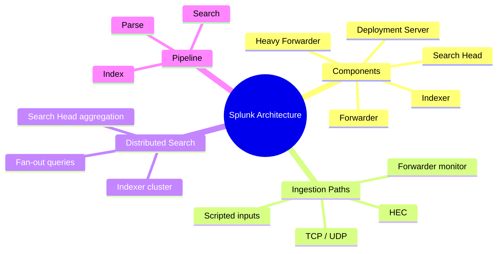
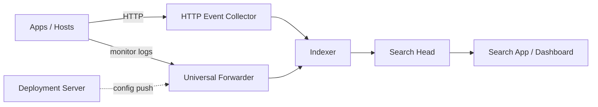
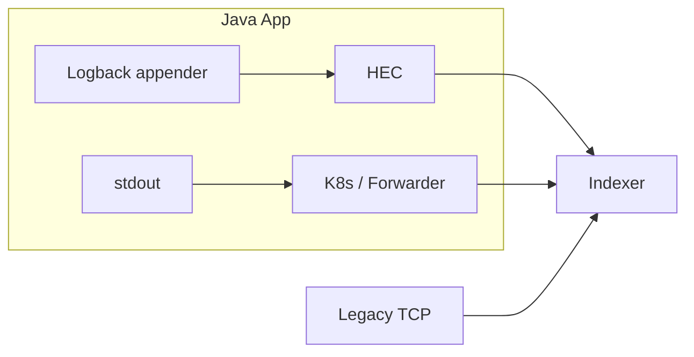
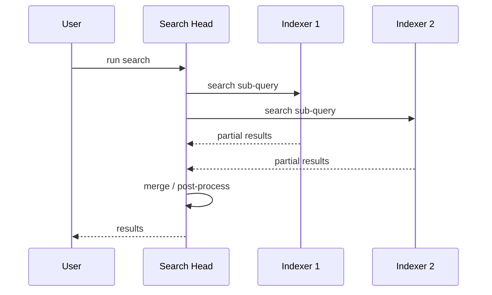

# Module 02: Splunk Architecture

Est. study time: 1.5h
Language: en
Description: Splunk Enterprise components, data ingestion paths, distributed search, HEC.

## Knowledge Map

---

## Learning Objectives (maps to course CILOs)
- Identify Splunk Enterprise components and their responsibilities — serves CILO #2
- Compare ingestion paths: HEC, TCP/UDP, forwarder monitoring — serves CILO #2
- Explain distributed search and indexer clustering — serves CILO #2
- Place a Java app's logging path in the architecture — serves CILO #2, #3

---

## Real-World Example

Your Spring Boot team on Kubernetes grows from 5 to 50 services. Logs are going to Splunk via an old shared TCP input, and searches get slower every week. One incident requires a "which pod logged this traceId" query that takes 4 minutes — too slow for incident response. The team realizes they never understood the components: they're overloading one indexer, mixing every service's logs into one sourcetype, and hitting the TCP input with no batching.

Understanding the architecture answers: which component should ingest my app's logs (HEC appender vs forwarder), how many indexers do we need, and why does the search head feel slow?

> **Think**: Why did a single shared TCP input become a bottleneck?
>
> *Answer: TCP inputs are fire-and-forget with no batching or acknowledgment. Under high log volume, connection churn and backpressure build up. The HEC appender with batching + retries is the standard for app-level logs. Also, with all services sharing one index/sourcetype, every search scans unrelated data.*

---

## Core Content

### The Four Roles

| Component | Job | Run where |
|---|---|---|
| **Universal Forwarder** | Lightweight agent; tails files, forwards to indexer. No storage, no search, no UI | Every host/pod |
| **Heavy Forwarder** | Forwarder with parsing + routing power (can run props/transforms, route by index) | Edge of infra |
| **Indexer** | Parses, timestamp-assigns, stores events in buckets; serves search to search heads | Dedicated servers |
| **Search Head** | Runs SPL, fans queries out to all indexers, merges results, hosts UI/dashboards/alerts | Dedicated or clustered |
| **Deployment Server** | Pushes configs (apps, inputs, props) to forwarders centrally | Central management |

Key mental model: **forwarders push, indexers store, search heads query.** A search head never holds data; an indexer never runs dashboards.

> **Cloze**: "The {universal forwarder} is a lightweight agent that tails log files and forwards them, while the {indexer} parses and stores them."
>
> *Answer: universal forwarder, indexer*

### Ingestion Paths for Java Apps

Your Spring Boot app has three realistic options to get logs into Splunk:

1. **HEC (HTTP Event Collector)** — app posts events over HTTPS to `/services/collector`. This is what `splunk-library-javalogging` uses. Batch-capable, acknowledged, secure. **Best default for app logs.**
2. **Forwarder monitoring** — app writes to stdout/file, a universal forwarder (or K8s agent) tails the file. Common on K8s: stdout → container logs → forwarder.
3. **TCP/UDP input** — raw socket. Simple but no ack, no batching, easy to lose events under load. Legacy.

> **Think**: On Kubernetes, is stdout + forwarder or HEC better?
>
> *Answer: Both work. Stdout + forwarder captures ALL pod output (even crash-loop shutdown logs before the app dies) and needs no app dependency. HEC gives batching, retries, and structured fields without extra infra. Many teams do both: stdout as the safety net, HEC for the canonical structured stream. Module 4 covers the HEC appender in detail.*

### Distributed Search

With more than one indexer, a search head must coordinate:

- Search head sends each indexer a **sub-search** scoped to its buckets, then **merges** results.
- Transforming commands (`stats`, `timechart`) are split: each indexer computes local aggregates, search head merges them. This is why `stats count by host` stays fast at scale.
- **Indexer cluster** (replication factor N) protects against indexer loss — data replicated across peers. Search heads query the cluster via the cluster master.

> **Predict**: You have 4 indexers. A search uses `| sort - count`. Where does sorting happen?
>
> *Answer: Per-indexer, each sorts its local partial results and sends the top N. The search head merges the sorted lists. Sending everything back unmerged would blow memory on the search head — Splunk handles this with bounded result sets per indexer.*

### Parsing vs Indexing: Where Fields Are Made

Inside the indexer, two distinct phases:

1. **Parsing** — assign timestamp (`_time`), break events (line breaking), extract default metadata (`source`, `sourcetype`, `host`). Configurable via `props.conf`.
2. **Indexing** — write the parsed event into index buckets; optionally create **indexed fields** from config.

Field extraction happens at **three** places in Splunk (this is the field-mapping crux for module 7):
- **Index time** — fields baked into the index (fast, storage-heavy, immutable)
- **Search time** — fields extracted per query via `props.conf` extractions or SPL commands (`rex`, `extract`, `spath`) — flexible, default
- **In the app** — your Java JSON log already carries fields; Splunk just reads them

> **Cloze**: "Timestamp assignment, line breaking, and default metadata extraction happen during {parsing}, which is configured in {props.conf}."
>
> *Answer: parsing, props.conf*

> **Spot the Mistake**: A teammate says "search-time field extraction is slow because Splunk re-reads raw data on every query."
>
> What's wrong?
>
> *Answer: Only partially true. Search-time extraction uses the already-indexed event data (from the inverted index and rawdata) — it does NOT re-ingest. The cost is CPU per extracted event on the search head/indexer. Index-time fields win when you need to filter on a rare value across huge data fast (TSIDX). For most fields, search-time is the right tradeoff: no storage cost, changeable anytime.*

---

### Why This Matters

Every later module assumes this map. The HEC appender (module 4) targets a specific component. The `props.conf` work in modules 6-7 edits the parser's behavior. Field mapping (module 8) decides where extraction happens. And "why is my search slow" (module 12) is usually an architecture answer: too many events scanned, no indexer headroom, or wrong field placement.

---

## Key Takeaways
- Forwarders push, indexers parse+store, search heads query — separation of concerns
- HEC is the standard ingestion path for app logs (batching, ack, TLS); TCP is legacy
- Distributed search: sub-search per indexer, merged on search head; stats split fine
- Parsing (timestamp/line-break/metadata) happens in the indexer, configured by props.conf
- Field extraction happens at index-time, search-time, or in the app itself

---

## Common Misconception

**"Adding more indexers always makes searches faster."** Volume, not indexer count, is usually the constraint. Search speed is dominated by how many events a search must scan (time range + filter tightness). A 4-indexer cluster scanning 3 days of all services will feel slow no matter how fast the hardware. Tight time ranges and good filters — not more indexers — are the real lever.

---

## Spot the Mistake

A diagram labels this data path: `Java App → Search Head → Indexer`.
What's wrong?

*Answer: Data never flows through a search head. The correct path is `Java App → HEC/Forwarder → Indexer → Search Head`. The search head is a consumer of indexed data, not a hop in the ingestion path.*

---

## Feynman Explain
(Explain to a non-engineer why a "search head" and "indexer" are separate machines. Analogy: a library where the shelvers (indexers) store every book with a proper card, and the librarians at the desk (search heads) take your question and coordinate with all shelvers. Why can't one person do both in a big library?)

---

## Reframe
(Pause. Judge: for a small team with 2 services, is the forwarder → indexer → search head split overkill? When does the complexity pay off? Write your evaluation.)

---

## Drill
Take the quiz. MCQs test different angles — recall, application, scenario.

Run: `learn.sh quiz splunk-java-observability 02-splunk-architecture`
