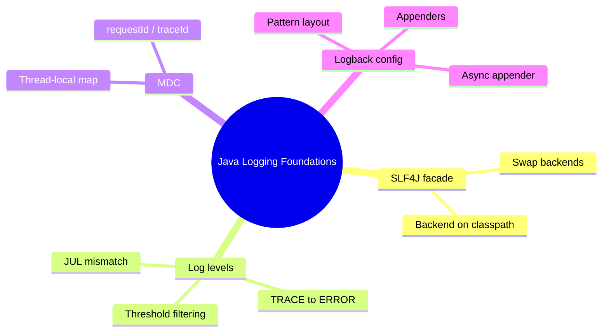
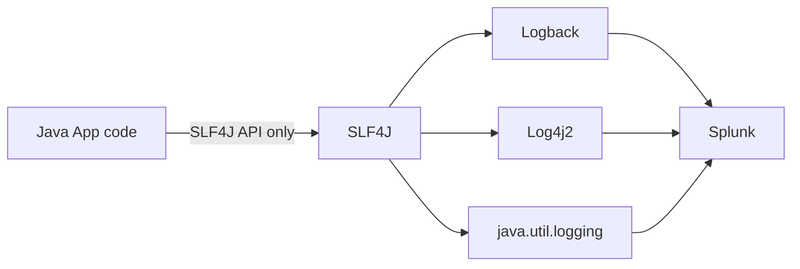
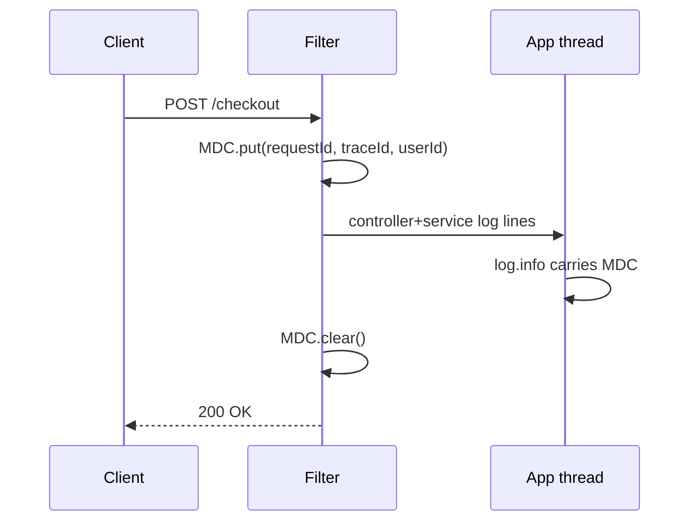
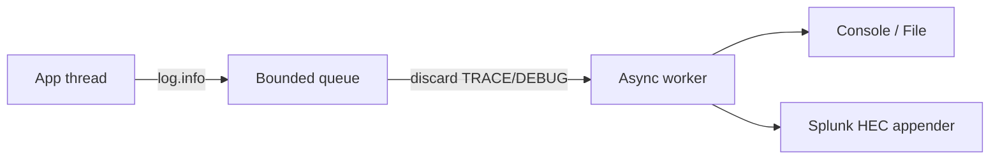

# Module 03: Java Logging Foundations

Est. study time: 1.5h
Language: en
Description: SLF4J, Logback, levels, MDC, pattern layouts — the stack that feeds Splunk.

## Knowledge Map



---

## Learning Objectives (maps to course CILOs)
- Explain SLF4J as a logging facade and why swapping backends never touches app code — serves CILO #3
- Map SLF4J log levels, threshold filtering, and the java.util.logging level trap — serves CILO #1, #9
- Use MDC to attach request context (requestId, traceId, userId) to every log on a thread — serves CILO #7
- Configure Logback in Spring Boot: pattern layouts, appenders, async, per-package tuning — serves CILO #3, #8

---

## Real-World Example

Your checkout service 500s at 3am. In Splunk you filter `level=ERROR` and get hundreds of hits across three services — but each error is an orphan: no request id on the line, so you can't tell which request or user it belongs to. The NPE is logged at INFO with no stacktrace, so the "why" is invisible.

> **Think**: Why can't you correlate these errors to a user or request? What one piece of context is missing?
>
> *Answer: No request context on the thread. Without an MDC key (requestId/traceId) set on request entry and carried by every log line, each ERROR floats alone; level discipline (NPE at INFO, no stacktrace) makes it worse. MDC + disciplined levels turn a 3am rebuild into a 30-second search.*

---

## Core Content

### SLF4J: The Facade Over Backends

SLF4J is an **abstraction**: app code logs through the SLF4J API only; a backend — Logback, Log4j2, or java.util.logging (JUL) — is picked at runtime from the **classpath**. Swap backend JARs, restart, done. App code never changes because it only ever saw `org.slf4j.Logger`.

Spring Boot's `spring-boot-starter-logging` brings **logback-classic** by default. Swap to `spring-boot-starter-log4j2` for Log4j2. Your `LoggerFactory.getLogger(...)` lines don't move.



> **Think**: Why does a facade earn its keep on a Splunk project?
>
> *Answer: Logging strategy changes constantly — file appender today, JSON encoder tomorrow, HEC appender next, then async. The facade makes it all config-level; `log.info(...)` calls stay identical and every backend uses one consistent API.*
>
> See the [SLF4J manual](https://www.slf4j.org/manual.html).

> **Cloze**: "SLF4J is a {facade} over logging backends; the active backend is selected at runtime from the {classpath}."
>
> *Answer: facade, classpath*

### Log Levels and Threshold Filtering

SLF4J levels, low to high: **TRACE, DEBUG, INFO, WARN, ERROR** (plus OFF). Every logger has an effective **threshold**; a message is emitted only if level >= threshold. `logging.level.com.myco=DEBUG` in `application.yml` sets that logger and its children to DEBUG.


Threshold INFO emits WARN and ERROR; TRACE/DEBUG are dropped — cheaply, with parameterized logging.

**The JUL trap:** java.util.logging orders levels differently — SEVERE > WARNING > INFO > FINE > FINEST. Names don't line up with SLF4J; the binding maps `SEVERE → ERROR`, `FINE → DEBUG`. Assuming one shared ladder silently changes filtering.

> **Think**: Root logger is INFO and you moved a "which DB replica" message to DEBUG to reduce noise. What happens to a TRACE-only HTTP body logger you relied on?
>
> *Answer: Both gone. Threshold filtering is downward-closed — raising root silences everything below it. Rescue: `logging.level.com.myco.debugger=TRACE` re-enables just that package at runtime, no redeploy.*

> **Predict**: You set `logging.level.root=WARN` and restart. What still reaches Splunk, and what do you lose?
>
> *Answer: WARN and ERROR survive; all INFO business events and DEBUG diagnostics vanish. Production monitoring feeds on INFO request lifecycle events — WARN root is an emergency lever, not daily practice.*

> **Cloze**: "A logger inherits its effective {level} from its parent logger unless it {overrides} it explicitly."
>
> *Answer: level, overrides*

### MDC: Request Context on the Thread

The **Mapped Diagnostic Context** is a thread-local key/value map. Set keys on request entry (Filter/interceptor); every log statement on that thread carries them until you clear them on the way out.



```java
String requestId = req.getHeader("X-Request-Id") != null
    ? req.getHeader("X-Request-Id") : UUID.randomUUID().toString();
MDC.put("requestId", requestId);
MDC.put("operation", req.getMethod() + " " + req.getRequestURI());
try {
    chain.doFilter(req, res);
} finally {
    MDC.clear();
}
```

MDC surfaces two ways: in patterns via `%X{requestId}`, and — with JSON logging (module 5) — as first-class **fields** (`requestId`, `traceId`, `userId`, `operation`). Those fields enable `| stats count by requestId` and cross-service correlation (module 11). See the [Logback MDC docs](https://logback.qos.ch/manual/mdc.html).

> **Think**: `@Async` method inside a request — why does MDC break, and the fix?
>
> *Answer: MDC is thread-local; the worker thread starts empty, so requestId vanishes from its logs. Fix: copy the MDC map into the task before submit, or configure the executor to inherit context.*

> **Cloze**: "MDC is a {thread-local} key/value map populated on request entry and {cleared} on request exit."
>
> *Answer: thread-local, cleared*

> **Predict**: You forget `MDC.clear()` and reuse a thread pool. What appears in Splunk next request?
>
> *Answer: Stale context. The pooled thread still holds the previous request's ids, so two users collapse into one requestId and correlation stats lie.*

### Pattern Layouts, Appenders, and Async in Spring Boot

Classic console pattern:

```text
%d{ISO8601} %-5level [%thread] %logger{36} - %msg%n
```

→ `2026-08-05T03:12:41+02:00 ERROR [http-nio-8080-exec-7] com.myco.PaymentService - payment declined`. `%d` timestamp, `%-5level` right-padded level, `%thread`, `%logger{36}` shortened class, `%msg`, `%n` newline; add `[%X{requestId}]` for MDC. Config lives in `logback-spring.xml` (Spring variant of `logback.xml`); see the [Logback configuration manual](https://logback.qos.ch/manual/configuration.html).

Appenders are the outputs. A production setup chains a console/file appender behind an **AsyncAppender**, decoupling app threads from I/O so a slow Splunk sink never blocks a request. Mandatory: a **bounded queue** plus a **discard policy** (drop TRACE/DEBUG when full). Unbounded queues stall the app or eat heap.



> **Predict**: You add AsyncAppender with an unbounded queue and no discard policy. Traffic spikes. What happens to the JVM?
>
> *Answer: The queue grows forever, heap fills, GC thrashes, then OutOfMemoryError — the thing meant to protect latency kills the app. Bounded queue + discard policy: lose cheap lines, never the request thread.*

> **Think**: Why does `log.info("user {} paid {}", userId, amount)` cost almost nothing when the level is disabled?
>
> *Answer: Parameterized logging defers string building — just a boolean level check. Concatenation builds the string unconditionally, at real cost under load that Splunk never sees.*

> **Spot the Mistake**: A teammate says "I set root logger to ERROR in production, so I never worry about volume or the Splunk license."
>
> What's wrong?
>
> *Answer: Two errors. First, ERROR-only root hides INFO request-lifecycle events — you go deaf. Second, it doesn't solve volume: a hot service still emits thousands of ERROR/sec, each with a big stacktrace. Correct framing: per-package thresholds + structured fields + async appender.*

---

### Why This Matters

Splunk only searches what your app emits. Every later module — structured JSON fields (5), HEC appender (4), traceId correlation (11), troubleshooting (12) — stands on these foundations. Wrong levels → noise; wrong MDC → orphan errors; wrong async → the app dies protecting its own logging. Good Splunk data starts at the source, here.

---

## Key Takeaways
- SLF4J is a facade; backend chosen on the classpath — app code never changes
- Levels low→high: TRACE, DEBUG, INFO, WARN, ERROR; only level >= threshold is emitted
- JUL orders levels differently (SEVERE>WARNING>INFO>FINE) — verify the mapping, don't assume
- MDC is thread-local request context; set on entry, clear in finally, expose via `%X{key}`
- AsyncAppender needs bounded queue + discard policy; parameterized `{}` logging defers formatting

---

## Common Misconception

**"Logging is just System.out with extra steps — anything I print ends up in Splunk the same way."** Wrong three ways. `System.out.println` bypasses the SLF4J pipeline: no level, no hierarchy, no MDC, no pattern, no async — straight to stdout. Levels decide *which* logs even exist for Splunk; MDC and structured fields turn raw text into searchable, correlatable fields. Correct framing: logging is a data pipeline, and the facade-to-appender chain is its plumbing.

---

## Spot the Mistake

This filter logs requestId — but Splunk shows blank requestId on ERROR events:

```java
MDC.put("requestId", req.getHeader("X-Request-Id"));
chain.doFilter(req, res);
```

What's wrong?

*Answer: Two bugs. The header is often absent, so requestId is null — and there is no clear() at all, so context leaks between pooled threads. Fix: default to a generated UUID when the header is missing, and wrap the chain call in try/finally with `MDC.clear()` in the finally block.*

---

## Feynman Explain
(Explain "logging is a pipe with filters" to a non-engineer. Water analogy: app = pipe, levels = sieve at top, MDC = label stamped on every drop, appenders = where drops land. Why stamp before entry and wash off after? No jargon.)

---

## Reframe
(Pause. Judge: "Setting the root level to ERROR is the smart way to control Splunk volume." Where does that reasoning break — what does it cost monitoring, incident response, and your license bill? Write your evaluation.)

---

## Drill
Take the quiz. MCQs test different angles — recall, application, scenario.

Run: `learn.sh quiz splunk-java-observability 03-java-logging-foundations`
