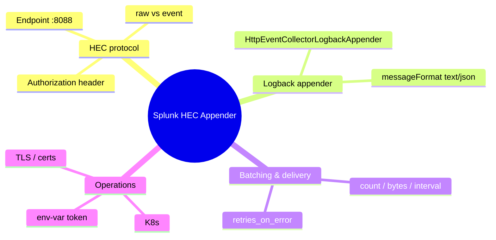
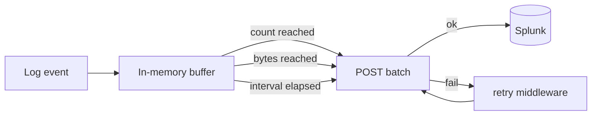

# Module 04: Getting Logs In: Splunk HEC Appender

Est. study time: 1.5h
Language: en

## Knowledge Map



---

## Learning Objectives (maps to course CILOs)
- Configure HEC server-side (enable input, create token, set default index/sourcetype) and wire the Logback appender in a Spring Boot service — serves CILO #2
- Explain the HEC wire protocol (endpoint, Authorization header, event vs raw) and why it keeps logs out of app servers — serves CILO #1
- Tune batching (count/bytes/interval) and retries for high-volume services; reason about throughput/latency trade-offs — serves CILO #3
- Secure the token (env vars, TLS, certificate validation) and choose `messageFormat: json` for field mapping — serves CILO #4

---

## Real-World Example

Checkout service on Spring Boot in K8s, spiking to thousands of req/sec during a sale. An exception repeats thousands of times. Team greps pod logs, finds nothing — grep crashes, lines interleave across replicas, error buried by scroll. Question: "can we get these logs into Splunk for real search?"

First answer: point a forwarder at stdout — but on-call dev needs structured fields (`orderId`, `total`, `errorClass`) and a per-service index.

> **Think**: Why did grepping pod logs fail, and what does the team lose by searching live logs instead of indexed ones?
>
> *Answer: Logs split across replicas and rotated; live-stdout grep is unstructured, unscalable, no history. Splunk indexes centrally, searchable with fields — search what happened, not what's scrolling.*

---

## Core Content

### Section 1: The HEC Protocol — What the Appender Talks To

HEC (HTTP Event Collector) is Splunk's HTTP ingest API. The appender from `com.splunk.logging:splunk-library-javalogging` is just an HTTP client POSTing events to it — no forwarder, no agent in the JVM.

Protocol is simple:
- Endpoint: `https://<splunk-host>:8088/services/collector`
- Auth: header `Authorization: Splunk <token>`
- Body: one JSON event per line, or batches in one POST
- `type=event` wraps each line in `{"event": {...}}`; `type=raw` sends bare text


**Server-side setup first.** In Splunk: Settings → Data Inputs → HTTP Event Collector → enable HEC → Add Token → set default index/sourcetype/source. Token defaults apply when appender omits them; appender overrides.

> **Cloze**: "Each POST to HEC must carry the secret in the {Authorization} header, formatted as `{Splunk} <token>`."
>
> *Answer: Authorization; Splunk*

> **Think**: Your appender config omits `<index>`. Will events land anywhere?
>
> *Answer: Yes — the default index on the token. No default and none sent → event dropped. Always set a default index on the token for safety.*

> **Predict**: You set `type=raw` on the appender. What happens to `batch_size_count`?
>
> *Answer: Raw forces count to 1 — one event per POST. Batch settings ignored; you lose batching throughput. Use raw only for simple text dumps.*

### Section 2: Wiring the Logback Appender

Add dependency (Maven):

```xml
<dependency>
  <groupId>com.splunk.logging</groupId>
  <artifactId>splunk-library-javalogging</artifactId>
  <version>1.11.0</version>
</dependency>
```

Requires SLF4J 1.7.36+ and Logback 1.2.13+. Appender class: `com.splunk.logging.HttpEventCollectorLogbackAppender`. Configure in `logback-spring.xml`:

```xml
<appender name="SPLUNK" class="com.splunk.logging.HttpEventCollectorLogbackAppender">
    <url>https://splunk.example.com:8088</url>
    <token>${SPLUNK_TOKEN}</token>
    <index>checkout</index>
    <sourcetype>springboot_json</sourcetype>
    <source>checkout-service</source>
    <messageFormat>json</messageFormat>
    <batch_size_count>100</batch_size_count>
    <batch_size_bytes>102400</batch_size_bytes>
    <batch_interval>500</batch_interval>
    <retries_on_error>3</retries_on_error>
    <connect_timeout>5000</connect_timeout>
</appender>

<root level="INFO">
    <appender-ref ref="SPLUNK"/>
</root>
```

Key attributes (shared server/client side): `url`, `token`, `channel`, `type` (raw|event), `source`, `sourcetype`, `messageFormat`, `host`, `index`, `batch_size_bytes`, `batch_size_count`, `batch_interval`, `retries_on_error`, `send_mode` (sequential|parallel), `middleware`, `disableCertificateValidation`, `eventBodySerializer`, `eventHeaderSerializer`, include flags (LoggerName/ThreadName/MDC/Exception/Marker, default true), connect/call/read/write/termination timeouts, `layout`, `filter`.

`messageFormat` decides your future. `text` (default) ships the rendered `%m` string — fine for humans, useless for field mapping. `json` sends structured JSON that pairs with a JSON encoder (module 5). Want `orderId: 482913` as a searchable field? Pick `json` now.

> **Think**: What happens to `includeMDC` when `messageFormat=json`?
>
> *Answer: MDC pairs attach to the payload as searchable fields — cheap way to carry request-id, tenant, user. This is how tracing data rides into Splunk.*

> **Cloze**: "For field mapping, set `messageFormat` to {json}; the plain {text} format only carries the rendered message."
>
> *Answer: json; text*

> **Spot the Mistake**: A dev writes `<url>http://splunk.example.com:8088</url>` over plain HTTP and sets `disableCertificateValidation=true` to "make it work".
>
> What's wrong?
>
> *Answer: Two errors. Port 8088 is HEC's HTTPS endpoint; plain HTTP leaks credentials and log content. `disableCertificateValidation=true` only helps self-signed TLS in dev — not a substitute for HTTPS. Fix: use https, keep cert validation (import CA into JVM truststore for self-signed); never ship `disableCertificateValidation=true` to prod.*

### Section 3: Batching, Retries, and the Delivery Pipeline

Each POST is an HTTP round trip. At thousands of logs/sec, per-event POSTs would melt the app thread and Splunk. The appender batches in memory, flushing on whichever fires first — `batch_size_count`, `batch_size_bytes`, `batch_interval` (ms).



A config of count=100 / bytes=102400 / interval=500 means flush at 100 events, or 100 KB, or every half-second — whichever comes first. Low traffic? Small `batch_interval` so events don't sit unflushed. High traffic? Raise count and bytes to cut HTTP calls dramatically.

Failures go through the middleware chain — `ResendMiddleware`, `ErrorMiddleware` — honoring `retries_on_error` and `send_mode` (sequential|parallel). At-least-once-ish; smooths hiccups, not exactly-once.

> **Predict**: You set `batch_size_count=1000` on a service that logs once per second. How long might an event wait in memory?
>
> *Answer: Up to `batch_interval`, because count never triggers. Set interval small (e.g. 1000 ms) so slow streams still flush — otherwise events buffer long and look lost mid-outage.*

> **Cloze**: "The flush fires on the first of three thresholds: {count}, {bytes}, or {interval}."
>
> *Answer: count; bytes; interval*

> **Think**: Retries are enabled and Splunk is down for two minutes. What risk does the buffer face, and what bounds it?
>
> *Answer: Events pile up in JVM memory; the retry loop keeps hammering. `retries_on_error` bounds retries per failed batch. Size retries so you don't queue an outage's worth of logs in heap.*

### Section 4: Running It in Production — TLS, K8s, Secrets

HEC over HTTPS is mandatory in prod. Self-signed certs (common in internal networks) break default TLS validation:
1. Dev only: `disableCertificateValidation=true` — never in prod.
2. Correct: import cert/CA into the JVM truststore (`keytool -importcert`).

On K8s the appender runs inside the pod — clean MDC-rich data, but nothing pre-crash or from other processes. The stdout-forwarder path (module 2) captures everything incl. JVM crash output. Complementary: run both; HEC `url` typically points at a Service or Ingress terminating TLS.

```ascii
app --HTTPS--> Service/Ingress --TLS--> Splunk HEC
```

The token is a credential — never hardcode it in `logback-spring.xml` and commit it. Inject via env var:

```xml
<token>${SPLUNK_TOKEN}</token>
```

Spring resolves `${SPLUNK_TOKEN}` from env/properties — never in git. Stricter setups: channel + ack for reliability (advanced).

> **Think**: Why is the stdout+forwarder path "more complete" than the HEC appender for capturing a crash?
>
> *Answer: A forwarder tails pod stdout continuously — catches JVM final stack traces, OOM dumps, anything not logged via SLF4J. The appender only ships what the app pushed before the JVM died.*

> **Cloze**: "When deploying on {Kubernetes}, the HEC appender captures only the app's own logs, so teams often pair it with a {stdout} forwarder."
>
> *Answer: Kubernetes; stdout*

### Why This Matters

This module is the on-ramp to everything after it. No reliable HEC pipeline → no search, no fields, no alerts. Token/TLS wrong → leaked secrets or silently dropped events. `messageFormat` wrong → modules 5–8 fight unstructured text.

---

## Key Takeaways
- HEC is plain HTTPS POSTs to `:8088/services/collector` with `Authorization: Splunk <token>` — no forwarder inside the JVM.
- `splunk-library-javalogging` provides `HttpEventCollectorLogbackAppender` (also Log4j2, JUL, SLF4J).
- Enable HEC + token server-side first; set a default index on the token so misconfigured appenders don't silently drop events.
- Batching (count/bytes/interval) makes high-volume shipping viable; `type=raw` forces count=1.
- Use `messageFormat: json` + JSON encoder for field mapping; token via env var, HTTPS, cert validation on.

---

## Common Misconception

"`messageFormat=json` alone makes my fields searchable." Wrong. JSON shapes how the event is sent — mapping still depends on the encoder (module 5), index/search-time extractions (modules 7–8), and how MDC/logger fields attach. Correct framing: JSON transport is a prerequisite, not the whole pipeline.

---

## Spot the Mistake

```text
<appender name="SPLUNK" class="com.splunk.logging.HttpEventCollectorLogbackAppender">
    <url>https://splunk.example.com:8088/services/collector</url>
    <token>${SPLUNK_TOKEN}</token>
    <type>raw</type>
    <batch_size_count>500</batch_size_count>
    <messageFormat>json</messageFormat>
</appender>
```

What's wrong?

*Answer: `type=raw` forces batch count to 1 and sends bare text — batch_size_count=500 ignored, and `messageFormat: json` is meaningless for raw. For structured JSON events: drop `type=raw` (default event type), keep batching, pair `messageFormat=json` with a JSON encoder (module 5).*

---

## Feynman Explain
(Teach batching to a child. Waiter, restaurant, orders on notes. Explain: why carry 100 notes in one trip instead of 100 trips, when you'd still walk to the kitchen with 3 notes, and what happens if the kitchen catches fire mid-run. Only that analogy — no "HTTP", "thread", "middleware".)

---

## Reframe
(Pause. Judge batching: does "flush on whichever fires first" always make sense? When would short `batch_interval` hurt — fresh alerts? Large `batch_size_count` backfire — latency/memory? Counterargument to fewer HTTP calls? Write your evaluation.)

---

## Drill
Take the quiz. MCQs test different angles — recall, application, scenario.

Run: `learn.sh quiz <subject> <module-id>`
