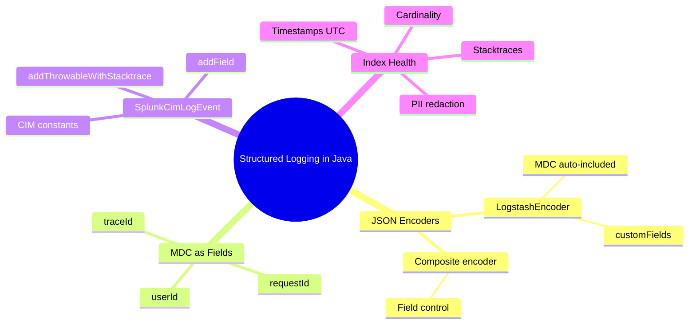
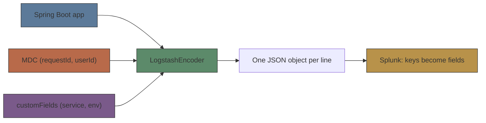
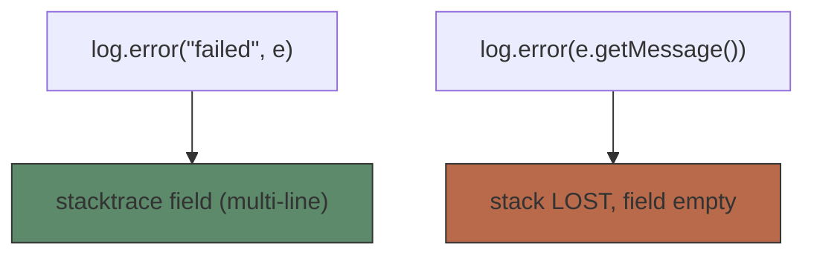

# Module 05: Structured Logging in Java

Est. study time: 1.5h
Language: en

## Knowledge Map



---

## Learning Objectives (maps to course CILOs)
- Configure a JSON logback encoder and custom static fields — serves CILO #1
- Propagate request-scoped context via MDC into Splunk fields — serves CILO #3
- Emit CIM-compliant events with SplunkCimLogEvent for ES/data models — serves CILO #2
- Judge log content for index health: stacktraces, cardinality, timestamps, sensitive data — serves CILO #4

---

## Real-World Example

Your Spring Boot checkout service logs 2,000 rows/minute to Splunk. PagerDuty fires at 3 a.m.: "500s spiking". Search `index=checkout level=ERROR` returns... multi-line soup. The message field holds `"Cannot process order 45: unexpected token"` — no stack, no `orderId` field, no correlation ID. Cannot filter by `orderId`, cannot tell which of 40 replicas logged it. Debugging takes 45 minutes.

Why? The app logs with `%d %level %logger %msg%n` patterns. Splunk indexes free-form text, not fields. Every `: 45` in a message is text — not a filterable `orderId=45`.

> **Think**: Why did the team struggle? What would you have done differently at the logging layer?
>
> *Answer: They logged human-readable strings instead of structured fields. One JSON event per line, with orderId/requestId as top-level fields, answers "where did order 45 fail" in one search.*

---

## Core Content

### Section 1: JSON Encoders — One Event, One JSON Object

The fix starts at the encoder. Replace the pattern layout with `LogstashEncoder` from `net.logstash.logback.encoder:logstash-logback-encoder` in `logback-spring.xml`:

```xml
<appender name="STDOUT" class="ch.qos.logback.core.ConsoleAppender">
    <encoder class="net.logstash.logback.encoder.LogstashEncoder">
        <customFields>{"service":"checkout","env":"prod"}</customFields>
    </encoder>
</appender>
```

Each log call now emits one JSON line with `@timestamp`, `@version`, `message`, `logger_name`, `thread_name`, `level`, `level_value`, plus MDC and custom fields. Splunk's JSON extraction (module 7) turns each key into a field.


Key design principle: **one event = one JSON object = one Splunk event**. Nested objects work but are harder to query — prefer flat keys. For full field control, use `LoggingEventCompositeJsonEncoder`.

> **Think**: Why does one JSON object per line matter for Splunk specifically?
>
> *Answer: Splunk's line-based parsing treats each line as one event; a compact JSON object maps 1:1 to clean fields. Multi-line stacktraces are the deliberate exception — one multi-line field per event.*

> **Cloze**: "The encoder class that emits JSON from Logback is {LogstashEncoder}, with static app fields injected via {customFields}."
>
> *Answer: LogstashEncoder / customFields*

> **Predict**: You add `<customFields>{"service":"checkout","env":"prod"}</customFields>` and deploy. What appears in Splunk without extra extraction config?
>
> *Answer: `service=checkout` and `env=prod` as fields on every event from this appender, alongside standard fields.*
### Section 2: MDC as Fields — Request Context That Follows the Log

MDC (Mapped Diagnostic Context) is thread-local key/value context Logback merges into every log line on that thread — LogstashEncoder emits it as JSON fields. Request-scoped IDs travel with every log call without threading them through method signatures.

```ascii
Filter: request arrives
   ├─ MDC.put("requestId", reqId)
   ├─ MDC.put("traceId", traceId)
   └─ chain.doFilter(...)      <- request logs get these fields
   finally:
      MDC.remove("requestId")  <- no leaks into pooled threads
```

Use a servlet filter: `MDC.put` at entry, `MDC.remove` in a `finally`. Without it, a reused Tomcat thread leaks the previous request's IDs into the next request's logs.

> **Think**: Why `MDC.remove` in a `finally` rather than trusting the request to end?
>
> *Answer: Thread pools reuse threads. If MDC is not cleared, request B inherits request A's requestId — corrupting trace correlation. finally guarantees cleanup on exceptions.*

> **Cloze**: "Keys put into the {MDC} appear automatically as JSON fields, but must be {removed} in a finally block to avoid cross-request leakage."
>
> *Answer: MDC / removed*

> **Spot the Mistake**: A teammate writes `MDC.put("requestId", reqId)` in a filter but never removes it, reasoning "Spring clears MDC between requests."
>
> What's wrong?
>
> *Answer: Spring does not clear MDC. With pooled servlet threads, the stale requestId silently attaches to unrelated requests. Clean up in a finally block.*

### Section 3: SplunkCimLogEvent — CIM-Compliant Events for ES

When events must feed Splunk Enterprise Security or data models, use `com.splunk.logging.SplunkCimLogEvent` — a programmatic key/value builder with CIM constants: `COMMON_NAME`, `COMMON_PRODUCT`, `COMMON_TRANSACTION_ID`, `COMMON_REASON`, `COMMON_RESULT`, `COMMON_SRC`, `COMMON_DEST`, and more. Add fields with `addField(key, value)`; attach a stack with `addThrowableWithStacktrace(throwable)`.

```java
SplunkCimLogEvent event = new SplunkCimLogEvent(SplunkCimLogEvent.COMMON_PRODUCT,
    "checkout-payment");
event.addField(SplunkCimLogEvent.COMMON_NAME, "payment_failed");
event.addField(SplunkCimLogEvent.COMMON_TRANSACTION_ID, txnId);
event.addField(SplunkCimLogEvent.COMMON_RESULT, "failure");
event.addField(SplunkCimLogEvent.COMMON_REASON, e.getMessage());
event.addThrowableWithStacktrace(e);
LOGGER.error(event);
```

The class adds no timestamp — the logging config supplies it. Use it where dashboards/data models demand CIM fields.

> **Think**: When is SplunkCimLogEvent the right tool over LogstashEncoder?
>
> *Answer: When events must conform to CIM so ES and data models recognize them without custom extraction — auth failures, endpoint changes. For ordinary app logs, JSON encoder + MDC is lighter.*
> **Cloze**: "SplunkCimLogEvent provides constants such as {COMMON_TRANSACTION_ID} and {COMMON_REASON}, and attaches stacktraces via {addThrowableWithStacktrace}."
>
> *Answer: COMMON_TRANSACTION_ID / COMMON_REASON / addThrowableWithStacktrace*

### Section 4: Stacktraces, Cardinality, Timestamps, Sensitive Data

Structured logging is not just format — it is judgment about what goes into the log.**Stacktraces.** Log the full throwable, never just a message. `log.error("failed", e)` emits the whole stack as a multi-line `stacktrace` field Splunk can search. `log.error(e.getMessage())` drops the stack, and the message often says nothing (e.g. `null`).

**Cardinality.** Fields with unbounded values — full URLs with query params, user-agent strings — bloat the index and slow searches. Trim to the path or hash.

**Timestamps.** Prefer ISO8601 UTC; Splunk maps `_time` at parse (module 6). Local time breaks cross-DC correlation.

**Sensitive data.** Never log PII, passwords, tokens, or full payloads. Cost + compliance (module 15). Redact before logging.



> **Think**: Why is `log.error(e.getMessage())` actively harmful rather than merely incomplete?
>
> *Answer: Drops the stacktrace — the artifact you need to locate the failure — and message-only values like null give no searchable signal.*

> **Spot the Mistake**: An engineer logs `response.getBody().toString()` on every call "so we can debug payloads in prod."
>
> What's wrong?
>
> *Answer: Full payloads often carry PII, tokens, or payment data — compliance and cost risk. Log field names and non-sensitive metadata instead.*

> **Predict**: A hot endpoint logs full user-agent strings at INFO. Two weeks later, searches slow and index volume doubles. Why?
>
> *Answer: User-agent is unbounded high-cardinality — new values consume index space and slow search. Hash or bucket it.*
---

### Why This Matters

Every minute without structured logs is a minute reconstructing failure from text soup. Structured JSON gives Splunk fields on arrival — `service=checkout level=ERROR requestId=...` — so monitoring, alerting (module 8), and triage work out of the box. Get the field model wrong: slow search (cardinality), broken traces (MDC leaks), compliance violation (PII).

---

## Key Takeaways
- `LogstashEncoder` turns each log call into one JSON object; `customFields` adds static app context as Splunk fields.
- One event = one JSON object = one Splunk event; keep fields flat.
- MDC gives every log line request context (requestId/traceId/userId) as fields — always `MDC.remove` in a finally.
- Use `SplunkCimLogEvent` when events must satisfy CIM for Enterprise Security and data models.
- Log full stacktraces, watch cardinality, use ISO8601 UTC, never log sensitive data.

---

## Common Misconception

"Structured logging means picking a better pattern like `%d %msg | json`."

Wrong. A hand-rolled delimiter format still leaves Splunk guessing at fields and breaks on any value containing the delimiter. Structured logging means the encoder emits machine-readable key/value (JSON) per event, so Splunk extracts fields deterministically. Format is a side effect; the field contract is the point.

---

## Spot the Mistake

```java
try {
    orderService.place(order);
} catch (Exception e) {
    log.error("Order failed: " + e.getMessage());
}
```

What's wrong?

*Answer: Only the message is logged — no stacktrace, no structured context. Fix: `log.error("order failed", e)` with MDC carrying orderId/requestId, so Splunk gets a searchable `orderId` plus the full stack in one event.*---

## Feynman Explain

(Teach structured logging to a child. Use simplest words. No jargon. Concrete example from daily work. Do NOT move on until you can explain it clearly without vague language.)

Every log line is a note about what the app did. Unstructured: a sentence like "Order 45 broke: bad data." To find it, you read every note and guess. Structured: a labeled card — `order = 45`, `what = broke`, `who asked = request 7`. A librarian (Splunk) instantly pulls every card where `order = 45`, and follows request 7 across all cards it touched. Write labels once; get searchable facts forever.

---

## Reframe

(Pause. Judge structured logging: does this make sense? When would this logic break? What's the counterargument? Write your evaluation.)

Structured logging is a field-contract bet: consistent keys so Splunk, alerting, and ES consume them automatically. It breaks when the contract drifts — a new service names `requestId` differently. Counterargument: JSON parsing and index size cost overhead; low-volume apps may not need the rigor. Verdict: for an observability pipeline the contract pays for itself; enforce it in code review and schemas, not hope.

---

## Drill
Take the quiz. MCQs test different angles — recall, application, scenario.

Run: `learn.sh quiz <subject> <module-id>`
