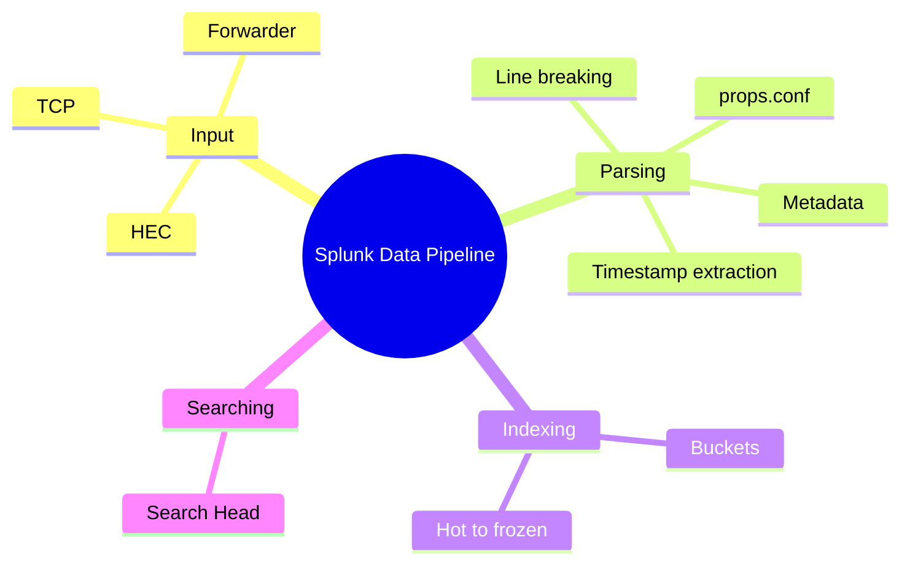

# Module 06: The Splunk Data Pipeline

Est. study time: 1.5h
Language: en
Description: How Splunk parses and indexes raw Java logs into searchable, time-bucketed events.

## Knowledge Map



---

## Learning Objectives (maps to course CILOs)
- Trace how a raw Spring Boot log becomes a searchable event through input, parsing, indexing, searching — serves CILO #1, #2
- Explain props.conf parsing decisions: timestamp extraction, line breaking, metadata — serves CILO #2
- Configure sourcetype parsing so multi-line Java stacktraces stay whole events — serves CILO #3
- Describe bucket storage and prepare JSON logs for immediate field extraction — serves CILO #4, #5

---

## Real-World Example

Your checkout service ships JSON logs via the HEC appender. At 02:00 UTC a payment incident starts. `index=checkout level=ERROR` between 01:00 and 02:00 returns events — but every `_time` is off by eight hours, and the 40-line `NullPointerException` stacktrace is shredded into 40 events. Correlation fails; the incident takes three hours instead of one.

Splunk decided at ingestion **what the timestamp is** and **where events break**. Wrong → indexed-but-wrong data: searchable, yet lying about when things happened.

> **Think**: The raw text still holds the correct timestamp. Why does a misparsed `_time` break the search?
>
> *Answer: Splunk stores events in time-bucketed storage; searches are bounded by `earliest`/`latest`. Wrong `_time` → wrong bucket → time-range search misses the event.*

---

## Core Content

### The Pipeline: Raw Log → Searchable Event

Four phases; module covers parsing and indexing.


- **Input** — data arrives via HTTP Event Collector (your appender), forwarder, or raw TCP/UDP.
- **Parsing** (indexer) — timestamp, line breaking, metadata, field extraction: defines each event.
- **Indexing** (indexer) — parsed events written to disk as **buckets** inside an index.
- **Searching** (search head) — SPL queries fan out to indexers (module 9+).

Same bytes, different sourcetype → different events.

> **Think**: You send the same log file via a forwarder AND the HEC appender. Duplicate events?
>
> *Answer: Yes. Each input path is an independent pipeline; Splunk does not dedupe across inputs. Pick one input path per source.*

> **Cloze**: "A raw log line travels four phases: {input}, {parsing}, {indexing}, and searching."
>
> *Answer: input, parsing*

> **Predict**: You stream 1 TB/day of repetitive INFO logs to the indexer. Which saturates first — parsing or searching?
>
> *Answer: Parsing. Every event is parsed at ingestion whether or not anyone searches it, so parse cost is paid on 100% of data upfront.*

### Parsing Decisions: Timestamps and Line Breaking

#### Timestamps

Splunk finds a timestamp per event and promotes it to `_time`: `TIME_PREFIX` (regex locating the timestamp), `TIME_FORMAT` (strptime pattern), `MAX_TIMESTAMP_LOOKAHEAD` (search range), `TZ` (zone when the timestamp has no offset).

Default auto-detection handles ISO8601 in JSON logs (module 5) with zero config. Trap: **missing timezone** — `2026-08-05 10:13:47` has no offset, so Splunk assumes `TZ` or the indexer's local zone. Wrong `TZ` → wrong-hour buckets (K8s pod in UTC, app in local time).

> **Think**: The app logs `2026-08-05 10:13:47` (no zone); pod is UTC, JVM says `Asia/Shanghai`. What becomes `_time`?
>
> *Answer: Whatever the sourcetype's `TZ` says, else the indexer's local zone. Splunk never guesses. Fix: log UTC or set `TZ = Etc/UTC`.*

> **Cloze**: "The timestamp becomes the internal field {_time}, and events are bucketed by it; an offset-less timestamp falls back to the {TZ} setting."
>
> *Answer: _time, TZ*

#### Line Breaking

`LINE_BREAKER` regex splits the raw byte stream into events. Default breaks on newlines — fine for single lines, terrible for Java stacktraces.

```ascii
raw stream:
  2026-08-05T10:13:47Z ERROR ... NPE      ──► event 1 (timestamp line)
  at ...PaymentService.charge             ──► event 2
  at ...OrderController.checkout          ──► event 3
(default: one event per line)
```

Multi-line events use `BREAK_ONLY_BEFORE` — a regex matching the **start of each new event**. For Java logs, match the timestamp:

```ini
[sourcetype:springboot_json]
BREAK_ONLY_BEFORE = \d{4}-\d{2}-\d{2}T\d{2}:\d{2}:\d{2}
```

Lines starting with a timestamp begin a new event; stack frames beneath stay glued → one searchable exception instead of 40 fragments.

> **Think**: Why does a shredded stacktrace break troubleshooting even though every line is searchable?
>
> *Answer: The causal chain dies. `| transaction` sees 40 unrelated events; exception, failing method, `Caused by:` land in different rows. One intact event preserves the failure path and traceId correlation (module 11).*

> **Cloze**: "To keep a Java stacktrace as one event, use {BREAK_ONLY_BEFORE} with a regex matching the {start} of each new event."
>
> *Answer: BREAK_ONLY_BEFORE, start*

> **Spot the Mistake**: A teammate writes `BREAK_ONLY_BEFORE = \n`, expecting it to behave like the default. Stacktraces still fragment.
>
> What's wrong?
>
> *Answer: `\n` matches before EVERY line, including every `at com.acme...` frame, so each frame becomes its own event. Match only what begins a real event — the timestamp — not every line break.*

### Parsing Decisions: Metadata and props.conf

Every event carries metadata: `source` (origin), `sourcetype` (format), `host` (machine/pod) — set at input (forwarder, HEC payload) or overridden at index time via `TRANSFORMS`.

All parsing rules live in **props.conf**, keyed by stanza:

```ini
[sourcetype:springboot_json]
BREAK_ONLY_BEFORE = \d{4}-\d{2}-\d{2}T
TZ = Etc/UTC
INDEXED_EXTRACTIONS = JSON
```

Stanzas can also target `[source::/path]`. Location: `$SPLUNK_HOME/etc/system/local` or an app. **Config is not live**: restart or `splunk reload`; verify with `splunk btool`. Every event also gets internal fields `_time`, `_raw`, `_index`, `_sourcetype`, `_source`, `_host`.

```ascii
props.conf
  └─ [sourcetype:springboot_json]
       ├─ TIME_PREFIX / TZ              ─► _time
       ├─ LINE_BREAKER / BREAK_ONLY_BEFORE ─► event boundaries
       └─ INDEXED_EXTRACTIONS           ─► level, traceId, userId
```

> **Think**: Two microservices share a mount and one log file but need different `TZ`. One stanza or two?
>
> *Answer: Two. Config is keyed by sourcetype (or source path); a shared sourcetype means identical rules for both.*

> **Cloze**: "Parsing rules live in a {props.conf} file inside a stanza named after the {sourcetype}; edits need a {reload} or restart to take effect."
>
> *Answer: props.conf, sourcetype, reload*

> **Spot the Mistake**: "I edited props.conf and searched immediately — nothing changed. The config must be broken."
>
> What's wrong?
>
> *Answer: Config is not hot-reloaded. Splunk reads props.conf at startup and on `splunk reload`. Run `splunk reload`; verify with `splunk btool props check`.*

### Indexing and JSON Logs

Parsed events are written to **buckets** — directories rolling over roughly every five minutes of data. They age through a lifecycle:

```ascii
Hot (active writes) ─► Warm (sealed, searchable) ─► Cold (slower storage) ─► Frozen (removed)
```

The index (module 1) is the top-level container; buckets are its time-sliced storage. Time ranges are cheap because Splunk skips whole buckets outside the window.

For JSON logs, use `INDEXED_EXTRACTIONS = JSON` (or built-in `_json`): `level`, `traceId`, `userId` extract at **index time** and appear immediately. The **Data Preview** UI shows parse results before you commit — test stacktraces there.

> **Think**: Why does `INDEXED_EXTRACTIONS = JSON` give fields "for free" versus plain text?
>
> *Answer: The indexer reads JSON structure once at parse time and writes each key as an indexed field. Plain text needs search-time regex or `TRANSFORMS`.*

> **Cloze**: "Parsed events are stored in {buckets} that age from hot to warm to {cold} and finally to {frozen}."
>
> *Answer: buckets, cold, frozen*

> **Predict**: You add `INDEXED_EXTRACTIONS = JSON` and re-ingest. Your dashboard references `traceId`. What changes?
>
> *Answer: `traceId` becomes a first-class field — searchable as `traceId=abc123`, usable in `stats` directly, no regex. Correlation (module 11) gets much simpler.*

---

### Why This Matters

Everything downstream assumes parsing worked. Field mapping (module 7-8), alerts (module 14), correlation (module 11) all depend on correct events and `_time`. A wrong `TZ` or shredded stacktrace corrupts everything — and data can't be re-parsed after indexing.

---

## Key Takeaways
- Pipeline: input → parsing → indexing → searching; the indexer performs parsing and storage
- `TIME_PREFIX`/`TIME_FORMAT`/`TZ` set `_time`; wrong timezone = events bucketed in the wrong hour
- `LINE_BREAKER`/`BREAK_ONLY_BEFORE` decide event boundaries; stacktraces need multi-line config
- Parsing rules live in `props.conf` stanzas; edits need `splunk reload`/restart, verify with `btool`
- Events store in buckets (hot → warm → cold → frozen); JSON + `INDEXED_EXTRACTIONS = JSON` gets fields at index time

---

## Common Misconception

**"Splunk indexes the raw text, so parsing mistakes don't matter."** Wrong. Text is there, but events land in wrong time buckets, stacktraces fragment, fields never appear. Parsing is the point of no return — data can't be re-parsed after indexing. Validate in **Data Preview** first.

---

## Spot the Mistake

```ini
[sourcetype:springboot_json]
BREAK_ONLY_AFTER = \d{4}-\d{2}-\d{2}T\d{2}:\d{2}:\d{2}
TZ = Asia/Shanghai
INDEXED_EXTRACTIONS = JSON
```

Events still fragment and timestamps are off. What's wrong?

*Answer: Two errors. (1) `BREAK_ONLY_AFTER` with the timestamp pattern says "an event ends where a timestamp begins" — the timestamp attaches to the previous event, so each stack frame becomes a new event. Use `BREAK_ONLY_BEFORE`. (2) `TZ = Asia/Shanghai` reads offset-less timestamps as Shanghai time; UTC logs shift eight hours. Log UTC + `TZ = Etc/UTC`.*

---

## Feynman Explain
(Explain parsing to a child. A post office sorts letters by postmark: read the postmark to pick the drawer, and keep torn pages of one letter together so it isn't split across three drawers. Misread the postmark → letter sits in the wrong drawer, unfindable even though the writing inside is legible. Splunk's indexer is the sorter, the postmark is the timestamp, torn pages are stacktrace lines, the drawer is the time bucket.)

---

## Reframe
(Pause. Judge: "index-time parsing is old-school — why not dump raw JSON and parse at search time?" Fair: search-time extraction (module 7) is flexible. But time bucketing can't be deferred, a shredded stacktrace can't be rejoined later, and search-time parsing runs on 100% of queried data every query. Boundary: parse at index time what you know you need; defer the long tail to search time. Write your evaluation.)

---

## Drill
Take the quiz. MCQs test different angles — recall, application, scenario.

Run: `learn.sh quiz splunk-java-observability 06-data-pipeline`
