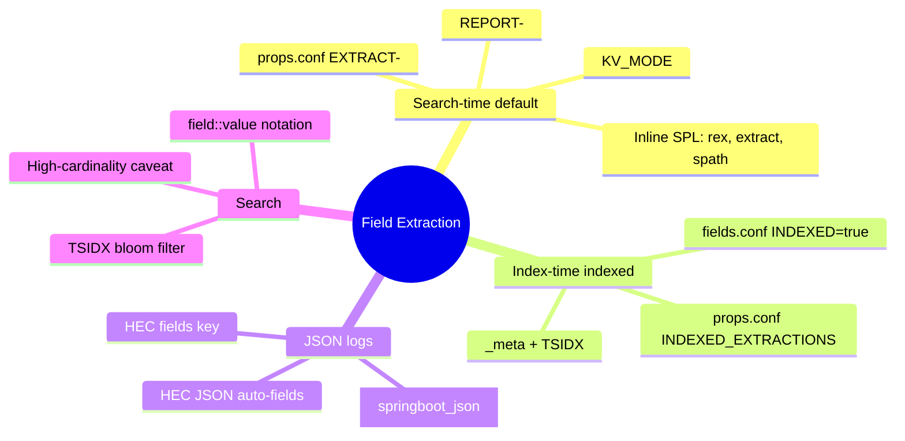
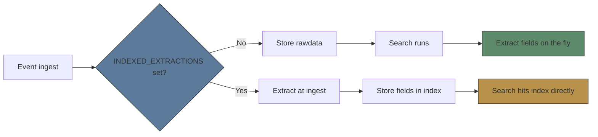
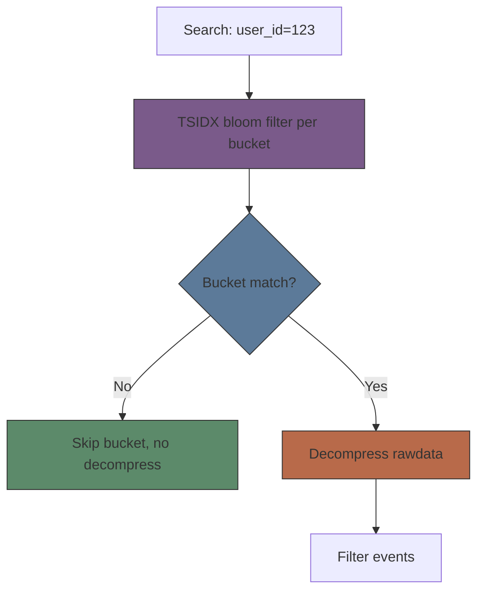
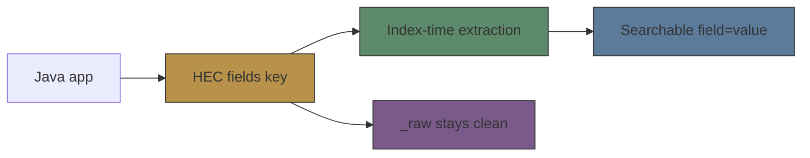

# Module 07: Field Extraction: Index-Time vs Search-Time

Est. study time: 1.5h
Language: en

## Knowledge Map



---

## Learning Objectives (maps to course CILOs)
- Compare index-time vs search-time extraction, list tradeoffs in storage, latency, flexibility — serves CILO #2
- Configure search-time extraction via props.conf EXTRACT/REPORT/KV_MODE for JSON logs — serves CILO #3
- Configure indexed extraction via INDEXED_EXTRACTIONS, transforms.conf, fields.conf, and HEC `fields` — serves CILO #3
- Decide when to use each model for a Java/Spring Boot workload and search indexed fields with `field::value` and TSIDX — serves CILO #4

---

## Real-World Example

You ship Spring Boot JSON logs from a payments service via HEC. Logback emits single-line JSON: `{"timestamp":"2026-08-05T10:22:31Z","level":"WARN","logger":"PaymentController","userId":92741,"club":"glee","latency_ms":412,"message":"payout slow"}`. A dashboard alert on slow payouts filters `club="glee" latency_ms>300`. Query hangs — scans every event every minute. Colleague says: "Mark everything indexed, problem solved." You are not so sure.

> **Think**: Why does the search touch every event? What does "marking everything indexed" actually cost?
>
> *Answer: By default fields are extracted at search time, so every bucket in the time range must be decompressed and regex-scanned. Indexing every field bakes each into every event's index entry: storage grows, ingest time grows, and the extraction cannot change without re-indexing.*

---

## Core Content

### Section 1: The Two Extraction Models

Splunk extracts fields by one of two models. **Search-time** (default): fields extracted when a search runs, from raw event text, via config or inline SPL. Nothing stored; cost is CPU per search. **Index-time** (indexed fields): extraction runs at ingest, results baked into the index; searchable without reading `_raw`. Both configure through `props.conf`, but index-time needs `fields.conf` too.



> **Think**: Search-time extraction is "free" at ingest. Where does its cost show up instead?
>
> *Answer: At query time — each search re-runs the regex over raw events. Repeated dashboards pay this every minute; that is the hidden bill.*

> **Cloze**: "By default Splunk uses {search-time} extraction, where fields are extracted when a {search} runs, not when data is ingested."
>
> *Answer: search-time / search*

> **Predict**: You add a regex rule to props.conf today. Old events from yesterday — do they gain the new field immediately?
>
> *Answer: Yes for search-time rules: extraction happens at search time against the stored raw text, so old events pick up the new rule instantly. Indexed fields would need re-indexing — this is the big flexibility win.*

### Section 2: Index-Time Extraction and Its Price

Index-time extraction bakes fields into the index at ingest. Configure with `INDEXED_EXTRACTIONS` in props.conf plus `fields.conf` marking fields `INDEXED = true`. Indexed fields become filterable via **TSIDX** (time-series index): a per-bucket bloom-filter pre-filter. A search with `user_id=123` tests bucket bloom filters and skips buckets with no match, before decompressing rawdata — fast for rare values.

Costs are real: storage grows (each indexed field stored per event), ingest time grows, and extraction cannot change after data is indexed — you must re-index. Do NOT index defaults (timestamp, host, source, sourcetype): no search benefit, pure cost. And if a field is high-cardinality (unique per event, e.g. latency_ms), bloom filter stops being selective — you gain nothing.



> **Think**: Why do we say indexed fields must be *rare* to pay off? What breaks with high cardinality?
>
> *Answer: TSIDX bloom filter is selective only when most buckets lack the value. If every bucket has it (high cardinality), the filter matches almost everything, so it pre-filters nothing and you still decompress all rawdata.*

> **Cloze**: "Indexed fields are declared in {fields.conf} with {INDEXED = true}, while the extraction itself is configured in {props.conf}."
>
> *Answer: fields.conf / INDEXED = true / props.conf*

> **Spot the Mistake**: A junior indexes `timestamp`, `host`, `sourcetype`, and `latency_ms` "because we filter on all of them." What's wrong?
>
> *Answer: The first three are already populated by the pipeline — indexing them adds storage for zero search benefit. latency_ms is high-cardinality so TSIDX won't pre-filter on it. Only rare, value-packed fields (userId, club) deserve indexing.*

### Section 3: JSON Logs — Automatic Extraction

Splunk parses JSON natively. Set a sourcetype and turn on `INDEXED_EXTRACTIONS = JSON`:

```text
[springboot_json]
INDEXED_EXTRACTIONS = JSON
KV_MODE = none
TIMESTAMP_FIELDS = @timestamp
```

KV_MODE = none stops double-extraction (JSON parser + KV parser racing). HEC JSON with an event as a JSON object gives auto-extracted fields. For indexed extraction from HEC JSON, use built-in sourcetype `_json`. Search indexed fields with double-colon notation: `club::glee`.

> **Cloze**: "With INDEXED_EXTRACTIONS = JSON, Splunk extracts every JSON key as a {field}; set {KV_MODE} to none to avoid conflicting key=value extraction."
>
> *Answer: field / KV_MODE*

> **Predict**: You set INDEXED_EXTRACTIONS = JSON on a sourcetype whose events are already indexed. New events get fields; old events don't. Is that right?
>
> *Answer: Indexed extraction runs only at ingest; the setting cannot retroactively change already-indexed buckets. Only search-time rules apply to old data.*

### Section 4: Custom Indexed Fields — transforms + HEC `fields`

Two ways to build custom indexed fields without JSON structure. First, transforms.conf regex extraction writing into `_meta` (index-time metadata; text units split on whitespace, `::` becomes field::value):

```text
[extract_userid]
REGEX = userId=(\d+)
FORMAT = user_id::$1
WRITE_META = true
DEST_KEY = _meta
SOURCE_KEY = _raw
REPEAT_MATCH = true
```

Referenced from props.conf: `TRANSFORMS-add = extract_userid`. Then fields.conf marks it indexed:

```text
[user_id]
INDEXED = true
```

Second and simplest for Java: HEC `fields` key — a flat JSON object sent with each event in the `/collector/event` payload. Fields are indexed at index-time automatically, searchable via `field=value`, but NOT present in `_raw` text (keeps the event string clean). Not applicable to raw-type events.



> **Think**: HEC `fields` vs transforms regex — when pick each?
>
> *Answer: If you can control the HEC payload, send `fields` — zero config, fields indexed automatically. Transforms regex exists for legacy or raw events where you cannot change the payload shape.*

> **Spot the Mistake**: Team sets TRANSFORMS-add referencing a nonexistent transform. Events still index fine, user_id just never appears. They blame Java. What actually happened?
>
> *Answer: A missing transform stanza is silently ignored — the reference resolves to nothing, so WRITE_META never runs. No error surfaces at ingest. Verify with `btool` before blaming the app.*


---

### Why This Matters

Field extraction decides how queryable your logs are. Search-time by default: flexible, cheap to store, fixable anytime. Index only rare, high-value fields you filter on at scale (data models, huge volumes) — never defaults. For JSON/Spring Boot, `INDEXED_EXTRACTIONS = JSON` or HEC `fields` gets most value with least config. Get this wrong and you either pay per-search CPU on terabytes, or pay storage + a locked-in extraction you can never change.

---

## Key Takeaways
- Search-time is default: fields extracted per search, zero storage cost, instantly reconfigurable.
- Index-time bakes fields into the index at ingest: storage + ingest cost grow, extraction immutable without re-index.
- TSIDX bloom filter makes indexed searches fast only for rare values; high-cardinality fields gain nothing.
- JSON logs: set `INDEXED_EXTRACTIONS = JSON`, `KV_MODE = none`; HEC JSON auto-extracts; search indexed fields via `field::value`.
- HEC `fields` key is the simplest way to add indexed fields from Java; transforms regex is the fallback for raw events.

---

## Common Misconception

"Indexing a field makes every search faster." Wrong: indexed fields only speed up searches that *filter on that specific field* via TSIDX, and only when the value is rare. The field never appears in `_raw` text, costs storage per event, and locks your extraction forever. Correct framing: index to pre-filter rare values, not to make a field searchable — search-time extraction already makes it searchable at no storage cost.

---

## Spot the Mistake

```text
[payment_log]
INDEXED_EXTRACTIONS = JSON
KV_MODE = auto
```

Analyst says: "KV_MODE=auto gives us more fields, belt and braces." Dashboard later shows duplicate, wrong-typed fields (e.g. `latency_ms` sometimes string, sometimes number). What's wrong?

*Answer: With JSON extraction on, KV_MODE should be `none`. auto runs the key=value parser on top of the JSON parser; keys clash, types race, events inflate. Keep one extraction path per event.*

---

## Feynman Explain

Explain to a child how Splunk finds your lucky marble. Imagine a huge jar of marbles (all your logs). Search-time: you tip the jar out and look one by one each time you search — nothing stored, but slow on a big jar. Index-time: before storing a marble you write "has a blue marble?" on each box lid. Finding blue: check lids, skip boxes without one — fast, but you paid extra filling boxes, and if every box has a blue marble the lids stop helping. For JSON logs, Splunk reads the label already on the marble, so you barely work at all.

---

## Reframe

Pause. Does "search-time by default" hold? Mostly — modern hardware + KV store searches are cheap and flexible. Where it breaks: multi-terabyte retention, real-time dashboards re-running the same rare-field filter every minute, data models with baked field access. Counterargument: over-indexers pay permanent storage tax for flexibility they never use; never-indexers pay query latency daily. Right answer is per-field, per-query-frequency judgment — one rule for everything is the real trap.

---

## Drill
Take the quiz. MCQs test different angles — recall, application, scenario.

Run: `learn.sh quiz <subject> <module-id>`
