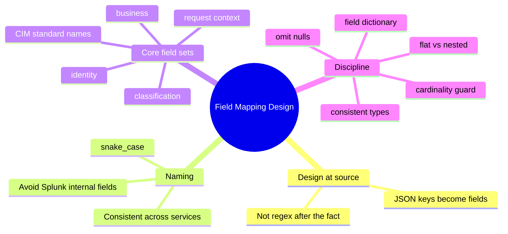
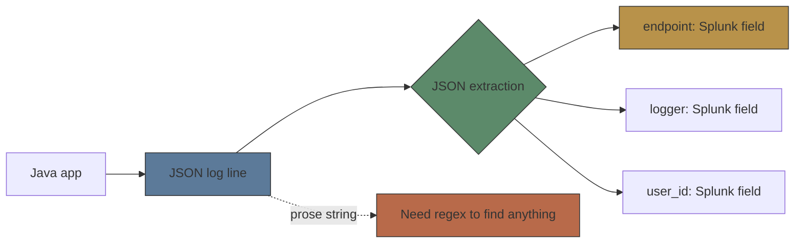
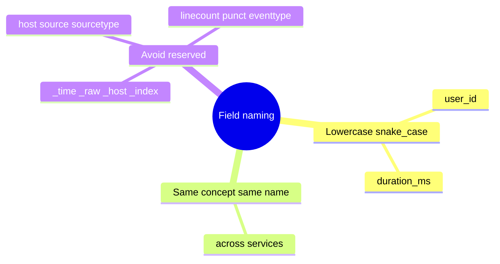
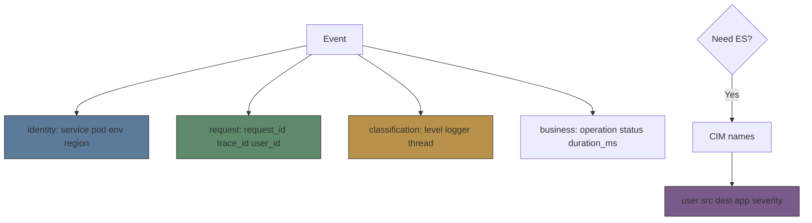

# Module 08: Field Mapping Design

Est. study time: 1.5h
Language: en

## Knowledge Map



---

## Learning Objectives (maps to course CILOs)
- Design a Java log field schema so JSON keys map cleanly to Splunk fields at the source — serves CILO #2
- Apply a consistent cross-service naming convention and avoid Splunk internal-field collisions — serves CILO #3
- Select core field sets (identity, request, classification, business) and standard CIM names for security/monitoring — serves CILO #5
- Manage cardinality, type consistency, nulls, and schema documentation so fields stay queryable and cheap — serves CILO #4

---

## Real-World Example

Spring Boot checkout service. Team logs raw messages: `"user 42 created order abc-123 in 1204ms with error null"`. Monitoring wants to alert "checkout > 1s slow". They cannot filter cleanly — user, order, duration all trapped in prose; regex needed for everything. Splunk dashboards are painful, alerts unreliable.

> **Think**: Where did the fields get lost? What single change fixes alerting for good?
>
> *Answer: Fields were lost at the source — embedded in human-readable prose. The fix is emitting structured JSON keys (service, user_id, operation, duration_ms, error_type) at the app, so each key becomes a Splunk field with no regex.*
>
> *Design fields when you write the log line, not after the data lands.*

---

## Core Content

### Section 1: Design Fields at the Source

Splunk turns JSON keys into fields automatically (Indexed extraction). So the field schema is decided by the **keys you choose in Java**, not by regex written later. This moves schema ownership into the application — versioned with your code, tested, and consistent across deploys.



> **Think**: Why is a JSON key "free" as a Splunk field, while the same value in prose costs regex?
>
> *Answer: JSON extraction is structural — Splunk reads key/value pairs directly. Prose gains nothing automatically; every value needs an extraction rule. Keys-in-code beat probes-after-the-fact.*
>
> *Answer: JSON keys are structural, so Splunk extracts them with zero config and they are typed correctly. Prose needs a parser per value.*

> **Cloze**: "Every {JSON} key you emit from Java becomes a Splunk {field} automatically, so the schema is decided at the source, not by regex after the fact."
>
> *Answer: JSON / field*

> **Predict**: You change a field name from `userId` to `user_id`. What happens to queries built on the old name?
>
> *Answer: They break or return nothing until updated — query writers see a stray, empty field. Renaming is a breaking change, so fix names early and document them.*

### Section 2: Naming and Reserved Fields

Two rules sort most problems. First, use consistent **lowercase snake_case** (`user_id`, `duration_ms`) — camelCase keys survive but snake_case is Splunk-native, greppable, and stable in `search` syntax. Second, keep the same concept named the same across **all services**; `user` in checkout and `member` in accounts breaks join queries.

Avoid colliding with Splunk internal fields `_time`, `_raw`, `_host`, `_index`, `_source`, `_sourcetype` and default metadata `host`, `source`, `sourcetype`, `linecount`, `punct`, `eventtype`. You cannot safely repurpose these.



> **Cloze**: "Use consistent lowercase {snake_case} for field keys, and avoid colliding with Splunk {internal} fields like _time and _raw."
>
> *Answer: snake_case / internal*

> **Spot the Mistake**: A service emits a field literally named `_host` thinking it maps to the reporting host. What's the problem?
>
> *Answer: _host is a reserved Splunk field (reporting host). The key is mangled or overridden by the pipeline — noisy and wrong. Use a custom name like `hostname` or `pod`.*

### Section 3: Core Field Sets and CIM

Standardize four field sets so every event is self-describing:

| Set | Fields |
|-----|--------|
| identity | service, pod/host, env, region |
| request context | request_id, trace_id, user_id, session_id |
| classification | level, logger, thread, timestamp |
| business | operation, status, http_method, http_status, client_ip, error_type, error_message, duration_ms |

For Enterprise Security or data models, use the **CIM** (Common Information Model) names: `user`, `src`, `dest`, `app`, `action`, `signature`, `severity`, `vendor_product`. The Splunk Java logging client exposes constants via `SplunkCimLogEvent` (`COMMON_SRC`, `COMMON_DEST`, `COMMON_USER`, `COMMON_APP`, `COMMON_SEVERITY`), so you get CIM-correct keys without memorizing strings.



> **Cloze**: "For Enterprise Security feeds, use {CIM} field names like user, src, and severity; the Splunk Java client exposes these as {SplunkCimLogEvent} constants."
>
> *Answer: CIM / SplunkCimLogEvent*

> **Predict**: You skip `service`, `env`, and `request_id` on a shared log stream. What search becomes impossible or unreliable?
>
> *Answer: Splitting one index into services or envs, and tracking a single user request across services. Without identity + request fields every multi-service question is guesswork.*

### Section 4: Cardinality, Types, Nulls, and Documentation

Four disciplines keep fields cheap and correct.

1. **Cardinality**: high-cardinality values (per-request IDs, full URLs with query strings, exact latency floats) bloat the index and defeat TSIDX. Log them, but don't index them; bucket the noisy ones for analysis (e.g. round `duration_ms` to the nearest 10 with eval).
2. **Type consistency**: keep `duration_ms` always a number, `status` always a string. Mixed types silently break `stats`, `where`, and comparisons.
3. **Nulls**: omit absent keys; emitting nulls/empty strings for unused fields pollutes filters.
4. **Documentation**: keep a field dictionary (name, type, meaning, example, owner) and share the base schema across services, e.g. via a shared JSON encoder `customFields` in GitOps.

Desired log line:

```json
{"@timestamp":"2024-03-01T10:15:30.123Z","level":"ERROR","logger":"com.myco.checkout.OrderService","service":"checkout","pod":"checkout-7f9c","request_id":"abc-123","user_id":"42","operation":"createOrder","duration_ms":1204,"http_status":500,"error_type":"NullPointerException"}
```

> **Cloze**: "Log high-cardinality values but do not {index} them; bucket noisy metrics like exact floats with {eval} for analysis."
>
> *Answer: index / eval*

> **Predict**: `duration_ms` is a string on Tuesdays and a number other days. What breaks?
>
> *Answer: stats and where comparisons silently behave differently — string '1204' does not compare numerically with 1204. Same field, two types, nonsense totals. Classic schema drift.*

> **Spot the Mistake**: A developer logs `currentTimeMillis: 1710000000000` — a fresh millisecond value on every line. The index balloons. Why?
>
> *Answer: It's high-cardinality — unique per event — so storage and TSIDX grow with zero filter value. Bucket it (e.g. to 15s) or omit it.*
>
> *Answer: High-cardinality per event defeats filters and inflates the index. Bucket it (e.g. to 15s) or omit.*

> **Spot the Mistake**: Enricher emits `email: ""` and `error_type: null` for 99% of events "to keep a consistent schema." What's wrong?
>
> *Answer: Constant empty/null fields pollute searches and stats. Omit absent keys — clean JSON; the schema doc records that the key exists, not that each event must carry it.*

---

### Why This Matters

Field mapping is the boundary where logs stop being text and become queryable data. Decide keys in Java, use snake_case, standardize core sets (plus CIM when feeding Enterprise Security), and keep cardinality, types, and nulls disciplined. Done right: dashboards, alerts, and multi-service tracing "just work" with no extraction hacks. Done wrong: every dashboard needs regex, every rename is a breaking change, and the index bloats on high-cardinality junk.

---

## Key Takeaways
- Design field schema at the source: choose JSON keys in Java; they become Splunk fields with no regex.
- Use consistent lowercase snake_case across all services; same concept = same name.
- Never collide with Splunk internal fields (_time, _raw, _host) or defaults (host, source, sourcetype).
- Standardize identity, request, classification, and business field sets; use CIM names for Enterprise Security.
- Keep cardinality low on indexed fields, types consistent, nulls omitted, and the schema documented in a shared field dictionary.

---

## Common Misconception

"More fields is better — dump every value." Wrong: high-cardinality fields bloat the index and starve filters, empty/null keys pollute searches, and mixed types silently break stats. The goal is a *disciplined, curated* schema — identity + request context + a few typed business fields — not a kitchen sink. Every value earns its place; if it is never queried, it is pure cost.

---

## Spot the Mistake

```java
logger.info("{} user {} {} order in {}ms", service, 42,
    "created", 1204 + "ms");
```

Team asks why the Splunk dashboard "can't filter by user" and why alerting on duration "sees strings." What's wrong?

*Answer: All values are embedded in a prose template — no JSON keys, so nothing becomes a Splunk field; duration becomes string '1204ms', not a number. Emit structured JSON keys (user_id, operation, duration_ms) instead, and keep duration_ms numeric.*

---

## Feynman Explain

Imagine a warehouse shelf with labeled jars (your events). A label on the jar ("user 42, order abc, 1204 ms") is prose — to find a user you must read every label twice. But put a tiny white tab on each jar with one word ("user:42", "dur:1204") and you can flip tabs instantly: that is a structured field. In Java you glue on the tabs (JSON keys) at the moment you label the jar, so Splunk never has to re-read anything.

---

## Reframe

Pause. "Field mapping is just naming" undersells it. Naming conventions are the contract; but the real leverage is deciding *where* the field exists (source, not Splunk), the discipline not to over-collect, and types staying true. Counterargument: niche tools tolerate messy logs and clean them in Splunk. Reality: that pushes schema drift into queries where it multiplies. Invest once at the source; pay once.

---

## Drill
Take the quiz. MCQs test recall, naming judgement, and scenario tradeoffs.

Run: `learn.sh quiz <subject> <module-id>`