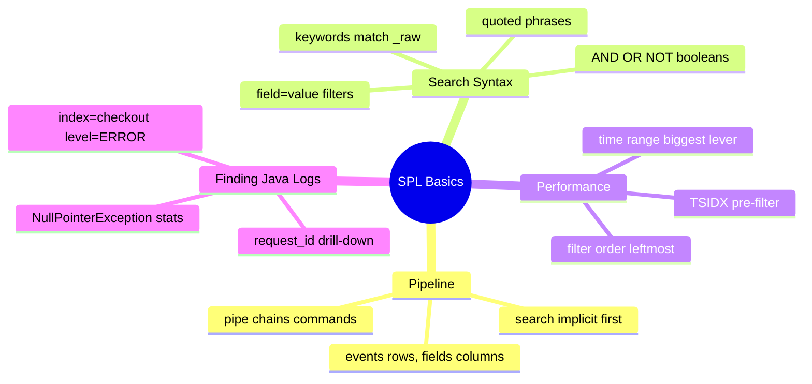
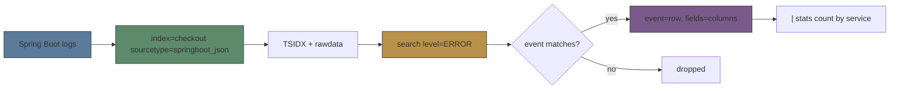
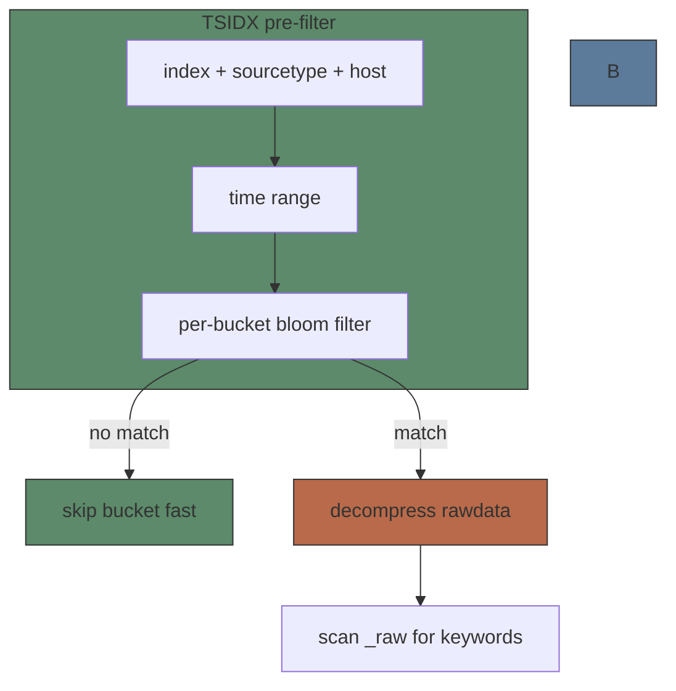

# Module 09: SPL Basics

Est. study time: 1.5h
Language: en

## Knowledge Map



---

## Learning Objectives (maps to course CILOs)
- Explain the SPL pipeline: implicit `search`, `|`-chained commands, events-as-rows / fields-as-columns — serves CILO #6
- Write keyword, `field=value`, phrase, and boolean searches that locate Spring Boot log events — serves CILO #6
- Set explicit time ranges and order tightest filters leftmost so searches use the TSIDX pre-filter instead of scanning all time — serves CILO #6
- Combine internal fields (`_raw`, `_time`, `_index`) with `field=value` to trace a production request end to end — serves CILO #9

---

## Real-World Example

2am. Checkout service throws `NullPointerException` every few seconds. Customer emails "payment page hangs". You open Splunk, type `NullPointerException`, hit Enter… and wait minutes — you constrained neither index nor time, so Splunk scans every bucket of every readable index.

> **Think**: Why does a bare `NullPointerException` take minutes while your colleague's `index=checkout level=ERROR` returns in seconds?
>
> *Answer: A bare keyword searches all data across all time. Filtering by index, sourcetype, and time range skips irrelevant buckets before raw text is touched.*

The fix: `index=checkout earliest=-1h level=ERROR | head 100`. This module teaches the syntax and ordering that make searches like this fast and correct.

---

## Core Content

### Section 1: The Search Pipeline — Events Are Rows

Every SPL search is a pipeline. The `search` command is implicit — it runs first whether typed or not. Everything after the first `|` is another command applied to the previous result set.



After the search, each event is a **row** and each extracted field a **column**. Your `level`, `service`, and `request_id` fields become columns you can filter, count, group.

> **Think**: Why does Splunk still scan raw event text instead of only reading pre-indexed metadata?
>
> *Answer: Not all text is indexed. Search-time scanning matches anything in raw event text — stacktrace lines, exception messages — without pre-deciding what matters.*

> **Cloze**: "The first command of a search is implicitly {search}; later commands are chained with the {pipe} character (`|`)."
>
> *Answer: search; pipe*

**Example:**
```text
index=checkout level=ERROR | head 100
```
The implicit `search` returns matching events; `head 100` (via `|`) keeps the first 100 rows.

> **Predict**: You run `index=checkout | stats count by service`. Which command runs first, and what does the pipeline deliver?
>
> *Answer: `search index=checkout` runs first; its events feed `stats`, which collapse them into one row per service with a count.*

### Section 2: Search Syntax — Keywords, Fields, Phrases, Booleans

| Syntax | Example | What it matches |
|--------|---------|-----------------|
| Keyword | `NullPointerException` | any event whose `_raw` contains it (broad) |
| field=value | `level=ERROR` | events where field `level` equals `ERROR` (narrow) |
| Phrase | `"Connection refused"` | raw text contains the exact phrase |
| Boolean | `(service=checkout OR service=inventory) level=ERROR` | grouped logic; AND implied between terms |

Key rules:
- Field names are **case-insensitive**; values are **case-sensitive** by default. `LEVEL=error` won't match `ERROR`.
- `AND` is implied between terms; `OR` and `NOT` are explicit.
- `AND` binds tighter than `OR`, so `index=a OR index=b level=ERROR` parses as `(index=a) OR (index=b AND level=ERROR)` — a classic surprise. Parenthesize.
- Quotes search `_raw` for the exact phrase.

> **Think**: `service=checkout level=error` returns 0 events, yet you see `"level":"ERROR"` in raw JSON. Why?
>
> *Answer: Values are case-sensitive — the event stores `ERROR`, so the value `error` never matches. Retry with `level=ERROR`.*

> **Cloze**: "Field names in SPL are {case-insensitive}, but field values are {case-sensitive} by default."
>
> *Answer: case-insensitive; case-sensitive*

> **Spot the Mistake**: A teammate searches `index=checkout OR index=inventory level=ERROR` and is puzzled by non-error checkout events. What's wrong?
>
> *Answer: Without parentheses, AND binds tighter than OR: `(index=checkout) OR (index=inventory AND level=ERROR)` — every checkout event matches. Fix: `(index=checkout OR index=inventory) level=ERROR`.*

### Section 3: Filter Order, Time Ranges, and Speed

Put the tightest filters **leftmost**: index, sourcetype, host, then time range, then the rarest field values. The TSIDX pre-filter checks index/sourcetype/host plus the time range against a per-bucket **bloom filter** *before* decompressing rawdata, so narrow constraints skip whole buckets instantly.



**Time range is the biggest performance lever.** Always set it:
- `earliest=-1h latest=now` — last hour
- `earliest=-7d@d` — 7 days snapped to midnight (`@d`); `@w` snaps to week start
- Absolute: `earliest=2024-03-01T00:00:00 latest=2024-03-02T00:00:00`
- In **scheduled searches, always embed earliest/latest in the SPL itself** — never rely on UI settings, which scheduled runs may not carry.

Wildcards cost you: a trailing wildcard on `service=checkout` (prefix) is fine; a leading wildcard (searching `ERROR` with a star in front) defeats index/TSIDX lookup on that field and forces a scan. Avoid leading wildcards.

> **Think**: `index=checkout earliest=-1h level=ERROR` vs `level=ERROR` with no other constraints — why is the first dramatically faster?
>
> *Answer: The first lets TSIDX test each bucket's bloom filter for index+time+field before touching rawdata, so most buckets are skipped. The second scans every readable bucket across all time.*

> **Cloze**: "The single biggest performance lever in any Splunk search is the {time range}."
>
> *Answer: time range*

> **Predict**: You add a trailing wildcard on `service=checkout` to `index=checkout earliest=-1h`. Which part does TSIDX check, and which is deferred to raw scanning?
>
> *Answer: Index, time, sourcetype, and host are TSIDX-checked; a trailing prefix wildcard on `service=checkout` stays TSIDX-backed when the field is indexed. A leading wildcard is not — it defers to raw scanning and slows the search.*

> **Spot the Mistake**: A scheduled alert has no `earliest`/`latest` in the SPL; the dashboard picker shows "Last 15 minutes". The alert fires with results from last month. What's wrong?
>
> *Answer: The UI time picker does not reliably apply to scheduled alert searches. The SPL must set `earliest`/`latest` itself, e.g. `index=checkout level=ERROR earliest=-15m latest=now`.*

### Section 4: Finding Your Java Logs

Three searches cover most Java/Spring Boot workflows:

```text
index=checkout level=ERROR | head 100
```
Newest failures fast.

```text
index=checkout "NullPointerException" | stats count by service
```
Which service throws most NPEs right now.

```text
index=checkout request_id=abc-123
```
Trace one request across its events — key to incident drill-down.

Keyword vs field=value: keywords search all event text (broad, slower); `field=value` uses the index/TSIDX (fast, narrow). Prefer field filters when structured logging gives you a known field.

> **Think**: To see everything about one failing request, why filter on `request_id=abc-123` instead of the exception message?
>
> *Answer: The exception message appears only on the failure line; `request_id` appears on every line of that request, so you get the full timeline — timings, params, downstream calls.*

> **Cloze**: "The internal field {_raw} holds the full unparsed event text; {_time} stores the event's timestamp."
>
> *Answer: _raw; _time*

---

### Why This Matters

SPL is the language your on-call rotation, platform team, and every alert you build will use. Search speed is not cosmetic: a 10-minute scan of all time is useless at 2am during an incident, while a 2-second `index=... earliest=-1h` points straight at the failing service. Later modules — stats, timechart, dashboards, alerts — assume you can write the base search correctly. The pipe chain starts here.

## Key Takeaways
- Every search starts with an implicit `search` command; `|` feeds results to the next command.
- Events are rows, fields are columns — structured log fields become filterable columns.
- Keywords match `_raw` broadly; `field=value` matches the index narrowly and fast.
- Field values are case-sensitive (`level=error` ≠ `level=ERROR`); `AND` binds tighter than `OR` — parenthesize.
- Put tightest filters first and always set a time range: TSIDX skips buckets without touching rawdata.

---

## Common Misconception

**"The time picker in the UI is enough."** Wrong — the search defines what gets scanned. With no `earliest`/`latest` in the SPL, you depend on whoever set the picker; scheduled searches often bypass it entirely. Treat time range as part of the query and embed it (`earliest=-1h latest=now`).

---

## Spot the Mistake

A developer writes: `earliest=-7d@d index=checkout level=ERROR | head 100` and complains it is slower than expected.

What's wrong?

*Answer: `@d` snaps to midnight, so this searches 7 full days, not the last 7 days from now — a huge window for a live incident. `earliest=-1h` would be far tighter; the oversized window is the problem.*

---

## Feynman Explain
(Teach "search pipeline" to a child. Use simplest words. No jargon. Give a concrete example from daily work. Do NOT move on until you can explain it clearly without vague language.)
A log is a note about something that happened. Splunk keeps a giant pile of notes. When you want only the sad notes, grab the right pile (index), pick the right hour (time), then read only notes saying "ERROR". Reading every word is slow; skipping wrong piles and hours first is fast. The `|` means "then": *first* grab the pile, *then* keep ERROR notes, *then* count them by service.

---

## Reframe
(Pause. Judge "filter order and time ranges": does this make sense? When would this logic break? What's the counterargument? Write your evaluation.)
Sound in practice: constrain early, scan late. But filter order in SPL is a readability convention, not a hard rule — Splunk is generally free to apply WHERE-style predicates in any order, so do not over-tune. Where it breaks: time-range snapping (`@d`) is subtle; leading wildcards and high-cardinality fields still force scans. Counterargument: "add an index filter and earliest" fixes most real cases, which is why the habit is worth keeping as default.

---

## Drill
Take the quiz. MCQs test different angles — recall, application, scenario.

Run: `learn.sh quiz <subject> <module-id>`