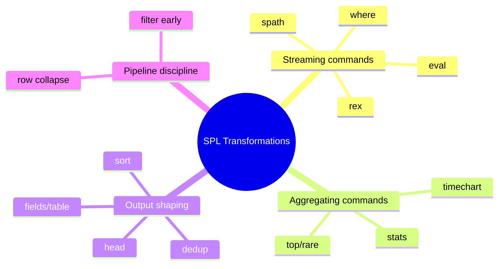
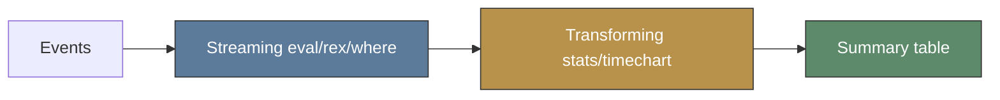
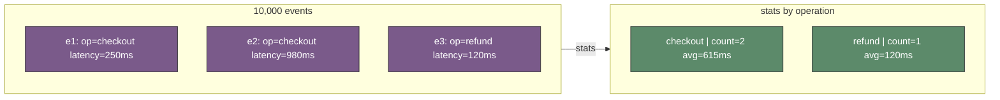
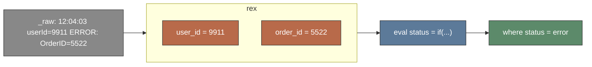
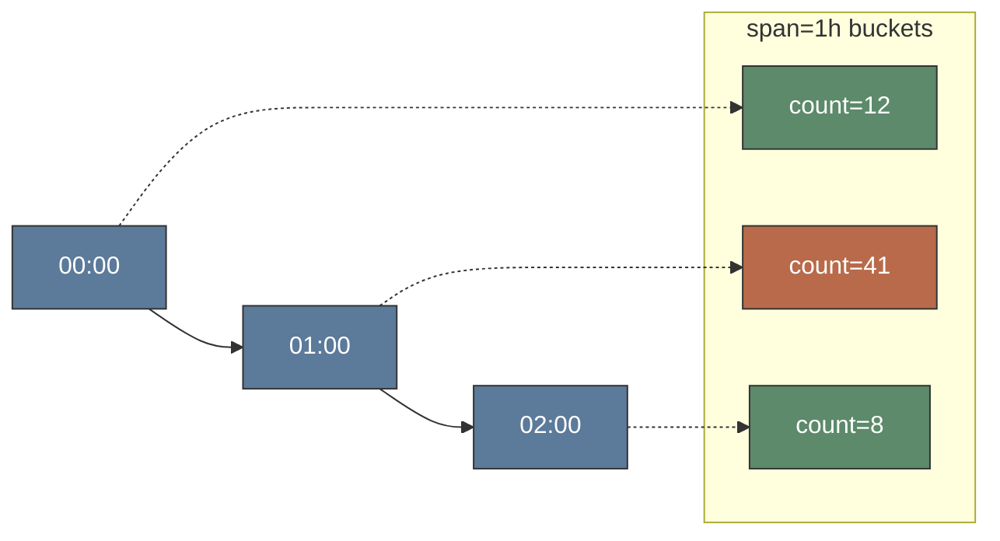

# Module 10: SPL Transformations

Est. study time: 1.5h
Language: en

## Knowledge Map



---

## Learning Objectives (maps to course CILOs)
- Distinguish transforming from streaming commands and explain why pipeline order matters — serves CILO #3
- Build `stats` aggregations with `by`-clauses to answer counts, averages, and cardinality questions — serves CILO #4
- Compute, extract, and reshape fields with `eval`, `rex`, and `spath` — serves CILO #4
- Compose a multi-stage `timechart` analysis over Java application logs — serves CILO #5

---

## Real-World Example

Your checkout service logs structured JSON. An on-call incident: payment errors spiked for 45 minutes at 02:00. You open Splunk, run the obvious search:

```text
index=checkout level=ERROR earliest=-24h
```

…and get 12,000 events. No pattern visible; 12,000 stack traces are unreadable. You need one summary — errors by type per hour.

> **Think**: Why does the raw event dump fail you here, and what output shape would actually answer "which error type, when"?
>
> *Answer: Events are per-request; the question is per-group. Extract an error type with `rex`, then bucket in time with `timechart`. One table beats 12,000 rows.*

---

## Core Content

### Section 1: Streaming vs Transforming Commands

Every SPL pipeline is a sequence of commands. Two families:

- **Streaming (non-transforming):** `eval`, `where`, `rex`, `spath`, `fields`, `rename`. Process one event at a time, output as many rows as went in. Cheap, incremental, works over huge result sets.
- **Transforming:** `stats`, `timechart`, `top`, `rare`. Consume many events, emit one summary row (or one row per `by`-group). This is where data *collapses*.



**Example pipeline:**

```text
index=checkout level=ERROR | eval status=if(...) | where status="error" | stats count by service
```

> **Think**: `eval` keeps row count; `stats` shrinks it. Which runs first — and why does it matter at 10M events?
>
> *Answer: Streaming transforms first. `stats` destroys per-event fields; any `eval`/`where` needing them must run before the collapse.*

> **Cloze**: "Commands that process one event at a time are called {streaming} commands; commands that collapse many events into a summary table are called {transforming} commands."
>
> *Answer: streaming; transforming*

### Section 2: stats — The Aggregation Workhorse

`stats` reduces many events to summary rows. The `by`-clause sets grouping; without it, everything collapses to one row.

```text
index=checkout | stats count by level
index=checkout | stats avg(duration_ms), max(duration_ms) by operation
index=checkout | stats dc(user_id)
index=checkout | stats count, sum(bytes), values(http_method) by service
```

Common functions: `count`, `avg`, `max`, `min`, `sum`, `dc(...)` (distinct count), `values(...)`, `earliest`/`latest`.



> **Think**: `| stats dc(user_id)` — one row, one number. Count of distinct values or rows? What Java analogy fits?
>
> *Answer: Count of distinct values — like a `Set` size or `SELECT COUNT(DISTINCT user_id)`. `dc()` counts unique users, not rows.*

> **Cloze**: "In `| stats avg(duration_ms) by service`, the {by} clause groups results; omitting it returns a single {row} for the whole result set."
>
> *Answer: by; row*

> **Predict**: You run `| stats count by level` and see `ERROR=4`. Then you add `| where count > 10`. What disappears?
>
> *Answer: Every row with count ≤ 10 — here the ERROR row. `where` after `stats` filters the aggregated table, not raw events.*

### Section 3: eval, rex, spath — Compute, Extract, Shape

**eval** adds computed fields and conditionals:

```text
| eval latency_ms = duration_ms / 1000
| eval status = if(http_status >= 500, "error", "ok")
| eval bucket = round(duration_ms, -1)          (round to nearest 10)
| eval full = request_id . "-" . service
```

`where` then filters on computed fields: `| where status="error"` or `| where count > 10`.

**rex** extracts named groups from a text field (default `_raw`) with Perl regex:

```text
| rex "userId=(?<user_id>\d+)"
| rex field=message "OrderID=(?<order_id>[0-9]+)"
```

**spath** pulls values from structured JSON/XML by path:

```text
| spath input=message path=order.total
| spath
```

`| spath` with no args auto-extracts top-level JSON keys into fields.



> **Think**: `| rex field=_raw "userId=(\d+)"` uses a positional group. Does it create a field called `userId`?
>
> *Answer: No. Positional `(...)` groups name nothing and are discarded. Only named groups `(?<user_id>...)` create fields.*

> **Cloze**: "To turn `"total": 99.50` inside a JSON message into a queryable field, use {spath}; to pull `userId=123` out of raw text, use {rex}."
>
> *Answer: spath; rex*

> **Spot the Mistake**: Someone writes `| eval status = if(http_status >= 500)`. What's wrong?
>
> *Answer: `if()` needs three arguments — condition, true-value, false-value. Syntax error. Correct: `if(http_status >= 500, "error", "ok")`.*

### Section 4: timechart + Pipeline Discipline

`timechart` is `stats` bucketed in time:

```text
| timechart span=1h avg(duration_ms) by operation
| timechart span=5m count by error_type
```



**Pipeline discipline — filter early, aggregate late.**

- Cheap narrowing first: search terms, then `where`, before `rex`/heavy work.
- `stats`/`timechart` collapse rows — anything after them operates on the summary table.
- A `by` field you didn't extract yet must be extracted *before* the transform.

Full analysis (errors by type, per hour):

```text
index=checkout level=ERROR earliest=-24h
| rex "ErrorType=(?<error_type>\w+)"
| timechart span=1h count by error_type
```

**Example** (worked):

```text
index=checkout earliest=-1h
| rex "op=(?<operation>\w+)" 
| where operation="checkout"
| eval bucket = round(duration_ms, -1)
| stats count, avg(duration_ms) by bucket
| sort - count
| head 10
```

Each event: name extracted → filtered → latency rounded → grouped → worst bucket ranked → top 10 shown.

> **Think**: Why place `rex` before `where operation="checkout"`, not after?
>
> *Answer: `where` only sees existing fields. Reversed, `operation` doesn't exist yet and every event is dropped — a silent empty result.*

> **Predict**: In the full analysis above, what happens to events whose `_raw` lacks `ErrorType=`?
>
> *Answer: `rex` emits no `error_type` for them; `timechart by error_type` groups them under a null bucket. Not dropped — count appears in a "(not set)" column.*

> **Spot the Mistake**: `index=checkout | stats count by error_type | rex "ErrorType=(?<error_type>\w+)"` — zero `error_type` columns in output. Why?
>
> *Answer: `rex` runs after `stats`, which collapsed events and dropped `_raw`. Nothing left to extract. Extraction must precede the transform.*

> **Cloze**: "The command that aggregates statistics into time buckets is {timechart}; grouping it with `by` produces one series per {value} of the by-field."
>
> *Answer: timechart; value*

---

### Why This Matters

A single error event is noise; a distribution is signal. Transforming commands turn raw Java logs into the tables and charts that drive alerting, SLO reports, and on-call triage. Get the order wrong and you get silent empty results or misleading totals — the kind of false-negative that hides an outage.

---

## Key Takeaways
- Streaming commands (`eval`, `where`, `rex`, `spath`) pass events through one at a time; transforming commands (`stats`, `timechart`) collapse them into summaries.
- `stats` with a `by`-clause groups; without `by` it returns one row for everything.
- `dc()` counts distinct values; `values()` lists them; `count()` counts rows.
- `rex` needs named groups `(?<name>...)`; positional groups create no fields.
- Pipeline order decides correctness: extract and filter before you aggregate; filter early, transform late.

---

## Common Misconception

Misconception: "The pipeline runs left to right, but results are the same regardless of order." In SPL, order is semantic, not cosmetic. `stats` destroys per-event fields, so any `eval`/`rex`/`where` depending on those fields must run first. Running `rex` after `stats` is not a performance nit — it silently produces empty fields. Same pipeline, different order, different (often wrong) answer.

---

## Spot the Mistake

You want slow checkouts per minute. You write:

```text
index=checkout | timechart span=1m count by operation | where avg(duration_ms) > 500
```

What's wrong?

*Answer: Two errors. (1) `avg(duration_ms)` is not in the `timechart` output, so the filter matches nothing. (2) `timechart by operation` counts events; it never averages durations. Fix: `| eval slow = if(duration_ms > 500, "slow", "ok") | timechart span=1m count by slow`.*

---

## Feynman Explain

(Explain `stats` to a child. You have a bag of 1,000 marbles, each a different color. "How many red ones?" You don't dump them all out — you sort into piles by color, then count each pile. That's `stats count by color`: one pile per color, one number per pile. `by` = which piles. No `by` = one big pile. `dc()` = count different colors, ignoring repeats. Your logs are the marbles.)

---

## Reframe

(Pause. Judge: `stats` turns "too much data" into "one table". When does it break? (1) A needed field never extracted → group silently empty/null. (2) High-cardinality `by`-field → thousands of rows, worse than raw. (3) Aggregates hide the individual event — you lose the stack trace behind the count. Counterargument: dashboards need summaries, but debugging needs drills. Write your evaluation: is aggregation the answer, or just the first question?)

---

## Drill
Take the quiz. MCQs test different angles — recall, application, scenario.

Run: `learn.sh quiz <subject> <module-id>`
