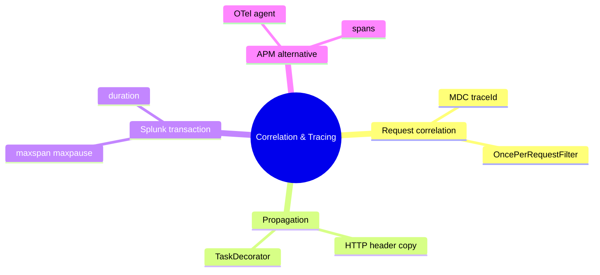
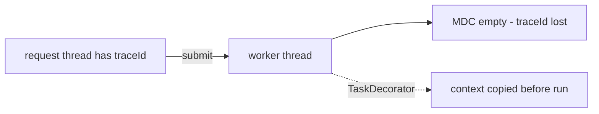
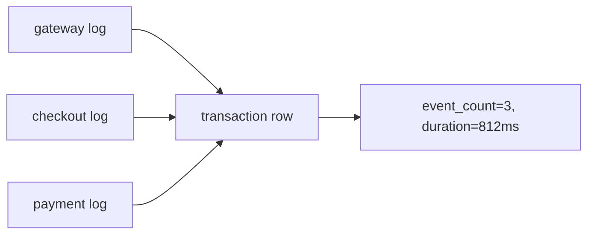
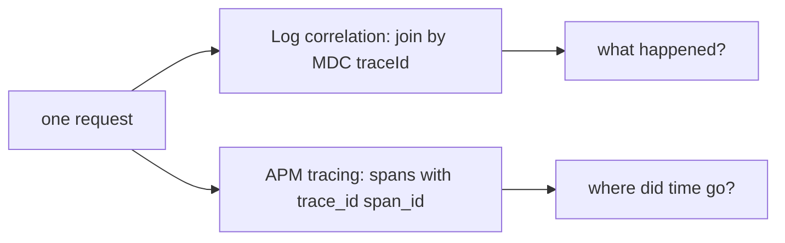

# Module 11: Correlation & Tracing

Est. study time: 1.5h
Language: en
Description: Correlate one request across Java services with MDC trace IDs, propagate them over HTTP, group results in Splunk with the transaction command, and compare log correlation to APM tracing.

## Knowledge Map



---

## Learning Objectives (maps to course CILOs)
- Explain how a request-scoped trace ID in the MDC links every log line of one request — serves CILO #3
- Implement correlation in Spring Boot with a OncePerRequestFilter and propagate the ID over HTTP — serves CILO #3
- Group correlated events with the SPL `transaction` command and its boundary options — serves CILO #4
- Compare log correlation with APM tracing and pick the right tool per question — serves CILO #5

---

## Real-World Example

A user reports a failed checkout. Support gives you one trace ID. The checkout service logged 40 lines, payment 60, an async email task 5. You search `index=main level=ERROR` — hundreds of events from every user. Which belong to this one failure? Without a shared identifier you cannot tell.

> **Think**: What single piece of data would pull exactly the events of one request across all three services?
>
> *Answer: A correlation ID — a traceId generated once per request, put in the MDC, and copied into outgoing HTTP calls so downstream services reuse it.*

---

## Core Content

### Section 1: Request Correlation with the MDC

Logback's MDC (Mapped Diagnostic Context) is a per-thread key-value map: values you put in it appear on every log line on that thread. In Spring Boot the idiomatic place to manage it is a `OncePerRequestFilter` — read an incoming header (`X-Request-Id` or `X-Trace-Id`) or generate a UUID, put it in the MDC, and clear it in a `finally` block so no ID leaks into the next request.

```java
public class TraceIdFilter extends OncePerRequestFilter {
    static final String TRACE_ID = "traceId";
    static final String HEADER = "X-Trace-Id";

    protected void doFilterInternal(HttpServletRequest req,
            HttpServletResponse res, FilterChain chain)
            throws IOException, ServletException {
        String traceId = req.getHeader(HEADER);
        if (traceId == null || traceId.isBlank()) {
            traceId = UUID.randomUUID().toString().replace("-", "");
        }
        MDC.put(TRACE_ID, traceId);
        try {
            chain.doFilter(req, res);
        } finally {
            MDC.remove(TRACE_ID);
        }
    }
}
```

Register the filter as a `@Component` and add `%X{traceId}` to the logback pattern — every line from that request now carries the field.

```text
HTTP request -> filter: read header or new UUID -> MDC.put(traceId)
  -> service logs all carry traceId -> finally: MDC.remove
```

> **Think**: Why must cleanup live in a `finally` block instead of right after `chain.doFilter`?
>
> *Answer: If the request throws, code after the call never runs and the thread leaks the trace ID into later requests. `finally` guarantees cleanup on the normal path and on exceptions.*

> **Cloze**: "A Spring Boot {OncePerRequestFilter} reads the incoming correlation header, stores the value in the {MDC}, and clears it in a finally block."
>
> *Answer: OncePerRequestFilter; MDC*

### Section 2: Propagation Across Services and Thread Pools

Propagation means Service A hands its traceId to Service B: an HTTP client interceptor reads the MDC and copies it into an outgoing header; the downstream filter reads that header back into its own MDC. That is how one request produces correlated logs across services.

```java
public class TraceIdInterceptor implements ClientHttpRequestInterceptor {
    public ClientHttpResponse intercept(HttpRequest req, byte[] body,
            ClientHttpRequestExecution exec) throws IOException {
        String traceId = MDC.get(TraceIdFilter.TRACE_ID);
        if (traceId != null) req.getHeaders().set(TraceIdFilter.HEADER, traceId);
        return exec.execute(req, body);
    }
}
```

**Async pitfall:** the MDC is thread-local, so a pool worker starts with an empty context and async log lines lose the trace ID. Fix by copying the context before the task runs — a `TaskDecorator` on `ThreadPoolTaskExecutor`, or logback's `ContextAwareExecutorService`.

```java
ThreadPoolTaskExecutor executor = new ThreadPoolTaskExecutor();
executor.setTaskDecorator(runnable -> {
    Map<String, String> ctx = MDC.getCopyOfContextMap();
    return () -> { MDC.setContextMap(ctx);
                   try { runnable.run(); } finally { MDC.clear(); } };
});
```



> **Think**: The task runs on the same JVM. Why does the worker not see the traceId you set before `submit`?
>
> *Answer: MDC storage is thread-local — a field of the current thread, not global state. The pool thread is a different thread and starts empty.*

> **Spot the Mistake**: A developer fixes async correlation with a static global `traceId` field. What breaks?
>
> *Answer: A static field is shared by all threads and requests. Concurrent requests overwrite each other, so log lines correlate to the wrong request — worse than no correlation.*

### Section 3: Splunk `transaction` — Grouping Correlated Events

On the Splunk side, `transaction` groups events sharing a field into one logical row.

```text
index=main sourcetype=app_logs
| transaction trace_id maxspan=30s maxpause=5s
```

Options: `fields` (grouping field), `maxspan` (window), `maxpause` (max gap), `maxevents` (event cap), `startswith`/`endswith` (boundaries). Events sharing `trace_id` collapse into one row with `event_count` and a `duration` field — that duration is the request span.



Full journey, slowest first:

```text
index=main sourcetype=app_log trace_id=7f3a2c99
| transaction trace_id maxspan=60s
| sort duration desc
```

> **Think**: A checkout takes 90 seconds but no two log lines are 20 seconds apart. With `maxspan=30s`, is it one transaction?
>
> *Answer: No. `maxspan` caps the total window at 30s, so the 90s request splits into several transactions. Raise `maxspan` past your longest request.*

> **Cloze**: "In `| transaction trace_id maxspan=30s maxpause=5s`, {maxspan} sets the total window and {maxpause} sets the maximum gap between events."
>
> *Answer: maxspan; maxpause*

> **Predict**: You run `transaction` on a million events; the search head slows, memory spikes. Why?
>
> *Answer: `transaction` buffers events in memory until boundaries close. Replace it with `| stats values(_raw) by trace_id` — lighter — or filter by the correlation field first.*

### Section 4: OpenTelemetry Alternative, Correlation vs Tracing

Log correlation joins lines by an MDC field; APM tracing rebuilds the request path from spans carrying `trace_id` and `span_id`. Correlation answers "what happened?"; tracing answers "where did the time go?". The Splunk OpenTelemetry Java agent auto-instruments Spring Boot, injects `trace_id`/`span_id` into logs, and exports spans via the OTel Collector. Set `OTEL_LOGS_EXPORTER=none` to disable log ingest.



> **Think**: You need the exact stack trace and log context of a slow payment call. Which do you open first?
>
> *Answer: The logs, filtered by trace_id, for the error context. Then APM for the latency breakdown, and drill from the slowest span back into its logs.*

> **Cloze**: "The OpenTelemetry Java agent injects {trace_id} and {span_id} into logs; set OTEL_LOGS_EXPORTER={none} to disable log ingest."
>
> *Answer: trace_id; span_id; none*

> **Predict**: You leave `OTEL_LOGS_EXPORTER` at its default (otlp). What changes?
>
> *Answer: The agent also exports log records over OTLP, adding a new ingest path. Set it to none if Splunk already ingests logs directly.*

> **Spot the Mistake**: Someone says `transaction` and APM tracing are interchangeable because both use `trace_id`. What's wrong?
>
> *Answer: They operate on different data. `transaction` groups logged events into rows; tracing builds a span tree with parent-child timings. Shared IDs make them complementary, not equivalent.*

---

### Why This Matters

Without a correlation ID, a 100-line failure is 100 unrelated lines. With `traceId` in the MDC, propagated across services, and grouped in Splunk, the whole request is one row: start, end, duration, every log. Get the filter or the async decorator wrong and you quietly correlate events to the wrong request — poisoning every dashboard above it.

---

## Key Takeaways
- MDC is thread-local: set `traceId` in a `OncePerRequestFilter` and clear it in `finally`.
- Propagate correlation by copying the MDC key into an outgoing HTTP header; the downstream filter reads it back.
- Thread pools lose the MDC — wrap tasks with a `TaskDecorator` or `ContextAwareExecutorService`.
- SPL `transaction` groups shared-field events into one row with `event_count` and `duration`; tune `maxspan`, `maxpause`, `startswith`/`endswith`.
- `transaction` is memory-heavy; use `stats values()`/`list()` or filter by the correlation field for large results.

---

## Common Misconception

Misconception: "Setting a header is enough — the logs will just know." Headers are not magic. Correlation works only when every link does its job: filter reads the header into the MDC, appender writes the field, interceptor forwards it, decorator restores it. Miss one link — especially async — and the chain silently breaks into wrongly-correlated logs.

---

## Spot the Mistake

You ship this to find slow checkouts:

```text
index=main sourcetype=app_log
| transaction trace_id maxspan=60 maxpause=20
| sort duration desc
```

It returns many single-event rows that are fragments of longer requests. What's wrong?

*Answer: A 2-minute checkout exceeds `maxspan=60`, so it is split in two. Raise `maxspan`, or use `startswith`/`endswith` boundaries to define the true start and end.*

---

## Feynman Explain

(Explain correlation to a child. You lose your keys in a mall. Security follows you across cameras by one thing: the colour of your shirt — the same shirt on every camera. The shirt colour is the trace ID; each camera frame is one log line. Change shirts or share a shirt and the cameras fail.)

---

## Reframe

(Judge log correlation: it answers "what happened?" but not "how long did each step take?" — that is APM's job. When does it break? Async work without a decorator drops the ID; a static-field shortcut correlates to whoever wrote last; unpropagated services cut the story at the service boundary. Counterargument: correlation is cheap and universal — every line, no agent — while tracing needs an agent and exporter. Write your evaluation: is MDC correlation enough, or do you need spans too?)

---

## Drill
- Trace `X-Trace-Id` from the browser into Service A's filter, into its logs, across an HTTP call to Service B, then into a thread pool.
- Write the SPL that shows the 10 slowest requests today, one row each, with event count.
- Explain to a colleague why their async logs lost the trace ID, plus the two fixes.

Take the quiz. MCQs test recall, application, and scenario angles.

Run: `learn.sh quiz <subject> <module-id>`