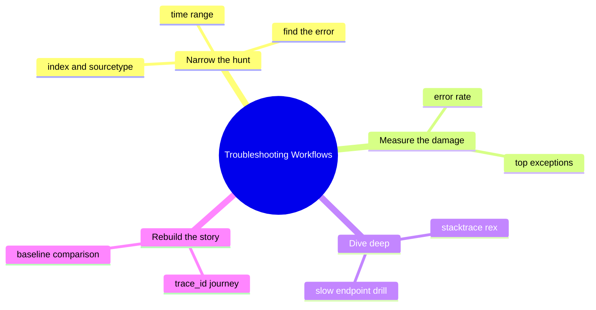
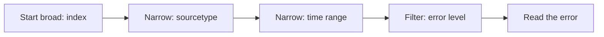
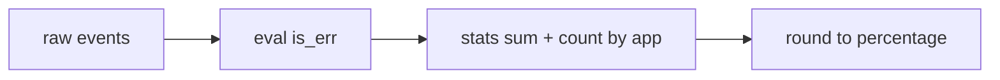
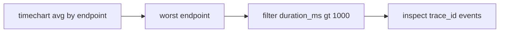

# Module 12: Troubleshooting Workflows

Est. study time: 1.5h
Language: en
Description: Systematic workflows for troubleshooting Java apps in Splunk — error triage, error-rate quantification, stacktrace analysis, latency drill-down, incident rebuild via trace_id, baseline comparison, and common anti-patterns.

## Knowledge Map



---

## Learning Objectives
- Narrow a search systematically (index, sourcetype, time) before investigating an error — serves CILO #2
- Quantify error rate and surface top exception classes with stats and rex — serves CILO #3
- Drill from a slow-endpoint chart into individual slow requests to find root cause — serves CILO #2
- Reconstruct a request journey across services from a trace_id and compare against a baseline window — serves CILO #4

---

## Real-World Example

Paging at 3am: payments Java service degraded. First instinct? Skip the filters, grab everything across all indices, scroll raw events. 10 minutes lost scrolling logs from three services and two load balancers before noticing the actual error line was sitting in `sourcetype=app_logs`.

> **Think**: Why did the broad search fail? What would you have done differently?
>
> *Answer: The wildcard index pulled in hundreds of event types, drowning the signal in noise. Narrowing first — one index, one sourcetype, one time window — made the error visible in seconds instead of minutes.*

---

## Core Content

### 1. Systematic Error Triage

Errors hide in noise. Work inward: pick the index, pick the sourcetype, set a tight time window, then filter for the error level.

```text
index=main sourcetype=app_logs level=ERROR earliest=-1h
```

Each clause removes an entire class of events. The index removes other apps' data. The sourcetype removes non-application logs. The time range bounds the window. The `level=ERROR` filter leaves only the signal.

```text
index=main sourcetype=app_logs level=ERROR earliest=-1h
```



> **Think**: Why does setting a time range first speed up a troubleshooting search?
>
> *Answer: Splunk searches only buckets that overlap the requested time range, so a tight window scans far fewer events and returns faster — and the error you need is usually recent anyway.*

> **Cloze**: "The first step of error triage is to pick an {index} and a {sourcetype} before hunting for the error line."
>
> *Answer: index, sourcetype*

> **Predict**: You search `index=main level=ERROR` with no time range. What happens to result count and speed?
>
> *Answer: Splunk scans all history, so the search is slower and returns every historical error. You lose the "what changed in the last hour" signal that pinpoints the current incident.*

### 2. Quantifying Error Rate

"Some errors" is not a metric. Turn raw events into numbers so you can say whether the app got worse.

```text
index=main sourcetype=app_logs
| eval is_err=if(level="ERROR",1,0)
| stats sum(is_err) as errors count as total by app
| eval error_rate=round(errors/total*100,2)
```

Every event gets a 1 or 0. `stats sum` counts errors, `count` counts everything, and the eval turns the ratio into a readable percentage.

```text
error_rate = errors / total * 100
```



> **Think**: Why flag each row with 1/0 instead of running two separate searches?
>
> *Answer: One pass over the data gives both numbers from the same events, so the ratio is internally consistent. Two searches risk different time windows or data skewing the percentage.*

> **Cloze**: "The eval `if(level="ERROR",1,0)` turns each event into a binary flag so `stats` can {sum} the errors and {count} the total."
>
> *Answer: sum, count*

### 3. Stacktrace Analysis

Splunk stores a Java stacktrace as a single multi-line event — the internal newlines survive, so the whole trace stays together. Extract the exception class and message with `rex`.

```text
index=main sourcetype=app_logs level=ERROR
| rex "Exception: (?<exception>[^\r\n]+)"
```

The `[^\r\n]+` captures everything up to the end of the first line — usually the exception message. To rank which exception dominates:

```text
index=main sourcetype=app_logs level=ERROR
| rex field=_raw "(?<exception_class>[\w.]+Exception)"
| stats count by exception_class
| sort -count
| head 5
```

The `[\w.]+Exception` named group matches any word-characters or dots ending in "Exception", so `NullPointerException` and `java.lang.OutOfMemoryError`-adjacent names like `IndexOutOfBoundsException` all match. `sort -count` (no space needed between the dash and field) puts the most frequent first.

```text
NullPointerException         3412
IllegalStateException         204
IndexOutOfBoundsException     189
```

> **Think**: Why does Splunk keep a stacktrace as one event instead of splitting it across lines?
>
> *Answer: Line breaks inside a log entry are preserved, so the event stays whole. This keeps the exception and its stack frames together for one `rex` extraction and one `stats count`.*

> **Spot the Mistake**: "I will search `level=ERROR`, extract exception classes, then trust the first dashboard tile showing the error graph."
>
> What's wrong?
>
> *Answer: The dashboard number may be stale or summarized. Before trusting any panel, check the raw events behind it — the source search, time range, and a couple of `_raw` samples. Dashboards are a starting point, not proof.*

> **Predict**: You add `| head 5` to the exception search. What changes in the output?
>
> *Answer: Only the five most frequent exception classes remain. The full ranked list is discarded, so you see the top offenders instantly but lose the tail of rare exceptions.*

### 4. Correlation, Baselines, and Anti-Patterns

Single-service searches miss distributed incidents. A `trace_id` ties events from every service into one journey.

```text
index=main trace_id=abc123 | sort _time
```

Sorting by `_time` replays the request across services in order: API gateway, order service, payments, database calls. For latency, find the slow endpoint first, then drill into its slow requests.

```text
index=main sourcetype=app_logs
| timechart avg(duration_ms) by endpoint span=5m
```

Spot the endpoint whose line climbs. Then drill into the worst endpoint:

```text
index=main sourcetype=app_logs endpoint=checkout
| where duration_ms > 1000
| sort -duration_ms
```

To detect a regression, run the same search against last week and compare:

```text
index=main sourcetype=app_logs earliest=-7d@d latest=now
| eval bucket=if(_time>=relative_time(now(),"-1d@d"),"today","past")
| stats count by bucket
```



Common anti-patterns: searching without an index filter, forgetting the time range, leading wildcards, and trusting a dashboard before checking raw events. When Splunk itself misbehaves, troubleshoot the tool with its own index.

```text
index=_internal log_level=ERROR
```

> **Think**: Why is `earliest=-7d@d latest=now` split into two buckets better than just eyeballing today's errors?
>
> *Answer: Same search, same fields, two time windows compared side by side. A bucket for today versus a bucket for the past week gives a numeric baseline, so a regression shows up as a ratio shift instead of a hunch.*

> **Predict**: You run `index=main trace_id=abc123 | sort _time` and the last event is a database timeout. What does that suggest?
>
> *Answer: The failure happened at the end of the journey, pointing to the database call rather than the gateway. The sorted sequence localizes the failing hop before you open any single service's logs.*

> **Cloze**: "A {trace_id} links events across services, and `sort _time` rebuilds the {request journey} in chronological order."
>
> *Answer: trace_id, request journey*

---

### Why This Matters

Downtime costs money and trust. A disciplined workflow — narrow, quantify, drill, rebuild — turns a 40-minute firefight into a 5-minute fix. Observability teams and on-call engineers live on these searches; getting the workflow wrong means slow MTTR and repeated pages. When your dashboard says everything is fine but users report errors, only raw-event verification saves you.

---

## Key Takeaways
- Narrow first: index, sourcetype, time range, then error level.
- Turn errors into numbers with `eval` + `stats` so the rate is comparable over time.
- Stacktraces stay whole events; one `rex` named group surfaces the exception class.
- A `trace_id` plus `sort _time` reconstructs the full request journey across services.
- Compare today against a baseline window; never trust a dashboard without checking raw events.

---

## Common Misconception

"More data helps — search everything." Searching with no index, no sourcetype, and no time range does not give you more signal, it buries the signal. The error line you need is one event in a hundred thousand. Broad searches are slower and harder to read, so the exact bug stays invisible. Correct framing: each narrowing filter removes a whole class of noise, and the remaining handful of events is where the answer lives.

---

## Spot the Mistake

This search is supposed to show the top 5 error types:

```text
index=main sourcetype=app_logs level=ERROR
| rex field=_raw "(?<exception_class>[\w.]+Exception)"
| stats count by exception_class
| sort -count
| head 5
```

Engineer complains it returns the top errors but cannot tell which exception dominates. What's wrong?

*Answer: Nothing structural — the search is correct. The confusion is in reading the output: `sort -count` (descending) plus `head 5` is exactly how you get the top five. If the engineer expected a different ordering, they are misreading `sort -count`, which sorts the count field in descending order, not ascending.*

---

## Feynman

Explain error triage to a child: you lost your toy in a big house. Do you search every room at once? No — you check the room you were in last, then the corner where you usually drop things, then the last ten minutes you remember having it. Splunk search is the same: pick the room (index), the corner (sourcetype), and the time you remember (earliest), then look for the thing that is wrong (level=ERROR). You find the toy faster because you stopped hunting everywhere.

---

## Reframe

Pause. Judge: is "narrow first" always right? When you do not know which service logged the error, a too-tight search can miss it entirely. Counterargument: narrowing is a first pass, not a cage. If the narrow search comes back empty, widen one step at a time — add a sourcetype, then an index, then expand the time range. The discipline is controlling the widening, not refusing to widen. Trade-off: precision costs coverage; workflow exists to make the widening deliberate instead of accidental.

---

## Drill

Take the quiz. MCQs test different angles — recall, application, scenario.

Run: `learn.sh quiz <subject> <module-id>`
