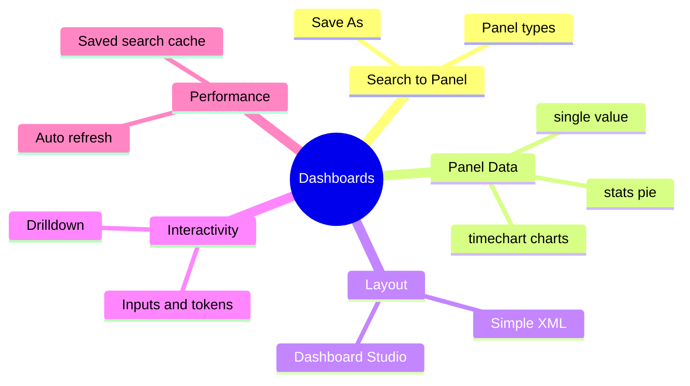

# Module 13: Dashboards

Est. study time: 1.5h
Language: en
Description: Turn saved Splunk searches into always-on dashboard panels for Java app monitoring — panel types, layout editors, dynamic inputs and tokens, drilldown, and performance.

## Knowledge Map



## Learning Objectives

- Build a dashboard from refined SPL, choosing the panel type that matches the data shape — serves CILO #8
- Compare simple XML dashboards with Dashboard Studio and use XML for versionable observability-as-code — serves CILO #8
- Wire dropdown inputs, tokens, and drilldown so one dashboard serves many apps and links to trace views — serves CILO #7
- Apply performance best practices — narrow panel searches, saved-search caching, deliberate auto-refresh — serves CILO #6

## Real-World Example

On-call for the checkout service. Every incident starts the same way: someone runs the same SPL by hand in Search, screenshots it, pastes the screenshot into Slack. No baseline, no shared view. When latency spikes, nobody can tell if it is new or normal.

> **Think**: Why does debugging stay slow even when the search results are correct?
>
> *Answer: The knowledge lives in one engineer's Search tab, not in a shared always-on view. Ad-hoc searches give a snapshot; a dashboard gives a living baseline everyone reads, so the spike becomes visible the moment it happens.*

## Core Content

### 1. From Search to Dashboard Panel

A dashboard is a set of panels; each panel runs its own SPL search when the page loads. Start from a search you trust, then Save As → Dashboard Panel, or build a new dashboard and add panels to it.

```text
Search app
   refine SPL ──> Save As ──> Dashboard Panel
       |
       └──> or: New Dashboard ──> Add Panel
                         |
                         v
          Chart | Table | List | Single Value
```

> **Think**: Why build panels from a saved search instead of retyping the query on the dashboard?
>
> *Answer: The dashboard re-runs the search on every load, so a panel is only as good as the query behind it. Reusing a refined, tested search avoids duplicating logic and keeps dashboards easy to audit.*

> **Cloze**: "The fastest way to turn a working search into a panel is {blank} → Dashboard Panel."
>
> *Answer: Save As*

### 2. Panels and the Searches That Feed Them

Panel type follows data shape. timechart produces time series → column/area/line chart. stats with a by clause produces categories → pie or bar. One number → single value with sparkline and trend indicator. Matching raw events → list.

```text
| timechart count by status         ->  column/area/line chart
| stats count by level              ->  pie chart
| stats latest(_time) as last_err   ->  single value + sparkline
level=error | head 20               ->  list of raw events
```

> **Think**: The pie needs one slice per log level; the line chart needs one line per status. What decides which panel renders what?
>
> *Answer: The final stats or timechart command shapes the result; the panel type maps that shape to a visual. timechart creates time buckets, stats creates categorical totals.*

> **Predict**: You feed a single value panel a search that returns 500 rows. What happens?
>
> *Answer: Single value expects one number; many rows make it show an error or an arbitrary value and the trend indicator becomes meaningless. Fix: collapse to one number with a terminal stats.*

> **Spot the Mistake**: A colleague says, "I will just swap `| timechart count by status` for `| stats count by level` inside my line chart." What's wrong?
>
> *Answer: stats has no time axis, so the line chart has nothing to plot over time. Use timechart for line, area, and column charts over time; use stats for pie or bar.*

> **Cloze**: "A {blank} command groups results into time buckets for line charts, while {blank} collapses results to categories or totals."
>
> *Answer: timechart ... stats*

### 3. Layout: Simple XML vs Dashboard Studio

Two editors render the same panels. Simple XML uses a grid of row and panel elements; the source is diffable, reviewable, versionable — observability-as-code. Dashboard Studio is a drag-drop canvas with visual styling and no source file.

```text
Simple XML                       Dashboard Studio
  <dashboard>                       drag-drop canvas
    <row>                           visual layout
      <panel>                       inline styling
        <title>Errors</title>       stored in the app
```

> **Think**: Your team wants dashboard changes reviewed in the same PR flow as Java code. Which editor fits?
>
> *Answer: Simple XML. The source sits in the repo, so changes are diffed, reviewed, and rolled back. Dashboard Studio state is stored in the app and is hard to review or diff.*

> **Cloze**: "A {blank} XML dashboard lays out panels on a grid with {blank} and {blank} elements."
>
> *Answer: simple ... row ... panel*

### 4. Dynamic Inputs, Tokens, and Drilldown

One dashboard serves many services. A dropdown input binds to a token; panel searches reference the token; the time picker is global. Drilldown: clicking a chart cell starts a search or navigates to another dashboard, passing tokens.

```text
<input type="dropdown" token="app">
  <choice value="checkout">checkout</choice>
</input>

panel search: index=main sourcetype=javalog app=$app$ level=error
click cell ──> drilldown ──> trace dashboard?traceId=$row.traceId$
```

> **Think**: The panel search uses app=$app$. Why the dollar signs on both sides?
>
> *Answer: The name between the dollar signs must match the input token name; Splunk substitutes it at runtime. A mismatch leaves literal text, the search matches nothing, and the panel silently shows no data.*

> **Predict**: You set auto-refresh to 5 seconds on every panel. What trade-off do you create?
>
> *Answer: Every panel runs a full search every 5 seconds for every viewer, multiplying search head load. Auto-refresh belongs on real-time ops screens; normal monitoring should refresh slowly or on demand.*

> **Predict**: A heavy dashboard runs wide searches on every load and feels slow. What makes first paint fast?
>
> *Answer: Back heavy panels with cached results from scheduled saved searches and keep panel searches narrow with small time ranges and indexed filters leftmost.*

> **Spot the Mistake**: A drilldown hard-codes the app name instead of passing the clicked value. What's wrong?
>
> *Answer: The drilldown loses the clicked context, so every click lands on the same view. Pass row tokens such as $row.app$ to keep the target panel relevant to what was clicked.*

> **Cloze**: "Clicking a chart cell is {blank}; it can launch a search or navigate to another dashboard while passing {blank}."
>
> *Answer: drilldown ... tokens*

## Why This Matters

A dashboard is the product your log pipeline ships. Java teams use them as the shared baseline for incidents, SLO tracking, and capacity planning. Get it wrong — bad chart choices, no inputs, heavy on-load searches — and you get a dashboard nobody trusts and everybody reloads.

## Key Takeaways

1. A dashboard is a set of panels, each running its own search on load.
2. Panel type follows data shape: timechart → chart, stats → pie or bar, one number → single value.
3. Simple XML is versionable and diffable; Dashboard Studio is visual but not code-reviewable.
4. Tokens and inputs make one dashboard serve many apps; drilldown links dashboards together.
5. Cache heavy panels behind scheduled saved searches and keep panel searches narrow.

## Common Misconception

Myth: a dashboard is just a saved search with nicer charts. Reality: panels re-run on every load, so query cost, time range, inputs, and caching decide whether the dashboard is useful or merely pretty. A slow, static, app-specific dashboard fails its real job — a shared, live monitoring view.

## Spot the Mistake

A panel search reads `index=main sourcetype=javalog | timechart count by level`. The author expects one line per HTTP status.

What's wrong?

*Answer: timechart count by level draws a line per log level, not per status. To plot HTTP status over time, bucket by the field that varies: `| timechart count by status`. Also filter leftmost to cut the event stream early.*

## Feynman

Explain to a kid: a dashboard is like a car's instrument panel. Every gauge is a search that runs continuously. Pick the right gauge for the measurement — a speedometer for one number, a line graph for how speed changes over time. If you know the car, you do not rebuild the gauges on every trip.

## Reframe

Judge: is one mega-dashboard ever right? Counter: a giant dashboard becomes scroll soup — slow to load, hard to scan, quick to ignore. Small focused dashboards per service or concern, linked by drilldown, beat it. The exception: a small ops wall with a few critical panels on auto-refresh. Dashboards are communication, not storage.

## Drill

Take the quiz. MCQs test panel types, XML vs Studio, tokens and drilldown, and performance.

Run: `learn.sh quiz <subject> <module-id>`
