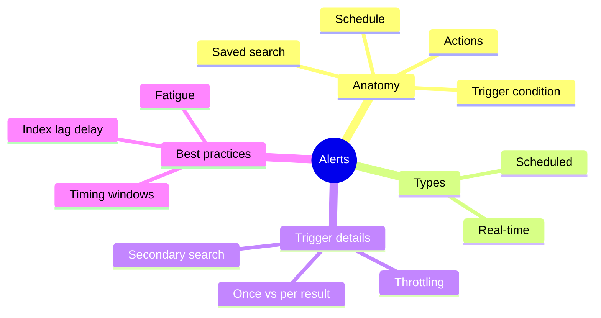
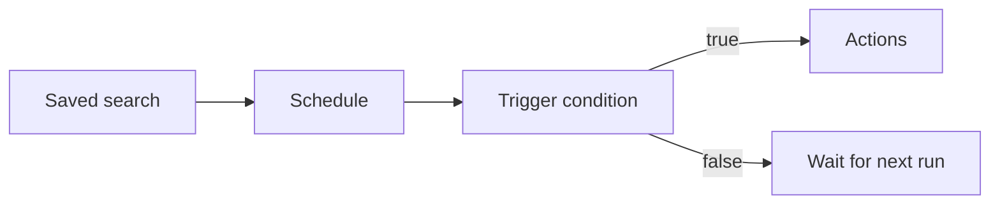
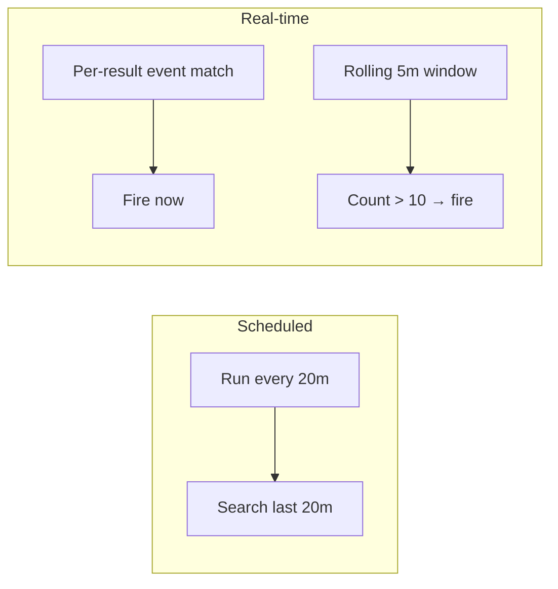
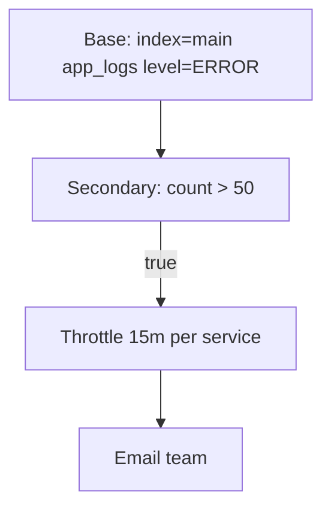
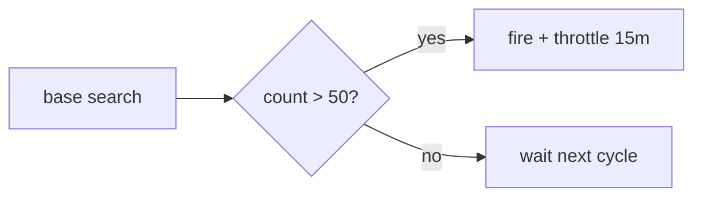
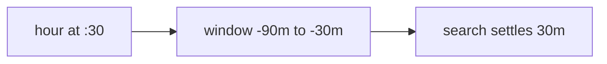

# Module 14: Alerts

Est. study time: 1.5h
Language: en
Description: Alerting for Java observability — alert anatomy, scheduled vs real-time alerts, trigger conditions and throttling, scheduling tips, actions, and beating alert fatigue.

## Knowledge Map



---

## Learning Objectives
- Explain the anatomy of a Splunk alert — saved search, schedule, trigger condition, actions — serves CILO #8
- Compare scheduled and real-time alerts and choose the right type for a Java service — serves CILO #8
- Configure trigger conditions, throttling, and schedule timing to avoid gaps and overlap — serves CILO #8
- Design symptom-based alerting with clear naming and runbooks to cut alert fatigue — serves CILO #9

---

## Real-World Example

You manage a Spring Boot checkout service. Your team spikes when load rises. Someone created an alert that emails the whole group every time a single ERROR log appears. By 10am inbox is 400 messages. Everyone mutes the channel. Two hours later a real outage hits and nobody notices — the pager wall went silent from exhaustion.

The problem wasn't alerting itself. It was alerting on every raw event instead of on a meaningful symptom. This module teaches you to build alerts that fire only when something is actually wrong.

> **Think**: Why did the team ignore the real outage even though alerts were firing?
>
> *Answer: Alert fatigue. Too many low-value alerts trained everyone to tune out, so the genuine signal got drowned in noise and muted.*

---

## Core Content

### Section 1: Alert Anatomy

Every alert has four parts bolted together:

1. **Saved search** — the SPL that collects the events you care about (base search).
2. **Schedule** — when and how often the search runs (cron or preset frequency).
3. **Trigger condition** — the rule that decides whether to fire (for scheduled alerts this is a secondary search).
4. **Actions** — what happens on fire: email, webhook, script, RSS, run a search.



> **Think**: Which two of the four parts decide *whether* an alert fires at all?
>
> *Answer: The schedule decides when the base search runs; the trigger condition decides whether firing happens. Actions only run after both are satisfied.*

> **Cloze**: "A Splunk alert is built from a {saved search}, a {schedule}, a trigger condition, and actions."
>
> *Answer: saved search, schedule*

> **Predict**: You raise an alert's saved search from every-minute to hourly. What changes — and what stays the same?
>
> *Answer: The schedule changes frequency and the time window it covers; the trigger condition and actions stay identical.*

### Section 2: Two Alert Types

**Scheduled alerts** run a search on a cron or preset frequency over a time window — for example every 20 minutes, searching the last 20 minutes. They are cheap, predictable, and fine for most Java error detection.

**Real-time alerts** run continuously. Two flavors:
- **Per-result** — fires the trigger each time a matching event streams in.
- **Rolling window** — fires when a condition holds over a sliding window, e.g. more than 10 matching events in 5 minutes.



Real-time is expensive: every event is evaluated as it indexes. Prefer scheduled unless a low-latency response is mandatory. One more catch: **per-result real-time is incomplete in HA** — if a search peer is down, results on that peer are missed. A rolling-window scheduled alert misses nothing.

> **Think**: Your jobScheduler uptime alert must page within 30 seconds of a dead node. Real-time or scheduled?
>
> *Answer: Real-time (per-result or tiny rolling window) — scheduled run every minute would add up to a minute of latency, which you decided is unacceptable.*

> **Predict**: You run a real-time per-result alert and one indexer replica dies. What happens to alert coverage?
>
> *Answer: Events on the down peer are never evaluated, so you miss alerts for that shard — coverage is incomplete until the peer recovers. Scheduled alert avoids this by re-searching across all peers.*

> **Cloze**: "Real-time alerts evaluate events {continuously} as they index, which is {expensive}; scheduled alerts run on a {frequency} over a {time window}."
>
> *Answer: continuously / expensive / frequency / time window*

### Section 3: Trigger Conditions and Throttling

A scheduled alert's base search collects results, then a **secondary search** evaluates them. If that secondary search returns any result, the trigger fires. Common condition: `search count > 10` after a `stats count` in the base.

Firing can be **once per search** (alert whenever the window's condition is true) or **once per result** (alert on each matching event).

**Throttling** is separate from the trigger condition. It *suppresses* repeats for a time period — optionally per field value — so you don't get paged 40 times. Example: fire when `count > 50`, then throttle so you hear at most once per 15 minutes *per* `service`.



> **Think**: A condition and a throttle both involve counts and time. How do they differ in role?
>
> *Answer: The condition decides the initial fire — is the threshold crossed? The throttle decides how often you may re-hear it afterward. You can have a strict condition plus a loose throttle.*

> **Cloze**: "Trigger {condition} says whether the alert fires; {throttling} suppresses repeats for a {time period}, optionally per {field value}."
>
> *Answer: condition / throttling / time period / field value*

#### Putting It Together: Error Alert

Put it together for the checkout service:

```text
Base search: index=main sourcetype=app_logs level=ERROR
Schedule:    every 10 min over last 10 min
Condition:   count > 50
Throttle:    once per 15 min by service
Action:      email on-call + webhook to PagerDuty
```



> **Think:** Why does the condition use `count > 50` rather than "any ERROR"?
> *Answer: a handful of errors is routine at scale. Only a burst beyond 50 signals a genuine incident. Using a threshold cuts noise without missing real problems.*

> **Cloze:** "The alert base search is {index=main sourcetype=app_logs level=ERROR}; the secondary condition evaluates {count > 50}; the throttle suppresses repeats for {15} minutes per service."
> *Answer: index search / count > 50 / 15*

### Section 4: Scheduling Tips and Actions

**Align schedule with window.** Coordinate the schedule frequency with the search time window to avoid gaps and overlaps. A 20-minute schedule should search the last 20 minutes.

**Add delay for indexing lag in distributed deployments.** Data takes time to show up. For an hourly alert, schedule the run later and look at an older window: cron 30 * * * * (at :30), with earliest `-90m`, latest `-30m`. This avoids missing events still indexing.

**Embed earliest/latest in SPL, not the UI.** Time range modifiers inside the saved search survive export and stay correct per run.



**Actions:** email, webhook, RSS, script, or run another search. Notifications can attach a results table or CSV/PDF. Alerts have per-team owners and permission — a shared alert with no owner dies silently.

**Alert fatigue:** start with symptom and SLO-based thresholds — error rate, latency, 5xx — not static CPU. Name alerts clearly, tie each to docs and a runbook link, so responders know the play.

> **Think:** Your hourly alert runs at :00 with a "last hour" window. Why might it miss events on a straggling indexer?
> *Answer: Indexing lag — events still buffered when the window closes are never searched, so the alert under-reports. Scheduling later with -90m/-30m absorbs that lag.*

> **Predict:** You embed a fixed time range in the UI and an analyst later changes the search to "last 24 hours." What breaks?
> The alert now scans a 24-hour window every run — overlapping windows, double-counting, and surprise fires.
> 
> *Answer: The alert loses its intended window; schedule and range no longer align, causing overlaps of overcounting.*

> **Spot the Mistake:** "I set aggression: threshold at any ERROR, throttle 0, real-time per-result, alert 20 people."
> What's wrong?
> 
> *Answer: Real-time per-result is costly and drops events on down peers; no throttle means a paging storm; alerting on raw events instead of a symptom buries the signal. Prefer scheduled symptom thresholds.*

---

## Why This Matters

Alerts are the difference between finding an incident in a dashboard and waking up to an empty pager. Done well, they turn your Splunk into a 24/7 sentinel for the Java services you own. Done badly, they produce alert fatigue that costs real response time during an outage. Every on-call rotation you have depends on the alert design here.

---

## Key Takeaways
- An alert = saved search + schedule + trigger condition + actions.
- Prefer **scheduled** alerts; use **real-time** only when low latency is mandatory, and accept HA gaps on per-result.
- Trigger condition is a secondary search; **throttling** is separate suppression you control.
- Align schedule frequency, window, and distributed delay (cron 30 * * * *, earliest -90m, latest -30m).
- Alert on symptoms/SLO, not raw events; name alerts and ship runbooks to beat fatigue.

---

## Common Misconception
"Real-time alerts are always better." Ironically real-time is *more* expensive and, per-result, drops coverage on a dead peer. Scheduled rolling windows give you an equivalent latency safety with much lower cost and full-coverage semantics over all peers. Prefer scheduled unless a hard low-latency SLO says otherwise.

---

## Spot the Mistake
A teammate writes: "I set an alert with condition `count > 0` and it pages me every 30 seconds all night." What went wrong?
What's wrong?
*Answer: `count > 0` is essentially "any event" — combined with no throttle it fires constantly. Condition should reflect a meaningful symptom (e.g. `count > 50`) and throttling should prevent repeat paging.*

---

## Feynman
Explain to a child: "An alarm watches your logs like a guard. You tell it when to look, then a rule, and how to call you. You tune it so it only shouts when something is really wrong, not for every pebble."

---

## Reframe
Judge: does symptom-based threshold reliably beat event count? Mostly yes, but a sudden spike of a silent runtime error won't show in a count of ERROR logs if you phrase it wrong. The heuristic is fine; the thin edge is careful SPL — the threshold only catches what the base search already finds.

---

## Drill
Take the quiz. MCQs drill scheduled vs real-time, trigger vs throttle, schedule timeline, and symptom thresholds.

Run: `learn.sh quiz splunk-java-observability 14-alerts`