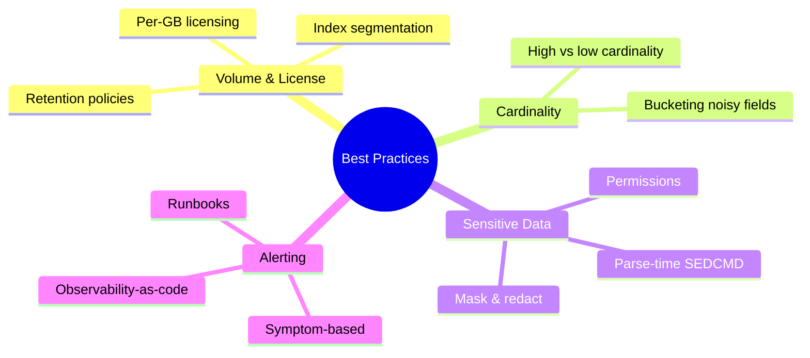
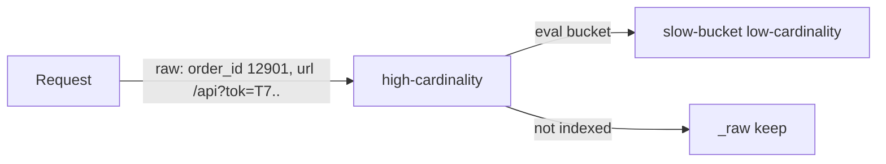
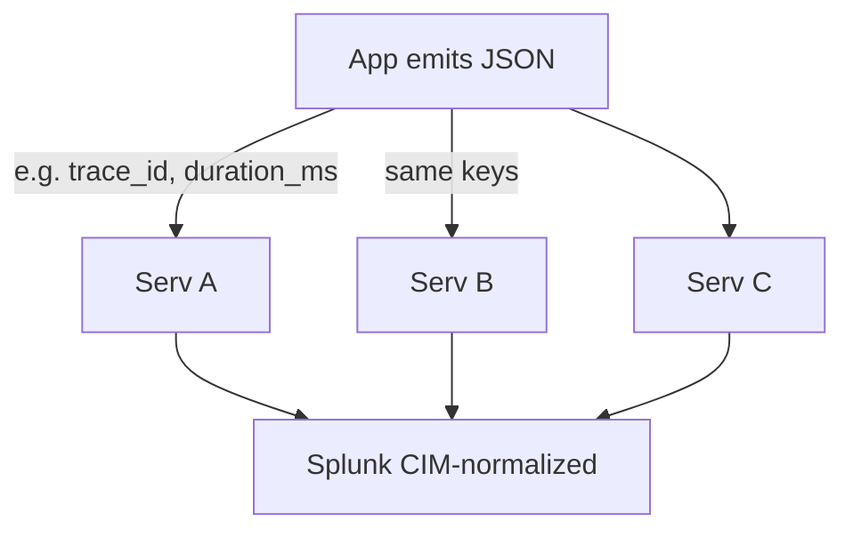

# Module 15: Logging & Alerting Best Practices

Est. study time: 1.5h
Language: en
Description: Production practices for Java logs into Splunk — volume & license control, cardinality, sensitive data, structured keys, and symptom-based alerting.

## Knowledge Map

---

## Learning Objectives

After this module you will be able to:
- Decide what to log and where to store it so volume stays within license limits — serves CILO #1
- Distinguish high-cardinality from low-cardinality fields and bucket noisy values correctly — serves CILO #2.
- Redact secrets, tokens, and PII before they reach Splunk — serves CILO #3.
- Design symptom-based alerts with documented runbooks and SLO burn detection — serves CILO #4.

---

## Real-World Example

Your team ships a Java service. Every request logs the full URL with query string, the exact timing float, and each order's 64-bit order id. On the last page-view, Splunk license count doubles overnight. The storage team bills back, finance asks why cost tripled, and `index=orders` is unsearchably slow.

> **Think**: Why did indexed volume explode while the code "only logs what it always logged"?
>
> *Answer: Logging output grew because each request emits high-cardinality fields — exact timestamps, URLs with query strings, unique order ids — which defeat TSIDX compression and stretch every indexed event. License is charged per GB/day indexed; more events of bigger events means more cost.*

---

## Core Content

### Volume & Licensing

Splunk Enterprise licenses per GB indexed per day. Every event stored costs money and disk. Rule: log only what you search. If you never write a search against a field, delete it before it leaves the JVM.

Segment by index and sourcetype: access, application, security each get own index. Set per-index retention — cold/frozen policies decide how long data lives. Hot recent data stays fast; old events age into cold and freeze out.

> **Think**: Access logs are searched every 5 minutes; debug logs only during incidents. Same storage tier?
>
> *Answer: No. Access index keeps higher retention with fast search; debug index can short retention and frozen sooner, saving license and storage.*

> **Cloze**: "Splunk licenses per {blank} indexed per day, so every event you never search still costs {blank}."
>
> *Answer: GB, money*

> **Predict**: You add a statement that prints every request body as JSON to app.log. What happens to license?
>
> *Answer: Indexed volume jumps; large bodies consume of tens of MB per day, pushing over license limit and triggering warning.*

### Cardinality Discipline

Cardinality = number of distinct values a field takes. Low (status, level) compress well and TSIDX query fast. High (request ids, exact timestamps, URL query strings, latency floats) fragment compression and blow up TSIDX.

Don't index noisy values. Bucket for analysis with `eval`: turn latency 214.3 ms into `bucket(_time, span)` or bin(latency_ms, 100). Keep original maybe in a non-indexed _raw; index only bucketed.

> **Think**: Why do exact timestamps, URLs, and latency floats kill TSIDX?
>
> *Answer: Each value differs per event — low compression, full scan. Bucket into ranges or status before indexing keeps index small.*

> **Cloze**: Fields with {high} cardinality destroy compression. {eval} buckets noisy values for analysis.
>
> *Answer: high, eval*

> **Spot the Mistake**: Dev logs `latency_ms` as six decimals and every full URL with user-supplied query string, thinking "more data = more observability".
>
> What's wrong?
>
> *Answer: Six-decimal floats and query-string URLs are high cardinality; they greedily consume compression and slow TSIDX. Bucket latency and strip query strings before logging.*

### Sensitive Data & Structured Discipline

Never log secrets, tokens, passwords, PII plaintext. Defense in depth: mask/redact at the *source* (in the JVM before emit), not only at parse time.

Splunk `props.conf` `SEDCMD` can scrub patterns at parse time — a safety net, not the primary. If the token is emitted to disk it sits in raw data and could leak via search or disk theft. Mask before logging.

Compliance: field-level access controls, index-level permissions, retention that honors PII requirements. See Splunk logging best practices: https://dev.splunk.com/view/logging-best-practices/SP-CAAADP6

Structured discipline: stable snake_case keys (`error.code`, `duration_ms`, `trace_id`, `user_id`), stable types. MDC for request context (trace id, user id). Choose parameterized logging — no string concat of values. Don't print objects without `toString` care (may leak internals).

Field standards + CIM: common names across services enable cross-service search; map to Common Information Model (CIM) fields for correlation.

> **Think**: You log `password=userPass!` in the JSON body. SEDCMD in props.conf redacts it. Is that safe enough?
>
> *Answer: SEDCMD may miss uncommon patterns, and raw bytes are already captured on disk. Never emit secrets at the source.*

> **Cloze**: Redact secrets at the {source}; props.conf {SEDCMD} offers parse-time scrub.
>
> *Answer: source, SEDCMD*

> **Predict**: Two services log user email differently — "customer_email" vs "custEmail". What breaks?
>
> *Answer: Cross-service search breaks; correlated queries fail. Standardize to common field schema or map to CIM.*

### Alerting Best Practices

Alerts signal real emergencies, not normal noise. Symptom-based — error rate, latency, SLO burn — beats static resource thresholds (e.g. "CPU > 80") that false-positive constantly.

Each alert document + runbook. Observability-as-code: alerts and dashboards live in version control, reviewed in PRs. Iterate: review template noise, tune threshold, delete closed alerts.

Level discipline: ERROR only actionable failures; WARN recoverable; INFO normal lifecycle; DEBUG never ships prod by default. No logging inside hot loops at high cardinality; for extreme volumes use sampling.

> **Predict**: Team sets static CPU threshold 80% for each VM. Nightly backup pushes CPU to 90%. What happens to paging? Team ignores alert, misses real outage.
>
> *Answer: False alert every night → alert fatigue; real outage missed. Switch to symptom-based SLO burn or error-rate alert.*

> **Cloze**: Alerts should be {symptom}-based, not static {resource} thresholds. Document each alert with a {blank}.
>
> *Answer: symptom, resource, runbook*

> **Spot the Mistake**: An alert fires on a hard-coded static CPU percent with no runbook, paging on-call every night.
>
> What's wrong?
>
> *Answer: Static threshold becomes a dead alarm with no runbook. Measure SLO burn and error rate, add runbook, tune or delete.*

---

### Why This Matters

License per GB/day decides your bill. Cardinality decides whether search is fast or crawls. Secrets in logs = security incident + compliance breach. Alerts either stop incidents or destroy trust with noise. Getting these right is the difference between Splunk as safety net and Splunk as a giant cost.

---

## Key Takeaways

- License per GB/day; log only what you search; segment by index.
- High cardinality kills compression/TSIDX; use eval bucketing.
- Redact secrets & PII at source; SEDCMD only safety net.
- Standard field names + CIM enable cross-service correlation.
- Alerts: symptom-based, documented, in version control, iterate.

---

## Common Misconception

"More logs = more observability." Wrong. Volume without searchable structure costs money and slows queries. Removing junk or moving it to raw non-indexed improves both.

---

## Spot the Mistake

Wire trace masquerading as debug ships to prod with `token=Bearer...` in the MDC and `toString()` dumping a request object with credentials.

What's wrong?

*Answer: Secrets at source in the event; object toString leaks fields; DEBUG shipped to prod. Fix: redact mask on, secure toString, debug scoped out in prod config.*

---

## Feynman Explain

(Tell how to log well to a child. Log only what matters, in small useful pieces. Use buckets for big noisy numbers, never write passwords. Raise alarm only when the house is really on fire, not for every flicker.)

---

## Reframe

(Judge: does per-GB cost ever force hiding incidents to save budget? Real tension. Counter: documented retention and curated volume serve both observability and cost long-term.)

---

## Drill
Take the quiz. MCQs test recall, application, scenario.

Run: `learn.sh quiz splunk-java-observability 15-best-practices`