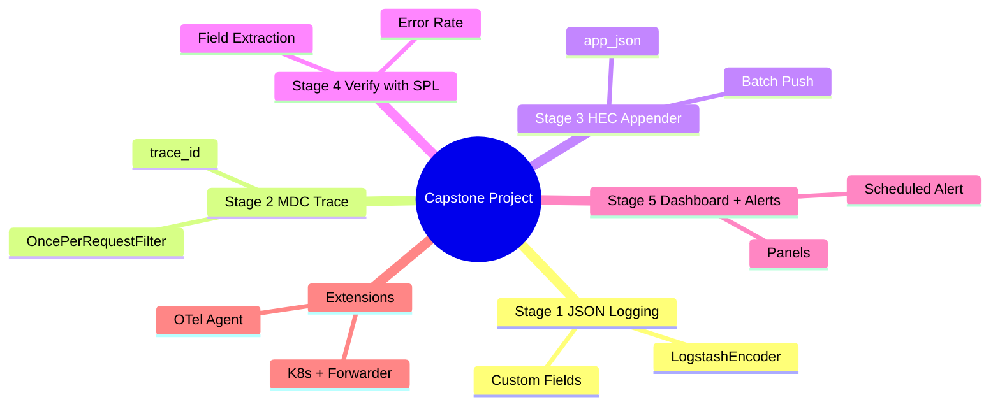
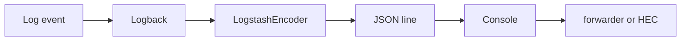
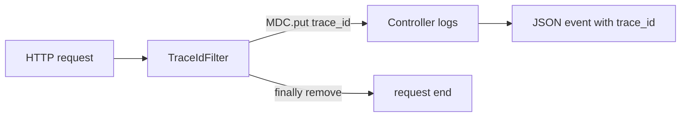
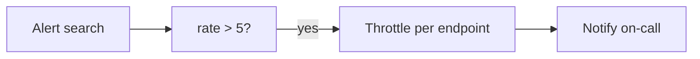
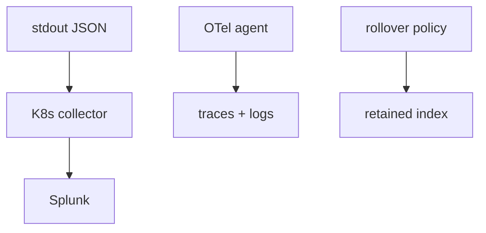

# Module 16: Capstone Project

Est. study time: 1.5h
Language: en
Description: Hands-on capstone: instrument a Spring Boot service end-to-end with Splunk — structured JSON logging, MDC correlation, HEC streaming, SPL verification, dashboard, alerts.

## Knowledge Map



---

## Learning Objectives

- Instrument a Spring Boot service with structured JSON logging — serves CILO #1
- Correlate logs per request using MDC trace IDs — serves CILO #2
- Stream events to Splunk Enterprise via the HEC appender — serves CILO #3
- Verify, visualize, and alert on the pipeline using SPL — serves CILO #4

---

## Real-World Example

Nightly incident: checkout API fails at 3am. On-call sees only raw text lines in Splunk — cannot tell which request failed, which endpoint is slow, or how many users hit errors.

> **Think**: Why is this hard to diagnose? What one change answers all three questions?
>
> *Answer: Logs were unstructured, with no correlation ID and no latency field. Structured JSON (service, env, trace_id, duration_ms, level) makes each line queryable.*

---

## Core Content

### Stage 1: Structured JSON Logging

Add logstash-logback-encoder, then configure logback-spring.xml so every line leaves the app as JSON:

```groovy
implementation 'net.logstash.logback:logstash-logback-encoder:8.0'
```

```xml
<appender name="JSON" class="ch.qos.logback.core.ConsoleAppender">
  <encoder class="net.logstash.logback.encoder.LogstashEncoder">
    <customFields>{"service":"checkout","env":"dev"}</customFields>
    <includeMdcKeyName>trace_id</includeMdcKeyName>
    <includeMdcKeyName>user_id</includeMdcKeyName>
  </encoder>
</appender>
```

customFields pins fixed dimensions; includeMdcKeyName whitelists MDC keys into top-level JSON fields.



> **Think**: Why put service and env in customFields instead of hardcoding them into every message?
>
> *Answer: One query (`service=checkout env=dev`) slices the whole estate without string matching, and the fields survive refactors.*

> **Cloze**: "The encoder that emits structured events as JSON is the {blank}."
>
> *Answer: LogstashEncoder*

> **Predict**: You log `log.info("order={} status={}", orderId, "PAID")`. Why does `order=42` resolve in Splunk with no extraction rule?
>
> *Answer: The encoder parses message key=value pairs into indexed fields.*

### Stage 2: MDC Correlation

Stamp one trace_id per request into the MDC, cleared in finally:

```java
@Component
public class TraceIdFilter extends OncePerRequestFilter {
  protected void doFilterInternal(HttpServletRequest req, HttpServletResponse res, FilterChain chain) throws IOException, ServletException {
    String traceId = req.getHeader("X-Trace-Id");
    if (traceId == null || traceId.isBlank()) traceId = UUID.randomUUID().toString().replace("-", "").substring(0, 16);
    MDC.put("trace_id", traceId);
    res.setHeader("X-Trace-Id", traceId);
    try { chain.doFilter(req, res); } finally { MDC.remove("trace_id"); }
  }
}
```

includeMdcKeyName puts trace_id on every log line of the request.



> **Think**: Why remove trace_id in finally rather than at the end of the happy path?
>
> *Answer: Thread pools reuse threads; a leaked trace_id mislabels the next request. finally guarantees cleanup even on exceptions.*

> **Cloze**: "The per-thread map that carries context such as trace_id is the {blank}."
>
> *Answer: MDC (Mapped Diagnostic Context)*

> **Predict**: You skip the finally block under Tomcat's thread pool. What does Splunk show?
>
> *Answer: Two requests sharing one thread show the same trace_id, merging unrelated events into one fake transaction.*

> **Spot the Mistake**: Developer says the filter is unnecessary because "Splunk adds its own trace_id when indexing."
>
> What's wrong?
>
> *Answer: Splunk only indexes what is sent; it never invents correlation. Without MDC each line is an orphan with no shared key.*

### Stage 3: HEC Appender

Stream events directly from Logback to Splunk:

```groovy
implementation 'com.splunk.logging:splunk-library-javalogging:1.11.8'
```

```xml
<appender name="SPLUNK" class="com.splunk.logging.HttpEventCollectorLogbackAppender">
  <url>https://splunk.local:8088</url>
  <token>11111111-2222-3333-4444-555555555555</token>
  <index>checkout</index>
  <sourcetype>app_json</sourcetype>
  <messageFormat>json</messageFormat>
  <batch_size_count>100</batch_size_count>
  <batch_interval>5000</batch_interval>
</appender>
```

batch_size_count and batch_interval buffer events and post them in groups.


> **Think**: Why run both a console JSON appender AND the HEC appender?
>
> *Answer: Console keeps local visibility; HEC streams to Splunk. Same format, two outputs, swap either without code changes.*

> **Cloze**: "The appender that posts batched events to Splunk over HTTP is the {blank}."
>
> *Answer: HttpEventCollectorLogbackAppender*

> **Spot the Mistake**: Events land in Splunk but each line is one unparsed message field; level and duration_ms are missing.
>
> What's wrong?
>
> *Answer: messageFormat=json is missing, so the appender wrapped raw text instead of JSON. Set it and keep LogstashEncoder upstream.*

### Stage 4: Generate Traffic and Verify with SPL

A controller logs at several levels and emits duration_ms:

```java
@RestController
public class CheckoutController {
  Logger log = LoggerFactory.getLogger(CheckoutController.class);

  @GetMapping("/api/checkout/{orderId}")
  public String get(@PathVariable String orderId) {
    long t = System.currentTimeMillis();
    log.info("checkout order={} region=eu", orderId);
    log.info("checkout duration_ms={} endpoint=checkout-get", System.currentTimeMillis() - t);
    return "ok";
  }

  @GetMapping("/api/checkout/fail")
  public String fail() {
    log.warn("simulated warn order=0");
    throw new IllegalStateException("payment gateway timeout");
  }
}
```

Generate load, then verify:

```bash
for i in $(seq 1 50); do curl -s localhost:8080/api/checkout/$i; done
curl -s localhost:8080/api/checkout/fail
```

```spl
index=checkout sourcetype=app_json
index=checkout sourcetype=app_json | stats count by level
index=checkout sourcetype=app_json | stats avg(duration_ms) by endpoint | sort - avg(duration_ms)
index=checkout sourcetype=app_json level=ERROR | timechart count by endpoint
```

Confirm status, duration_ms, trace_id appear as fields and _time parses the JSON timestamp.


> **Think**: How do you turn `| stats count by level` into a per-endpoint error rate?
>
> *Answer: Group by endpoint and compute a ratio: `count(eval(level="ERROR"))` as errs over `count` as total, then `eval rate=errs/total`.*

> **Predict**: The fail() endpoint throws, but the stack trace lacks trace_id. Why?
>
> *Answer: The exception escaped before the filter context, or the logger skipped the MDC. Log it inside the request context, e.g. via @ControllerAdvice.*

> **Cloze**: "A time-based count of ERROR events is `index=checkout sourcetype=app_json level=ERROR | {blank}`."
>
> *Answer: timechart count*

### Stage 5: Dashboard and Alerts

Dashboard from three saved searches:

- Single value: total ERROR count, last 24 hours.
- Timechart: requests by status (`timechart count by status`).
- Table: top exceptions (`| stats count by message | sort - count | head 10`).

Error-rate alert, throttled per endpoint:

```spl
index=checkout sourcetype=app_json
| stats count(eval(level="ERROR")) as errs count as total by endpoint
| eval rate = round(errs/total*100, 2)
| where rate > 5
```

Schedule every 5 min, throttle 30 min per endpoint, paste a runbook into the description.



> **Think**: Why throttle per endpoint rather than globally?
>
> *Answer: One broken endpoint should not page for every endpoint; the throttle fires once per broken service.*

### Stage 6: Acceptance Checklist and Extensions

Accept when all pass:

- service, env, level, trace_id, duration_ms present as fields.
- trace_id spans every line of one request, unique per request.
- Events arrive within the batch window; _time is event time, not index time.
- Error-rate query, slowest-endpoint query, and dashboard render.
- Alert fires on injected errors and throttles per endpoint.

Extensions: on K8s log JSON to stdout and ship with Splunk Connect or a forwarder; replace the filter with the OpenTelemetry agent; add daily roll plus retention.



> **Think**: On K8s, why prefer stdout plus collector over embedding the HEC token in the image?
>
> *Answer: The token lives in cluster config, not the image, so deploys survive URL and token rotation.*

> **Cloze**: "Moving from direct HEC to stdout plus a collector is a form of {blank} from the transport."
>
> *Answer: decoupling*

---

### Why This Matters

This capstone assembles modules 1-15 into one pipeline: emit, correlate, transport, verify, alert. The same shape runs production checkout flows and cuts diagnosis from hours to minutes. Get the order wrong and you chase phantom fields when you need them most.

---

## Key Takeaways

- JSON at source makes events queryable with zero parsing effort.
- One trace_id per request, cleared in finally, groups the whole request.
- HEC batches events; batch settings tune throughput and freshness.
- Verify with stats and timechart before building dashboards.
- Alerts need throttling and a runbook, or they become noise.

---

## Common Misconception

Misconception: "Splunk auto-extracts everything, so log format does not matter."

Wrong: Splunk extracts only what it can infer; unstructured text stays one blob. Structured JSON guarantees fields (status, duration_ms, trace_id) the moment events land.

---

## Spot the Mistake

Events exist but the "requests by status" panel is empty.

Possible cause: the panel references a field never extracted — `status` was logged only inside the message body, so `timechart count by status` renders nothing.

What's wrong?

*Answer: The panel assumes a field the pipeline never produced. Emit status as a structured field; the panel fills.*

---

## Feynman

To a child: the app writes a note each time it does something, in a language Splunk understands — boxes labeled who, what, how long. Each visitor carries a secret number on every note, so you can find all their notes. A bell rings when too many notes are sad (errors).

---

## Reframe

Is direct HEC right? It couples logging to Splunk uptime; if Splunk is down the appender buffers and retries but can drop. Fine for a small service. At scale the stdout plus collector pattern wins. Verdict: right default for classroom and small services; revisit at scale.

---

## Drill

MCQs test pipeline order and failure diagnosis.

Run: `learn.sh quiz <subject> <module-id>`