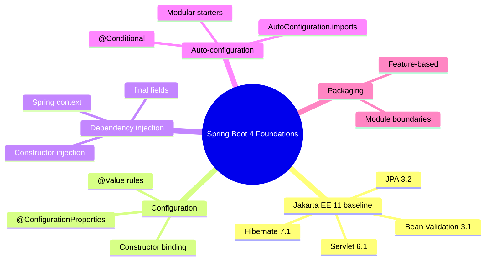
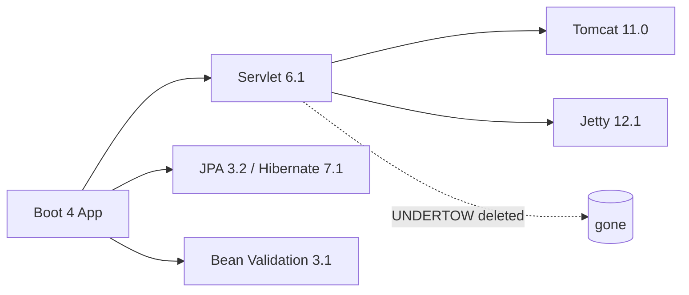
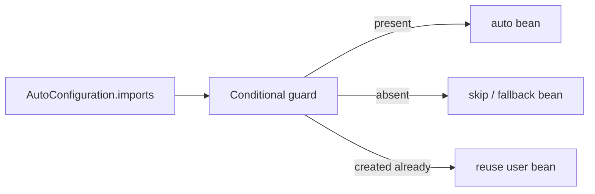

# Module 01: Spring Boot 4 Foundations

Est. study time: 1.5h
Language: en
Description: Boot 4 pull-through. Jakarta EE 11, feature packaging, config properties, constructor DI, auto-config.

## Knowledge Map



---

## Learning Objectives
- Explain Boot 4's Jakarta EE 11 baseline and what the server switch implies
- Prefer `@ConfigurationProperties` over `@Value` and bind with constructor injection
- Explain auto-configuration and conditionals
- Recognize modular starters vs classic starters
- Apply feature-based packaging to a real service

---

## Real-World Example

Your team runs a payments service on Spring Boot 3.4 with 2.3M lines. A new senior joins and asks: "Why do all controllers reference `paymentService` directly? Why is config scattered across `@Value` fields in 40 classes?" Nobody knows. A sprint later, the platform team forces a Boot 3 → 4 upgrade. The build explodes: Jackson class not found, CSRF 403s, a removed `authorizeRequests()`. The upgrade looks like whack-a-mole, not engineering.

> **Think**: Why did the upgrade hurt so much? What conventions would have made it boring?
>
> *Answer: Config-mechanics scattered (`@Value`), hidden framework couplings, and missing module boundaries turn a version bump into archaeology. Boot 4 makes boring upgrades possible by codifying the conventions.*

---

## Core Content

### Section 1: The Jakarta EE 11 Baseline

Boot 4 sits on **Jakarta EE 11**: Servlet 6.1, JPA 3.2, Bean Validation 3.1, Hibernate 7.1. The container default is Tomcat 11.0.x; Jetty 12.1.x is supported. **Undertow is gone** — it never caught up to Servlet 6.1.

Why Berth: EE 11 is the first baseline where the platform treats virtual threads and modern records as normal.



> **Think**: Your team pins `spring-boot-starter-web`. You swap Tomcat for Undertow with two lines like you did in 3.x. What happens?
>
> *Answer: Boot 4 ships no Undertow support at all. The swap silently fails (or needs a new artifact you do not have). Always check `spring-boot-starter-web[4.x]` server support before choosing.*

> **Cloze**: "Boot 4's baseline is {Jakarta EE} 11, which brings Servlet 6.1, JPA 3.2, and Bean Validation 3.1."
>
> *Answer: Jakarta EE*

### Section 2: Feature-Based Packaging

Pack by feature, not by layer. A `booking` feature owns its controller, service, repository and DTOs in one package tree, visible at a glance.

Why: layered packages (`controllers/`, `services/`, `repositories/`) force you to hop across the tree to understand one flow. Feature packages make a flow a single subtree, and make Boot 4 modularization (Module 02) tractable — a feature maps cleanly onto a module boundary.

**Example:**
```text
orders/
  OrderOrderController.java
  OrderService.java
  OrderRepository.java
  graphql/OrderFetcher.java   (DGS 12)
```

> **Predict**: Refactor `controllers/`, `services/`, `repositories/` packages into feature packages. What happens to a typical cross-cutting change, e.g. "add trace id to every order call"?
>
> *Answer: Touches fewer files per change: the whole flow lives under one package, so the edit set shrinks and diff review gets easier.*

### Section 3: @ConfigurationProperties Over @Value

Prefer typed config properties over `@Value`. In Boot 4, **binding to public fields is removed** — you use private fields + accessors, or constructor binding with immutable records. `@ConfigurationPropertiesSource` is a build-time hint for the config processor (no runtime effect), telling it which annotation marks homes for properties.

Why: typed properties become a compile-checked contract. `@Value("${payment.timeout}")` is a string-typed guess that fails at runtime, scattered and typo-prone.

> **Cloze**: "Bind config to an immutable {record} via constructor binding rather than mutable public fields, which Boot 4 no longer supports."
>
> *Answer: record*

```record
/** payment.timeout (ms), payment.retry-max */
@ConfigurationProperties(prefix = "payment")
public record PaymentProps(int timeout, int retryMax) {}
```

> **Think**: `@Value("${payment.timeout}")` vs `PaymentProps`. Which fails at what time?
>
> *Answer: `@Value` fails at runtime when the property is missing or misspelled. Constructor-bound properties fail at startup binding with a clear message and give you IDE autocomplete plus unit tests.*

> **Spot the Mistake**: A colleague brags: "I wrote `@Value` for everything, it's faster to add." The app boots green in QA, then production dies with `Could not resolve placeholder 'payment.timeoute'`. What went wrong?
>
> What's wrong?
>
> *Answer: `@Value` defers configuration errors to runtime and hides them behind a typo. Constructor-bound `@ConfigurationProperties` validates the whole prefix at startup — the failure would have been caught in CI.*

### Section 4: Constructor Injection with Final Fields

Inject required collaborators through the constructor, never field injection. Mark fields `final`, use records for value objects, let the container do the wiring. Boot 4's JSpecify-annotated code (Module 08) makes nullability explicit at compile time, so a missing bean shows up sooner.

Why: constructor injection makes dependencies explicit and testable — you construct the object with plain `new` and no Spring in unit tests. Field injection hides dependencies and secretly relies on reflection.

### Section 5: Auto-Configuration & Conditionals

Boot's magic is **conditional auto-configuration**: a class annotated `@AutoConfiguration` is loaded from `META-INF/spring/AutoConfiguration.imports` only if its `@Conditional` guards pass (class present, property set, bean absent). In Boot 4, autoconfigure has been split into small modules (Module 02) and everything is AOT-processed, but the mechanism is the same: imports file + conditions.



> **Predict**: You define your own `ObjectMapper` bean while `spring-boot-jackson` (Jackson 3) is on the classpath. Does Boot auto-config overwrite it?
>
> *Answer: No — `@ConditionalOnMissingBean` says the auto-configured `JsonMapper` backs off. Your bean wins. Auto-config respects user beans.*

### Section 6: Modular Starters

Boot 4 keeps classic starters (they still work) but adds **modular starters**: small focused artifacts like `spring-boot-jackson-module` or `spring-boot-autoconfigure-modules` you pull in per concern. JPA/Hibernate and validation now live in separate autoconfigure modules. This shrinks startup and integrates with AOT/native (Module 02).

> **Think**: Why does Boot 4 split one fat autoconfigurer into many focused modules? What problem does that solve for a 2× stack?
>
> *Answer: Smaller, dependency-light modules: you only pull the auto-config you use, which trims startup, eases native/AOT, and removes classpath bloat.*

---

### Why This Matters

Boot 4 multiplies surface: servers dropped, Jackson 3, Security 7 defaults. The disciplines in this module — explicit config, constructor DI, feature packaging, conditional understanding — are what make the version jump cheap. Get them wrong and every future upgrade is archaeology.

---

## Key Takeaways
- Boot 4 = Jakarta EE 11; Undertow is gone
- `@ConfigurationProperties` with constructor binding, not `@Value` or public fields
- Constructor injection with final fields
- Auto-config: imports file + conditionals, user beans win
- Feature packages map cleanly onto modular starters

---

## Common Misconception

"Boot 4 is a minor bump like 3.x." It is not: Jackson 3 (`tools.jackson` package), JSpecify, Security 7, and module splits change how you write code, not just versions. Treat it as a framework generation, budget time, read migration notes (Module 02).

---

## Spot the Mistake

```java
@Configuration
@EnableConfigurationProperties(PaymentProps.class)
class PaymentConfig {
    @Bean PaymentGateway gateway(@Value("${payment.gateway.api-key}") String key) {
        return new PaymentGateway(key);
    }
}
```
A teammate says: "This is fine — `@Value` is only for secrets, so it's OK to keep here."

What's wrong?

*Answer: Two errors. (1) Secrets should never exist as plain properties — use a secret manager and map it into a typed property object. (2) `@Value` in a bean method has the same startup-vs-runtime lookup, so the mistake still applies: put `api-key` into `PaymentProps` and inject the property object.*

---

## Feynman Explain
Explain to a child: "Spring Boot 4 starts an app, reads a config card, builds only the things it needs, and wires them without you shouting." Use the payments flow as the concrete example. No jargon. Do NOT move on until it holds.

---

## Reframe
Judge: "feature-based packaging + modular starters" — does this genuinely help a 2-person library, or just look tidy? When does the indirection cost more than it saves? Write your evaluation.

---

## Drill
Run: `learn.sh quiz spring-boot 01-spring-boot-4-foundations`