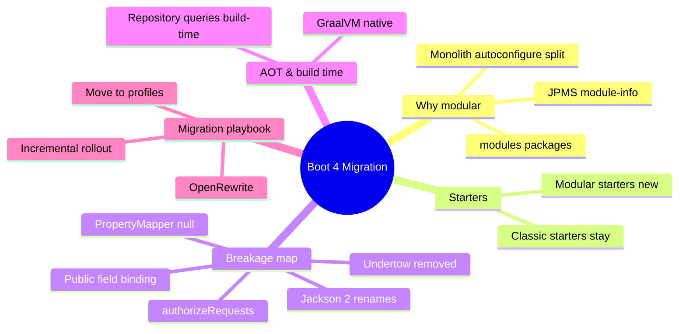

# Module 02: Boot 4 Migration & Modularization

Est. study time: 1.5h
Language: en
Description: Boot 4 upgrade path. Modular autoconfigure, starter tradeoffs, breaking changes, OpenRewrite.



## Learning Objectives

- Explain why Boot 4 splits spring-boot-autoconfigure into small modules and what it changes for you
- Decide between classic and modular starters for a service
- Predict which 3.x code breaks in 4.0 and why
- Fix PropertyMapper and binding behavior that changed
- Apply a safe, incremental migration plan with OpenRewrite

## Real-World Example

Your team ships a 3.x monolith using Hibernate, validation, and a custom RestTemplate call. You bump the parent to 4.0 and the build explodes: a package no longer exists, a property silently stops binding, and one method signature vanished. Nobody changed any business code. That is the whole point of a major release: **Boot 4 removed the safety nets you did not know you leaned on.**

> **Think**: Why does a framework risk breaking thousands of apps to modularize internals you never touch?
>
> **Answer**: Because the old monolithic autoconfigure jar forced every app to carry code for features it never used. Small modules let you ship, start, and scan far less. The cost is a one-time migration, paid once across the ecosystem.

## The Big Split

For years `spring-boot-autoconfigure` was one giant jar containing auto-configuration for every supported technology. Boot 4 breaks it into small, focused modules living under `org.springframework.boot.modules`. Each module knows one technology: JPA, Hibernate, validation, data source pooling, and so on. Framework 7 goes further and ships real JPMS `module-info.java` descriptors.

What this means practically:

- Your runtime classpath now contains only the modules your dependencies actually pull in
- Startup and component scanning get faster because fewer candidate bean definitions load
- Library authors build against narrow modules instead of the kitchen sink

> **Think**: If autoconfigure is now per-technology modules, what tells the app which modules to activate?
>
> **Answer**: The module graph is driven by dependencies. Pull `spring-boot-starter-data-jpa` and its autoconfigure module lands on the classpath; drop it and that configuration vanishes entirely. Configuration follows the classpath.

## Classic vs Modular Starters

Two starter flavors now exist:

| Flavor | Example | Tradeoff |
|---|---|---|
| Classic aggregate | `spring-boot-starter-web` | Pulls a tree of dependencies; zero thought, works everywhere |
| Modular | a starter dedicated to one autoconfigure module | Smaller footprint; you assemble more starters yourself |

The classic starters remain fully supported in 4.0 — compatibility first. Modular starters exist for teams that want the smallest possible runtime and are migrating deliberately.

> **Think**: Which apps should bother picking modular starters?
>
> **Answer**: Anything where binary size or startup latency is a hard constraint: GraalVM natives, serverless functions, microservices counted in MB. Ordinary monoliths should stay on classic starters and enjoy the same 4.0 improvements with no extra effort.

{We call the manual, small-footprint approach --- starters.}

*Answer: modular*

## What Breaks in 4.0

Not everything long-deprecated made it. The breakage map:

- **Undertow removed** — it never reached Servlet 6.1, so it is gone. Tomcat 11 and Jetty 12 are the supported servers.
- **Binding to public fields removed** — `@ConfigurationProperties` storage must go through private fields + accessors or constructors.
- **`spring.factories` auto-config removed** — `AutoConfiguration.imports` is the only route (already covered in Module 01).
- **RestTemplate auto-config is opt-in** — the client is no longer wired by default; RestClient is the default client.
- **Jackson 2 API renames** — customizers and serializers moved (Module 06 covers the new names).
- **OAuth2 client properties restructured** and Authorization Server merged into Spring Security.
- **Method-based security role hierarchy and `authorizeRequests()`** replaced by `authorizeHttpRequests()` (Module 12).

> **Spot the Mistake**: A teammate writes a release note: "Boot 4 is a drop-in upgrade; our existing RestTemplate code runs unchanged." Find the error.
>
> What's wrong?
>
> *Answer: RestTemplate autoconfiguration is now opt-in. If the bean was produced by Spring, it disappears on upgrade; the call site compiles but you get NoSuchBeanDefinitionException at startup. You must either restore the old autoconfiguration or migrate the call to RestClient.*

> **Think**: Why would Boot drop a working binding path like public-field configuration properties instead of keeping it?
>
> **Answer**: Immutability and predictability. Mutable public fields let any code silently change configuration. Constructor/accessor binding gives you final fields, validation at construction, and a single point where invalid config fails loudly.

## PropertyMapper Null Behavior

`PropertyMapper` is a small fluent helper used by Spring itself to copy properties. In Boot 4, a `null` source is no longer mapped by default:

```java
PropertyMapper.get().from(supplier::getUrl).to(url::setValue);
```

If `supplier.getUrl()` returns null, Boot 3 silently skipped the copy. Boot 4 also skips it — the change is that you now control that explicitly:

```java
PropertyMapper.get().from(supplier::getUrl).always().to(url::setValue);
```

`.always()` forces the copy even when the source is null, which is what shutting a server down needs. The default is now "ignore nulls" and you opt in to the implicit behavior you used to get.

{In Boot 4, a null PropertyMapper source is skipped unless you call --- to force the mapping.}

*Answer: .always()*

> **Predict**: You migrate a shutdown hook that uses PropertyMapper to copy a null port into a server configuration. What do you expect to happen before you add `.always()`?
>
> **Answer**: The port never gets overwritten, so the server keeps its previous bound value and shuts down on the wrong address — or fails to honor the shutdown intent. Silent, because nothing threw.

## AOT & Build-Time Processing

Boot 4 leans hard on ahead-of-time processing:

- **GraalVM 25 native images** get first-class support; build-time configuration is the default path for natives.
- **Spring Data repository queries are processed at build time** by default (Spring Data 2025.1). Repositories validate and bind their derived queries when the app compiles, not when the first request runs.
- Boot's own modules are compiled with AOT in mind — configuration is deduplicated and simplified at build time.

The contract for your code: keep configuration resolvable without runtime introspection. Dynamic tricks like reflection-loading bean classes or runtime-generated repository names fail earlier and louder in 4.0.

> **Think**: What kind of bug does build-time query processing turn into a compile error instead of a 500 at runtime?
>
> **Answer**: A typo in a derived query method, a parameter name mismatch, or a missing property in the entity. Before, the query only ran when a client hit the endpoint; now the build fails first.

## Migration Playbook

Safe path, in order:

1. **Baseline.** Run the full test suite on 3.5.x before touching anything.
2. **OpenRewrite.** The Spring Boot 4 migration recipe rewrites imports, deprecated signatures, and property names for you. Run it in a branch, diff it, keep it small.
3. **Fix the breakage map.** Undertow → Tomcat, RestTemplate → opt-in or RestClient, public-field props → constructors, `authorizeRequests()` → `authorizeHttpRequests()`.
4. **Drive property-only changes.** New defaults (virtual threads, CSRF on APIs) get controlled via `application.properties` switches first, so behavior flips are visible and revertible.
5. **Split the runtime footprint (optional).** After the move, evaluate modular starters per service. Do this as a separate PR — never in the same commit as the version bump.


> **Spot the Mistake**: A plan says: "V1: bump Boot version. V2: switch to modular starters. V3: rewrite RestTemplate clients." Find the ordering flaw.
>
> What's wrong?
>
> *Answer: The RestTemplate rewrite (a behavior change) sneaks into V2's footprint work. Each release should change exactly one axis — version, or footprint, or client API. Fold the client rewrite into V1; keep V2 purely mechanical footprint reduction so regressions are attributable.*

## Why This Matters

Upgrades are when senior engineers earn their keep. Knowing not just what broke but which of the team's latent assumptions broke (classpath hygiene, silent null mapping, mutable config) is what turns your rollout from "version bump" into "planned migration." It also tells you when not to migrate at all.

## Key Takeaways

- `spring-boot-autoconfigure` is now a set of `org.springframework.boot.modules.*` modules; classpath drives configuration
- Classic starters still work; modular starters are the small-footprint option
- Undertow, public-field binding, silent PropertyMapper nulls, and Spring's RestTemplate auto-config did not survive
- Repository query methods are validated at build time by default
- Migrate one axis per release; use OpenRewrite, then control behavior changes through properties

## Common Misconception

"Moving to Boot 4 means moving to modular starters." No. Most teams stay on classic starters and change almost nothing about dependency declarations — the modularization is an implementation detail that pays off as startup and footprint wins. Modular starters are for teams chasing size or latency.

## Feynman

Explain to a colleague who skipped 3.x: "Boot 4 split its magic into small modules, removed the parts nobody officially supported, and runs more of Spring at build time. Here is how I decide what actually breaks for us, and how I'd sequence the migration." Aim for an explanation a new hire can act on.

## Reframe

You are the platform team. Two services want to upgrade: one is a GraalVM lambda, the other a long-running monolith. Explain why the lambda leans on modular starters and build-time processing, while the monolith reaps the same 4.0 benefits by changing the fewest files possible.

## Drill

Run `learn.sh quiz spring-boot 02-boot4-migration-modularization`, then `learn.sh cloze spring-boot 02-boot4-migration-modularization`. Explain each wrong answer before retrying.