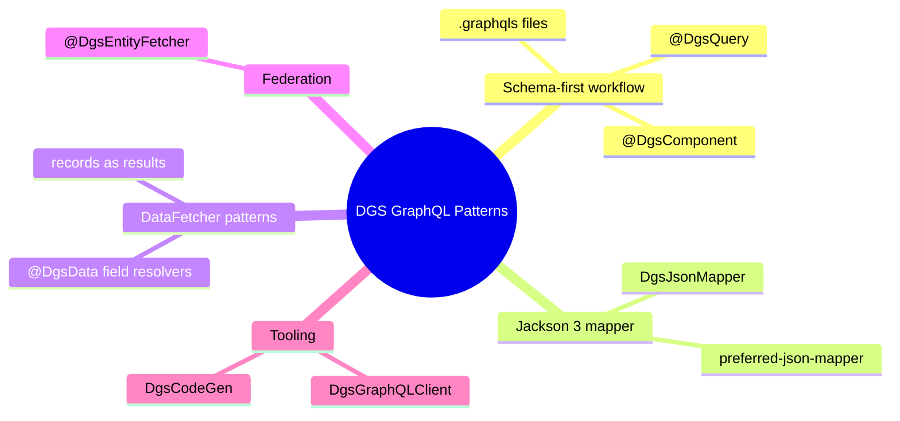
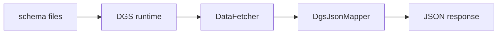

# Module 03: DGS GraphQL Production Patterns

Est. study time: 1.5h
Language: en
Description: DGS 12 on Boot 4. Schema-first, Jackson 3 mapper, fetchers, federation, codegen, clients.

## Knowledge Map



---

## Learning Objectives
- Drive a schema-first workflow where GraphQL types own the API contract
- Wire DGS 12 on Boot 4 with Jackson 3 through the DgsJsonMapper abstraction
- Resolve root and nested fields with the correct DataFetcher annotation
- Join a federated graph with @DgsEntityFetcher reference resolution
- Generate types with DgsCodeGen and target DgsGraphQLClient over a raw ObjectMapper

---

## Real-World Example

Your flagship storefront team serves web and mobile from one GraphQL endpoint. Customers, orders, and reviews started as separate REST services that front-end teams glued together. The endpoint grew to 94 fields, some dead, arguments duplicated, and the same product shape returned four ways depending on client. A mobile sprint trips: the app expects price as a decimal string, web expects a float, nobody agrees who is right.

Then the platform team announces Boot 4 and Jackson 3. The DGS upgrade breaks: a resolver returning `Map<String, Object>` serializes differently, and the schema file meant to be the single source of truth is treated as decoration.

> **Think**: Why did shape drift and dead fields happen, when every GraphQL service already had a schema file?
>
> *Answer: The schema existed but nothing treated it as the contract. Ad-hoc maps, no codegen, whatever JSON mapper sat on the classpath. A schema nothing validates against is decoration.*

---

## Core Content

### Section 1: Schema-First Workflow

GraphQL is contract-driven. In DGS the schema lives in `resources/schema` as `.graphqls` files, loaded at startup and wired to Java methods. Java types map 1:1 to schema types, so naming matters.

```graphql
type Query {
  product(id: ID!): Product
}

type Product {
  id: ID!
  name: String!
  brand: String
}
```

```java
@DgsComponent
public class CatalogFetcher {
    private final CatalogService catalog;

    public CatalogFetcher(CatalogService catalog) {
        this.catalog = catalog;
    }

    @DgsQuery
    public Product product(@InputArgument String id) {
        return catalog.findProduct(id);
    }
}
```



`@DgsMutation` covers root mutations the same way. Schema that cannot live in a file is supplied via `@DgsTypeDefinitionRegistry` or a `SchemaString` bean.

Schema files live in the resources/{schema} directory and end with the `.graphqls` extension.
*Answer: schema*

> **Think**: The schema declares brand as nullable. The fetcher throws when brand is missing. Where should the contract enforce the guarantee?
>
> *Answer: In the schema, not code. Mark brand non-nullable so the document states the guarantee and DGS validates it at runtime.*

### Section 2: DGS 12 on Boot 4 — the Jackson 3 Story

DGS 11.0 (Dec 2025) first supported Boot 4. DGS 12.0.0 (Apr 2026) is the first DGS with native Jackson 3 — the `tools.jackson` packages from Module 06 — wired in as the default.

The seam that makes this painless is the {DgsJsonMapper}: a Jackson-agnostic interface in `com.netflix.graphql.dgs.json` that plugs in any JSON backend.
*Answer: DgsJsonMapper*

`Jackson3DgsJsonMapperAdapter` is the default adapter. Teams still on Jackson 2 pull `graphql-dgs-jackson2` as an opt-in module, or force the backend with `dgs.graphql.preferred-json-mapper=jackson2` (or `jackson3`) when both versions are present. Records, DTOs, and maps returned from fetchers serialize through the configured mapper, so Jackson 3 rules — immutability, custom serializers, safe typing — apply to GraphQL responses.

> **Think**: Why a mapper abstraction instead of just bumping the ObjectMapper type?
>
> *Answer: Boot 4 ships Jackson 3 while many teams still run Jackson 2. One mapper interface supports both backends instead of forking per library.*

> **Predict**: You set `dgs.graphql.preferred-json-mapper=jackson2` but never add `graphql-dgs-jackson2`. What does DGS do?
>
> *Answer: There is no Jackson 2 adapter to select, so DGS falls back to the Jackson 3 default — or fails with a missing-mapper error if no mapper exists. Property and module travel together.*

### Section 3: DataFetcher Patterns and Return Types

Keep root Query and Mutation resolvers for top-level fields. For a field on another type — reviews on Product — use {DgsData} with `parentType` and `field`.
*Answer: DgsData*

```java
@DgsComponent
public class ProductResolver {
    private final ReviewService reviews;

    public ProductResolver(ReviewService reviews) {
        this.reviews = reviews;
    }

    @DgsData(parentType = "Product", field = "reviews")
    public List<Review> reviews(DgsDataFetchingEnvironment env) {
        return reviews.forProduct(((Product) env.getSource()).id());
    }
}
```

Return typed records, not raw maps. `ProductReviewSummary(int count, float average)` documents the shape; aggregate cost per product is Module 04 territory.

> **Think**: What decides whether a method binds a root Query field (product in Section 1) or a nested field (reviews here)?
>
> *Answer: The annotation. @DgsQuery binds root Query or Mutation fields; @DgsData binds a named field on a parentType. One binding per method.*

> **Spot the Mistake**: A colleague resolves Product.reviews with `@DgsQuery`. "It passed my unit test," they say.
>
> What's wrong?
>
> *Answer: @DgsQuery only binds root Query fields. reviews is not a root field, so schema wiring fails or the field never resolves. Use @DgsData(parentType = "Product", field = "reviews").*

### Section 4: Federation with @DgsEntityFetcher

In a federated graph the storefront endpoint composes entities split across subgraphs. When the gateway asks your subgraph to contribute fields to an entity owned elsewhere, DGS calls the {DgsEntityFetcher} for that type.
*Answer: DgsEntityFetcher*

```java
@DgsComponent
public class OrderEntityFetcher {
    private final OrderService orders;

    public OrderEntityFetcher(OrderService orders) {
        this.orders = orders;
    }

    @DgsEntityFetcher(name = "Order")
    public Order resolveOrder(Map<String, Object> values) {
        return orders.findById((String) values.get("id"));
    }
}
```

The protocol sends only key fields, so the fetcher gets a partial values map and reassembles it for its part of the type — reference resolution behind `_Entity` and `_entities`.

> **Think**: Federation hands your subgraph a reference with only id. Should the fetcher trust the id is present and canonical?
>
> *Answer: No. Treat the reference map as untrusted input, validate absent keys, and throw a typed GraphQLError; the gateway reports a field error instead of a silent null.*

> **Predict**: The gateway requests 200 distinct orders in one entities payload; your fetcher calls findById per reference. What does Module 04 add to collapse this into two calls?
>
> *Answer: DataLoader batching and deduplication fold the per-reference lookups into one query. Per-reference fetching is exactly the N+1 problem Module 04 solves.*

### Section 5: Codegen and the Typed Client

Hand-written fetcher signatures drift from the schema. The fix is DgsCodeGen, the Gradle plugin generating Java types straight from `.graphqls`, keeping fetchers, inputs, and clients in sync at build time.

```gradle
plugins {
    id "com.netflix.dgs.codegen"
}

generateJava {
    schemaPaths = ["${projectDir}/src/main/resources/schema"]
    packageName = "com.storefront.graphql.generated"
}
```

Generated types are your return types: Order, ProductInput, enums. Editing them by hand works until the next generation deletes your edits.

DGS 12 also modernizes the client. The new {DgsGraphQLClient} and `DgsMonoGraphQLClient` interfaces replace the deprecated ObjectMapper-based constructors — same call shape, wired through the DgsJsonMapper.
*Answer: DgsGraphQLClient*

```java
// Wired through DgsJsonMapper, so server and client share one Jackson 3 config
public final class OrdersClient {
    private final DgsGraphQLClient client;

    public OrdersClient(DgsGraphQLClient client) {
        this.client = client;
    }

    public DgsGraphQLResponse fetchOrders() {
        return client.executeQuery("{ orders { id } }");
    }
}
```

> **Predict**: Someone renames a field in the schema but CI still deploys, since fetchers are hand-written and codegen is skipped. What is the first sign the contract broke?
>
> *Answer: A runtime failure — a GraphQL validation error or null field deep in a client page — because nothing verified the mapping at build time. Codegen moves it to compile time.*

> **Spot the Mistake**: A developer fixes a bug by hand-editing a generated Order class and checks it in; the next codegen run silently overwrites it.
>
> What's wrong?
>
> *Answer: Generated code is an artifact, not a source. Edit the generator inputs — the schema — or map via a separate domain type (Module 07); treat build output as read-only.*

---

## Why This Matters

One endpoint, many consumers: web and mobile agree on shapes only because schema, codegen, and mapper enforce them together. DGS on Boot 4 multiplies the surface — Jackson 3, new client interfaces — and these patterns keep the contract boring: schema-first, typed records, correct annotations. Get a resolver or the mapper wrong and a successful deploy ships a broken contract to millions of devices. Efficiency is Module 04; errors and auth, Module 05.

---

## Key Takeaways
- DGS 12 first DGS with native Jackson 3 by default
- Schema in `resources/schema`, Java maps 1:1 to schema types
- `@DgsData` resolves nested fields; `@DgsQuery` and `@DgsMutation` are root fields
- `@DgsEntityFetcher` answers federated gateway reference calls
- `DgsCodeGen` and `DgsGraphQLClient` move contract breaks to build time

---

## Common Misconception

"One GraphQL endpoint means one schema, so shapes cannot drift." Wrong. Drift comes from the fetchers and the mapper, not the schema file. Raw-map resolvers, hand-written types that ignore codegen, and silent JSON mapper changes all desync clients from the schema. The schema is a contract only when codegen and typed returns make it assertable.

---

## Feynman

Explain to a child: a storefront serves web and mobile from one menu, the schema. The kitchen, the fetchers, fills the orders and a rulebook — codegen, typed records, one JSON mapper — makes every dish look the same on every plate. Use the product and reviews flow. No jargon. Do NOT move on until the menu-to-plate link holds.

---

## Reframe

Judge: field resolvers built to fight N+1 add indirection and per-field method hops. For a two-field listing, when do they cost more than they save, and when do they pay off? Write your evaluation, then check Module 04.

---

## Drill

Check yourself on the quiz and cloze decks for this module.

Run: `learn.sh quiz spring-boot 03-dgs-graphql-patterns`
Run: `learn.sh cloze spring-boot 03-dgs-graphql-patterns`