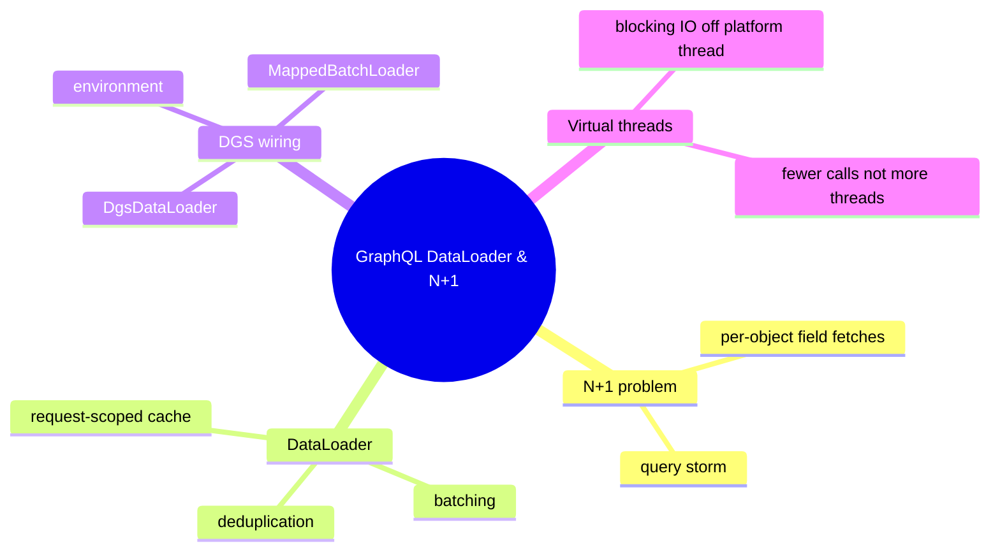
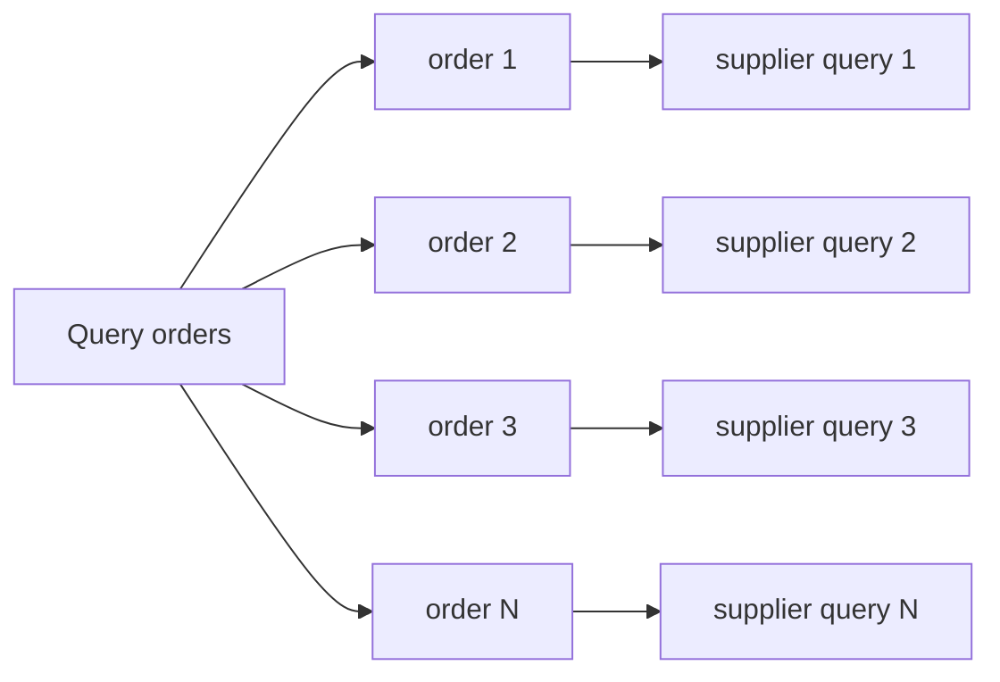

# Module 04: GraphQL DataLoader & N+1

Est. study time: 1.5h
Language: en
Description: N+1 problem. BatchLoader vs MappedBatchLoader, request scoping, virtual threads.

## Knowledge Map



---

## Learning Objectives
- Explain the root cause of N+1 query storms in GraphQL resolvers
- Describe how DataLoader batches loads and dedups identical keys within a request
- Choose between BatchLoader and MappedBatchLoader on ordering and key-presence
- Wire a DataLoader into DGS field resolvers via the DataFetchingEnvironment
- Reason about virtual threads and DataLoader as complementary, not substitutes

---

## Real-World Example

Your marketplace lists 40 orders, each with one supplier. You ship `orders { id supplier { name } }` with a naive resolver fetching each supplier inside `supplier`. The page takes 4 seconds and the database CPU spikes: 1 query for the orders, then 40 tiny `SELECT FROM supplier` calls, one per row.

> **Think**: Why does one GraphQL query turn into 41 database calls?
>
> *Answer: GraphQL runs each field once per object. The `supplier` field executes 40 times, once per order, each calling the repository — the loop hides inside resolver fan-out (Module 03 patterns; Module 05 batch errors).*

---

## Core Content

### Section 1: The N+1 Query Storm

A nested list costs N+1 queries: 1 for the parent list, then N for the child field, one per parent row. GraphQL is field-per-object, so the child resolver runs once per parent instance. Cost grows with page size; deeper nesting multiplies it.



**Naive resolver (the storm):**
```java
@DgsData(parentType = "Order", field = "supplier")
public Supplier supplier(DataFetchingEnvironment env) {
    Order order = env.getSource();
    return supplierRepository.findById(order.supplierId()).orElseThrow();
}
```

> **Think**: Your query returns 200 rows and each child fetch takes 25 ms. Why is total latency awful even with a fast database?
>
> *Answer: About 200 times 25 ms = roughly 5 seconds of serial round trips. Each pays a network round trip: total time equals N times per-fetch latency.*

> **Cloze**: "The N+1 problem appears because a child-field resolver runs once per parent {object}, fanning out one query per instance."
>
> *Answer: object*

### Section 2: DataLoader Fundamentals — Batch and Dedupe

A DataLoader queues loads during one pass of the query, then flushes them through a single batch function. Batching turns 40 supplier ids into one query; deduplication queues the same key once so a shared child is fetched a single time and every resolver that asked gets the value.

> **Predict**: Three orders all reference supplier `s-9`. With deduplication, how often does the batch function see `s-9`?
>
> *Answer: Once. The loader deduplicates keys within the pass, fetches `s-9` a single time, and serves the cached value to all three resolvers.*

> **Cloze**: "Grouping queued loads into one call to the batch function is {batching}, and loading each identical key once per pass is deduplication."
>
> *Answer: batching*

### Section 3: BatchLoader vs MappedBatchLoader — the Ordering Trap

graphql-java offers two batch interfaces. BatchLoader returns a List zipped positionally onto the input keys. MappedBatchLoader returns a Map so each key finds its value directly.

- BatchLoader<K,V>: List in key order. Only safe when the batch function guarantees exact input-key order and one value per key.
- MappedBatchLoader<K,V>: Map<K,V>. Keys may be absent, which reads as missing. The safe default.

**BatchLoader — position matters:**
```java
@DgsDataLoader(name = "booksByAuthor")
public class BooksByAuthorLoader implements BatchLoader<String, Book> {
    @Override
    public CompletionStage<List<Book>> load(List<String> authorIds) {
        return CompletableFuture.supplyAsync(() ->
            bookRepository.allByAuthorsOrderedLike(authorIds));
    }
}
```

**MappedBatchLoader — dictionary style:**
```java
@DgsDataLoader(name = "suppliers")
public class SupplierLoader implements MappedBatchLoader<String, Supplier> {
    @Override
    public CompletionStage<Map<String, Supplier>> load(Set<String> ids) {
        return CompletableFuture.supplyAsync(() ->
            supplierRepository.findAllById(ids).stream()
                .collect(Collectors.toMap(Supplier::id, s -> s)));
    }
}
```

> **Think**: `WHERE id IN (...)` returns rows in primary-key order, not input order, and one supplier was deleted. Why does BatchLoader corrupt the response and MappedBatchLoader does not?
>
> *Answer: BatchLoader zips the returned list onto input keys positionally, so reordered or shorter results shift values onto wrong keys. MappedBatchLoader matches values by key, so ordering is harmless and a deleted supplier simply stays out of the map.*

> **Spot the Mistake**: A teammate replaces every loader with `BatchLoader<String, Supplier>` because "the docs show BatchLoader". The supplier table returns rows sorted by primary key; after the first order, every row shows the wrong supplier name.
>
> What's wrong?
>
> *Answer: BatchLoader relies on results in exact input order with one value per key. Reordered or partly missing results shift the positional zip. Use MappedBatchLoader unless order and full presence are guaranteed.*

> **Predict**: You delete one supplier row but keep every order. How do the two loaders behave for that order's supplier field?
>
> *Answer: MappedBatchLoader leaves the key out of the map, so the field resolves to null or the Module 05 not-found error. BatchLoader with a shorter list throws or misaligns, since the zip expects one value per key.*

### Section 4: Wiring DataLoader in DGS

In DGS, register a batch class with @DgsDataLoader and pull the loader from the DataFetchingEnvironment in the resolver. DGS memoization scope is the request, so each request gets a fresh loader and an isolated result set.

```java
@DgsData(parentType = "Order", field = "supplier")
public CompletableFuture<Supplier> supplier(DataFetchingEnvironment env) {
    Order order = env.getSource();
    return env.<String, Supplier>getDataLoader("suppliers")
        .load(order.supplierId());
}
```

The resolver returns the future and the engine drains the loader at the pass boundary. List fields load several keys in one pass and all batch together. Batch size is configurable, capping keys per flush so a huge pass splits into bounded batches.

> **Cloze**: "In DGS a field resolver gets its per-request loader from the {DataFetchingEnvironment} and returns the future instead of blocking."
>
> *Answer: DataFetchingEnvironment*

> **Predict**: The resolver loops 40 orders and calls `load(id)` each time. How many batch function invocations result?
>
> *Answer: One. The pass collects all 40 keys, deduplicates, and drains through a single batch call at the pass boundary.*

### Section 5: Virtual Threads and the Correctness Rules

Boot 4 enables virtual threads by default (spring.threads.virtual.enabled default true), so blocking calls in resolvers no longer pin platform threads. Concurrency gets cheap but N+1 stays: latency still sums N per-fetch waits and the database still runs N queries. DataLoader cuts the call count; virtual threads absorb the blocking cost. Use both.

Senior correctness rules:

- Scope the loader to the request. A singleton shares one first-level cache across all requests, leaking results and serving stale data.
- Never reuse a loader for a different query shape; keys from a prior query stay cached.
- The loader cache is not a business cache — it lives one request pass and dies with it.

```java
@Component
public class LeakySupplierLoader {
    @Autowired SupplierRepository repo;
    // WRONG: one DataLoader shared by every request, cache leaks across users
    DataLoader<String, Supplier> loader =
        new DataLoader<>(ids -> repo.findAllById(ids));
}
```

> **Think**: User A and user B both request the same order. A's request dies mid-batch. What does B see with the singleton above?
>
> *Answer: The singleton keeps its cache, so B may read A's stale value or a half-filled cache — results and errors bleed across clients. Request-scoped loaders build a fresh cache per request and isolate the data.*

> **Cloze**: "A DataLoader must be scoped to the {request}, never a singleton, otherwise cached results leak and go stale across queries."
>
> *Answer: request*

> **Spot the Mistake**: A developer keeps a request-scoped loader but sets `withMaxBatchSize(10)` for a 45-key pass, then says batching "cut the query count". The query still needs 5 separate drain calls.
>
> What's wrong?
>
> *Answer: Batch size is a cap on keys per flush, not a count reduction. Setting it low splits the pass into many batches, adding round trips. Leave it at a sane upper bound unless a single IN clause exceeds database limits.*

---

### Why This Matters

GraphQL hides the real cost of a query behind field resolvers. Without DataLoader, every nested list silently multiplies round trips, and the slowness shows up in production, not in unit tests. Teams that skip it ship paged APIs that die at page 50.

---

## Key Takeaways
- N+1 means one fetch per object per field, a storm scaling with page size
- DataLoader batches a pass into one batch call and deduplicates identical keys
- MappedBatchLoader is the safe default; BatchLoader only when output order equals key order
- Pull the loader from the environment in DGS and return the future, do not block
- Scope loaders to the request; use DataLoader with virtual threads, never instead of them

---

## Common Misconception

"Virtual threads replace DataLoader." They keep the thread pool from starving while a resolver blocks on IO, but the query count and summed latency stay identical. DataLoader attacks the count itself, collapsing N queries into 1. One makes blocking cheap, the other makes fewer calls — you want both.

---

## Spot the Mistake

```java
@DgsData(parentType = "Order", field = "supplier")
public CompletableFuture<Supplier> supplier(DataFetchingEnvironment env) {
    return CompletableFuture.supplyAsync(() -> {
        SupplierLoader loader = env.getDataLoader("suppliers");
        return loader.load(order.supplierId()).join();
    }, myExecutor);
}
```

A teammate says: "Every resolver wrapped in `supplyAsync` plus `join` for maximum parallelism."

What's wrong?

*Answer: `load` already returns a future the engine resolves at the batch boundary. The extra `supplyAsync` adds a hop and `.join()` blocks inside your own executor, fighting batching and risking deadlock. Return the future from `load` and let the loader drain; hand-rolled executors buy nothing.*

---

## Feynman Explain
Teach a child: "40 kids each raise a hand for their own mail. Tiny trip each. A DataLoader is one kid collecting all 40 addresses, walking to the post office once, coming back with 40 packages — two kids wanting the same package share one." Say it without the words batch or loader.

---

## Reframe
Judge: is the Map loader always better than the List loader, or does Map membership hide a deleted-rows scan you should know about? When does exact ordering actually hold? Write your evaluation, then decide the default you would enforce on your team.

---

## Drill
Run: `learn.sh quiz spring-boot 04-graphql-dataloader`