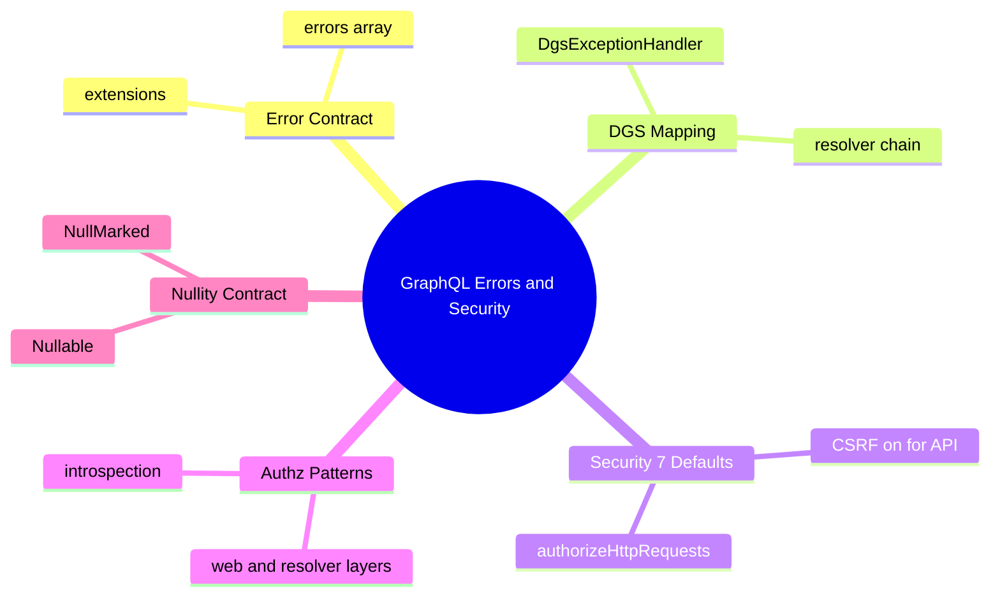
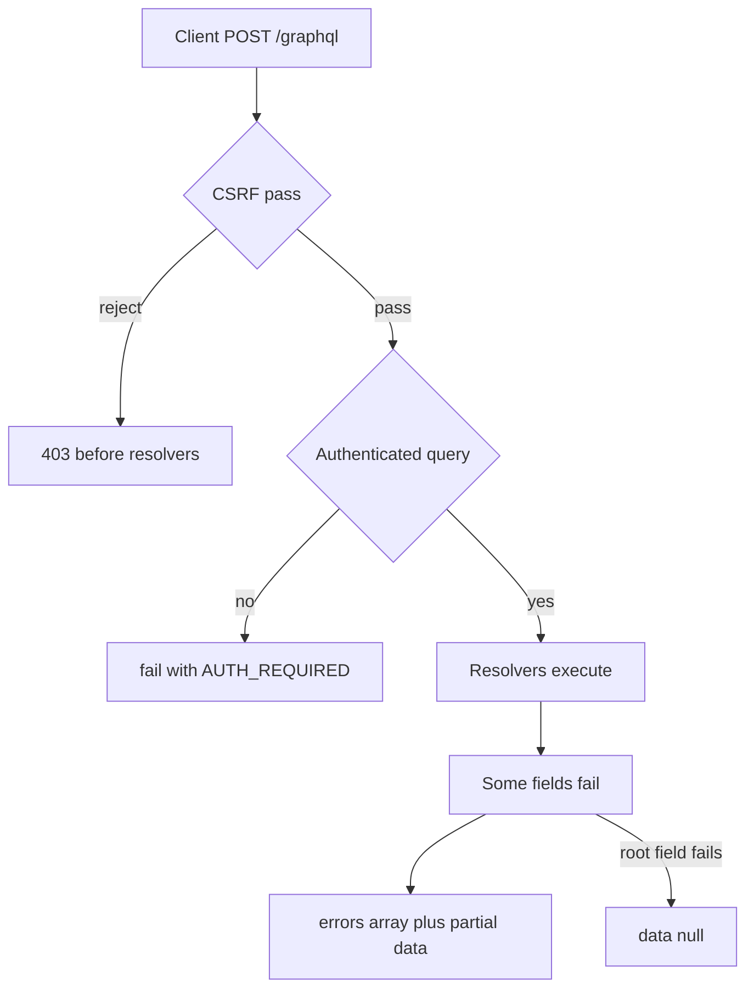

# Module 05: GraphQL Errors & Security

Est. study time: 1.5h
Language: en
Description: Field errors and extensions, exception handling, Spring Security 7 on GraphQL.

## Knowledge Map



---

## Learning Objectives

After this module you will:

- Explain why GraphQL errors are field-level, not request-level.
- Map exceptions to machine-readable DGS errors with `extensions`.
- Fix the Security 7 CSRF default that 403s every GraphQL POST.
- Secure GraphQL at web and resolver layers and gate introspection.
- Bridge JSpecify `@Nullable` resolver contracts with non-null schema fields.

---

## Real-World Example

A mobile checkout team ships a "Place Order" mutation. The order service throws for one promo code, the billing resolver for a payment token. Devs expect a single 500 — they get two field errors and a half-populated order. Then a security upgrade lands: every mutation returns 403 with unchanged POST body, correct Authorization header, and a security config that no longer compiles.

Two lessons hide here. GraphQL promises partial success, so one bad field must never kill the whole response. And Boot 4 ships Security 7, where CSRF protection is on for ALL endpoints — the top "it worked in 3.x" surprise.

> **Think**: Why does the client still get useful data when two resolvers failed?
>
> *Answer: A 200 with `errors` per failed field and `data` for the successes. Failure is scoped to the field, not the request.*

---

## Core Content

### The Error Contract

GraphQL has no single exception channel. Each resolver returns its value or records an error. The response is a JSON `errors` array plus a `data` object; a failed field is `null`, and `data` is `null` entirely only when a root field fails.

```json
{
  "errors": [
    {
      "message": "promo code EXPIRED",
      "path": ["placeOrder", "promoCheck"],
      "extensions": { "code": "INVALID_PROMO" }
    }
  ],
  "data": {
    "placeOrder": {
      "id": "order-1042",
      "promoCheck": null
    }
  }
}
```



HTTP carries transport failure (401, 403, 500); GraphQL carries application failure inside `errors` — the body stays 200, so branch on `errors` plus `data`, not the HTTP code.

`extensions` is the machine-readable home: stable codes like `AUTH_REQUIRED`, `NOT_FOUND`, `INVALID_PROMO`, plus retry hints. Parse codes, never `message`.

> **Think**: Every resolver succeeds except one field, which throws. What lands in the response?
>
> *Answer: 200, one `errors` entry for the failed field; `data` keeps the rest, that value null.*

> **Cloze**: "Field-level failure lands in the response {errors} array, while successful fields stay in {data}."
>
> *Answer: errors*

> *Answer: data*

### DGS Exception Mapping

DGS pre-renders the JSON contract above. You decide which exception → which error shape: `@DgsExceptionHandler` methods (one per exception type on a `@DgsComponent`) or a `DataFetcherExceptionResolver`.

```java
@DgsComponent
class OrderErrorHandler {

    @DgsExceptionHandler
    GraphQLError handlePromo(PromoExpiredException ex,
                             DataFetchingEnvironment env) {
        return GraphqlErrorBuilder.newError(env)
                .message(ex.getMessage())
                .extensions(Map.of("code", "INVALID_PROMO"))
                .build();
    }
}
```

The mapped error becomes one `errors` entry with your `extensions`, other fields still resolve. Unknown exceptions fall through to DGS defaults — a fine floor, but it hides domain codes. Map every exception your resolvers throw.

> **Predict**: A resolver throws an exception you did not map. Other resolvers in the same query already succeeded. What does the client see?
>
> *Answer: The unmapped exception becomes a generic error entry with no stable `code`, while already-resolved fields still ship under `data`. The front end cannot branch on it reliably, which is why you map known exceptions.*

> **Spot the Mistake**: Dev maps every exception to `.message(ex.getMessage())` with no `extensions`, and says "codes are cosmetics".
>
> What's wrong?
>
> *Answer: Without a stable `code`, clients glue logic to human-readable text that can change any day. Message strings are not an API contract; `extensions.code` is.*

> **Cloze**: "Machine-readable error identity lives in the response {extensions} map, not the {message} string."
>
> *Answer: extensions*

> *Answer: message*

### Security 7 Defaults: the CSRF 403

Every GraphQL operation is a POST — queries, mutations, subscriptions all POST. Security 7 enables CSRF protection for all endpoints by default, not just form logins like Boot 3. A stateless client sends `Authorization: Bearer` and no CSRF cookie; the filter has no token to verify and returns 403 before any resolver runs.

```java
@Configuration
@EnableWebSecurity
public class GraphqlSecurityConfig {

    @Bean
    SecurityFilterChain securityFilterChain(HttpSecurity http) {
        return http
            .csrf(csrf -> csrf.disable())
            .authorizeHttpRequests(auth -> auth
                .requestMatchers("/graphql").authenticated())
            .build();
    }
}
```

Two facts. `authorizeRequests()` is gone — only `authorizeHttpRequests()` exists. And `csrf.disable()` is defensible only for non-cookie auth (Bearer token), never stateful cookie sessions.

> **Think**: Why does a Bearer-token GraphQL client get 403 on a valid POST?
>
> *Answer: CSRF protection is on for all endpoints by default. The stateless client never echoes a CSRF token, so the filter rejects the POST before authentication runs.*

> **Predict**: You fix the 403 by removing `csrf.disable()` and instead adding a CSRF token fetch. Client still uses Bearer tokens. What happens?
>
> *Answer: Complex for nothing. CSRF guards cookie-authenticated requests; a Bearer mechanism is not cookie-based, so a token exchange adds zero security and one round trip. Disabling it with Bearer is the stateless answer — if documented.*

> **Cloze**: "The deprecated {authorizeRequests} must be replaced by {authorizeHttpRequests} in Security 7."
>
> *Answer: authorizeRequests*

> *Answer: authorizeHttpRequests*

### Authenticate and Authorize GraphQL

Secure the web layer with filter-chain rules, then layer per-field authorization inside resolvers when rules differ per entity. Introspection needs read access, mutations write access — a blanket permit on POST `/graphql` opens every operation.

```java
http
    .authorizeHttpRequests(auth -> auth
        .requestMatchers("/graphql").authenticated()
        .requestMatchers("/graphql/admin").hasRole("ADMIN"));
```

> **Spot the Mistake**: Dev secures the endpoint with a blanket `permitAll` on POST `/graphql` because "resolver auth is enough".
>
> What's wrong?
>
> *Answer: Unauthenticated clients still reach every mutation resolver that pays, moves, or deletes. Resolver authorization is the second layer, not the only gate — require authentication at the chain and add entity-level rules in resolvers.*

> **Predict**: You force authentication on POST `/graphql`. Does the schema stay hidden?
>
> *Answer: No. Introspection runs as part of the authenticated request, outside the resolvers you control, so any signed-in caller reads the full schema. If that shape is sensitive, gate it with a resolver guard (module 12).*

### Resolver Contract under JSpecify

Module 08 makes nullability explicit: `@NullMarked` packages type every resolver against `@Nullable` and non-null contracts. A non-null schema field backed by `@Nullable` is a mismatch you resolve deliberately — throw, or return an empty list for list fields.

```java
@DgsData(parentType = "Order", field = "promoCheck")
public @Nullable PromoState promo(Order order) {
    Promo promo = order.promo();
    if (promo == null) {
        throw new OrderException("no promo", "NO_PROMO");
    }
    return new PromoState(promo.code(), promo.discount());
}
```

Nullable state is a real outcome — orders without promos exist. Decide first: a nullable schema field permits `null`; a non-null field backed by `@Nullable` must throw or return a sentinel, never ship an implicit null that violates the schema.

> **Think**: Schema says `discount: Decimal!` non-null. Resolver has a `@Nullable` discount value. Silent null is not an option. What is?
>
> *Answer: Either throw a mapped exception (client sees `errors.code`), or return a safe sentinel value the data contract allows. Implicit null breaks the non-null schema contract and corrupts client code generation.*

> **Cloze**: "A non-null schema field backed by a {Nullable} resolver must fail loudly with a mapped error rather than ship silent null."
>
> *Answer: Nullable*

---

## Why This Matters

Teams run GraphQL in front of mobile flows where one field dying must not kill the whole screen. Extensions decide whether client code branches on APIs or prose. The CSRF flip breaks production the day you upgrade and the fix is an auth-flow decision, not a config line. Get both right and partial failure degrades gracefully; get them wrong and you ship a dead endpoint or an open one.

---

## Key Takeaways

- GraphQL errors are field-scoped — `errors` array plus partial `data`, HTTP stays 200.
- `extensions.code` is the machine contract; `message` is display prose.
- Security 7 turns CSRF on for all endpoints; stateless Bearer APIs disable it and document why.
- `authorizeHttpRequests()` replaced `authorizeRequests()`.
- Web-layer auth, resolver authorization, gated introspection — three layers, not one.

---

## Common Misconception

"GraphQL errors work like REST — one problem, whole request fails." Wrong. REST propagates one status code. GraphQL resolves each field independently: ten fields can succeed nine and still carry one error entry. HTTP status is transport health, not application health.

---

## Spot the Mistake

Resolver returns `null` for a non-null schema field "because the query still returns a 200." The client parses null where the schema promised `Decimal!`.

What's wrong?

*Answer: Null violates the schema contract. A non-null field backed by a `@Nullable` resolver must throw a mapped exception or return a sentinel, so the failure arrives as an `errors` entry with a code the client handles.*

---

## Feynman Explain

GraphQL as a sandwich shop for a 10-year-old. Bread runs out but the drink machine works — did the whole order fail? No, the drink arrived, the sticky note names the problem topping. GraphQL is that: each field is its own worker, failures become sticky notes (errors), successes still ship. The door guard (security) checks a badge; a stateless badge holder has no door tag (CSRF token), so you tell the guard in review "badges only, no door tags" — out loud, so nobody breaks in.

---

## Reframe

Is this module's advice always right? Disabling CSRF "because Bearer" is correct only when nothing trusts cookies — a hybrid app (cookies for one client, Bearer for another) must keep CSRF on for the cookie path. Partial-data delivery is right for UX, wrong for money flows: a transfer must fail atomically, not half-settle.

---

## Drill

Take the quiz, then the cloze deck. MCQs test recall, scenario, and security tradeoffs.

Run: `learn.sh quiz spring-boot 05-graphql-errors-security`