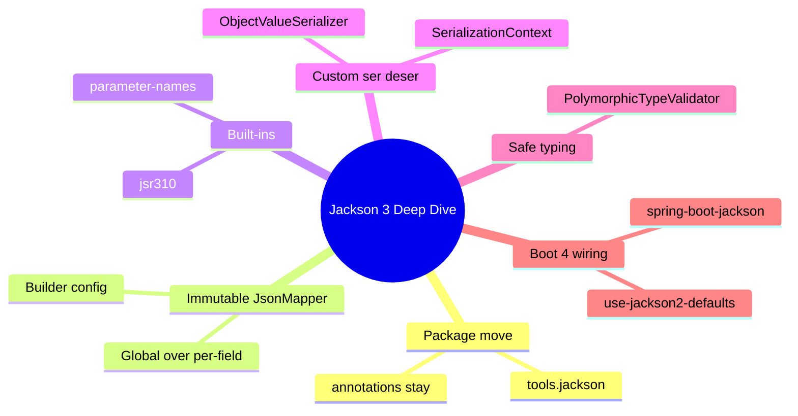
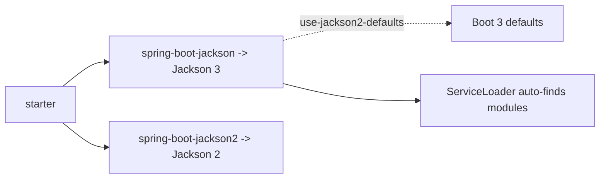

# Module 06: Jackson 3 Deep Dive

Est. study time: 1.5h
Language: en
Description: Jackson 3 groundwork. tools.jackson move, immutable JsonMapper, safe polymorphism, Boot 4 wiring.

## Knowledge Map



---

## Learning Objectives
- Map the Jackson 2 to 3 package and class renames, including what stays put
- Configure an immutable `JsonMapper` through its Builder; prefer global config over per-field annotations
- Replace legacy module registration and customizer code with Jackson 3 built-ins
- Write custom serializers and deserializers under the new names
- Explain safe polymorphic typing and Boot 4's Jackson wiring choices

---

## Real-World Example

Your trading platform runs a REST API and a GraphQL DGS service, both serializing the same `TradeDto` into ticks for a realtime dashboard. A mandate arrives: move to Spring Boot 4, which ships Jackson 3. The upgrade compiles; then the dashboard goes stale on 40% of rows. `TradeDto` carries a `LocalDateTime fillTime` and a nullable `shortName`; in Boot 3 both worked only because `ObjectMapper.registerModule(new JavaTimeModule())` hid the work. After the move, hook code still calls `Jackson2ObjectMapperBuilder` and per-field `@JsonFormat` fights the new defaults. Renamed classes, lost nulls: a library bump that was really a rewrite of your serialization contract.

> **Think**: Why did fill-time parsing and nulls both break after a bump that "compiled fine"?
>
> *Answer: Compile-time surfaces renames; runtime surfaces behavior. Modules are no longer registered by hand and defaults changed for zero-field and null policy.*

---

## Core Content

### Section 1: Jackson 3 Is a Rename With Teeth

Jackson 3 is the same library family under a new umbrella name. The Maven groupId and runtime packages moved from `com.fasterxml.jackson` to `tools.jackson`; the JSON, annotations, and semantics you know still apply. One exception: `jackson-annotations` stays under `com.fasterxml.jackson`, so `com.fasterxml.jackson.core` and `com.fasterxml.jackson.annotation` still refer to the annotation layer. Headline renames: `ObjectMapper` became `tools.jackson.databind.json.JsonMapper`; `Jackson2ObjectMapperBuilder` became `JsonMapper.Builder`.

> **Think**: A teammate runs `git grep com.fasterxml.jackson` and finds only annotations. Is that a problem?
>
> *Answer: No. Annotations legitimately stay in `com.fasterxml.jackson`; the rest should sit under `tools.jackson`. A clean grep means no stray Jackson 2 imports remain.*

> **Cloze**: "Jackson 3 moved runtime packages under `{tools.jackson}`, while `jackson-annotations` stays in `com.fasterxml.jackson`."
>
> *Answer: tools.jackson*

### Section 2: The Immutable JsonMapper Builder

`ObjectMapper` in Jackson 3 is immutable: setters are gone, so you literally cannot mutate a shared mapper after construction. Configuration flows through a fluent `JsonMapper.Builder` from `JsonMapper.builder()`. That kills the class of concurrency bugs where a handler tweaked a shared mapper mid-flight, forcing one habit: build once, freeze, share.

Because the mapper is immutable, the right lever for app-wide rules is the global builder, not per-field `@JsonFormat` or `@JsonInclude`. If every DTO must omit nulls, set that once on the builder; per-field annotations then exist only for true exceptions. Null handling is a strategy, not a sticker.

> **Predict**: You add `enable(SerializationFeature.WRITE_DATES_AS_TIMESTAMPS, false)` on the builder after objects were already serialized by a shared immutable mapper. What happens?
>
> *Answer: Nothing at runtime: the shared mapper is frozen. Construct and swap a new one.*

> **Spot the Mistake**: A coworker "fixes" the timestamp bug with `mapper.setSerializationInclusion(Include.NON_NULL)` on the shared bean.
>
> What's wrong?
>
> *Answer: No `setSerializationInclusion` exists on the immutable mapper; even in Jackson 2 that mutates a mapper every thread shares. Configure the builder at construction, then let the frozen mapper serve everyone.*

> **Cloze**: "`ObjectMapper` is now {immutable}, so all configuration happens on a fresh `JsonMapper.Builder` before the mapper is built."
>
> *Answer: immutable*

### Section 3: Built-ins That Stop You Registering Modules

Two of the old module-registration rituals are dead. java.time support (the old jsr310 module) and constructor parameter-names support are built in. No `registerModule(new JavaTimeModule())`, no `@JsonCreator` ladder, no `@JsonDeserialize` shims: a `LocalDateTime` field and a record constructor just work. Hand-wired Jackson 2 module code is dead weight.

Meanwhile Boot-side customizers were renamed: `Jackson2ObjectMapperBuilder` is deprecated; its customizer `Jackson2ObjectMapperBuilderCustomizer` became `JsonMapperBuilderCustomizer`. Old builder config now goes through `JsonMapper.Builder`.

> **Think**: Your code carries a custom `Jackson2ObjectMapperBuilderCustomizer` that sets date formats. What is the minimal migration?
>
> *Answer: Switch to `JsonMapperBuilderCustomizer` and operate on the `JsonMapper.Builder`. Global rules move to the builder; per-field `@JsonFormat` remains only for exceptions.*

### Section 4: Custom Serializers Under New Names

Custom serialization was renamed too. `JsonObjectSerializer` became `ObjectValueSerializer`; `JsonValueDeserializer` became `ObjectValueDeserializer`, living in `tools.jackson.databind.ser.std` and `tools.jackson.databind.deser.std`. Two runtime details matter: `SerializerProvider` is now `SerializationContext` (your serialize methods take it), and checked `IOException` is gone in favour of `JacksonException`, Jackson's own root.

```java
final class TradeSerializer extends ObjectValueSerializer<TradeDto> {
    @Override
    public void serialize(TradeDto v, JsonGenerator gen, SerializationContext ctxt)
            throws JacksonException {
        gen.writeNumberField("price", v.price());
        gen.writeStringField("fillTime", v.fillTime().toString());
    }
}
```

> **Predict**: A legacy serializer still declares `throws IOException`. Does it compile in Jackson 3?
>
> *Answer: No. The context is `SerializationContext` and the only checked root is `JacksonException`. The declaration must be rewritten.*

> **Cloze**: "`SerializerProvider` was renamed to {SerializationContext}, and serializers now throw `JacksonException` instead of the checked `IOException`."
>
> *Answer: SerializationContext*

### Section 5: Polymorphism Without the RCE

Jackson's polymorphic typing makes an abstract-typed field come back as its concrete class, driven by `@JsonTypeInfo` or default typing. That power is also a weapon: deserializing untrusted JSON into attacker-chosen classes was the classic gadget hack. So Jackson requires a strict `PolymorphicTypeValidator` — never enable default typing without one. Spring Security 7 runs its own safe `PolymorphicTypeValidator` internally for session data, keeping polymorphic state while your DTO layer stays closed.

```java
// minimal strict allowlist
PolymorphicTypeValidator ptv = BasicPolymorphicTypeValidator.builder()
    .allowIfSubType("trade.") // only our DTO packages
    .build();

JsonMapper mapper = JsonMapper.builder()
    .activateDefaultTyping(ptv, ObjectMapper.DefaultTyping.NON_FINAL)
    .build();
```

> **Spot the Mistake**: To free the DGS layer of per-type annotations, a teammate turns on default typing "temporarily" with an empty validator.
>
> What's wrong?
>
> *Answer: An empty or permissive validator equals no protection: polymorphic deserialization on untrusted input is a remote code execution vector. Name trusted subtypes in the allowlist, or stay non-polymorphic.*

### Section 6: Boot 4 Wiring

In Boot 4 the default starter is `spring-boot-jackson`, which pulls Jackson 3. Legacy apps keep a seat: `spring-boot-jackson2` restores Jackson 2 for apps that cannot move yet. Properties follow the split: the legacy knob is the `spring.jackson2` prefix, and `spring.jackson.use-jackson2-defaults=true` makes Jackson 3 behave like Boot 3 did — zero-fields handling, date formats — the gentlest bridge. Module discovery needs no code: Jackson 3 finds modules through the JDK `ServiceLoader`, so the auto-configured `JsonMapper` sees them automatically.



> **Predict**: You keep `spring-boot-jackson` but set `spring.jackson.use-jackson2-defaults=true` and the old `spring.jackson2` props. What goes to production?
>
> *Answer: Jackson 3 machinery with Boot 3-compatible defaults: modern package names, old behaviour — the least surprising seat and recommended bridge.*

---

### Why This Matters

Serialization is the contract between your service and every client. Jackson 3 changed package names, registration, builder names, exception model, and defaults in one release. Treat it as a compile-only rename and you ship silent data bugs; model it as a config contract and you ship the nulls, timestamps, and types clients expect.

---

## Key Takeaways
- Jackson 3 runtime lives under `tools.jackson`; `jackson-annotations` stays in `com.fasterxml.jackson`
- `ObjectMapper` is immutable; all config goes through `JsonMapper.Builder`, built once and frozen
- jsr310 and parameter-names are built in; drop manual module registration
- Custom code: `ObjectValueSerializer`/`ObjectValueDeserializer`, `SerializationContext`, `JacksonException`
- Boot 4 defaults to Jackson 3 via `spring-boot-jackson`; `use-jackson2-defaults` and the `spring.jackson2` prefix smooth the move

---

## Common Misconception

"Jackson 3 is a package rename; keep the same code." Wrong on three axes: the mapper is immutable so setter-based config no longer compiles; module registration is gone so classpath no longer negotiates feature parity; and defaults moved so output changes even when input compiles. Treat the move as a serialization-contract rewrite.

---

## Spot the Mistake

A teammate says: "With the fallback starter I can keep writing Jackson 2 code and even keep mutating the mapper, because it is Jackson 2 again."

What's wrong?

*Answer: The `spring-boot-jackson2` fallback starter restores Jackson 2 artifacts, but running two generations at once drags the migration, and mutating a shared mapper is the exact concurrency trap the new design deletes. Pick one generation, configure from builder or properties, keep the mapper immutable.*

---

## Feynman Explain
Explain to a child: "Jackson turns your report into text to send, and must refuse strangers disguised as bosses." Use the trading dashboard: timestamps must stay readable, missing nicknames stay honest (null), and the machine must never rebuild a stranger if only the report writer is allowed. Do NOT move on until the child can restate which parts are locked (immutable mapper) and which need permission (polymorphic types).

---

## Reframe
Judge: "global-builder config over per-field annotations" — does it hold for two DTOs that genuinely differ, or does it prescriptively hurt small teams? When does one global `JsonMapper` become the wrong default (two shapes with opposite null policies)? Write your evaluation; note when a second immutable mapper is fair.

---

## Drill
Take the quiz. MCQs test different angles — recall, application, scenario.

Run: `learn.sh quiz spring-boot 06-jackson3-deep-dive`