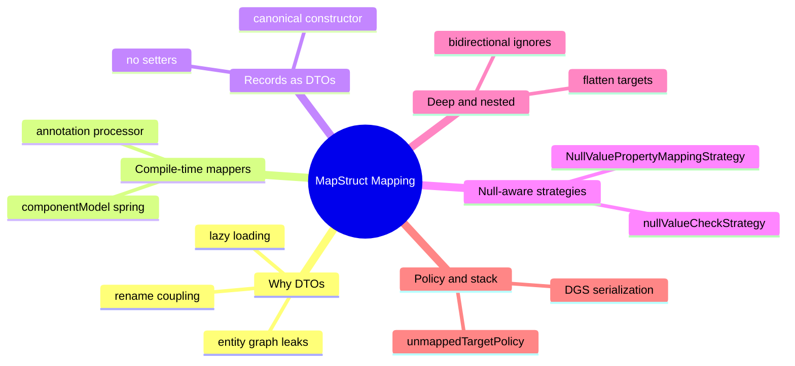
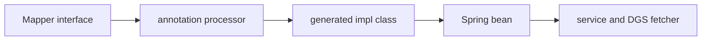

# Module 07: MapStruct & DTO Mapping

Est. study time: 1.5h
Language: en
Description: MapStruct compile-time DTO mapping. Records, null strategies, deep mapping, DGS serialization.

## Knowledge Map



---

## Learning Objectives
- Justify a DTO layer that decouples the wire contract from the persistence model
- Explain how the MapStruct annotation processor generates mapper code at compile time
- Map records to records through canonical constructors without setters
- Choose null-aware strategies that protect target fields from silent overwrite
- Enforce unmappedTargetPolicy in CI to surface API drift at build time

---

## Real-World Example

Your team exposes orders over REST by returning JPA entities straight from the repository. Week one the response echoes `Order → Customer → List<Order>` until Jackson gives up or the tab freezes. Next the transaction closes and lazy `customer.addresses` throws `LazyInitializationException`. Then the persistence team renames `totalAmount` to `amount` and every downstream consumer breaks overnight.

> **Think**: Why did three separate failures come from one habit, returning entities directly?
>
> *Answer: The entity couples persistence shape to the wire contract, so graph recursion, lazy loading, and rename coupling all leak through the API. A DTO layer breaks the coupling.*

---

## Core Content

### Section 1: Why a DTO Layer Exists

A DTO is a plain shape that carries data to the wire and nothing else, decoupling what the database holds from what clients consume. Returning the entity bakes table columns, ORM relationships, and lazy proxies into every response.

Two forces push teams to DTOs. Entity graph leaks: JPA relationships serialize as nested objects, dragging in the whole graph. Rename coupling: renaming a column forces an API break unless a mappable DTO absorbs it. MapStruct fills the DTO shape mechanically, giving isolation without hand-written boilerplate.

```java
@Entity
public class Order {
    private Long id;
    private Customer customer;
    private BigDecimal amount;
}

public record OrderDto(Long id, String customerName, BigDecimal total) {}
```

> **Think**: The DTO renames `amount` to `total`. Who decides that rename is safe?
>
> *Answer: The mapper. It compiles, so the rename is caught or confirmed at build time instead of breaking clients at runtime.*

### Section 2: Compile-Time Processing and componentModel

MapStruct is an annotation processor. At compile time it reads `@Mapper` interfaces and generates an implementation class from the same source files. The generated code is plain Java: field-by-field assignment, constructors, type conversions. No reflection at runtime, so mapping cost is near zero and mismatches surface as compile errors, not exceptions in traffic.

Wiring into Spring is one attribute. `componentModel = "spring"` generates the implementation as a Spring {bean}, so a service constructor injects `OrderMapper` directly.
*Answer: bean*

```java
@Mapper(componentModel = "spring")
public interface OrderMapper {
    @Mapping(target = "customerName", source = "customer.name")
    @Mapping(target = "total", source = "amount")
    OrderDto toDto(Order order);
}
```



> **Think**: A colleague swears MapStruct uses reflection because the generated impl feels like magic. How do you disprove the claim?
>
> *Answer: Open the generated OrderMapperImpl in target/generated-sources. It holds plain assignments and constructor calls, no reflection.*

### Section 3: Records as DTOs

Records make ideal DTOs: immutable, compact, equals and hashCode from state. MapStruct 1.6+ maps records in both directions. A record target has no setters, so the processor builds it through the canonical {constructor}, calling `new OrderDto(id, customerName, total)` in argument order.
*Answer: constructor*

Source records work too: accessor methods named like `id()` mirror `getId()`. Field-name matching stays the default; `@Mapping` only disambiguates exceptions.

> **Predict**: OrderDto gains a fourth field, `promoCode`, and no mapper maps it. The build uses the default policy, then the API ships. What does the client receive for that field?
>
> *Answer: The generated impl leaves it null because no source matches, and the default WARN policy lets the build pass. ReportingPolicy.ERROR would have failed the build before shipping.*

### Section 4: Null-Safe Mapping Strategies

MapStruct default handling: a null source value maps to a null target value. When filling an existing target, the default `NullValuePropertyMappingStrategy` is SET, so a null source overwrites the persisted value. Two knobs tune this.

`nullValueCheckStrategy` decides whether the generated code guards the source with a null check, mainly before converting nested sources. The property strategy decides whether a null source value overwrites an existing target value at all.

Senior gotcha: in an update mapping, a merge that defaults to SET stale-nulls a patched object. A DTO field the client omits nulls out the stored value. Choose {IGNORE} for update paths, keep SET for create paths.
*Answer: IGNORE*

```java
@Mapper(componentModel = "spring")
public interface PatchMapper {
    @BeanMapping(nullValuePropertyMappingStrategy = NullValuePropertyMappingStrategy.IGNORE)
    Order merge(OrderDto patch, @MappingTarget Order current);
}
```

> **Spot the Mistake**: A developer maps a PATCH DTO with defaults and says: "If the client sends null I update nothing, MapStruct is null-safe." After one request, `shippingAddress` on every order is null.
>
> What's wrong?
>
> *Answer: The default property strategy is SET, so a null source overwrites the target. Null-safe does not mean keep-on-null. Use NullValuePropertyMappingStrategy.IGNORE on update mappings.*

### Section 5: Deep and Nested Mapping

Entities nest. Multi-level mapping flattens nested sources into target leaves, nests DTOs inside DTOs, or both. `@Mapping` targets use dot notation; list conversion like `List<OrderItem>` to `List<OrderItemDto>` is automatic per element.

Bidirectional entities — `Customer` holds `List<Order>`, `Order` holds `Customer` — recurse forever if both directions map. One side must be ignored with `@Mapping(target = "orders", ignore = true)`. The ignore is the escape hatch that breaks graph recursion, a huge and cyclic non-serializable shape.

```java
@Mapper(componentModel = "spring")
public interface CustomerMapper {
    @Mapping(target = "orders", ignore = true)
    CustomerDto toDto(Customer customer);
}
```

> **Predict**: You map Customer both ways, so `customer.orders` and `order.customer` both generate mappings. What happens when the graph is cyclic?
>
> *Answer: The generated code recurses forever or blows the stack, because neither side is ignored. Ignore one back-reference to break the cycle.*

### Section 6: unmappedTargetPolicy and the Alternatives

Renamed columns, refactored entities, drifted DTOs — all surface as unmapped target properties. Default policy is WARN, silent in CI logs. Sharpen it with `unmappedTargetPolicy = ReportingPolicy.ERROR` so any unmapped target fails the build. API drift moves from production incidents to pull-request failures.

Alternatives exist. ModelMapper uses runtime reflection, no generated code, and its reflection errors surface per request, not per build, with slower mapping. Manual mappers are hand-written and type-safe but drift silently unless unit-tested.

MapStruct wins the senior checklist: compile-time type safety, zero runtime reflection, lowest overhead. The DGS stack completes the loop: generated mappers return records, and the DGS 12 {Jackson3DgsJsonMapperAdapter} serializes them through Jackson 3 per Module 06 rules.
*Answer: Jackson3DgsJsonMapperAdapter*

| Approach | Generation | Type safety | Runtime cost | Boilerplate |
|---|---|---|---|---|
| MapStruct | compile time | compile-time errors | none | none |
| ModelMapper | runtime reflection | runtime errors | slow | none |
| Manual | hand-written | compile-time errors | none | lots |

```java
// CI gate — one attribute on the mapper
@Mapper(componentModel = "spring", unmappedTargetPolicy = ReportingPolicy.ERROR)
public interface OrderMapper {
    OrderDto toDto(Order order);
}
```

> **Spot the Mistake**: A team picks ModelMapper "because it needs no interfaces and zero config". First traffic spike maps 200k orders and latency triples; a field rename silently returns nulls in production.
>
> What's wrong?
>
> *Answer: Runtime reflection pays per request and fails per request, not at build time. The config-less start hides both the overhead and the drift that compile-time MapStruct catches for free.*

> **Think**: The mapper returns OrderDto from a DGS fetcher. Which component serializes it, and what does that mean for the record shape?
>
> *Answer: The Jackson3DgsJsonMapperAdapter serializes through Jackson 3, so record canonical components become JSON and Jackson 3 rules from Module 06 apply unchanged.*

---

## Why This Matters

A DTO layer is the difference between an API that survives refactors and one trapped by table columns. MapStruct makes the layer nearly free: compile-time guarantees, no reflection, records-compatible. Skipping it couples the wire to the ORM; letting targets drift silently ships nulls to clients. Every Boot 4 service with a REST or GraphQL boundary uses this daily.

---

## Key Takeaways
- DTOs decouple the wire contract from the persistence model, killing graph leaks and rename coupling
- MapStruct generates mapper implementation at compile time via an annotation processor
- componentModel spring makes the generated mapper an injectable Spring bean
- Records map through canonical constructors, no setters needed
- NullValuePropertyMappingStrategy.IGNORE prevents null overwrites on update
- ReportingPolicy.ERROR turns unmapped targets into build failures

---

## Common Misconception

"MapStruct is another reflection library, just hidden by magic." False. It is an annotation processor: the implementation is real Java compiled into target/generated-sources and type-checked before the build finishes. Reflection cannot catch a wrong field type at build time; MapStruct does. When in doubt, open the generated file — there is no magic, only generated code.

---

## Feynman

Explain to a child: the database keeps an order, a customer, money amounts, all tangled up. The API should return a clean card: order number, customer name, total. A little factory called a mapper fills the card from the tangle, and it checks its work while the house is still being built, so a wrong card is fixed before anyone sees it. That is MapStruct.

---

## Reframe

Judge: DTOs add a layer, files, and mapping rules. For a small internal service whose only consumer is its own team, is the layer worth it? Counterargument: even small surfaces drift, and this layer is nearly free. A two-field local DTO is noise; a boundary DTO is cheap insurance. Decide by contract stability, not feature size.

---

## Drill

Check yourself on the quiz and cloze decks for this module.

Run: `learn.sh quiz spring-boot 07-mapstruct-dto-mapping`
Run: `learn.sh cloze spring-boot 07-mapstruct-dto-mapping`