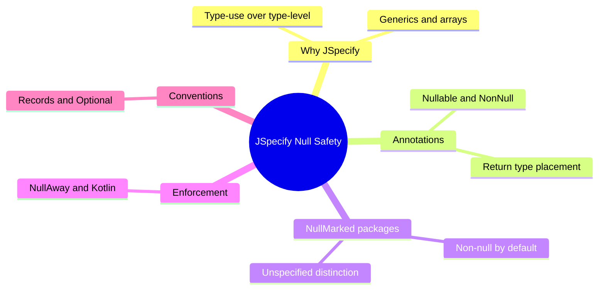
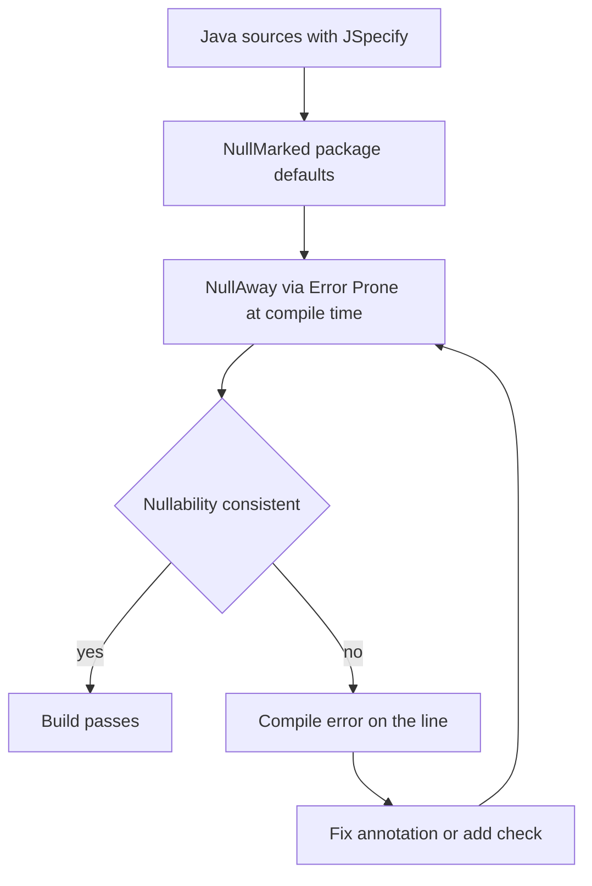

# Module 08: JSpecify Null Safety

Est. study time: 1.5h
Language: en
Description: JSpecify annotations, @NullMarked packages, NullAway enforcement, records and Optionals.

## Knowledge Map



---

## Learning Objectives

After this module you will:

- Explain why `org.springframework.lang` annotations are deprecated in favor of JSpecify.
- Place JSpecify type-use annotations on returns, generics, and arrays.
- Default packages to non-null with `@NullMarked`; reason about unspecified packages.
- Enforce null contracts with NullAway; predict Kotlin build failures.
- Choose among `@Nullable` returns, `Optional`, and nullable record components.

---

## Real-World Example

A payments team upgrades to Boot 4 and everything compiles; then an NPE hits on the first heavy-traffic night: `invoice.customer().email()`. Spring's account lookup, always treated as non-null, returns `null` for a deleted account.

Across Boot 4, Spring re-annotated its own signatures — methods that looked effectively non-null are now declared `@Nullable`. The old annotations were documentation-only, so upgraded signatures could not fail the build; the NPE surfaced on a real customer. The fix: a compile-time null contract — JSpecify plus NullAway.

> **Think**: Why did the compiler not catch this NPE during the upgrade?
>
> *Answer: The old annotations were type-level and enforced by nothing at compile time, so Spring's re-annotated signature could not break the build. Only production dereferencing the null exposed it.*

---

## Core Content

### Why JSpecify: Type-Use over Type-Level

JSR-305 annotations, which `org.springframework.lang` inherited, declare nullness on the whole *declaration* — an approximation. JSpecify annotations are *type-use*: they attach to a specific type position, so nullness composes with generics and arrays.

```java
import org.jspecify.annotations.Nullable;
import java.util.List;

public class InvoiceService {
    public List<@Nullable String> promoReasons(Invoice invoice) {
        return invoice.promos().stream().map(p -> p.reasonOrNull()).toList();
    }
    public String @Nullable [] splitNames(String raw) {
        return raw.isBlank() ? null : raw.split(",");
    }
}
```

`List<@Nullable String>` (non-null list, nullable elements) and `@Nullable List<String>` (nullable list) are different contracts — impossible at declaration level. That is why Boot 4 deprecated `org.springframework.lang` in favor of `org.jspecify.annotations`.

> **Cloze**: "JSpecify annotations are {type-use}, so nullness composes with generics and arrays instead of covering a whole declaration."
>
> *Answer: type-use*

### Annotations and Placement

JSpecify ships four annotations in `org.jspecify.annotations`: `@Nullable`, `@NonNull`, `@NullMarked`, `@NullUnmarked`. Inside a `@NullMarked` package, `@NonNull` is the default and mostly redundant.

The migration moved the return-type annotation from before the type name to *after the modifiers, immediately before the type*.

```java
import org.jspecify.annotations.Nullable;

public class AccountService {
    public @Nullable Account findByLogin(String login) {
        return loginRepository.findByLogin(login);
    }
}
```

In the deprecated style the annotation sat before the type name: `@Nullable Account findByLogin(...)`. The same placement rule applies to parameters, fields, and record components. Keeping the old position is ambiguous — tooling reads it as a declaration-level marker.

> **Predict**: A team migrates imports but keeps `@Nullable Account findByLogin(...)` in the old position. What happens when NullAway runs?
>
> *Answer: The annotation is read as a declaration-level marker, so the return-type contract is not honored precisely. Placing it after the modifier makes the contract machine-readable.*

> **Cloze**: "The migrated form puts the annotation {after} the modifier, immediately before the type."
>
> *Answer: after*

### NullMarked Packages via package-info.java

Per-annotation nullness is verbose, so JSpecify inverts the default at package level: annotate `package-info.java` with `@NullMarked` and every type in that package becomes non-null by default, with `@Nullable` as the explicit opt-out.

```java
@NullMarked
package com.example.billing;

import org.jspecify.annotations.NullMarked;
```

Now a bare `String` means "non-null"; `@Nullable` appears only where absence is a real outcome. Nested packages opt back out with `@NullUnmarked`.

The key distinction: a package *without* `@NullMarked` is **unspecified**, not non-null. Tooling cannot assume either side, so NullAway stays conservative. Only `@NullMarked` gives the checker confidence to flag every unmarked dereference.

> **Think**: A package has no package-info.java and no annotations. Is it non-null by default?
>
> *Answer: No. It is unspecified — neither non-null nor nullable. The checker stays conservative, which is why @NullMarked matters for tooling, not just documentation.*

> **Predict**: You add `@NullMarked` to a legacy package whose methods return null freely. What does the first build show?
>
> *Answer: Compile errors wherever null crosses a non-null boundary — implicit null returns and unchecked dereferences surface at compile time. The migration cost, paid once, for NPEs that cannot reach production.*

### NullAway and Kotlin Enforcement

Annotations are only as strong as the checker that reads them. NullAway, an Error Prone plugin, is the mainstream compile-time enforcer for JSpecify: add `nullaway` and `error_prone_core` to the `annotationProcessorPaths` of `maven-compiler-plugin` (or the Gradle Error Prone plugin) and the build fails on any nullability violation.



Two realities shape migration. Spring's portfolio is re-annotated across Boot 4: a method you call may now be `@Nullable` where it was not, so your signatures must agree — dereference without a check and NullAway stops the build. Kotlin compilers likewise treat JSpecify as a source of truth: treating a `@Nullable` Java return as non-null fails the Kotlin build, and so does returning null for a non-null contract.

> **Think**: Your method returns `Account` but dereferences `loginRepository.findByLogin(...)`, newly `@Nullable`. Where does the build break?
>
> *Answer: At compile time, inside the method body — NullAway flags the dereference before code ships, turning a production NPE into a build failure.*

> **Cloze**: "The mainstream compile-time checker for JSpecify is {NullAway}, an Error Prone plugin."
>
> *Answer: NullAway*

> **Spot the Mistake**: A team claims "we migrated to JSpecify" but a migrated file still imports `org.springframework.lang.annotation.Nullable` and merely swapped package names.
>
> What's wrong?
>
> *Answer: Cosmetic only. Real migration moves to org.jspecify.annotations, repositions annotations as type-use, and turns on a checker — otherwise the contract stays unenforced and re-annotated Spring signatures still slip NPEs through.*

### Records, Optional, and Null Conventions

Records fit type-use nullness: a canonical constructor parameter can carry `@Nullable`, and the accessor returns exactly that contract.

```java
import org.jspecify.annotations.Nullable;
import java.util.List;

public record Payment(
    String id,
    List<@Nullable String> flags,
    @Nullable String gatewayRef) {}
```

Pick per-method semantics. JSpecify does not force `Optional`: `@Nullable` under `@NullMarked` is a clear, enforced absence contract for a one-off lookup. Reserve `Optional` for *container semantics* — when the caller composes absence with `map` and `flatMap`.

```java
import org.jspecify.annotations.Nullable;
import java.util.Optional;

@NullMarked
public class UserService {
    public @Nullable User findByName(String name) {
        return repository.findByName(name);
    }
    public Optional<Address> billingAddress(User user) {
        return Optional.ofNullable(user.address()).filter(Address::billing);
    }
}
```

Conventions: never put null in a collection — return an empty list; for nullable fields, assign from the constructor parameter rather than reading the field inside a constructor, since NullAway forbids dereferencing nullable fields within constructors.

> **Spot the Mistake**: A developer annotates a nullable field `@Nullable` and stops, saying "the annotation documents the contract."
>
> What's wrong?
>
> *Answer: An annotation without a checker is documentation; the contract holds only when NullAway enforces it.*

> **Cloze**: "Kotlin compilers treat JSpecify as a null-safety {source} of truth, so a mismatch between Java and Kotlin fails the Kotlin build."
>
> *Answer: source*

---

## Why This Matters

Null is the top cause of production crashes in Java, and annotation-only conventions never survive refactors. Boot 4 raises the stakes: Spring re-annotated its own API surface, so upgrading without a null contract quietly changes what your calls mean. JSpecify plus NullAway moves failure from a midnight incident to the compile step; one contract guards Java and Kotlin.

---

## Key Takeaways

- `org.springframework.lang` deprecated; JSpecify annotations express nullness per type position.
- Place `@Nullable` after modifiers, before the type — `public @Nullable String foo()`.
- One `@NullMarked` package-info.java defaults a package to non-null; no marker means unspecified.
- NullAway via Error Prone enforces at compile time; Kotlin compilers honor JSpecify as source of truth.
- Records carry `@Nullable` components; `Optional` for composable absence, empty lists not null.

---

## Common Misconception

"Adding `@Nullable` to my code is null safety." The annotation alone changes nothing — a null checker must read it. Null safety is the pipeline: annotations state the contract, `@NullMarked` sets the default, NullAway or Kotlin enforces it at build time.

---

## Spot the Mistake

A method returns a list that is sometimes null, and the developer annotates `@Nullable List<String> getFlags()`, claiming the type-use migration is complete.

What's wrong?

*Answer: The contract is ambiguous — it flags the whole list as nullable but says nothing about elements. A nullable collection is a smell; the convention is a non-null list, possibly empty, with element nullness explicit — `List<@Nullable String>` or empty over null.*

---

## Feynman Explain

Some boxes always hold something, others may be empty. Old labels said "maybe empty" about the whole box; new labels stick to the inside parts — "the box is full, but one toy inside is missing." A guard robot (NullAway) shouts before you reach in empty-handed and warns Kotlin teammates too. Empty boxes get labelled at the factory, not discovered when a customer opens them.

---

## Reframe

Does every codebase need `@NullMarked` everywhere? A small service with few null paths may carry more annotation noise than risk; NullAway adds build cost and a learning curve. `Optional` is not free — a container you must open. The contract pays off where teams change hands, where Spring's re-annotated surface bites, and where Kotlin shares the code. Elsewhere, measure before you annotate.

---

## Drill

Take the quiz, then the cloze deck. MCQs cover placement, unspecified packages, and Kotlin enforcement.

Run: `learn.sh quiz spring-boot 08-jspecify-null-safety`