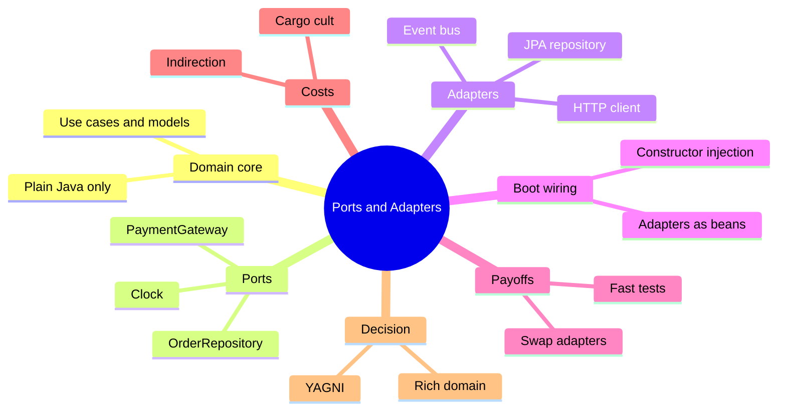
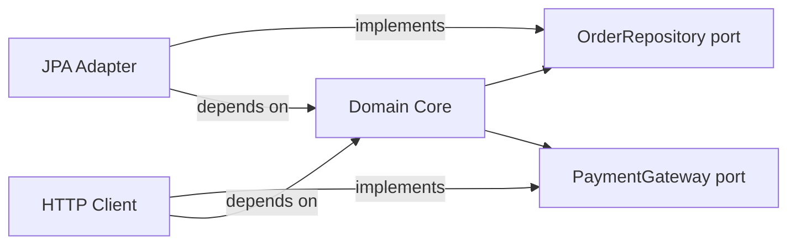

# Module 09: Ports & Adapters (Hexagonal Architecture)

Est. study time: 1.5h
Language: en
Description: Hexagonal architecture for Boot 4. Core, ports, adapters, dependency rule, testability, YAGNI.

## Knowledge Map



---

## Learning Objectives
- Identify ports, adapters, and the domain core in a Boot 4 service
- State the dependency rule and why adapters depend inward
- Wire adapters as Spring beans into a plain-Java core
- Judge when ports and adapters pay off vs when they are cargo cult
- Relate the pattern to Boot 4 modularization and the modern API era

---

## Real-World Example

Your team owns a pricing service where business rules are the product: quotes depend on region, tier, currency, and payment method. Every rule test starts a Spring context, spins up an embedded database, and mocks an HTTP client — one test takes 9 seconds, and a finance-reported discount bug survives because nobody can reproduce it.

A senior suggests pulling the rules out of the Spring world: interfaces for what they need — orders, payments, the current time — in-memory doubles in tests, JPA and HTTP beans in production. The core stops knowing Spring exists; tests drop to milliseconds.

> **Think**: Why did the original design make business-rule tests slow?
>
> *Answer: The core referenced concrete Spring-managed collaborators, so testing rules meant booting the whole stack — yet it needed only narrow interfaces.*

---

## Core Content

### Section 1: Pattern Anatomy and the Dependency Rule

Ports and adapters (hexagonal architecture) draws a clean line through your service. In the middle sits the **domain core**: use cases, domain models, business rules — plain Java, no Spring, no JPA, no HTTP. The core declares **ports**, interfaces named for what it needs — `OrderRepository`, `PaymentGateway`, `Clock`. Around them live **adapters**: infrastructure like a JPA repository, an HTTP client, an event bus.

The dependency rule: adapters depend on the core, the core depends on ports, nothing depends on infrastructure.



Arrows point from dependent to dependency: the core knows only interfaces, the adapters know the core, and the framework sits at the edge. Dependency inversion: high-level policy no longer imports low-level detail; both depend on the interface.

```java
public interface OrderRepository {   // port
    Optional<Order> findById(OrderId id);
    void save(Order order);
}
```

> **Cloze**: "The domain core depends only on {ports}, plain Java interfaces, never on concrete framework classes."
>
> *Answer: ports*

> **Think**: The core calls `orders.findById(id)`. Does it know whether that reads Postgres, an in-memory map, or a mock?
>
> *Answer: No — and that is the point. Written once, the core runs against any implementation, keeping rules fast to test and safe to change.*

### Section 2: Spring Wiring

Spring sits at the edge. Adapters become `@Component` or `@Service` beans; Spring injects them into plain core services. The core stays annotation-free — you build it with `new`, zero Spring.

```java
@Component
public class JpaOrderRepository implements OrderRepository {
    private final OrderJpaRepository jpa;   // Spring Data proxy

    public JpaOrderRepository(OrderJpaRepository jpa) {
        this.jpa = jpa;
    }
    @Override
    public Optional<Order> findById(OrderId id) {
        return jpa.findById(id.uuid()).map(OrderMapper::toDomain);
    }
}

public class PricingService {   // core: no Spring imports
    private final OrderRepository orders;
    private final PaymentGateway payments;
    private final Clock clock;

    public PricingService(OrderRepository o, PaymentGateway p, Clock c) {
        orders = o; payments = p; clock = c;
    }
}
```

Constructor injection (module 01) fits naturally: each core service lists its ports, Spring resolves adapter beans. No `@Autowired`, `@Transactional`, or field annotations in the core.

> **Cloze**: "In Boot, infrastructure {adapters} are annotated beans that Spring injects into the plain Java core."
>
> *Answer: adapters*

> **Spot the Mistake**: A teammate writes an adapter that injects another adapter: `JpaOrderRepository` receives a `NotificationHttpClient` to fire an event when an order is saved. What went wrong?
>
> What's wrong?
>
> *Answer: The core lost control of its side effects — infrastructure fires events the rules never asked for, and the client is coupled to a repository. Adapters get chosen through ports, not wired around the core's back.*

### Section 3: The Testability Payoff

Inject in-memory adapters — a `Map` backed `OrderRepository`, an always-approving `PaymentGateway`, a fixed `Clock` — and the pricing rule runs in a millisecond: no Spring context, database, or network.

```java
class PricingServiceTest {
    @Test
    void tierDiscountAtBoundary() {
        var service = new PricingService(new InMemoryOrderRepository(),
            gate -> new Approved(gate.id()), Clock.fixed(NOW, UTC));
        assertEquals(899_99, service.price(orderAt("GOLD", 999_99)).totalCents());
    }
}
```

Rules run at CPU speed; the Spring-heavy integration suite shrinks to smoke tests proving the adapters connect. On a Boot upgrade (module 02), churn concentrates in adapters; stable ports mean the core barely moves.

> **Predict**: The pricing suite drops from 9 seconds per test to 1 millisecond. What changes about when developers run the rules tests, and what bug class vanishes?
>
> *Answer: Tests run on every keystroke instead of only before merge; flaky-database failures vanish from the rules suite, and the tier-boundary bug becomes a plain assertion.*

> **Spot the Mistake**: A developer "helps" by annotating the core: `@Entity` on the domain `Order` class and `@Transactional` inside the service. What went wrong?
>
> What's wrong?
>
> *Answer: JPA annotations pull persistence into the domain core, so tests now drag Hibernate semantics and a database session; the plain-`new` fast test path dies. Persistence belongs in the JPA adapter, with the domain `Order` kept plain and a mapper between them.*

### Section 4: Costs and Cargo Cult

Ports and adapters are not free: every port is an interface, every adapter needs wiring, and every domain model round-tripping a database needs a mapper between the domain `Order` and its JPA `OrderEntity`. It also invites cargo cult: teams wrap every service in an interface — one interface, one implementation, complexity moved sideways.

A port earns its cost when it has at least two implementations (real plus test double, or v1 and v2 clients), or when domain logic is rich enough that isolation pays. One implementation and trivial logic? Decoration.

### Section 5: Decision Framework — When to Use, When to Skip

Use ports and adapters when:
- Domain core is rich: rules, invariants, state machines that deserve fast tests
- You need multiple implementations of a port: real and stub, several vendors
- You expect framework churn (Boot upgrades, Jackson swaps, REST to DGS)

Skip them — transactional script plus one persistence layer — when:
- Service is CRUD-heavy: save what arrived, read it back, thin rules
- Exactly one implementation exists and logic is testable through the repository
- Mapping cost exceeds benefit for a small team

YAGNI cuts both ways: ports before a second implementation exists are speculative, but so is painting a rich domain into a framework corner and paying in slow, brittle tests. Decide by domain shape, not fashion.

> **Think**: Is adding ports before any second implementation exists "architecture" or speculation?
>
> *Answer: Speculation — one implementation and thin logic means the interface is decoration. Introduce ports when a real second implementation appears.*

> **Cloze**: "For a CRUD-heavy service with one persistence implementation, adding ports is mostly {YAGNI} — a transactional script is the honest shape."
>
> *Answer: YAGNI*

> **Predict**: A product team wraps every service in a port-adapter pair with exactly one adapter each. What appears at review time?
>
> *Answer: Reviews show interfaces that are verbatim copies of their single implementation — pure ceremony. Speculative debt, not architecture.*

### Section 6: Ties to Boot 4 Modularization and the Modern API Era

Ports and adapters and Boot 4 modularization (modules 02/10) are orthogonal but complementary: modularization is compile-time structure — what classes may depend on what — while ports and adapters is runtime dependency direction. A module boundary can house a port with its adapters, while the core module exports only port interfaces, so the boundary enforces the dependency rule.

The modern API era changes nothing. DGS GraphQL (module 03) and REST are both adapters translating requests into core use-case calls — a fetcher is in-bound, a JPA bean is out-bound. Same hexagon, two sides.

---

## Why This Matters

Ports and adapters decide whether your domain is an asset or a hostage. On rich-rule services, isolating the core makes rules testable at speed, keeps a Boot 4 (or future) upgrade boring, and lets you swap vendors freely. Mindlessly applied to CRUD, it becomes ceremony that slows every change. Senior engineers ask: where is the domain, and what does it depend on?

---

## Key Takeaways
- Core holds rules, ports hold interfaces, adapters hold infrastructure; adapters depend inward
- Spring is an edge concern: adapters are beans, core is plain Java
- Ports earn cost via test doubles, multiple implementations, or framework churn
- Skip the pattern for CRUD-heavy services with one implementation
- Modularization (compile-time) and the pattern (runtime) complement each other

---

## Common Misconception

"Ports and adapters means microservices." It does not. The hexagon is a code-internal layering pattern for one deployable; microservices is a split of deployment and ownership across processes. A monolith can use it; microservices can ignore it.

---

## Spot the Mistake

```java
@Service
class OrderService {
    @Autowired private JpaOrderRepository repo;   // concrete class, not a port
}
```

A teammate says: "We use Spring, so we do not need ports. The service talks to the repository directly."

What's wrong?

*Answer: The core depends on a concrete repository, drags infrastructure into the service layer, and hides side effects. The fix: define an `OrderRepository` port the core calls, keep entities inside the adapter, and expose notification as a port the core chooses to call.*

---

## Feynman Explain
Explain to a child: "The business rules are the chef. The chef does not phone suppliers or scrub pans — they shout orders to a hatch. Anyone can stand there: the real kitchen, a pretend kitchen, even a robot kitchen. As long as the hatch stays the same, the chef never changes." No jargon. Do NOT move on until it holds.

---

## Reframe
Judge the pattern: worth it for a 400-test pricing engine, not for a five-table admin CRUD. Where is the honest boundary? Write your decision rule — what evidence (second implementations, rule density, upgrade history) tips you either way?

---

## Drill
Run: `learn.sh quiz spring-boot 09-ports-adapters`
