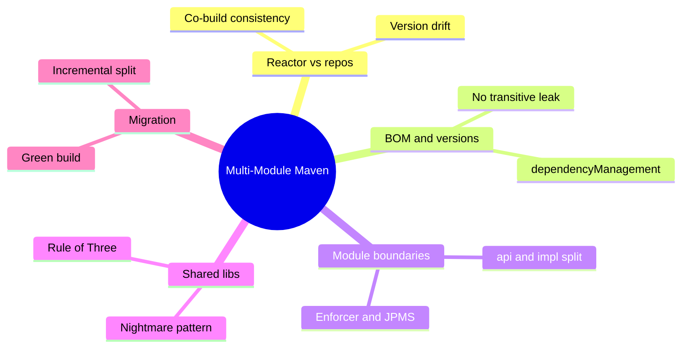
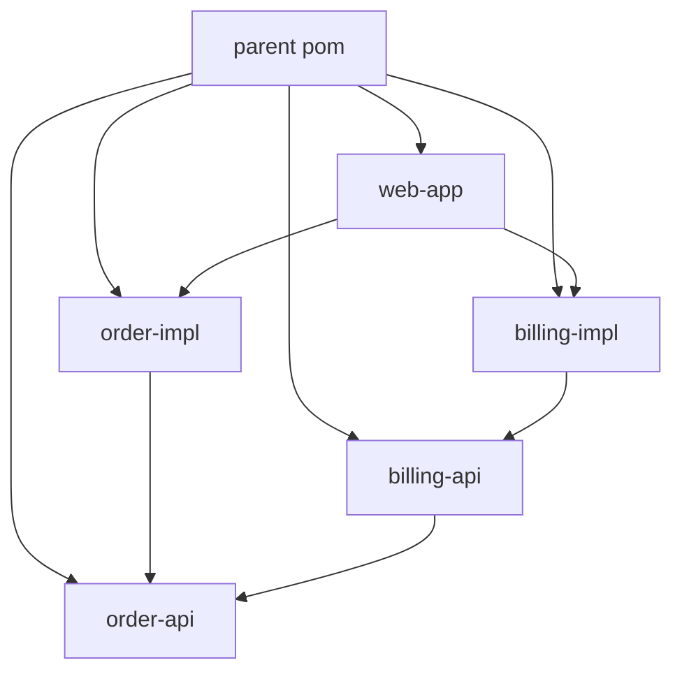

# Module 10: Multi-Module Maven & Shared Lib Strategy

Est. study time: 1.5h
Language: en
Description: Reactor vs separate repos, BOM, module boundaries, shared-lib cycle, Rule of Three.

## Knowledge Map



---

## Learning Objectives

After this module you will:

- Compare a reactor against separate versioned repos, weighing co-build consistency against release coupling.
- Build a platform BOM that pins versions without leaking dependencies.
- Split api from impl, boundaries enforced by Enforcer, ArchUnit, or JPMS.
- Diagnose the shared-lib nightmare and apply the Rule of Three.
- Plan an incremental migration from one commons module to focused modules, green at every step.

---

## Real-World Example

A payments platform started a module named `common` with two DTOs and a date helper. Three years later it held 400 classes, and all 15 services depend on it. When one service needed a newer JSON library, all 15 took the hit because `common` exposed it transitively; even a date change meant auditing every consumer. Boot 4 migration stalled for weeks.

> **Think**: Why did a module that started with two DTOs become the bottleneck for every release?
>
> *Answer: No rule said what belongs there. Convenience let every team dump code in, so it accumulated unrelated dependencies everyone inherited. Lockstep and blast radius followed.*

---

## Core Content

### Reactor or Separate Repos: The Shape of the Build

A **multi-module reactor** is a parent pom plus sibling modules built in one command. It resolves inter-module dependencies from the build itself, so a change recompiles and tests its consumers in the same build — co-build consistency. Cost: one repo, one version, one release; you cannot ship module A without module B.

**Separate repos** with versioned artifacts break that coupling: each releases on its own cadence, consumers pick their version. Without a shared source of truth, versions drift: X stays on Jackson 2 while Y moves to Jackson 3.

> **Predict**: A team adds a fifth module but forgets to list it in the parent pom `<modules>`. What happens?
>
> *Answer: Invisible to the reactor build — never built with siblings, references fail against local repository artifacts.*

> **Cloze**: "A {reactor} resolves sibling module dependencies from the current build, not installed artifacts."
>
> *Answer: reactor*

### BOM Basics: dependencyManagement, Not dependencies

A **BOM** (Bill of Materials) is a pom that manages versions without adding jars. `spring-boot-dependencies` works this way: import it in the parent's `dependencyManagement` to pin hundreds of versions.

```xml
<dependencyManagement>
  <dependencies>
    <dependency>
      <groupId>org.springframework.boot</groupId>
      <artifactId>spring-boot-dependencies</artifactId>
      <version>4.0.2</version>
      <type>pom</type>
      <scope>import</scope>
    </dependency>
  </dependencies>
</dependencyManagement>
```

Children declare dependencies without `<version>`; the parent fills it in.

`dependencyManagement` **manages versions**, `dependencies` **adds jars**. A BOM uses `dependencyManagement` so consumers get the managed version only when they choose the dependency. Put libs in `dependencies` and every consumer inherits them transitively — the lockstep the BOM was meant to kill.

> **Spot the Mistake**: A team builds its platform BOM and puts every internal library in `<dependencies>` so consumers "get them for free."
>
> What's wrong?
>
> *Answer: Dependencies in a BOM flow transitively to every consumer, forcing everyone onto one dependency set. A BOM must use dependencyManagement so consumers opt in.*

> **Cloze**: A BOM centralizes versions through {dependencyManagement}, setting managed versions without adding jars.
>
> *Answer: dependencyManagement*

> **Think**: Two teams share a platform BOM. A needs Guava 33, B needs Guava 30, the BOM pins 31. Why is one managed version still the right default?
>
> *Answer: One pinned version keeps the platform predictable and testable as a unit. Rare overrides are cheap; untracked divergence is drift.*

### The api/impl Split and Enforcing Boundaries

A module boundary is only real when enforced. The workhorse is the **api/impl split**: an `api` module holds DTOs and interfaces; an `impl` module depends on it.

```java
public interface OrderGateway {
    OrderDto submit(OrderCommand command);
}
```

The arrow points one way: `impl` depends on `api`; `api` depends on nothing from `impl` or implementation frameworks. Consumers depend on `api` and swap implementations freely.

Enforcement:

- **Maven Enforcer** with `import-control` rules bans forbidden imports: `org.hibernate` outside persistence fails the build.
- **ArchUnit** (module 14) tests rules in CI, e.g. no `..api..` class depends on `..impl..`.
- **JPMS `module-info.java`** (Framework 7 and Boot 4 use it): the compiler checks `exports` and `requires`.

```java
// order-api: module-info
module com.acme.order.api {
    exports com.acme.order.api;
}
```

```java
// order-impl: module-info
module com.acme.order.impl {
    requires com.acme.order.api;
}
```

Dependency graph:



> **Think**: Why does `api` never declare `spring-boot-starter-web` or a persistence framework?
>
> *Answer: `api` is a contract. Any framework leaking into it forces every consumer onto that framework.*

> **Cloze**: In the api/impl split, the {api} module holds DTOs and interfaces, not implementation.
>
> *Answer: api*

> **Predict**: A developer imports a persistence annotation into `order-api` and the build still passes because no enforcer rule exists. What later?
>
> *Answer: The contract silently binds consumers to the persistence framework; boundary held by convention only. Rules, not habits, keep boundaries.*

### The Shared-Lib Nightmare and the Rule of Three

The "common module for everything" is the anti-pattern. Once every module depends on it, every dependency it declares sits on every classpath, every change has a repo-wide blast radius, and reactor lockstep turns toxic.

Cure: thin, domain-driven sharing.

- Split by need: `security-core`, `billing-dto`, `observability-support`.
- Keep each module thin. A date-helper module has no Spring Security.
- Duplicate trivial utilities. Three copies of a 10-line helper beat a shared module.

The **Rule of Three** is the trigger: extract a shared library only when the same logic appears a third time. The first two copies are fine; the third justifies the abstraction, because the contract's shape is visible by then.

> **Cloze**: "The {Rule of Three} says extract a shared library only after three occurrences of the same logic."
>
> *Answer: Rule of Three*

> **Predict**: The `security-core` module, used by two services, gains a WebFlux dependency for one consumer. What happens to the other?
>
> *Answer: The WebFlux jar lands on its classpath too and may conflict with its servlet stack. A shared module promises all consumers: one's need becomes everyone's cost.*

### Migration Strategy: Split Incrementally, Stay Green

A monolith of commons is split the way any large refactor succeeds: small steps, green after each.

1. **Map reality.** Run `mvn dependency:tree`; most modules use a fraction of `common`.
2. **Normalize versions first.** Import the platform BOM so modules resolve the same versions before code moves.
3. **Extract the smallest self-contained slice first** — a pure utility with no Spring. Move it, build, ship.
4. **Add enforcer rules as you go.** Ban old `common` imports module by module.
5. **Delete dead code.** A thin module you can reason about beats a broad one you cannot.
6. **Repeat until `common` is empty, then delete it.**

Green at every step makes the migration boring — and boring refactors finish.

> **Think**: After splitting `common` into five focused modules, the reactor still releases them together. When does that lockstep start to hurt?
>
> *Answer: When modules stabilize at different rates — one stable contract, one actively evolving — releasing the stable one through the full reactor slows its cadence. That signals promoting it to its own repo and version.*

> **Spot the Mistake**: A team "finishes" the migration by creating `common-v2` with better package names, then moving the same 400 classes in.
>
> What's wrong?
>
> *Answer: Renaming the dumping ground does not fix it. Classes must be distributed by domain into focused modules with enforcer rules and a BOM; otherwise common-v2 becomes the new graveyard.*

---

## Why This Matters

Every senior engineer inherits a repo whose build shape they did not choose. The reactor-versus-repos decision controls how fast the team ships and how bad upgrades get. Boot 4 raises the bar: its autoconfigure modularization (module 02) is the template — per-subsystem modules with explicit `module-info` boundaries. Get boundaries wrong and every upgrade becomes cross-team negotiation.

---

## Key Takeaways

- Reactor: co-build consistency at the price of one-version, one-release coupling; separate repos invert the tradeoff.
- A BOM pins versions via dependencyManagement; dependencies in a BOM leak jars to every consumer.
- Split into api and impl; enforce the arrow with Enforcer, ArchUnit, or JPMS.
- One common module is a latency bomb; share thin, domain-focused modules, duplicate trivial utils.
- Migrate incrementally: normalize versions, extract the smallest slice, stay green, delete unused.

---

## Common Misconception

"Multi-module Maven means more modular code." Splitting poms does nothing for architecture — 20 modules with one fat `common` is still a monolith. Modularity is a dependency property: each module declares exactly what it needs, and rules enforce it. Poms are plumbing, not architecture.

---

## Spot the Mistake

A service declares `spring-boot-starter-web` even though it only consumes DTOs from a library that uses the Servlet API. The developer says "the BOM manages it, so it is fine."

What's wrong?

*Answer: The BOM manages versions, not choices. Declaring a starter adds its whole dependency tree regardless of need. The import sets the version; the module decides what to add.*

---

## Feynman Explain

A project is like a kitchen. A reactor is one kitchen where every cook tastes the others' dishes. Separate repos are kitchens in different buildings sending frozen meals. A BOM is the shared recipe book, so every kitchen cooks with the same amounts. The shared-lib nightmare is one cupboard every kitchen must take from, so every meal secretly contains whatever it holds. The api/impl split: menus are agreed in one place while cooking happens elsewhere — the enforcer checks that the menu, not the kitchen, decides the meal.

---

## Reframe

Is splitting into modules always right? A two-service company with one stable codebase gains little from a reactor, even less from five libraries. Every boundary is a contract you must version, document, and enforce; a wrong split creates ceremony without isolation. Modularity is justified by measured coupling pain — upgrade friction, broken consumers, cross-team negotiation — not fashion. Boot 4 modularized its autoconfigure in response to real release pain; match that response.

---

## Drill

Take the quiz, then the cloze deck. Coverage: reactor mechanics, BOM semantics, boundary enforcement, migration sequencing.