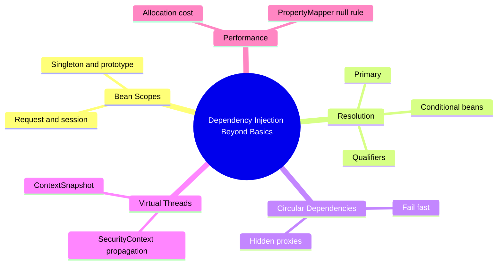
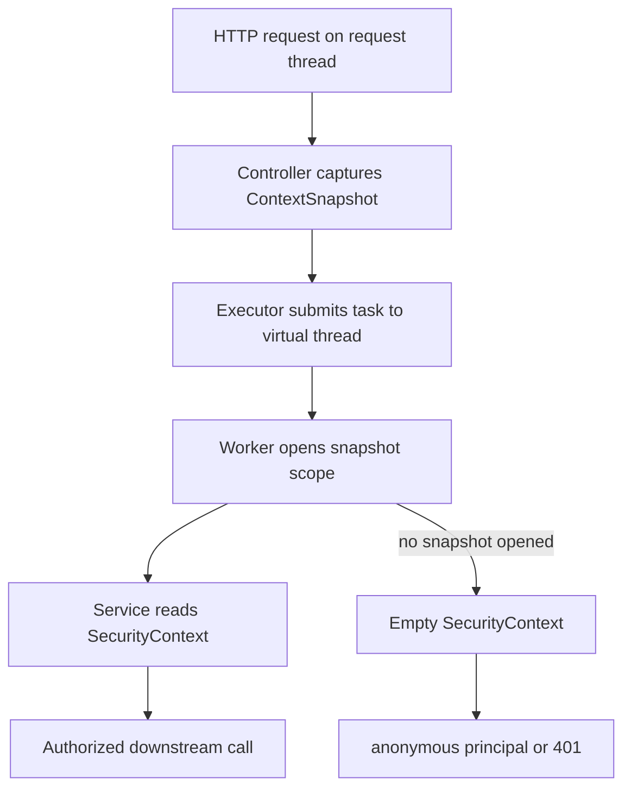

# Module 11: Dependency Injection Beyond Basics

Est. study time: 1.5h
Language: en
Description: Scopes, qualifiers, conditionals, cycles, virtual-thread context propagation.

## Knowledge Map



---

## Learning Objectives

After this module you will:

- Choose the right bean scope and predict the prototype pitfall when a singleton caches a prototype instance.
- Resolve multi-bean injection with role-based qualifiers and `@Primary`; order conditional beans correctly.
- Distinguish constructor cycles that fail fast from proxy-hidden cycles; fix with redesign, not `@Lazy`.
- Propagate `SecurityContext` across virtual threads with `ContextSnapshot` and a configured `TaskExecutor`.
- Recall the `PropertyMapper` null-skip default and weigh scope costs on hot paths.

---

## Real-World Example

A billing team ships an order-export job. Boot 3 ran it on a hand-wired platform pool; Boot 4 defaults to virtual threads, so they swap in a lightweight executor. Night one: every invoice shows operator `anonymous`; auth calls return 401.

The exporter stamps each invoice from `SecurityContextHolder` (thread-local); a fresh virtual thread runs the export — the hand-rolled executor skipped Spring's async machinery, leaving the worker thread-local empty.

> **Think**: Why did the same code work on the platform pool and break after the executor swap?
>
> *Answer: The swap changed which thread runs the work, not the code. The old pool happened to reuse request-thread state; virtual threads carry no thread-local from the request thread unless something propagates it.*

---

## Core Content

### Bean Scopes

A scope decides who owns an instance and how long it lives. Default `singleton`: one instance per `ApplicationContext`, shared by every injection point — right for stateless services.

`prototype` gives every lookup a fresh instance. Request and session scopes hand out one instance per request or session, and still work on virtual threads.

The catch: a prototype injected into a singleton is created once at wiring and cached forever — the fresh-instance promise quietly dies.

> **Predict**: `ReportService` is a singleton with a `@Scope("prototype") ExportCursor` field injected via constructor. Two concurrent exports call `cursor.nextOffset()`. What does the app observe?
>
> *Answer: A single shared cursor. The prototype was instantiated once at wiring, so both exports read the same offset sequence — a data race, not a fresh cursor per export.*

> **Cloze**: "A bean requested as a fresh instance at every injection point has scope {prototype}."
>
> *Answer: prototype*

### Qualifiers, Primary, and Conditional Beans

Two beans of one type make injection ambiguous — startup fails. Fix: mark one `@Primary`, or select explicitly with `@Qualifier`. Prefer qualifiers naming a *role*, not an implementation — swapping implementations should not force renaming injection points.

Conditional beans exist only when a condition holds: `@ConditionalOnProperty`, `@ConditionalOnClass`, `@ConditionalOnBean`, `@ConditionalOnMissingBean`. They evaluate against the context *as built so far* — `@ConditionalOnBean` placed before the bean it checks sees an absent bean and backs off.

> **Cloze**: "Conditional annotations are evaluated against the context built so far, so definition {order} decides whether a conditional bean sees its dependency."
>
> *Answer: order*

> **Spot the Mistake**: A team has `CardGateway` and `WalletGateway` and annotates the constructor parameter `@Qualifier("cardGateway")`, "so everyone knows exactly which bean we mean."
>
> What's wrong?
>
> *Answer: The qualifier names the implementation, not the role. Swap CardGateway and every injection point must change. Role-based names — "cardPayments" versus "walletPayments" — survive implementation changes.*

### Circular Dependencies: Fail Fast or Hidden

Module 01 used constructor injection. Cycles surface at startup: when `A` needs `B` and `B` needs `A`, both via constructors, neither builds first — `BeanCurrentlyInCreationException` at boot.

Setter or field injection hides the cycle: the container builds `A` empty, `B` gets a lazy proxy to `A`, Boot starts; the proxy defers construction to the first real call.

Spring tolerates proxy-backed cycles; good design does not. Redesign — extract shared logic into a third bean — not `@Lazy`, which postpones failure.

> **Think**: An app starts fine but throws `BeanCurrentlyInCreationException`. Is that a bug report or a feature?
>
> *Answer: A feature. Constructor injection surfaced the cycle at startup — a boot failure and instant fix — instead of a runtime call that blows up in production.*

> **Spot the Mistake**: A team "fixes" a constructor cycle by moving one dependency to setter injection. The app boots, tests pass. They call it done.
>
> What's wrong?
>
> *Answer: The cycle still exists — setter injection only replaced the eager failure with a lazy proxy that defers the problem to the first real call. Redesign the cycle away with a third bean.*

> **Cloze**: "A constructor-injected dependency cycle is exposed at {startup}, failing fast instead of hiding behind a lazy proxy."
>
> *Answer: startup*

### Context Propagation on Virtual Threads

Boot 4 enables virtual threads by default (`spring.threads.virtual.enabled` true), so `@Async` and other Spring-managed code may run on them. Blocking IO turns cheap — the JDK parks many threads on one scheduler. Cheap threads do not mean free context: `SecurityContext`, request attributes, MDC live in thread-locals — a virtual thread starts empty.

That broke the billing example. `ContextSnapshot` captures a thread's context — `SecurityContext`, request attributes, MDC — and re-establishes it elsewhere.

```java
ContextSnapshot snapshot = ContextSnapshot.captureAll();
executor.execute(() -> {
    try (ContextSnapshot.Scope scope = snapshot.open()) {
        exportService.exportInvoice(invoiceId);
    }
});
```

Inside `exportService`, `SecurityContextHolder.getContext()` sees the captured auth. Two paths: wrap work with `ContextSnapshot`, or use a propagation-aware `@Async` executor — Spring Security ships `SecurityContextPropagator` / `ContextPropagatingTaskDecorator`, Micrometer covers MDC.



> **Predict**: The team wires `@Async` with a plain `ThreadPoolTaskExecutor` and no decorator. A `@Async sendConfirmationEmail` method checks `SecurityContextHolder` for the recipient's principal. What ships?
>
> *Answer: An anonymous context. Without a propagation-aware executor, the async task runs with an empty thread-local and any security check inside it fails.*

> **Think**: Virtual threads made blocking IO cheap. What did they *not* make cheap?
>
> *Answer: Context. Each virtual thread starts with empty thread-locals, so SecurityContext, request attributes, and MDC must be copied explicitly — exactly what ContextSnapshot does.*

> **Cloze**: "Spring re-establishes a captured request context on a worker thread with {ContextSnapshot}."
>
> *Answer: ContextSnapshot*

### Performance and the PropertyMapper Note

Scopes are a performance decision. Singleton default: one allocation per type for the whole app. Prototypes allocate per injection — a prototype in a hot loop is per-iteration garbage. Request scope adds a lookup per request; fine for controllers, wasteful in a million-row batch. Conditional evaluation is a startup cost.

`PropertyMapper` (Boot) copies a source to a target property *only when the source is non-null* — a null source is silently skipped; chain `.always()` to bind null explicitly. Same principle as Module 08's JSpecify rule, at property level: null = "leave the target untouched" unless you opt in.

> **Think**: A config loader uses `PropertyMapper` and a field stays at its default even though the yaml said nothing. Bug?
>
> *Answer: No. Null sources are skipped by design — the target keeps its previous value. Use `.always()` only when an explicit null must overwrite.*

---

## Why This Matters

Default DI keeps working until it does not. This module's three failures — cached prototypes, hidden circular dependencies, lost `SecurityContext` on virtual threads — all start as "it compiled and ran fine in tests." With virtual threads default, every hand-rolled executor and `@Async` call is a potential context leak. Understanding scopes, resolution, and propagation turns an incident into a design choice made up front.

---

## Key Takeaways

- `singleton` default, cheapest; `prototype` fresh per injection but dies inside a caching singleton.
- Resolve ambiguity with role-based `@Qualifier`/`@Primary`; conditional beans read context built so far — order matters.
- Constructor injection fails cycles at startup; setter/field injection hides them behind lazy proxies — redesign, not `@Lazy`.
- Virtual threads default in Boot 4; hand-rolled executors lose thread-locals — propagate with `ContextSnapshot` or a propagation-aware executor.
- `PropertyMapper` skips null sources unless `.always()`; scope choices are allocation decisions.

---

## Common Misconception

"Virtual threads mean I can ignore thread pooling and thread-locals." Virtual threads remove the *blocking* penalty, not the *context* problem: thread-local data does not travel between threads, and the JDK scheduler creates fresh threads. Same code loses `SecurityContext`, MDC, and request attributes unless propagation is explicit.

---

## Spot the Mistake

A developer "modernizes" the async pipeline: `@Async` on export, `ThreadPoolTaskExecutor` with virtual threads, no decorator, no snapshot — reasoning "the executor is Spring-managed, so Spring keeps my context."

What's wrong?

*Answer: Spring manages the executor, not the thread-locals. A plain executor never copies the SecurityContext, request attributes, or MDC onto the worker thread. Without ContextSnapshot, a propagation-aware decorator, or the Micrometer context-propagation integration, the async method runs anonymous.*

---

## Feynman Explain

A nametag you pin on at the front desk. A helper takes the call in another room — but wears no nametag, so the receipt is stamped "guest" even though you know who called. Virtual threads are the helper: fast, many, but each starts nameless. ContextSnapshot is a photocopy of the nametag you hand over. Constructor injection is a building that refuses to hire two workers who each wait on the other — it fails the interview before they can deadlock.

---

## Reframe

Is the fail-fast cycle rule absolute? Spring's proxy-backed cycles let real systems boot, and `@Lazy` buys migration time. The trade is visibility: an eager cycle is a two-line fix at boot; a lazy cycle is a stack trace at 3am. Virtual-thread propagation has the opposite tension — `ContextSnapshot` everywhere is ceremony, but forgetting it leaks principals silently. Default strict; deviate only where measured.

---

## Drill

Take the quiz, then the cloze deck: scope semantics, qualifiers, cycle behavior, thread-context propagation.

Run: `learn.sh quiz spring-boot 11-di-beyond-basics`