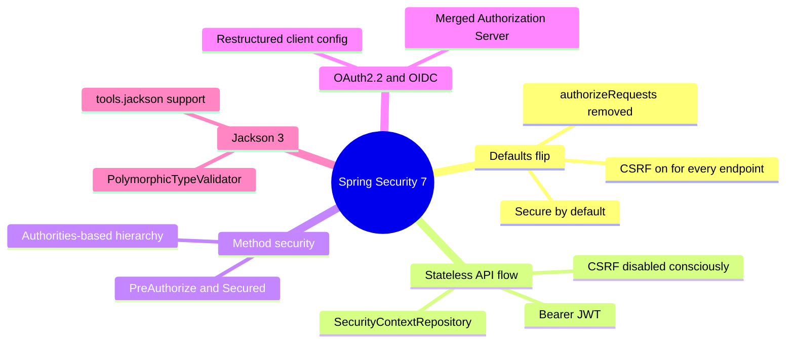
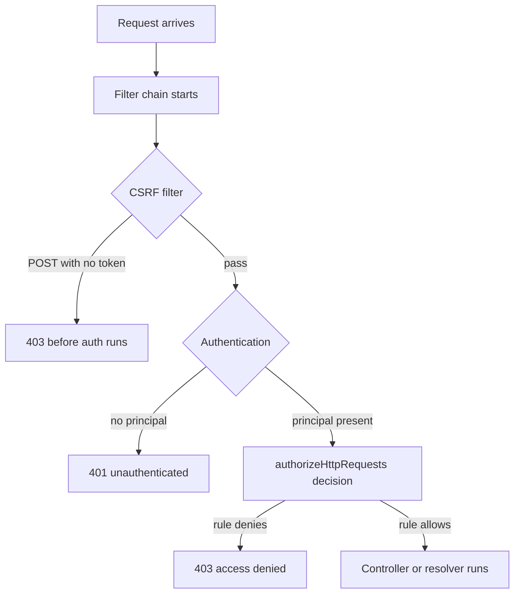

# Module 12: Spring Security 7

Est. study time: 1.5h
Language: en
Description: CSRF on APIs, authorizeHttpRequests, method security, OAuth2 restructure.

## Knowledge Map



---

## Learning Objectives

- Explain why Security 7 flips CSRF on for all endpoints and what that breaks.
- Migrate removed `authorizeRequests()` to `authorizeHttpRequests()`.
- Design a stateless token flow that disables CSRF consciously and stores no session state.
- Apply `@PreAuthorize` method security with an authorities-based role hierarchy.
- Use OAuth2.2 clients, the merged Authorization Server, and Jackson 3 safe default typing.

---

## Real-World Example

A mobile team runs a stateless REST API on Boot 3.x — every request carries `Authorization: Bearer`, no cookies. Team bumps to Boot 4 (bundles Security 7). Upgrade calm — until logs show 403 on every POST, PUT, DELETE. GET works. Token valid. Server log: "Invalid CSRF token".

The client did nothing wrong. Security 7 enables CSRF on all endpoints, APIs included — Security 6 protected only form-login flows.

> **Think**: Why does a Bearer-token client get 403 on POST with a valid JWT?
>
> *Answer: The CSRF filter runs early in the chain and rejects state-changing requests with no CSRF token. JWT authenticates, but CSRF and authentication are separate gates.*

---

## Core Content

### Security 7 Defaults and the CSRF Flip

Security 6 shipped CSRF with browser forms in mind — the token matters when a browser auto-sends credentials; stateless API clients never sent cookies. Security 7 enables CSRF for all endpoints, API included. A POST with no CSRF token dies with 403 before any controller runs.

Philosophy: secure by default. Boot 4 ships safe defaults. Cookie clients keep CSRF; stateless bearer clients disable it deliberately.



> **Think**: A GET request still works after the upgrade. Why does the flip spare GET?
>
> *Answer: CSRF protects state-changing requests. GET counts as safe; the check only bites POST, PUT, PATCH, DELETE.*

> **Cloze**: "Security 7 enables {csrf} protection for all endpoints by default, where Security 6 applied it mainly to form-login flows."
>
> *Answer: csrf*

> **Predict**: You upgrade but never touch security config. Your cookie-session admin app keeps working; your stateless mobile API starts failing. What does that tell you?
>
> *Answer: The default matches cookie-session apps and punishes stateless ones. The API must declare its threat model — disable CSRF for bearer tokens, adopt token exchange.*

### authorizeHttpRequests Replaces authorizeRequests

`authorizeRequests()` removed, not deprecated. Boot 3 config fails to compile on Boot 4; every rule moves to `authorizeHttpRequests()` with a lambda.

```java
@Configuration
@EnableWebSecurity
public class SecurityConfig {

    @Bean
    SecurityFilterChain chain(HttpSecurity http) throws Exception {
        return http
            .authorizeHttpRequests(auth -> auth
                .requestMatchers("/api/public/**").permitAll()
                .requestMatchers("/api/orders/**").authenticated()
                .requestMatchers("/api/admin/**").hasRole("ADMIN")
                .anyRequest().denyAll())
            .build();
    }
}
```

Rules evaluate in order, first match wins, `anyRequest()` the final catch-all. Module 05 applies the same chain to GraphQL layers.

> **Spot the Mistake**: A migration guide says "authorizeRequests is deprecated, keep it until Spring 9." Team copies its old config unchanged.
>
> What's wrong?
>
> *Answer: Deprecation is the wrong label. The method was deleted, not deprecated. Build breaks on Boot 4; config must move to authorizeHttpRequests.*

> **Cloze**: "The removed authorizeRequests method is replaced by a single {authorizeHttpRequests} lambda-based API for all request rules."
>
> *Answer: authorizeHttpRequests*

### Stateless Token Flow

CSRF exists because browsers attach cookies automatically. A stateless Bearer JWT sends nothing, so CSRF guards nothing and costs round trips. Disabling it is right — only when auth is genuinely not cookie-based.

```java
@Bean
SecurityFilterChain securityFilterChain(HttpSecurity http) throws Exception {
    return http
        .csrf(csrf -> csrf.disable())
        .sessionManagement(s -> s.sessionCreationPolicy(STATELESS))
        .securityContext(c -> c.securityContextRepository(
            new RequestAttributeSecurityContextRepository()))
        .authorizeHttpRequests(auth -> auth.requestMatchers("/api/**").authenticated())
        .oauth2ResourceServer(o -> o.jwt(j -> j.jwtAuthenticationConverter(
            new JwtAuthenticationConverter())))
        .build();
}
```

Three decisions. `csrf.disable()` is deliberate: no cookies, nothing to forge. `STATELESS` plus a request-attribute `SecurityContextRepository` means no HTTP session. Resource server converts the JWT into a principal.

> **Spot the Mistake**: A cookie-session web app "modernizes" by copying the stateless config, `csrf.disable()` included.
>
> What's wrong?
>
> *Answer: A browser auto-sends the session cookie on every state-changing request, so CSRF attacks forge those requests unseen. Bearer-only auth is the precondition for that disable.*

> **Predict**: You disable CSRF but keep the default session-based `SecurityContextRepository`. What happens on horizontal scale-out?
>
> *Answer: The principal lives in the HTTP session, so a load balancer must pin or share sessions. The request-attribute repository stays session-free.*

> **Cloze**: "A stateless flow stores the authenticated principal in a {SecurityContextRepository} scoped to the request, not in the HTTP session."
>
> *Answer: SecurityContextRepository*

### Method Security and Role Hierarchy

Chain rules gate the URL; method security gates the code. `@EnableMethodSecurity` activates `@PreAuthorize` and `@Secured`.

```java
@EnableMethodSecurity
class OrderService {

    @PreAuthorize("hasRole('ADMIN') or hasAuthority('orders:cancel')")
    void cancel(OrderId id) {
    }
}
```

Security 7 changes role hierarchy: the old hierarchy bean becomes an authorities-based one. "ADMIN outranks USER" becomes an authority mapping.

```java
@Bean
GrantedAuthoritiesMapper roleHierarchy() {
    return new RoleHierarchyAuthoritiesMapper(
        RoleHierarchyImpl.withHierarchy("ROLE_ADMIN > ROLE_USER").build());
}
```

`ROLE_ADMIN > ROLE_USER` means an ADMIN also holds USER authorities, so an ADMIN passes both checks. Old beans wired `RoleHierarchyImpl` directly into the chain; those no longer apply.

> **Think**: Why does hierarchy route through a `GrantedAuthoritiesMapper` instead of the old role bean?
>
> *Answer: Mapper expands the authority set at authentication time so every downstream check sees it. Hierarchy becomes a pure authority transformation.*

### OAuth2.2, OIDC, and the Merged Authorization Server

Security 7 restructures OAuth2 client properties. Boot 3 config sits in a different layout in Boot 4 — `application.yml` needs re-mapping, not a copy. OAuth2.2 refines flows; OIDC adds an ID token for identity.

Authorization Server code moved into Spring Security as one artifact, so Boot 4 apps host it without an extra dependency.

New keys: `spring.security.oauth2.client.registration.orders-app` and `.provider.keycloak.issuer-uri`. Treat Boot 3 OAuth2 config as a starting point; verify each property.

> **Think**: Why does the Authorization Server merge reduce the cost of moving to Boot 4?
>
> *Answer: One artifact, one version train, one upgrade.*

### Jackson 3 and Safe Default Typing

Security 7 with Jackson 3 moves packages from `com.fasterxml.jackson` to `tools.jackson`.

The sharp edge is polymorphic typing. The payload type name decides which class gets instantiated — raw polymorphic input without a validator is a classic RCE vector. Security 7 gates default typing through a `PolymorphicTypeValidator` allowing only expected types.

```java
PolymorphicTypeValidator validator = BasicPolymorphicTypeValidator.builder()
    .allowIfSubType("com.orders.token.")
    .build();
```

> **Spot the Mistake**: A team accepts arbitrary polymorphic JSON because "Jackson 3 is memory-safe now."
>
> What's wrong?
>
> *Answer: No Jackson version makes polymorphism safe by itself. The payload type name chooses the class; a validator restricts it to your packages. Without one it stays a deserialization RCE target.*

> **Cloze**: "Security 7 validates polymorphic JSON against a {PolymorphicTypeValidator} before type-based deserialization."
>
> *Answer: PolymorphicTypeValidator*

> **Predict**: You register a new DTO package but forget to add it to the validator allow list. Client deserialization of that DTO starts failing. Is that a bug or a feature?
>
> *Answer: The default working as designed. The validator denies anything not explicitly allowed; extend the allow list, do not weaken.*

---

## Why This Matters

Security mistakes compound silently. CSRF flip breaks production on upgrade day; removed `authorizeRequests()` breaks the build the same day. Security 7 forces you to say what your API trusts — no cookies and no CSRF for stateless APIs, a provider for OAuth2, explicit types for polymorphic JSON.

---

## Key Takeaways

- Security 7 enables CSRF for all endpoints; stateless bearer APIs disable it deliberately, cookie apps keep it.
- `authorizeRequests()` is removed, not deprecated — `authorizeHttpRequests()` is the only path.
- Stateless means no session: bearer JWT, request-scoped `SecurityContextRepository`, `STATELESS` policy.
- Method security runs on `@EnableMethodSecurity` plus `@PreAuthorize` and `@Secured`; role hierarchy is now an authorities mapping.
- OAuth2 client properties restructured, the Authorization Server merged into Spring Security, Jackson 3 typing gated by a validator.

---

## Common Misconception

"Security is a feature you add at the end." Wrong. Boot 4 ships secure defaults; make the default right for your API. The CSRF flip proves it. Security posture is a continuous decision.

---

## Feynman Explain

To a child: a door guard (CSRF) asks for a ticket before you change anything. The old guard asked only in the browser world; the new guard asks everyone. A phone app holds no ticket, so the guard stops it — until the owner says "this phone carries no cookies, let it through." The phone password is the JWT; the guard writes the rule book (`authorizeHttpRequests`) instead of the torn-up old one (`authorizeRequests`). When a package claims to be anything, the guard checks a whitelist (`PolymorphicTypeValidator`).

---

## Reframe

When does "disable CSRF" break? Any hybrid app where a browser path and a bearer path share one API — cookies in play, the disable wrong for that route. When does the authorities hierarchy fail? Two flat roles make it pure machinery. The Authorization Server merge only helps if versions move together. Principles hold; apply per threat model.

---

## Drill

Take the quiz, then the cloze deck. MCQs test recall, scenario judgment, and stateless design tradeoffs.

Run: `learn.sh quiz spring-boot 12-spring-security-7`