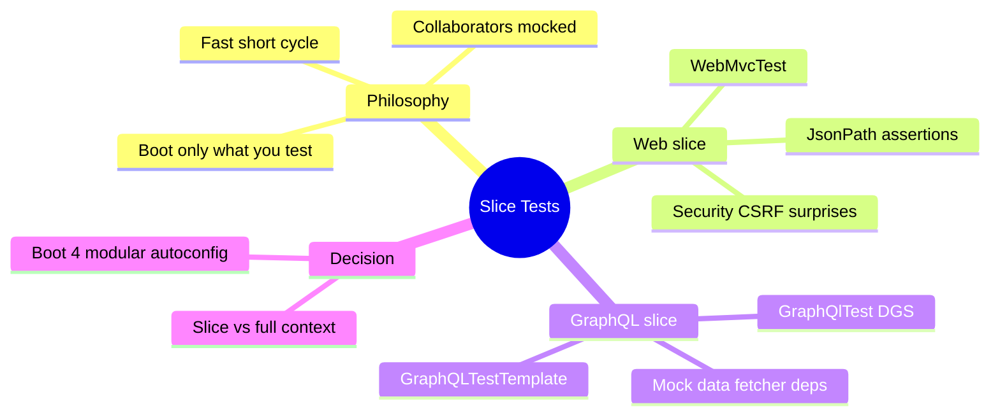
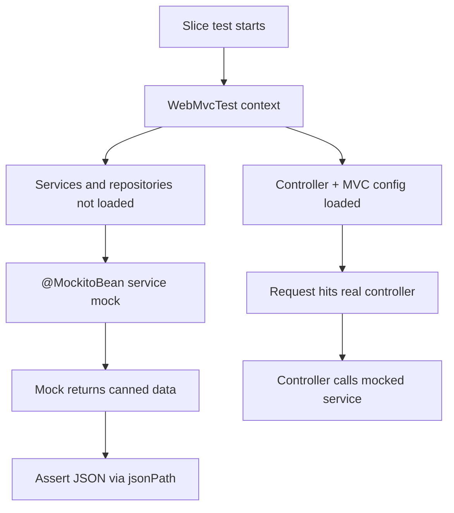

# Module 13: Testing Web & GraphQL Slices

Est. study time: 1.5h
Language: en
Description: Slice tests, MockMvc, @GraphQlTest, CSRF in tests, Boot 4 modular autoconfig.

## Knowledge Map



---

## Learning Objectives

- Explain what a slice test loads, what it mocks, and why that keeps it fast.
- Write @WebMvcTest controller tests with @MockitoBean mocks and jsonPath assertions.
- Handle Security 7 CSRF and auth inside MockMvc with csrf(), @WithMockUser, and addFilters(false).
- Write @GraphQlTest DGS tests that resolve queries through GraphQLTestTemplate over mocked services.
- Decide when a slice beats full @SpringBootTest and how Boot 4 modular autoconfig makes slices cleaner.

---

## Real-World Example

A checkout service on Boot 4 has a test suite built entirely on @SpringBootTest. Every controller test boots the whole app: database pool, Kafka consumer, security chain, DGS components. One build runs two hundred tests and takes nine minutes. Deploys wait. A dev changes an unrelated mapper, and half the suite re-runs.

The waste: most tests exercise one controller, but the context instantiates everything. Boot a slice instead, and those same tests finish in seconds.

> **Think**: Why does one controller test pay the cost of Kafka and the database?
>
> *Answer: @SpringBootTest loads the full application context, so bringing up the app pulls every bean into play even when the test only touches one controller.*

---

## Core Content

### Slice Philosophy: Wire Only What You Test

A slice test is a focused application context. Boot 4 autoconfiguration is modular, so a slice keeps only the autoconfiguration serving one layer. @WebMvcTest wires controllers, MVC configuration, selected @ControllerAdvice, filters, plus your real @ConfigurationProperties and WebMvcConfigurer beans. It does NOT wire services or repositories — you provide mocks through dependency injection into the test.

Because the slice side-steps the database, message brokers, and schedulers, context startup drops from seconds to milliseconds.



> **Think**: A slice skips the database. Why is a controller test still meaningful without one?
>
> *Answer: The slice verifies controller behavior: routing, validation, status codes, serialization, and error handling. Data-layer correctness belongs to repository and integration tests in module 14.*

> **Cloze**: "Slice tests boot only the autoconfiguration for one layer; everything the layer depends on is replaced by a {mock}."
>
> *Answer: mock*

### @WebMvcTest, @MockitoBean, and jsonPath

@WebMvcTest(OrderController.class) scopes the slice to one controller. The controller's collaborator is a field annotated @MockitoBean — the Boot 4 replacement for @MockBean, which Spring deprecates. @MockitoBean registers a mock bean in the test context; @Autowired injects it wherever the controller expects the real type.

```java
@WebMvcTest(OrderController.class)
class OrderControllerTest {

    @Autowired MockMvc mockMvc;

    @MockitoBean OrderService orderService;

    @Test
    void returnsOrderById() throws Exception {
        when(orderService.findById(42L)).thenReturn(new Order("ready"));

        mockMvc.perform(get("/orders/42"))
            .andExpect(status().isOk())
            .andExpect(jsonPath("$.status").value("ready"));

        verify(orderService).findById(42L);
    }
}
```

Arrangement is given-when-then: stub the mock in the given phase, drive the request in the when, assert the JSON and verify interactions in the then. jsonPath walks the response body: $.status reaches the status field.

> **Cloze**: "@WebMvcTest loads web-layer beans only; the controller's dependencies come in as {mocks} via @MockitoBean."
>
> *Answer: mocks*

> **Spot the Mistake**: New code keeps using @MockBean because "it still compiles."
>
> What's wrong?
>
> *Answer: Compiling is not enough. Spring deprecates the annotation; @MockitoBean is the maintained replacement. New tests should use the current API, not the one that merely builds.*

### Security and CSRF in MockMvc

Security 7 (module 12) enables CSRF for every endpoint. In a @WebMvcTest the security filter chain runs inside MockMvc, so a mutating request — POST, PUT, PATCH, DELETE — with no CSRF token returns 403 before the controller runs. No amount of valid stubbing fixes it.

```java
// 403 unless a CSRF token rides along
mockMvc.perform(post("/orders").content(json))
    .andExpect(status().isOk());

// pass a token
mockMvc.perform(post("/orders").with(csrf()).content(json))
    .andExpect(status().isOk());
```

For authenticated endpoints, @WithMockUser fills a security context before the filters evaluate, so the request arrives authenticated.

```java
@WebMvcTest(OrderController.class)
@WithMockUser(roles = "ADMIN")
class OrderControllerTest { }
```

When the test targets pure serialization and the security rules matter only elsewhere, @AutoConfigureMockMvc addFilters(false) removes the filter chain entirely — the controller runs with no auth gate and no CSRF check.

> **Spot the Mistake**: A POST test fails with 403 and the developer blames DGS, then @SpringBootTest "fixes it" by skipping the whole slice setup.
>
> What's wrong?
>
> *Answer: Security 7 CSRF rejects the token-less POST before any code runs. The fix is csrf() on the request or addFilters(false), not abandoning the slice.*

> **Cloze**: "Security 7 CSRF default-on makes MockMvc POST requests return {403} unless the request carries a CSRF token."
>
> *Answer: 403*

> **Predict**: You add @WithMockUser to a failing POST test but the 403 stays. What is still missing?
>
> *Answer: @WithMockUser covers authentication, not CSRF. The token gate is separate — the request still needs csrf() or the filters removed.*

### @GraphQlTest with DGS

The GraphQL analog of @WebMvcTest is @GraphQlTest from the DGS framework. It creates a context holding @DgsComponent classes, the GraphQL schema, and scalars — but not services. GraphQLTestTemplate, from the DGS test infrastructure, executes queries against that context exactly as a client would.

Data fetcher dependencies are mocked with @MockitoBean, then the template resolves a query through the real resolver logic.

```java
@GraphQlTest(OrderDataFetcher.class)
class OrderDataFetcherTest {

    @Autowired GraphQLTestTemplate template;

    @MockitoBean OrderService orderService;

    @Test
    void resolvesOrderQuery() {
        when(orderService.find(7)).thenReturn(new Order(7, "ready"));

        GraphQLResponse response = template
            .postForResource("query-order.graphql");

        assertThat(response.get("$.data.order.status"))
            .isEqualTo("ready");
    }
}
```

The data fetcher runs, calls the mocked service, and the response travels through the real Jackson mapper — Boot 4 ties Jackson 3 into DGS via DgsJsonMapper.

> **Predict**: You mock the service to return null inside a non-null query field. What does the template respond?
>
> *Answer: The resolver returns null for a non-null field, so GraphQL reports a nullability error in the response rather than the field value. The error surfaces through the same path a client sees.*

> **Cloze**: "In a @GraphQlTest context, @DgsComponent classes and the schema load while services stay out, so data fetcher dependencies come in as {mocks}."
>
> *Answer: mocks*

### Slices vs Full Context

Choose a slice when the test verifies one layer and you can stub its collaborators: controller routing, serialization, validation, a single data fetcher. Choose full @SpringBootTest when the test needs real wiring across layers — transactional service-plus-repository flows, compatibility between security and DGS, or a smoke test of the whole app in module 14 style.

Boot 4 makes the choice sharper: modular autoconfiguration gives slices precise boundaries, so a slice context is smaller and its startup faster. The slice is not a cheap imitation of the full test — it is the right tool for a layer-scoped question.

> **Think**: A test must prove that a service transaction commits across two repositories. Is a slice the right tool?
>
> *Answer: No. That question crosses persistence layers, where a slice has nothing loaded. It belongs to a full-context integration test.*

> **Spot the Mistake**: A team writes one giant @SpringBootTest class "for everything" — controller, service, repository — and names it the integration test.
>
> What's wrong?
>
> *Answer: One context mixes layer-scoped assertions with integration assertions. Slices isolate the fast web and GraphQL checks; the full context stays reserved for cross-layer flows, which run rarely.*

> **Cloze**: "Pick a slice when one layer and its mocked collaborators answer the question; pick a full {context} when real wiring across layers matters."
>
> *Answer: context*

---

## Why This Matters

Slow test suites throttle feedback. Slice tests keep controller and data-fetcher coverage fast, so failures surface seconds after a change, not minutes. The cost is discipline: design collaborators behind interfaces so slices can mock them, and keep the slow full-context count low. Teams that lean on @SpringBootTest for everything trade minutes for every run; teams that slice get seconds.

---

## Key Takeaways

- A slice boots only the autoconfiguration for one layer; collaborators enter as mocks.
- @WebMvcTest wires controllers and MVC config; @MockitoBean replaces the deprecated @MockBean for service mocks.
- Security 7 CSRF rejects token-less MockMvc POST requests with 403 — use csrf(), @WithMockUser, or addFilters(false).
- @GraphQlTest loads DGS components and the schema; GraphQLTestTemplate resolves queries over mocked data fetcher dependencies.
- Use slices for layer-scoped checks and full @SpringBootTest for cross-layer wiring; Boot 4 modular autoconfig keeps slices small.

---

## Common Misconception

"A slice test is a smaller @SpringBootTest — mock a few beans and it is basically the same." Wrong. The slice loads a different, layer-only set of autoconfiguration, and the mocking contract differs: @WebMvcTest expects a mock for every service the controller touches. Treat it as its own test type with its own wiring rules, not a trimmed integration test.

---

## Feynman Explain

To a child: the app is a restaurant. Full @SpringBootTest opens the whole restaurant for one question about the cashier. A slice opens just the cashier desk and hires a pretend cook who answers whatever you script. Fast cashier questions. Kitchen questions go to the real kitchen once in a while.

---

## Reframe

Does a slice carry a price? Mocks freeze behavior, so a controller test can pass while the real service breaks — why repository and integration tests still exist. Slices answer layer questions; full context answers wiring. The split depends on what you distrust. Keep layer logic thin so slices stay honest, and the counterargument mostly vanishes.

---

## Drill

Take the quiz, then the cloze deck. MCQs test which layers each slice loads, the CSRF 403 surprise, and slice-versus-full-context decisions.

Run: `learn.sh quiz spring-boot 13-testing-web-graphql-slices`