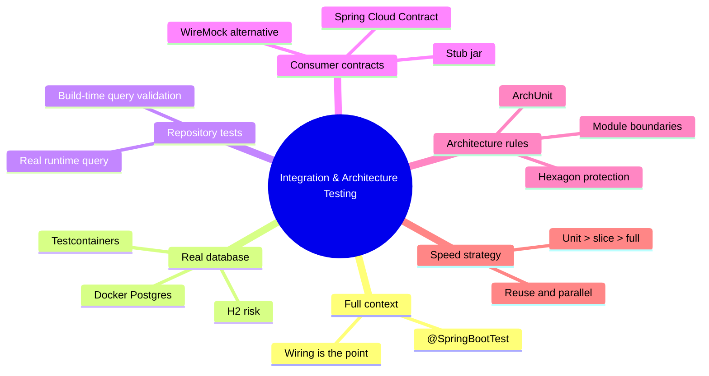
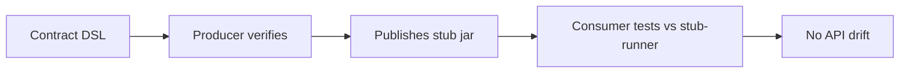

# Module 14: Testing: Integration & Architecture

Est. study time: 1.5h
Language: en
Description: Testcontainers, build-time queries, Spring Cloud Contract, ArchUnit.



## Learning Objectives

- Decide when @SpringBootTest earns its cost over a slice
- Test repository behavior against a real Postgres via Testcontainers
- Combine build-time query validation with a real runtime query
- Enforce API shape with Spring Cloud Contract; judge WireMock as lighter
- Guard hexagon and module boundaries with ArchUnit rules
- Plan a test speed strategy the suite stays fast as the app grows

## Real-World Example

Your payments service runs an outbox queue. Persistence tests use H2 because it is fast. All green. In production the job uses `SELECT ... FOR UPDATE SKIP LOCKED` to claim rows, and two instances claim the same order — double billing. H2 is not Postgres: it no-ops Postgres locking and JSONB. Meanwhile the producer renames a field `currency` to `currencyCode`, noticed weeks later. Your ArchUnit file runs and asserts nothing — theater.

> **Think**: Why did the H2 suite stay green while production corrupted data?
>
> *Answer: The tests certified H2's behavior, not the SQL you ship. Verify SQL semantics on the real database; keep H2 only for a boot smoke; verify consumer expectations so drift fails a build, not staging.*

## When @SpringBootTest Is the Point

A slice test (module 13) wires one Spring layer with collaborators faked — fast, but it cannot prove pieces assemble. `@SpringBootTest` boots the full ApplicationContext: every bean, property binding, auto-configuration, filter order. Expensive, so the senior rule: use it when **wiring is the subject under test**.

```java
@SpringBootTest
class OrderFlowIntegrationTest {
    @Autowired OrderService orders;   // real bean graph, nothing mocked
}
```

> **Think**: A slice passes but the app dies at startup with NoSuchBeanDefinitionException. Why did the slice miss it?
>
> *Answer: Slices build only their own context and substitute fake collaborators, so a missing bean never assembles there. Only the full context exposes wiring bugs.*

> **Predict**: You delete a @ConfigurationProperties prefix and refactor the property file, with only slice tests. What happens?
>
> *Answer: Slices keep passing — they bypass full property binding. The first @SpringBootTest or prod startup then fails with a binding error. Context tests are cheap insurance against this.*

## Testcontainers: Test Against the Real Database

When a test must verify SQL behavior, faking the database means testing a fiction. Testcontainers spins a real Docker Postgres for the run — the honest default.

```java
@Testcontainers
@SpringBootTest
class OrderRepositoryTest {
    @Container static PostgreSQLContainer<?> db = new PostgreSQLContainer<>("postgres:17");
}
```

The JUnit 5 extension starts the container once before the class and stops after. Prefer a `waitStrategy` on the healthcheck over sleeping; reuse locally with `testcontainers.reuse.enabled=true`; images cache so pulls are cheap. CI agents run Docker too — Docker-in-Docker or privileged runners are the norm.

> **Cloze**: In Testcontainers, a {static @Container} field on a @Testcontainers class is started once per class by the JUnit 5 extension.
>
> *Answer: static @Container*

> **Predict**: A test asserts `FOR UPDATE SKIP LOCKED` returns each row to exactly one concurrent claimant. What family of tests must this be?
>
> *Answer: Testcontainers against real Postgres, two threads asserting the claim is exclusive. Any embedded or mocked database fakes locking and certifies the wrong thing.*

> **Spot the Mistake**: "Repository tests on H2 are fine — same SQL, same result, CI stays fast." What's wrong?
>
> *Answer: H2 is not a Postgres implementation. Locking, JSONB, arrays, collation, window functions all differ. You assert H2's semantics, then ship Postgres SQL. H2 is for a smoke test that the context loads; verify SQL behavior on real Postgres with Testcontainers.*

## Repository Tests and Build-Time Query Validation

Module 02 showed Boot 4 builds and validates Spring Data repository queries **at build time** (Spring Data 2025.1). A typo in a derived query, a wrong property name, or a missing `@Param` fails the build — not the first request. Senior teams exploit both halves:

- the build/startup failure proves the query is well-formed and bound to the entity model;
- the Testcontainers runtime query proves the SQL returns what the domain expects.

```java
@Testcontainers
@SpringBootTest
class OrderRepositoryContractTest {
    @Test
    void findsOnlyPendingOrdersOfGivenStatus() {
        Order o = repo.save(marketSell());
        assertThat(repo.findByStatusAndMarket(Status.PENDING, "SELL"))
            .extracting(Order::id).containsExactly(o.id());
    }
}
```

> **Cloze**: Repository query methods are validated at {build} time in Boot 4, so a typo fails before deployment, not on the first caller.
>
> *Answer: build*

> **Predict**: You rename an entity property but forget to update a derived query method. Where does build-time processing fail?
>
> *Answer: At compile or context startup, before shipping. Build-time validation catches the mismatch; the runtime test confirms the query returns correct rows on the real database.*

## Contract Tests: Consumer-Driven API Guarantees

Two services drift because nothing forces them to share a contract. Spring Cloud Contract fixes this with one source of truth in Groovy DSL.

```groovy
Contract.make {
    request { method GET(); urlPath("/api/orders/1") }
    response {
        status 200
        body([id: 1, currency: "USD"])
        headers { contentType("application/json") }
    }
}
```

The **producer** (API owner) verifies its real implementation against the contract and publishes a **stub jar**. The **consumer** tests against the stub through the stub-runner, which boots an embedded WireMock from the jar. The contract is enforced on both sides: the producer cannot silently change shape without failing verification; the consumer cannot rely on fields the producer never agreed to.



WireMock is the lighter cousin: hand-written stubs, same simulated HTTP endpoint, but no shared contract artifact and no producer verification. WireMock for a test double; Spring Cloud Contract when the API shape itself must be a shared, versioned guarantee.

> **Cloze**: In Spring Cloud Contract the producer publishes a {stub jar} that consumers test against, so both sides enforce the same API shape.
>
> *Answer: stub jar*

> **Spot the Mistake**: "We write contract tests and run them on the producer; consumers trust them, so we are covered." What's wrong?
>
> *Answer: Producer verification only proves the producer satisfies the DSL. Consumer drift — expecting fields the producer never promised — surfaces only when the consumer tests against the stub. Skip the consumer side and you ship incompatible services.*

## ArchUnit: Architecture as a Test

Module 09 built the hexagon: domain core depends only on ports, adapters depend inward, nothing depends on infrastructure. Module 10 enforced module boundaries with the Maven Enforcer and reserved ArchUnit for this module. ArchUnit turns those rules into plain JUnit tests that fail the build on violation. No review drift: a regression is authored, and the architecture test fails on the same push.

```java
@AnalyzeClasses(packages = "com.acme")
class ArchitectureTest {
    @ArchTest static final ArchRule domainIsPure =
        noClasses().that().resideInAPackage("..domain..")
            .should().dependOnClassesThat()
            .resideInAnyPackage("..persistence..", "jakarta.persistence..", "org.springframework..");

    @ArchTest static final ArchRule adaptersPointInward =
        classes().that().resideInAPackage("..adapter..")
            .should().dependOnClassesThat().resideInAPackage("..domain..")
            .orShould().dependOnClassesThat().resideInAPackage("..port..");
}
```

Enforcer and ArchUnit are complementary. Enforcer checks dependency **coordinates** at module level; ArchUnit checks package-level **imports** inside a module. A JPA adapter that sneaks `JpaRepository` into the domain is invisible to the Enforcer; `domainIsPure` catches it instantly.

> **Think**: What does ArchUnit give you over "we review every PR"?
>
> *Answer: Impartial, repeatable enforcement. Reviews drift, get skipped, and miss nested imports; ArchUnit evaluates the same rules on every commit, so architecture cannot rot between reviews.*

## Speed Strategy: The Pyramid, Not the Wish

Fast feedback is engineered. Pyramid: many fast unit tests at the base, fewer slices in the middle, fewest slow full-context tests at the top. Unit-test the plain-Java core (module 09) whenever logic is the subject, slices (module 13) whenever one Spring layer is.

Force speed with three settings: `@Testcontainers(parallel = true)`, JUnit parallel execution, container reuse locally. Then measure — a suite past a few minutes stops being run, and an unrun suite is fiction.

## Why This Matters

Integration and architecture tests are what you run when nobody is watching — the line between confident refactoring and a prayer. Wrong-database tests certify false behavior, contract drift surfaces only in staging, unenforced architecture rots silently.

## Key Takeaways

- Use @SpringBootTest only where wiring is the subject; slices cover the layers
- Test SQL semantics on real Postgres with Testcontainers; H2 is smoke-test only
- Repository tests exploit build-time query validation plus a real runtime query
- Spring Cloud Contract shares one contract and a stub jar; WireMock is a lighter double
- ArchUnit enforces hexagon and module boundaries as JUnit rules in CI
- Engineer speed: unit > slice > full, parallel Testcontainers, reuse, measured time

## Common Misconception

"More @SpringBootTest tests mean better coverage." No. Each costs seconds of context startup, so coverage per second falls. Shrink the slow layer: extract testable logic into plain-Java ports (module 09), test at unit speed, and reserve the full context for the wiring facts only it can prove.

## Feynman

Explain to a new hire: "Tests tell you about the thing they actually run. A test on H2 tells you about H2. So when SQL matters, run Postgres in Docker; when wiring matters, boot the whole context; when a rule matters — no JPA in the domain — make it a test on every push."

## Reframe

You own the payments service from the example: double-billing outbox, silent contract drift. Which tests first, where do they run, how does runtime change? Push back on "everything @SpringBootTest" — justify each pyramid level with what it actually proves.

## Spot the Mistake

A pipeline has: H2 context smoke, a Testcontainers repository suite, producer-side contract tests, and an ArchUnit file with `assertThat(true).isTrue()`. Name the gaps.

What's wrong?

*Answer: Consumer-side contract testing is missing, so drift ships. The ArchUnit file asserts nothing, so architecture has no enforcement. Add stub-runner tests on the consumer and real ArchUnit rules; then the pipeline enforces what it claims.*

## Drill

Run `learn.sh quiz spring-boot 14-testing-integration-architecture`, then `learn.sh cloze spring-boot 14-testing-integration-architecture`. Explain each wrong answer before retrying.