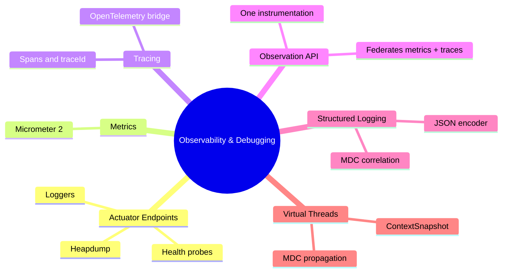
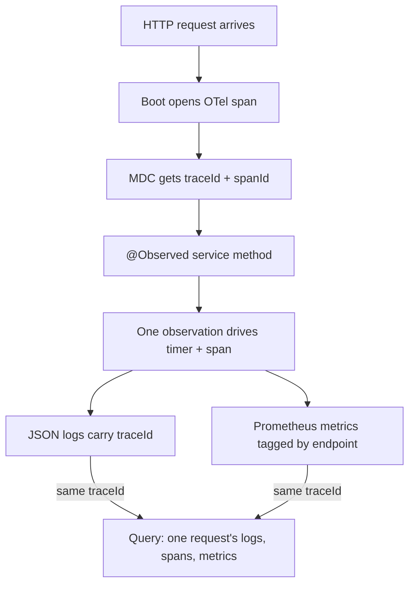

# Module 15: Observability & Debugging

Est. study time: 1.5h
Language: en
Description: Actuator, Micrometer and OTel, structured logs, MDC on virtual threads.

## Knowledge Map



---

## Learning Objectives

After this module you will:

- Expose and query Actuator endpoints: health probes, live log levels, heap dumps, bean conditions.
- Instrument a method once with the Observation API; one code point feeds both metrics and traces.
- Trace requests across service boundaries via the OpenTelemetry bridge and `traceparent` propagation.
- Correlate logs, metrics, traces by MDC `traceId` in structured JSON logging.
- Debug async work on virtual threads: re-apply MDC, flip log levels live without restart.

---

## Real-World Example

A payments team ships a fraud check on Boot 4. Production graphs flat green — low latency, zero errors. Yet customers report checkout hanging "for seconds." Logs carry timestamp, thread, message — nothing tying one request together; tracing was skipped as "for microservices." Slow requests hide in averages — no per-request id makes the 400ms outlier unfindable.

> **Think**: Why could the team see a green dashboard and still ship an outage?
>
> *Answer: Metrics aggregate, so rare slow requests vanish into the mean. The signals were not linked — no `traceId` in logs, no per-endpoint drill-down. Observability answers a question about one request, not just the fleet.*

---

## Core Content

### Actuator — the Operational Backbone

`spring-boot-starter-actuator` exposes management endpoints under `/actuator`. Secure behind Spring Security (module 12); expose only what you need:

```text
management.endpoints.web.exposure.include=health,info,metrics,loggers,heapdump,conditions
```

- `health` — aggregate `UP`/`DOWN`; with probes enabled you get `health/readiness` + `health/liveness`. k8s stops traffic on readiness `DOWN`, kills on liveness failure.
- `info` — build version, git commit, environment.
- `metrics` / `prometheus` — registry snapshots for scraping.
- `loggers` — read and set levels live (`POST /actuator/loggers/{name}` body `{"configuredLevel":"DEBUG"}`); no restart.
- `heapdump` — `GET /actuator/heapdump` returns `.hprof` for on-demand memory profiling.
- `conditions` — why a `@Conditional` bean registered or backed off (module 01).

A custom health indicator folds your subsystem into the aggregate:

```java
@Component
public class DgsHealthIndicator implements HealthIndicator {
    public Health health() {
        return Health.up().withDetail("queries", registry.queries().size()).build();
    }
}
```

> **Think**: Readiness returns `DOWN` but liveness stays `UP`. What does k8s do?
>
> *Answer: Stops routing traffic to the pod but does not restart it — right for "alive but not ready". Liveness kills cause restart loops.*

### Metrics with Micrometer

Micrometer is a metrics facade: one API, swappable registries. Boot 4 ships Micrometer 2.x with the starter; `micrometer-registry-prometheus` adds `/actuator/prometheus`.

Three instruments matter: `Counter` (monotonic events), `Gauge` (point-in-time value), `Timer` (duration distribution). Boot auto-instruments JVM, HTTP, connection pools, MVC, GraphQL.

The fatal mistake is tag cardinality: a `Timer` tagged with `orderId` creates one time series per order. Tag low-cardinality facets — endpoint, result, region — keep entity ids in MDC or spans.

> **Predict**: A team tags a request timer with `orderId` "so we can see per-order latency." Prometheus retention is 15 days. What breaks?
>
> *Answer: Cardinality explosion. Each order is a new label value, hence a new never-reused time series; storage and scrape cost grow until the registry thrashes. Order identifiers belong in MDC and spans, not metric labels.*

> **Cloze**: "Micrometer counts monotonically increasing events with a {Counter} and measures duration distributions with a Timer."
>
> *Answer: Counter*

### The Observation API — Instrument Once

Before it, the same work was instrumented twice — once for metrics, once for spans — and the two drifted apart.

The Observation API (`io.micrometer.observation`) replaces both: one instrumentation point federates to metrics **and** tracing. Boot auto-wires an `ObservationRegistry`; the OTel bridge turns an observation into a span while a `Timer` captures latency. Key-values become metric tags and span attributes; `@Observed(name = "order.create")` yields a timer, a span, a MDC `traceId`.

> **Cloze**: "The {Observation} API is a single instrumentation point that federates to both metrics and tracing."
>
> *Answer: Observation*

> **Spot the Mistake**: A team instruments a method with a Micrometer `Timer` and, separately, opens a span via a manual OTel call in the same method. "Now we have full observability."
>
> What's wrong?
>
> *Answer: Two manual instrumentation points for the same work — they drift in names, tags, coverage. The Observation API instruments once and federates, so metric and trace definitions cannot diverge.*

> **Predict**: The same method is instrumented twice — once with a bare `Timer`, once with `@Observed`. Which one do the traces show?
>
> *Answer: Only the `@Observed` path. Observation drives span creation through the OTel bridge; a bare `Timer` has no span lifecycle, so latency is double-counted in metrics while traces cover just the observed path.*

### Tracing with OpenTelemetry

Micrometer Tracing is the facade; `micrometer-tracing-bridge-otel` connects it to OpenTelemetry and an OTLP exporter ships spans to a collector. Boot auto-wires a tracer when the bridge is on the classpath; MVC/GraphQL requests get spans automatically.

Parent and child spans form a trace; the same `traceId` crosses service boundaries because the outbound client (RestClient, module 16) propagates the `traceparent` header.



> **Think**: Logs and traces carry `traceId`, but metrics do not. How do metrics and traces get correlated?
>
> *Answer: Metrics aggregate, so they cannot key on `traceId`. Correlate at query time: take a slow traceId from the trace explorer, slice metrics by the same span attributes — endpoint, service, region. Metrics say "widespread?", traces say "which request?", logs the details.*

### Structured Logging, MDC, and Virtual-Thread Debugging

Plain-text logs are unsearchable at scale. A JSON encoder (logstash-logback-encoder) makes each line a typed object. Boot injects `traceId` and `spanId` into MDC; add fixed key-values — `app`, `env`, `version` — so search can slice the fleet. Clear MDC after use so context never leaks into the next request.

Virtual threads change the rules (module 11). Request-handler MDC stays intact because the thread is pinned to the request; a hand-spawned virtual thread starts with empty thread-locals, so async logs lose `traceId`. Re-apply with `ContextSnapshot`:

```java
ContextSnapshot snapshot = ContextSnapshot.captureAll();
try (ContextSnapshot.Scope scope = snapshot.open()) {
    auditService.logAsync(orderId);
}
```

> **Spot the Mistake**: An `@Async` email sender logs "email queued" but those lines have a blank `traceId`; the request handler's lines are fine. The team blames the logging framework and restarts the app "to reset MDC."
>
> What's wrong?
>
> *Answer: Logging is fine — context did not travel. The async worker virtual thread started with empty MDC, the same leak as the missing `SecurityContext` in module 11. Re-apply with `ContextSnapshot` or a propagation-aware executor.*

> **Cloze**: "A hand-spawned virtual thread starts with empty {MDC}, so async logs lose the traceId unless context is re-applied with ContextSnapshot."
>
> *Answer: MDC*

---

## Why This Matters

The example failed because the three signals lived apart. Observability is not three dashboards — one question across metrics, traces, and logs. Boot 4 gives you the whole stack: instrument once via the Observation API, log JSON with MDC, propagate context onto virtual threads. Skip correlation and you get a green dashboard's confidence with a blind spot for the real failure.

---

## Key Takeaways

- Expose Actuator endpoints selectively: health probes for k8s, `loggers` for live level flips, `heapdump` for memory, `conditions` for bean mysteries.
- Instrument once with the Observation API; it federates to metrics and traces, so definitions stay consistent.
- Boot 4 auto-wires OpenTelemetry tracing; the OTel bridge and exporter ship spans and propagate `traceId` across HTTP calls.
- Correlate the three signals with MDC `traceId` in JSON logs; metrics stay aggregate — correlate at query time.
- Virtual threads keep request-handler MDC but hand-spawned workers start empty — re-apply with `ContextSnapshot`.

---

## Common Misconception

"Logs plus metrics is observability." Without traces and a correlation ID, logs cannot be reassembled per request and metrics cannot be drilled into. The companion myth — "tracing is only for microservices" — is equally wrong: one Boot 4 app needs per-request spans to find a slow outlier.

---

## Spot the Mistake

A team ships a shared `MetricsService` that wraps every call in try/finally: start a manual `Timer`, open a manual OTel span, log start and end. "One library, so everyone observes the same way."

What's wrong?

*Answer: They reimplemented the Observation API by hand, and worse. Manual timers and spans drift in naming and coverage; lifecycle bugs — a span never closed, a timer skipped on exception — corrupt both signals silently. The Observation API already does this once, wired into Boot's exporters and MDC. Custom wrappers are a second observability layer.*

---

## Feynman Explain

A post office. Every parcel gets a tracking number. Metrics = the board counting parcels per hour. Logs = notes workers scribble on each parcel. Traces = the map of sorting centers a parcel passed through. All must show the same tracking number or you cannot follow one parcel. The Observation API is the clerk who stamps the number once so all three records match. A virtual thread is a courier fetching a parcel — unless you hand him a photocopy of the tracking slip, his note arrives without a number.

---

## Reframe

Is more telemetry always better? No — this module's rules draw the line. High-cardinality metric tags destroy storage; hand-rolled instrumentation buries the signal the Observation API keeps clean. Detail versus cost, resolved structurally: low-cardinality tags in metrics, identifiers in MDC, spans for the per-request map. Payoff: the live debug loop — flip a log level without restart, grab a heapdump on demand.

---

## Drill

Take the quiz, then the cloze deck: Actuator endpoints, metric instruments, Observation API federation, OTel trace propagation, MDC correlation, virtual-thread context.

Run: `learn.sh quiz spring-boot 15-observability-debugging`