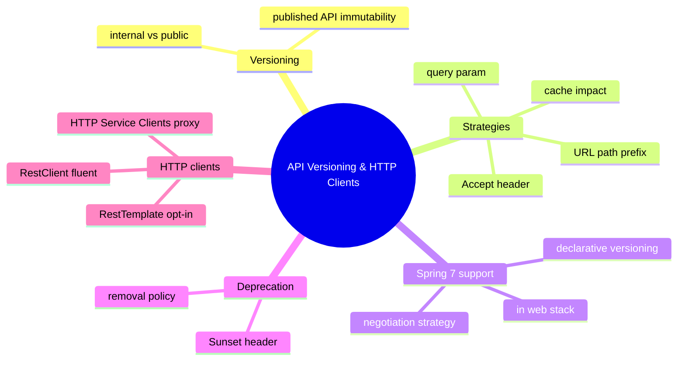

# Module 16: API Versioning & HTTP Clients

Est. study time: 1.5h
Language: en
Description: Versioning strategies, RestClient, HTTP Service Clients.

## Knowledge Map



---

## Learning Objectives
- Explain why a published API must be versioned and when internal APIs can skip versioning
- Compare URL path, Accept header, and query param strategies on visibility, cache, and namespace cost
- Describe Spring 7 first-class versioning as declarative, strategy-driven routing built into the web stack
- Use RestClient's fluent API and explain why RestTemplate auto-configuration is now opt-in
- Define an HTTP Service Client interface and consume it as a generated proxy bean

---

## Real-World Example

Your order service publishes `GET /orders`. You add a status code, release, and the mobile team calls at midnight: every order shows the wrong status. The old client parsed `status: "PENDING"` as a string; the new payload sends an integer. Nobody agreed the contract changed.

> **Think**: Why did adding one field break a consumer that never asked for it?
>
> *Answer: The endpoint is a published contract, not an internal method. Consumers parsing the old schema read corrupted data once you mutate it. Fix: versioned contract keeps the old shape reachable while the new one ships.*

---

## Core Content

### Section 1: The Versioning Problem

Versioning exists because a published API is immutable. Once external code parses your JSON, that shape is a contract; changing it in place silently breaks every consumer. Consumers cannot "upgrade with you" — mobile apps ship on release cycles, partner integrations run for years.

Internal contracts differ: a service calling another inside your platform can deploy together, so skip versioning when both sides ship in lockstep. Never for public consumers.### Section 2: Versioning Strategies

Three classic strategies negotiate which API version a request gets. Each buys something, costs something.

**URL path prefix** — `/v1/orders`, `/v2/orders`.
```java
@GetMapping("/v1/orders")  public List<OrderV1> ordersV1() { ... }
@GetMapping("/v2/orders")  public List<OrderV2> ordersV2() { ... }
```
Visible in every URL and log, cache-friendly (version is part of the cache key), trivial to route and test. Cost: pollutes the namespace, shows in analytics.**Accept header** — `Accept: application/vnd.orders.v2+json`.
```java
@GetMapping(path = "/orders", produces = {"application/vnd.orders.v1+json", "vnd.orders.v2+json"})
public String orders() { ... }
```
Clean URLs that never change. Cost: clients must set headers, curl debugging needs an explicit header, caching must key on Accept to tell versions apart — content negotiation does the final dispatch.

**Query param** — `?version=2`.
```java
@GetMapping("/orders") public String orders(@RequestParam(defaultValue = "1") int version) { ... }
```
Trivial to build and test. Cost: ugly, pollutes analytics, caches poorly — proxies treat the URL family as one resource, so a v2 response can reach a v1 client.

> **Think**: Your cache in front of `/orders` keys purely on URL. Why does the Accept-header strategy corrupt it?
>
> *Answer: Two clients request the identical URL with different Accept values, so a pure-URL key serves one version to the other. Version-aware caching must key on the media type.*

> **Predict**: You ship `/v2/orders` but leave `/v1/orders` reading the same renamed column the v2 code reads.
>
> *Answer: v1 is no longer stable — it returns the new shape and breaks old clients. Each version pins its own mapping and DTO, so v1 stays byte-stable.*

> **Spot the Mistake**: A teammate versions a public API with `?version=2` only and calls it done: "the routes go through a shared service layer."
>
> What's wrong?
>
> *Answer: The real error is no deprecation plan — the old route stays silently mutable. Versioning is the discipline that v1 never changes again plus an explicit removal rhythm; "done" requires a Sunset policy.*
>
> > **Cloze**: "Of the three strategies, the URL {path} prefix is visible in logs and caches well while polluting the namespace."
> >
> > *Answer: path*

### Section 3: Spring 7 First-Class Versioning

Spring Framework 7 (and Boot 4) announced first-class API versioning: declare a version on a handler mapping, and requests negotiate versions through a strategy — base path, Accept header, or query param — with the framework routing each request to the matching versioned handler. The exact declarative annotations are settling; treat the feature directionally. Versioning lives in the web stack, no hand-rolled version filter needed when the declared strategy matches.```mermaid
flowchart LR
  R[Incoming request] --> N{Version negotiation}
  N -->|base path v2| H2[versioned handler v2]
  N -->|Accept vnd.v2| H2
  N -->|query param v2| H2
  N -->|no version| D[default handler]
  H2 --> C2[API contract v2]
  D --> C1[API contract v1]
```text

Versioned requests still flow through the full web stack. Security (Module 12) applies to the resolved route: versioned paths pass through `authorizeHttpRequests` like any other mapping. Negotiation yields a concrete handler; tracing (Module 15) sees one trace context whatever version handled it.

> **Predict**: You declare the base-path strategy and a second strategy on the same controller set accidentally.
>
> *Answer: Conflicting declarations make the mapping ambiguous; startup fails or whichever handler matches first serves. Pick one negotiation strategy per mapping set.*

### Section 4: Deprecation Rhythm

New versions ship, old ones must leave. A version dies in three stages:

1. Announce deprecation in release notes and responses.
2. Return the `Sunset` header with all v1 responses — a concrete removal date clients can enforce.
3. Remove the handler after the deadline: `410 Gone` (or `404`) on the dead route, never a silently changed body.

`Sunset` turns "we might change this" into a dated contract.

> **Think**: Your v2 ships and v1 is unmaintained. Why is deleting v1 immediately a trap?
>
> *Answer: Consumers migrate on their own schedule. Immediate deletion breaks clients with no time to move; a stated Sunset date sets the deadline.*

> **Spot the Mistake**: A developer updates the v2 handler but the body still returns the v1 response object, then claims "the mapping is versioned so we're safe."
>
> What's wrong?
>
> *Answer: Versioning is about the served contract, not the mapping annotation. A v2 route returning the v1 schema is a v2 bug. Pair each versioned handler with its own versioned DTO.*

### Section 5: HTTP Clients — RestClient and HTTP Service Clients

Consuming external REST APIs is this module's client side. Boot 4 makes `RestClient` first-class — fluent successor to RestTemplate:
```java
RestClient orders = RestClient.builder()
    .baseUrl("https://orders.example.com/v2")
    .defaultHeader("Accept", "application/vnd.orders.v2+json")
    .build();

OrderResponse order = orders.get().uri("/orders/{id}", orderId)
    .retrieve().body(OrderResponse.class);
```text
`RestTemplate` is not gone, but its auto-configuration became opt-in (Module 02) — Boot stopped silently wiring a bean few teams should use.

The modern answer for typed clients is **HTTP Service Clients** (promoted in 2025): declare a Java interface with exchange methods; Boot generates a RestClient-backed proxy bean.```java
public interface OrderClient {
    @GetExchange("/orders/{id}") OrderResponse getOrder(@PathVariable("id") String id);
    @PostExchange("/orders")     OrderResponse createOrder(@RequestBody CreateOrderRequest body);
}
```

Declare the interface, inject it, and the framework supplies the client — uri variables, error handling, headers declared, not hand-written. Security and observability traits from Modules 12 and 15 apply unchanged.

> **Think**: One RestClient bean for both v1 and v2 calls — why is that painful?
>
> *Answer: A shared client fixes one base URL and one Accept header, forcing both versions through one channel. Two client beans — one per version — keep URLs, headers, and DTOs aligned per contract.*

> **Predict**: You replace a hand-written client that appended `/api/v1/orders` with `@GetExchange("/orders/{id}")` but forget to configure a base URL.
>
> *Answer: The proxy resolves a relative path with no host and errors, or strikes the wrong base via a global default. HTTP Service Clients resolve uris against the configured baseUrl, exactly like RestClient.*

> **Cloze**: "HTTP Service Clients turn a plain interface with {exchange} methods into a generated RestClient-backed proxy bean."
>
> *Answer: exchange*

> **Cloze**: "RestClient's get, uri, retrieve, body chain replaces RestTemplate while its auto-configuration became {opt-in} in Boot 4."
>
> *Answer: opt-in*

---

### Why This Matters

Versioning is the contract between your service and everyone who consumes it. Skip it and every release is a coordination disaster; get the negotiation strategy wrong and caches serve corrupted data. Client side matters equally — RestClient is the modern default, HTTP Service Clients turn integrations into typed, testable beans.---

## Key Takeaways
- A published API is immutable; internal APIs may skip versioning when consumers ship in lockstep
- Path prefix visible, cache-friendly, pollutes namespace. Accept clean URLs, needs client discipline and version-aware caching. Query trivial but ugly, cached poorly
- Spring 7 versioning is declarative, strategy-driven, built into the web stack
- Deprecation rhythm: warn, Sunset header with a removal date, then 410 on the dead route
- RestClient is first-class; RestTemplate auto-configuration is opt-in. HTTP Service Clients give typed interface proxies

---

## Common Misconception

"Versioning means putting `/v1` in the URL and forgetting about it." Versioning is contract-management discipline: strategy negotiable, invariants not. Old versions must keep their exact shape, be deprecated on a public schedule, removed at a stated date. A path prefix with a mutable v1 body is not versioning.

---

## Spot the Mistake

```java
@GetMapping("/orders") public String orders(@RequestParam int version) {
    return "PENDING"; // same body for every version
}
```

A teammate says: "The query param is the versioning strategy, and one method serving both is fine since the payload is small."

What's wrong?

*Answer: A `version` param returning an identical body for every value is versioning theater — no negotiated contract exists, and caches collapse all versions into one URL. Real versioning fixes the schema per version (own DTO per version).*

---

## Feynman Explain
Teach a child: "Your friend has a toy box. One day you open it and your favorite toy is gone, swapped for a new one, and nobody told you. Versioning is the promise: the old toy stays in its own labeled drawer until everyone has the new one, and the label says which toy is inside." No jargon — no contract, negotiation, or media type.

---

## Reframe
Judge: versioning sounds like a rule, but it is a cost. Path prefixes are ugly, Accept headers need cache surgery, every version doubles handlers, tests, DTOs. When is the honest trade to skip versioning — internal contracts only, or a young API you can break loudly? Write your evaluation.

---

## Drill
Run: `learn.sh quiz spring-boot 16-api-versioning-rest-clients`